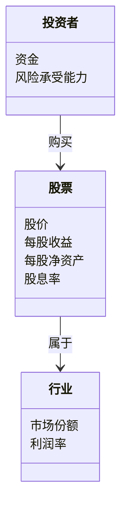

                 


# 彼得林奇的"街头智慧"投资法

> 关键词：彼得林奇、投资策略、非专业投资者、基本面分析、价值评估

> 摘要：本文详细介绍了彼得林奇的"街头智慧"投资法，从投资的基本概念、核心理念到具体的分析方法和系统设计，帮助非专业投资者掌握一种简单有效的投资策略。

---

# 第一部分: 投资的基础知识与彼得林奇的背景

## 第1章: 投资的基本概念

### 1.1 投资的基本定义

#### 1.1.1 投资的定义与分类
投资是指将资金投入到某种资产或项目中，以期获得未来收益的行为。投资可以分为股票、债券、基金、房地产等多种形式。股票投资是最常见的形式之一，也是本文的重点。

#### 1.1.2 股票投资的核心要素
股票投资的核心要素包括公司基本面、行业地位、管理层能力、财务数据等。这些要素共同决定了股票的内在价值和市场表现。

#### 1.1.3 投资市场的基本结构
投资市场包括一级市场和二级市场。一级市场是新股发行的市场，二级市场是股票交易的场所。本文主要关注二级市场的股票投资。

---

### 1.2 彼得林奇的生平与投资理念

#### 1.2.1 彼得林奇的个人经历
彼得·林奇（Peter Lynch）是美国著名的职业经理人和投资专家，曾管理富达麦哲伦基金（Fidelity Magellan），创造了卓越的投资业绩。他的投资理念强调非专业投资者的优势，认为市场中的信息对称性为普通人提供了投资机会。

#### 1.2.2 彼得林奇的投资哲学
彼得林奇的投资哲学基于以下几点：
1. 非专业投资者可以通过常识和观察发现投资机会。
2. 市场的有效性与非理性并存，投资者可以通过长期持有优质股票获得超额收益。
3. 风险管理是投资成功的关键。

#### 1.2.3 彼得林奇的成功案例
彼得林奇管理的富达麦哲伦基金在1977年至1990年间年均回报率达到29.2%，远超同期市场表现。他的成功证明了"街头智慧"投资法的有效性。

---

## 第2章: 街头智慧投资法的背景

### 2.1 现代投资理论的发展

#### 2.1.1 传统投资理论的局限性
传统投资理论（如CAPM模型）虽然在理论上严谨，但对非专业投资者来说过于复杂，难以直接应用于实际操作。

#### 2.1.2 行为金融学的兴起
行为金融学研究表明，市场参与者的行为往往受到心理因素的影响，非理性决策在市场中普遍存在，这为非专业投资者提供了机会。

#### 2.1.3 非专业投资者的机会
非专业投资者可以通过观察和分析市场中的常见现象，发现被低估的投资机会。

---

### 2.2 街头智慧投资法的核心思想

#### 2.2.1 非专业投资者的优势
非专业投资者可以通过日常生活中的观察，发现市场中的投资机会。例如，关注身边企业的经营状况、行业动态等。

#### 2.2.2 市场的有效性与非理性
市场在长期是有效的，但在短期可能因为参与者的非理性行为而出现价格偏离价值的情况。非专业投资者可以通过长期持有优质股票，捕捉市场非理性带来的机会。

#### 2.2.3 投资中的常识与直觉
彼得林奇强调，投资不需要复杂的数学模型，而是需要基于常识和直觉的判断。例如，选择具有强大竞争优势和良好财务状况的企业。

---

# 第二部分: 彼得林奇"街头智慧"投资法的核心概念

## 第3章: 投资策略的核心要素

### 3.1 基本面分析的简化版

#### 3.1.1 公司财务数据的简化分析
非专业投资者可以通过关注以下财务指标来评估公司基本面：
- **市盈率（P/E）**：股价与每股收益的比率，用于衡量股票的估值。
- **市净率（P/B）**：股价与每股净资产的比率，用于衡量股票的估值。
- **股息率**：股息与股价的比率，用于衡量股票的分红能力。

#### 3.1.2 行业地位的快速判断
非专业投资者可以通过关注公司所在行业的竞争格局，判断公司的行业地位。例如，行业龙头通常具有更强的议价能力和竞争优势。

#### 3.1.3 管理层能力的初步评估
管理层的能力可以通过公司财务报表和市场表现来初步判断。例如，公司是否持续盈利、管理层是否具有良好的道德记录等。

---

### 3.2 价值评估的简化方法

#### 3.2.1 市盈率的简单应用
市盈率 = 股价 / 每股收益（Net Income per Share）

例如，如果一家公司的股价为10元，每股收益为1元，则市盈率为10倍。如果市场平均市盈率为15倍，那么该股票可能被低估。

#### 3.2.2 市净率的快速判断
市净率 = 股价 / 每股净资产（Book Value per Share）

例如，如果一家公司的股价为20元，每股净资产为10元，则市净率为2倍。如果市场平均市净率为3倍，那么该股票可能被低估。

#### 3.2.3 股息率的初步分析
股息率 = 每股股息 / 股价

例如，如果一家公司每股股息为1元，股价为20元，则股息率为5%。如果市场平均股息率为3%，那么该股票的股息率较高，具有吸引力。

---

### 3.3 价值陷阱的识别

#### 3.3.1 什么是价值陷阱
价值陷阱是指那些看似估值低，但实际上公司基本面恶化，未来无法持续盈利的股票。

#### 3.3.2 价值陷阱的识别方法
- 关注公司的财务健康状况，例如是否存在高负债、持续亏损等。
- 关注行业动态，判断公司是否面临重大风险。

---

## 第4章: 投资决策的关键点

### 4.1 行业选择的策略

#### 4.1.1 行业周期的简单判断
行业周期包括上升期、成熟期、衰退期等。非专业投资者应选择处于上升期或成熟期的行业，避免选择衰退期的行业。

#### 4.1.2 行业竞争格局的初步分析
非专业投资者可以通过关注行业龙头企业的市场份额、利润率等指标，判断行业的竞争格局。

#### 4.1.3 行业风险的快速评估
行业风险包括政策风险、技术风险等。非专业投资者应选择行业风险较低的行业进行投资。

---

### 4.2 公司选择的技巧

#### 4.2.1 公司规模的合理性判断
非专业投资者应选择规模适中、增长稳定的公司，避免选择过于庞大或增长过快的公司。

#### 4.2.2 公司成长性的初步评估
公司成长性可以通过关注营业收入增长率、净利润增长率等指标来初步判断。

#### 4.2.3 公司财务健康状况的快速判断
公司财务健康状况可以通过关注资产负债率、流动比率等指标来初步判断。

---

### 4.3 投资决策的步骤

#### 4.3.1 确定投资目标
非专业投资者需要明确自己的投资目标，例如追求长期资本增值还是稳定的股息收入。

#### 4.3.2 收集信息
通过新闻、财经网站等渠道收集目标公司的信息。

#### 4.3.3 分析公司基本面
分析公司的财务数据、行业地位、管理层能力等。

#### 4.3.4 评估估值
通过市盈率、市净率等指标评估股票的估值。

#### 4.3.5 做出投资决策
综合分析后，做出是否投资的决策。

---

## 第5章: 风险管理的核心原则

### 5.1 非专业投资者的风险控制

#### 5.1.1 分散投资的简单方法
非专业投资者可以通过投资多个行业的股票来分散风险。

#### 5.1.2 仓位管理的初步策略
非专业投资者应根据自己的风险承受能力，合理配置资金。

#### 5.1.3 心理风险管理的技巧
非专业投资者应避免贪婪和恐惧，保持冷静的头脑。

---

### 5.2 投资组合的优化

#### 5.2.1 简单的投资组合构建
非专业投资者可以通过投资多个行业的股票，构建一个分散的投资组合。

#### 5.2.2 组合风险的初步评估
通过关注投资组合的整体市盈率、市净率等指标，初步评估组合的风险。

#### 5.2.3 组合优化的实践技巧
定期检视投资组合，根据市场变化进行调整。

---

# 第三部分: 投资策略的数学模型与系统设计

## 第6章: 投资策略的数学模型

### 6.1 市盈率与市净率的计算公式

#### 6.1.1 市盈率的计算公式
市盈率 = 股价 / 每股收益

例如，假设某公司股价为30元，每股收益为3元，则市盈率为10倍。

#### 6.1.2 市净率的计算公式
市净率 = 股价 / 每股净资产

例如，假设某公司股价为30元，每股净资产为15元，则市净率为2倍。

#### 6.1.3 股息率的计算公式
股息率 = 每股股息 / 股价

例如，假设某公司每股股息为2元，股价为20元，则股息率为10%。

---

### 6.2 投资组合风险的数学模型

#### 6.2.1 马科维茨投资组合理论简介
马科维茨的投资组合理论认为，投资者可以通过分散投资降低风险。投资组合的总风险小于各资产风险的加权平均。

#### 6.2.2 非专业投资者的风
险管理

非专业投资者可以通过以下方法进行风险管理：
1. 分散投资：投资多个行业的股票。
2. 仓位控制：根据风险承受能力，合理配置资金。
3. 定期检视：定期评估投资组合的表现。

---

## 第7章: 系统分析与架构设计方案

### 7.1 问题场景介绍

非专业投资者需要一种简单有效的投资方法，帮助他们在复杂的市场中找到投资机会。

---

### 7.2 系统功能设计

#### 7.2.1 领域模型（Mermaid 类图）


#### 7.2.2 系统架构设计（Mermaid 架构图）


---

## 第8章: 项目实战

### 8.1 环境安装

非专业投资者需要安装以下工具：
- 财经网站（如 Yahoo Finance、Google Finance）
- 股票分析工具（如Excel、Google Sheets）

---

### 8.2 系统核心实现源代码

以下是一个简单的股票分析示例代码（Python）：
```python
import pandas as pd

def calculate_pe(stock_price, eps):
    return stock_price / eps

def calculate_pb(stock_price, book_value):
    return stock_price / book_value

def calculate_div_yield(dividend, stock_price):
    return dividend / stock_price

# 示例数据
stock_price = 100
eps = 10
book_value = 50
dividend = 5

# 计算指标
pe = calculate_pe(stock_price, eps)
pb = calculate_pb(stock_price, book_value)
div_yield = calculate_div_yield(dividend, stock_price)

print(f"市盈率：{pe}")
print(f"市净率：{pb}")
print(f"股息率：{div_yield}")
```

---

### 8.3 代码应用解读与分析

上述代码通过简单的函数计算市盈率、市净率和股息率，帮助非专业投资者快速评估股票的估值。

---

### 8.4 实际案例分析

以苹果公司为例，分析其基本面和市场表现：
1. 苹果公司的市盈率和市净率低于行业平均水平，说明其估值较低。
2. 苹果公司具有强大的品牌优势和行业龙头地位。
3. 苹果公司的股息率适中，具有分红能力。

---

### 8.5 项目小结

通过实际案例分析，我们可以看到，彼得林奇的"街头智慧"投资法在实际操作中具有较强的可操作性和实用性。

---

## 第9章: 最佳实践与小结

### 9.1 最佳实践

1. **持续学习**：保持对市场和行业的关注，不断更新知识。
2. **分散投资**：避免将所有资金投入单一股票或行业。
3. **长期持有**：耐心持有优质股票，避免频繁交易。

---

### 9.2 小结

彼得林奇的"街头智慧"投资法为非专业投资者提供了一种简单有效的投资策略。通过基本面分析、价值评估和风险管理，非专业投资者可以在复杂市场中找到投资机会。

---

### 9.3 注意事项

1. **市场风险**：市场波动可能对投资组合造成影响。
2. **信息滞后**：数据和信息可能存在滞后性，影响判断。
3. **心理因素**：投资者的心理因素可能影响决策。

---

### 9.4 拓展阅读

1. 彼得林奇的著作《彼得林奇的成功投资》。
2. 行为金融学相关书籍。

---

# 结语

彼得林奇的"街头智慧"投资法是一种简单有效的投资策略，适合非专业投资者。通过基本面分析、价值评估和风险管理，投资者可以在复杂市场中找到投资机会。

---

作者：AI天才研究院/AI Genius Institute & 禅与计算机程序设计艺术 /Zen And The Art of Computer Programming

