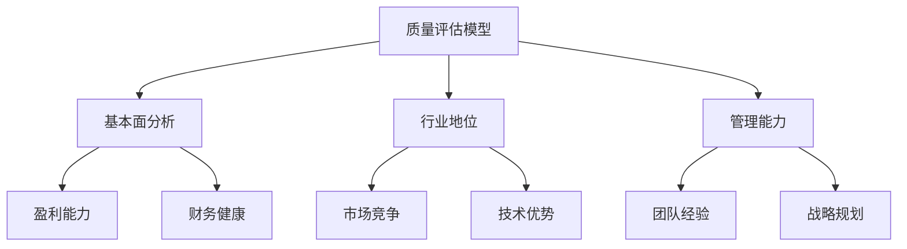

                 

# 彼得林奇的"质量优先"在医疗科技投资中的应用

---

## 关键词：  
彼得林奇, 质量优先, 医疗科技, 投资策略, 质量评估, 风险管理

---

## 摘要：  
本文探讨了彼得林奇的“质量优先”投资理念在医疗科技领域的应用。通过对医疗科技行业的现状、趋势、质量评估模型、投资策略及风险管理的系统分析，结合实际案例，总结了质量优先在医疗科技投资中的实践方法和成功经验。文章从理论到实践，为投资者提供了全面的指导和启示。

---

## 正文：

### 第一部分：引言

#### 1. 彼得林奇投资理念概述

彼得林奇是全球著名投资家，以其“质量优先”的投资理念闻名。他认为，投资成功的关键在于选择具有持续竞争优势和良好管理团队的公司，并长期持有。医疗科技作为当前快速发展的行业，其投资机会与挑战并存，为质量优先理念的应用提供了广阔的舞台。

#### 2. 医疗科技行业的现状与未来趋势

医疗科技行业涵盖医疗设备、药品研发、医疗信息化等多个领域，近年来随着技术进步和政策支持，行业呈现高速发展的态势。然而，行业竞争激烈，技术更新快，企业质量参差不齐，投资者需要通过质量评估模型筛选出具有长期竞争优势的企业。

---

### 第二部分：质量优先理念的核心要素

#### 1. 质量优先的定义与特征

质量优先是一种以企业质量为核心的投资策略，强调选择具有强大基本面、竞争优势和管理能力的公司。其核心特征包括：

- **基本面优秀**：盈利能力稳定，财务健康。
- **竞争优势明显**：在行业内具有独特的技术和市场地位。
- **管理团队可靠**：管理团队经验丰富，战略清晰。

#### 2. 医疗科技行业的质量评估模型

为适应医疗科技行业的特点，构建了一个包含基本面分析、行业地位和管理能力的质量评估模型。

**质量评估模型框架：**

---

### 第三部分：质量优先在医疗科技投资中的应用

#### 1. 投资策略与实践

**投资策略：**

- **长期价值投资**：选择具有持续增长潜力的企业。
- **行业周期分析**：关注行业周期性，抓住投资时机。
- **风险管理**：通过分散投资和严格筛选降低风险。

**投资实践：**

结合具体案例，分析了某医疗科技企业的投资过程，包括对企业基本面、行业地位和管理能力的全面评估。

---

#### 2. 风险管理与退出策略

**风险管理：**

- **风险识别**：分析行业政策、技术风险和市场波动。
- **风险控制**：通过分散投资和动态调整降低风险敞口。

**退出策略：**

- **退出时机**：关注企业估值变化和市场趋势。
- **退出方式**：选择合适时机和方式退出，实现收益最大化。

---

### 第四部分：案例分析与总结

#### 1. 成功投资案例分析

以某医疗科技企业为例，详细分析了其投资过程和成果。案例展示了质量优先策略在实际投资中的有效性和可行性。

#### 2. 未来投资展望

医疗科技行业将继续受益于技术创新和政策支持，未来投资机会丰富。投资者应关注具有核心技术优势和良好管理能力的企业，同时注重风险管理。

---

### 第五部分：总结与建议

质量优先投资理念在医疗科技领域的应用为投资者提供了科学的指导。通过构建合理的质量评估模型和投资策略，投资者能够在竞争激烈的市场中捕捉到优质企业，实现长期稳健收益。

---

## 作者：AI天才研究院 & 禅与计算机程序设计艺术

