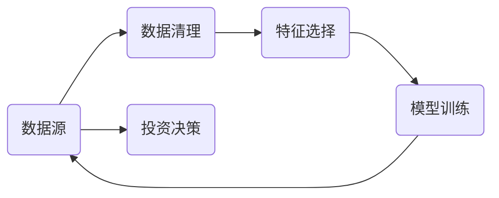

                 

# 彼得林奇的"质量优先"在新兴市场投资中的实践挑战

> 关键词：彼得林奇，质量优先，新兴市场，投资策略，系统架构，实战案例

> 摘要：本文深入探讨了彼得林奇的“质量优先”投资理念在新兴市场中的应用挑战，从理论基础到系统架构，从实战案例到数学模型，全面分析了如何在新兴市场中有效实施质量优先策略，帮助投资者在复杂多变的市场环境中实现稳健投资。

---

# 第一部分: 彼得林奇的"质量优先"投资理念概述

## 第1章: 彼得林奇与质量优先投资概述

### 1.1 彼得林奇及其投资理念

#### 1.1.1 彼得林奇的生平简介
彼得·林奇（Peter Lynch）是全球最著名的职业投资人之一，曾任富达麦哲伦基金的经理人。他以长期的投资业绩和对上市公司基本面的深入研究闻名。林奇的投资理念强调“质量优先”，即选择具有强大基本面、良好管理团队和持续增长潜力的公司进行投资。

#### 1.1.2 质量优先投资的核心理念
质量优先策略的核心在于**选择优秀的公司而非市场波动**。林奇认为，市场短期波动难以预测，但优质公司的长期表现可以通过基本面分析来判断。这种策略强调对公司的深入了解，包括财务状况、行业地位、竞争优势和管理能力。

#### 1.1.3 质量优先与新兴市场的结合
新兴市场通常具有高增长潜力，但也伴随着更高的风险和不确定性。将质量优先策略应用于新兴市场，需要结合当地市场的特点，选择那些在行业中有竞争优势、财务健康且管理团队稳健的公司。

### 1.2 新兴市场的特点与投资机会

#### 1.2.1 新兴市场的定义与范围
新兴市场通常指那些经济发展迅速、市场机制逐步完善但尚未完全成熟的国家或地区的金融市场。这些市场包括中国、印度、巴西等。

#### 1.2.2 新兴市场的投资潜力
新兴市场通常具有较高的经济增长率，许多行业处于快速发展阶段，这为投资者提供了丰富的投资机会。然而，这些市场的波动性也更大，政策风险和经济不确定性更高。

#### 1.2.3 新兴市场与发达市场的区别
| 特性 | 新兴市场 | 发达市场 |
|------|----------|----------|
| 市场成熟度 | 较低 | 高 |
| 波动性 | 高 | 低 |
| 增长潜力 | 高 | 低 |
| 投资难度 | 高 | 中 |

### 1.3 质量优先策略在投资中的重要性

#### 1.3.1 质量优先策略的定义
质量优先策略是一种以公司质量为核心的投资方法，强调选择具有强大基本面、竞争优势和持续增长潜力的公司。

#### 1.3.2 质量优先策略的核心要素
- **财务健康**：公司财务状况稳健，盈利能力强。
- **行业地位**：公司在行业中具有竞争优势。
- **管理能力**：管理团队经验丰富且高效。
- **增长潜力**：公司具有可持续的增长空间。

#### 1.3.3 质量优先策略的优势与局限性
- **优势**：通过选择优质公司，投资者可以规避市场的短期波动，实现长期稳健收益。
- **局限性**：在新兴市场中，优质公司的数量有限，且市场波动可能影响投资组合的表现。

### 1.4 本章小结
本章介绍了彼得·林奇的质量优先投资理念及其在新兴市场中的应用潜力。质量优先策略强调选择优质公司，但在新兴市场中，投资者需要面对更高的风险和不确定性。

---

# 第二部分: 质量优先策略的核心概念与分析框架

## 第2章: 质量优先策略的理论基础

### 2.1 质量优先策略的哲学基础

#### 2.1.1 质量优先与长期投资的关系
质量优先策略的核心是长期投资，通过选择优质公司，投资者可以避免短期市场波动的影响，实现长期稳健收益。

#### 2.1.2 质量优先与价值投资的联系
质量优先策略与价值投资有相似之处，都强调选择具有内在价值的公司。但质量优先更注重公司的质量和成长潜力。

#### 2.1.3 质量优先与成长投资的对比
| 特性 | 质量优先 | 成长投资 |
|------|----------|----------|
| 投资目标 | 稳定收益 | 高增长 |
| 风险承受 | 中等 | 较高 |
| 投资期限 | 长期 | 中长期 |

### 2.2 质量优先策略的数学模型

#### 2.2.1 投资组合优化的数学公式
投资组合的收益和风险可以通过以下公式进行优化：

$$
\text{收益} = \sum_{i=1}^{n} w_i \cdot r_i
$$

$$
\text{风险} = \sqrt{\sum_{i=1}^{n} \sum_{j=1}^{n} w_i w_j \cdot \sigma_i \sigma_j \cdot \rho_{ij}}
$$

其中，\( w_i \) 是第 \( i \) 只股票的权重，\( r_i \) 是第 \( i \) 只股票的预期收益，\( \sigma_i \) 是第 \( i \) 只股票的收益波动率，\( \rho_{ij} \) 是第 \( i \) 和第 \( j \) 只股票的协方差。

#### 2.2.2 风险与收益的平衡模型
通过优化投资组合的夏普比率，可以在风险与收益之间找到平衡点：

$$
\text{夏普比率} = \frac{\text{投资组合收益} - \text{无风险利率}}{\text{投资组合收益波动率}}
$$

### 2.3 质量优先策略的属性特征对比表
| 属性 | 传统投资 | 质量优先投资 |
|------|----------|--------------|
| 投资目标 | 短期收益 | 长期价值 |
| 投资策略 | 跟风炒作 | 选择优质企业 |
| 风险控制 | 低关注 | 高关注 |

### 2.4 质量优先策略的ER实体关系图

### 2.5 本章小结
本章从哲学基础和数学模型的角度分析了质量优先策略的理论基础，强调了其在投资组合优化中的重要性。

---

# 第三部分: 质量优先策略在新兴市场的实践挑战

## 第3章: 新兴市场中的质量优先策略实施

### 3.1 新兴市场中的公司选择标准

#### 3.1.1 公司基本面分析
公司基本面分析包括对财务报表的分析，重点关注盈利能力、资产负债表健康状况和现金流情况。

#### 3.1.2 行业地位与竞争优势
选择在行业中具有竞争优势的公司，例如市场份额高、技术领先或成本优势明显。

#### 3.1.3 财务健康状况评估
通过财务指标（如ROE、净利率、负债率等）评估公司的财务健康状况。

### 3.2 新兴市场中的投资风险分析

#### 3.2.1 市场波动风险
新兴市场波动性高，容易受到外部因素（如政策变化、经济波动）的影响。

#### 3.2.2 政策风险
新兴市场国家的政策变化可能对市场产生重大影响，投资者需要密切关注政策动向。

#### 3.2.3 经济周期风险
新兴市场通常处于快速发展的经济周期中，周期波动可能对投资组合产生重大影响。

### 3.3 新兴市场中的质量优先策略实施

#### 3.3.1 投资组合构建
根据质量优先策略，选择那些在新兴市场中具有强大基本面和竞争优势的公司。

#### 3.3.2 风险管理
通过分散投资、设置止损点和定期评估投资组合来降低风险。

### 3.4 本章小结
本章分析了在新兴市场中实施质量优先策略的具体挑战，包括公司选择标准和风险管理策略。

---

# 第四部分: 质量优先策略的系统架构与实战案例

## 第4章: 基于质量优先策略的投资系统架构

### 4.1 系统功能设计

#### 4.1.1 数据收集模块
从新兴市场中收集公司的基本面数据，包括财务报表、行业排名等。

#### 4.1.2 特征选择模块
根据质量优先策略，选择关键特征（如ROE、市场份额、管理团队等）。

#### 4.1.3 模型训练模块
使用机器学习算法对特征进行分析，评估公司的质量。

#### 4.1.4 投资决策模块
根据模型评估结果，生成投资建议。

### 4.2 系统架构设计

#### 4.2.1 系统架构图

### 4.3 本章小结
本章设计了一个基于质量优先策略的投资系统架构，从数据收集到投资决策，详细描述了系统的功能模块和架构设计。

---

# 第五部分: 实战案例与总结

## 第5章: 质量优先策略在新兴市场的实战案例

### 5.1 案例分析

#### 5.1.1 案例背景
选择一家新兴市场的科技公司作为案例，分析其财务状况、行业地位和竞争优势。

#### 5.1.2 数据收集与分析
收集公司的财务数据，分析其ROE、净利率等指标。

#### 5.1.3 投资决策
根据分析结果，决定是否将该公司纳入投资组合。

### 5.2 本章小结
本章通过具体案例展示了质量优先策略在新兴市场中的实际应用。

---

# 作者信息

作者：AI天才研究院/AI Genius Institute & 禅与计算机程序设计艺术 /Zen And The Art of Computer Programming

