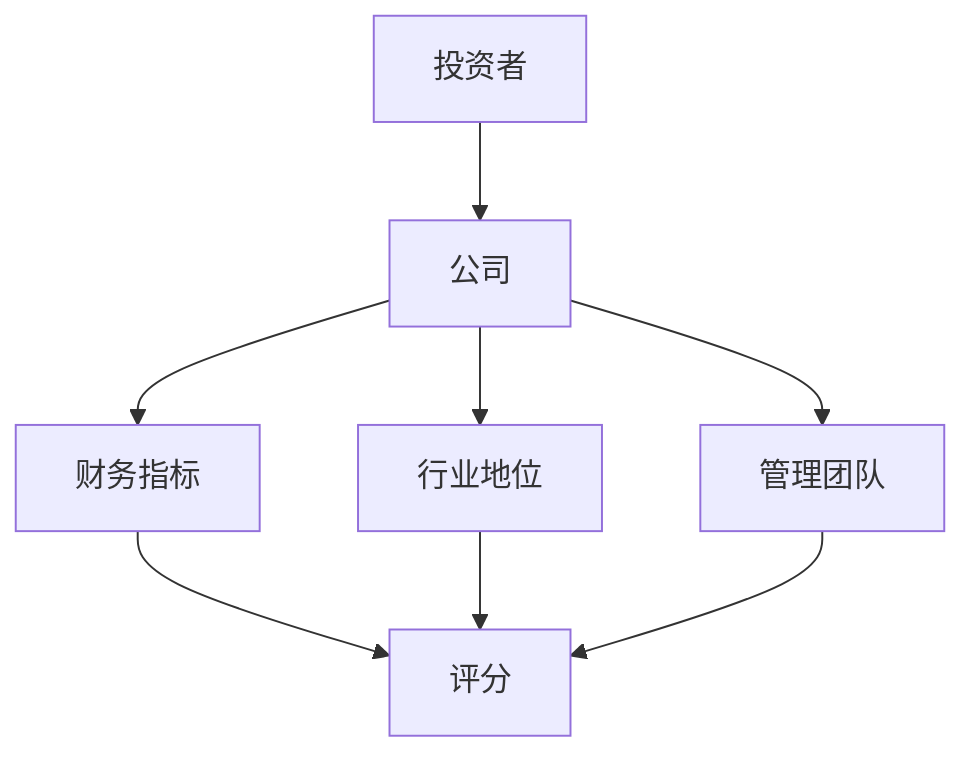
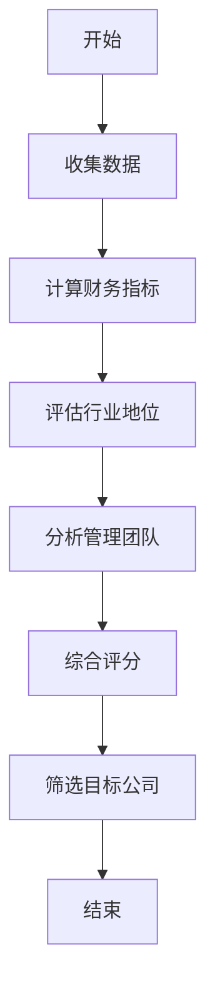
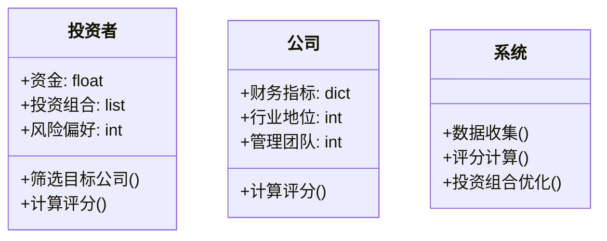
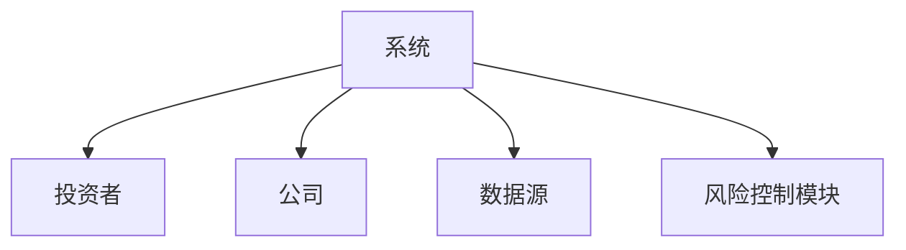
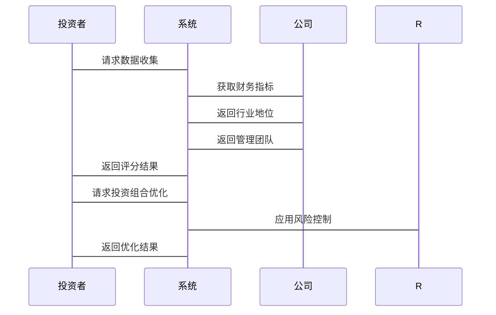

                 


# 彼得林奇的"质量优先"在新兴市场的实践挑战

## 关键词：质量优先策略、彼得林奇、投资策略、新兴市场、风险控制

## 摘要：本文深入探讨了彼得林奇的质量优先投资策略在新兴市场中的应用挑战。通过分析策略的核心概念、算法原理、系统架构及实际案例，揭示了该策略在新兴市场的独特挑战，并提出了优化建议。

---

## 第一部分：背景介绍

### 第1章：质量优先策略的定义与核心要素

#### 1.1 质量优先策略的背景

- **问题背景**：在投资领域，选择优质公司是实现长期收益的关键。彼得林奇作为著名投资经理，提出了质量优先策略，强调选择具有强大基本面和管理团队的公司。
- **问题描述**：新兴市场波动性高、信息不透明，实施质量优先策略面临更多挑战。
- **解决方法**：通过多维度评估公司质量，结合市场环境动态调整策略。
- **边界与外延**：质量优先策略不仅适用于成熟市场，新兴市场的独特性要求策略进行本地化调整。

#### 1.2 质量优先策略的核心要素

- **核心概念**：质量优先策略注重公司基本面、行业地位和管理团队。
- **实施要素**：
  - **公司质量评估**：财务指标、行业地位、管理团队。
  - **市场质量评估**：市场波动性、政策环境、行业趋势。
  - **动态调整机制**：定期评估和调整投资组合。

---

## 第二部分：核心概念与联系

### 第2章：质量优先策略的原理与特征

#### 2.1 质量优先策略的原理

- **核心原理**：通过多维度评估公司质量，选择优质公司进行投资。
- **动态调整**：根据市场变化和公司表现，动态调整投资组合。
- **风险管理**：通过分散投资和严格筛选降低风险。

#### 2.2 核心概念对比分析

| 投资策略 | 质量优先 | 价值投资 | 成长投资 |
|----------|-----------|-----------|----------|
| 核心目标 | 选择优质公司 | 寻找被低估资产 | 投资高增长公司 |
| 评估重点 | 质量、管理 | 价格、价值 | 成长潜力 |
| 风险偏好 | 中低风险 | 中低风险 | 高风险 |

#### 2.3 ER实体关系图



---

## 第三部分：算法原理讲解

### 第3章：质量优先策略的算法实现

#### 3.1 算法流程图



#### 3.2 Python核心代码实现

```python
def calculate_score(financials, industry, management):
    return 0.3 * financials + 0.3 * industry + 0.4 * management

# 示例数据
financials = 85
industry = 70
management = 90

score = calculate_score(financials, industry, management)
print(f"公司评分为：{score}")
```

#### 3.3 数学模型与公式

- **加权评分公式**：
  $$ \text{评分} = 0.3 \times \text{财务指标} + 0.3 \times \text{行业地位} + 0.4 \times \text{管理团队} $$

- **筛选条件**：
  $$ \text{评分} \geq 80 $$

---

## 第四部分：系统分析与架构设计

### 第4章：系统架构设计

#### 4.1 项目背景

- 为实施质量优先策略开发一个自动化投资管理系统，帮助投资者在新兴市场中筛选优质公司。

#### 4.2 系统功能设计



#### 4.3 系统架构设计



#### 4.4 系统交互设计



---

## 第五部分：项目实战

### 第5章：项目实战与案例分析

#### 5.1 环境安装

- **工具**：Python、Pandas、Matplotlib、Scikit-learn。
- **数据源**：新兴市场的财务数据和行业报告。

#### 5.2 核心代码实现

```python
import pandas as pd

def preprocess_data(dataframe):
    # 数据清洗与预处理
    dataframe.dropna(inplace=True)
    dataframe['评分'] = dataframe.apply(lambda x: calculate_score(x['财务指标'], x['行业地位'], x['管理团队']), axis=1)
    return dataframe

# 示例数据加载
data = pd.read_csv('emerging_markets.csv')
data_clean = preprocess_data(data)
print(data_clean.head())
```

#### 5.3 实际案例分析

- **案例**：印度市场的科技公司。
- **步骤**：
  1. 数据收集与清洗。
  2. 计算各公司的评分。
  3. 根据评分筛选优质公司。
  4. 构建投资组合并进行优化。

#### 5.4 项目总结

- **成果**：成功构建了一个自动化投资管理系统，帮助投资者在新兴市场中筛选优质公司。
- **经验**：新兴市场的复杂性要求策略具有灵活性和本地化调整能力。

---

## 第六部分：最佳实践

### 第6章：最佳实践与注意事项

#### 6.1 投资策略优化建议

- 定期回顾和调整投资组合。
- 结合市场趋势和行业动态优化策略。
- 采用多维度评估方法，降低单一因素影响。

#### 6.2 风险控制建议

- 设定止损点，避免重大损失。
- 分散投资，降低集中风险。
- 定期评估策略的有效性。

#### 6.3 拓展阅读

- 彼得林奇的《彼得林奇的成功投资》。
- 《投资学基础》。

---

## 结语

质量优先策略在新兴市场的应用具有独特挑战，但通过深入分析和系统设计，可以有效应对这些挑战。投资者应结合市场特点，灵活调整策略，以实现长期稳定的收益。

---

## 作者：AI天才研究院/AI Genius Institute & 禅与计算机程序设计艺术 /Zen And The Art of Computer Programming

---

这篇文章系统地探讨了彼得林奇的质量优先策略在新兴市场的实践挑战，通过理论分析、算法设计和项目实战，为投资者提供了有价值的指导和建议。

