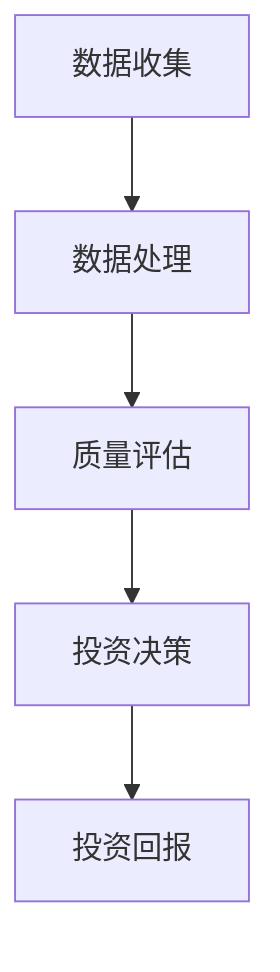

                 


# 彼得林奇的"质量优先"投资策略分析

> 关键词：彼得林奇，投资策略，质量优先，长期投资，基本面分析，优质公司

> 摘要：本文详细分析了彼得林奇的“质量优先”投资策略，从其核心理念、数学模型到实际应用，深入探讨了如何通过选择优质公司进行长期投资，以实现稳健的投资回报。

---

## 第1章：彼得林奇投资理念概述

### 1.1 彼得林奇的生平与成就

#### 1.1.1 彼得林奇的生平简介
彼得·林奇（Peter Lynch）是美国著名投资专家，曾任富达投资集团麦哲伦基金的经理。他以卓越的投资业绩和独特的选股方法闻名，被誉为“股神”之一。

#### 1.1.2 彼得林奇的投资成就
在担任麦哲伦基金经理期间，彼得林奇使基金资产从1.3亿美元增长至140亿美元，年均回报率达到29%，远超市场平均水平。

#### 1.1.3 彼得林奇的投资哲学
彼得林奇强调投资的长期性和选择优质公司的理念，认为长期持有优质股票是实现财富增长的最佳方式。

### 1.2 “质量优先”投资策略的背景

#### 1.2.1 投资领域的现状
传统投资策略存在短期波动大、风险高的问题，投资者需要更稳健的策略。

#### 1.2.2 传统投资策略的局限性
传统策略往往注重短期收益，忽视了公司的长期发展潜力。

#### 1.2.3 “质量优先”策略的提出
彼得林奇提出“质量优先”策略，强调选择优质公司进行长期投资，以实现稳健回报。

---

## 第2章：“质量优先”投资策略的核心概念

### 2.1 优质公司的定义

#### 2.1.1 优质公司的特征
- 高质量的管理层
- 强大的竞争优势
- 稳定的财务状况
- 可持续的盈利能力

#### 2.1.2 优质公司的筛选标准
- 市盈率（P/E）低于行业平均水平
- 市净率（P/B）低于行业平均水平
- 股息率合理且稳定增长

### 2.2 长期投资的重要性

#### 2.2.1 长期投资的优势
- 避免短期波动影响
- 享受公司长期成长带来的收益

#### 2.2.2 长期投资的风险与挑战
- 市场波动可能导致短期亏损
- 需要较长的时间来实现收益

---

## 第3章：“质量优先”策略与其他投资策略的对比

### 3.1 价值投资与成长投资的区别

#### 3.1.1 价值投资的核心理念
寻找被市场低估的股票，等待其价值回归。

#### 3.1.2 成长投资的核心理念
投资于高成长性的公司，追求资本增值。

#### 3.1.3 两者与“质量优先”策略的异同
- 价值投资注重价格，成长投资注重增长，“质量优先”注重公司质量。
- 三者都强调长期投资，但侧重点不同。

### 3.2 “质量优先”策略的独特性

#### 3.2.1 独特的选股标准
- 重视公司质量，而非单纯的低估值或高成长。

#### 3.2.2 独特的风险管理方式
- 通过选择优质公司降低投资风险。

---

## 第4章：投资策略的数学模型

### 4.1 基本面分析的数学模型

#### 4.1.1 市盈率（P/E）的计算与应用
$$ P/E = \frac{\text{股价}}{\text{每股收益}} $$
市盈率低于行业平均水平的公司更具投资价值。

#### 4.1.2 市净率（P/B）的计算与应用
$$ P/B = \frac{\text{股价}}{\text{每股净资产}} $$
市净率低于行业平均水平的公司更具投资价值。

#### 4.1.3 股息率的计算与应用
$$ \text{股息率} = \frac{\text{每股股息}}{\text{股价}} \times 100\% $$
股息率合理且稳定的公司更具投资价值。

### 4.2 质量评估的综合模型

#### 4.2.1 综合质量指数的构建
综合考虑市盈率、市净率和股息率等因素，构建综合质量指数。

#### 4.2.2 综合质量指数的计算公式
$$ \text{综合质量指数} = \frac{\text{市盈率} + \text{市净率} + \text{股息率}}{3} $$

---

## 第5章：系统分析与架构设计方案

### 5.1 系统功能设计

#### 5.1.1 领域模型类图


#### 5.1.2 系统架构设计


---

## 第6章：项目实战

### 6.1 环境安装
安装必要的数据分析工具，如Python和Pandas库。

### 6.2 核心代码实现

#### 6.2.1 数据处理代码
```python
import pandas as pd

# 加载数据
df = pd.read_csv('stocks.csv')

# 计算市盈率
df['PE'] = df['股价'] / df['每股收益']

# 计算市净率
df['PB'] = df['股价'] / df['每股净资产']

# 计算股息率
df['股息率'] = (df['每股股息'] / df['股价']) * 100
```

#### 6.2.2 质量评估代码
```python
def 计算综合质量指数(df):
    df['综合质量指数'] = (df['PE'] + df['PB'] + df['股息率']) / 3
    return df

# 应用质量评估
df = 计算综合质量指数(df)
```

### 6.3 实际案例分析

#### 6.3.1 案例选择
以科技行业为例，分析苹果公司的投资价值。

#### 6.3.2 数据分析
```python
# 分析苹果公司
apple = df[df['公司'] == '苹果']
print(apple[['PE', 'PB', '股息率', '综合质量指数']])
```

### 6.4 投资决策与结果解读
根据计算的综合质量指数，选择综合质量指数高于行业平均水平的公司进行投资。

---

## 第7章：最佳实践与总结

### 7.1 最佳实践
- 定期评估公司的质量指数
- 长期持有优质公司股票

### 7.2 小结
彼得林奇的“质量优先”策略通过选择优质公司进行长期投资，能够实现稳健的投资回报。

### 7.3 注意事项
- 市场波动可能影响短期收益
- 需要持续关注公司基本面变化

### 7.4 拓展阅读
推荐阅读彼得林奇的书籍《彼得·林奇的成功投资》。

---

## 作者：AI天才研究院 & 禅与计算机程序设计艺术

