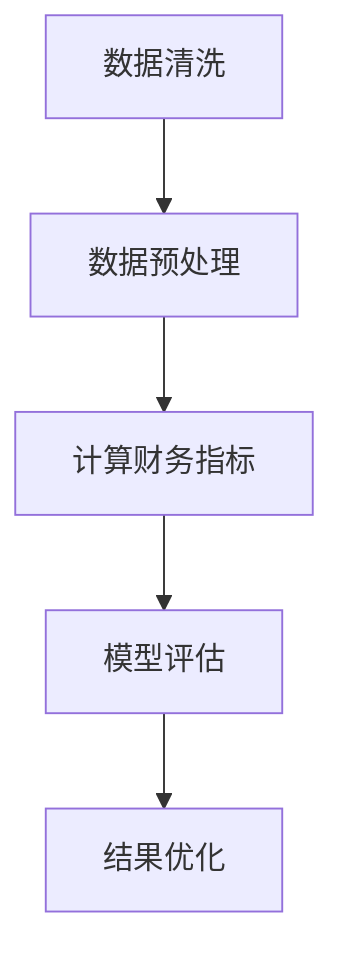

                 

# 彼得林奇的"质量优先"选股标准

> 关键词：彼得·林奇，质量优先，选股标准，投资策略，财务分析，优质公司

> 摘要：本文深入分析了彼得·林奇的"质量优先"选股标准，探讨了优质公司的核心特征、质量优先与数量优先的区别，以及如何通过财务指标和市场地位来选择优质股票。文章结合实际案例，详细阐述了质量优先选股的数学模型、系统架构设计和实战应用，为投资者提供了实用的指导。

---

## 第一部分: 投资基础与彼得·林奇的选股理念

### 第1章: 投资的基本概念

#### 1.1 投资的定义与分类

投资是指将资金投入到某个项目或资产中，以期获得未来收益的行为。投资可以分为以下几类：

- **股票投资**: 购买公司股份，成为股东，分享公司利润。
- **债券投资**: 购买政府或企业的债券，定期获得利息。
- **房地产投资**: 购买房地产用于出租或升值。
- **金融衍生品投资**: 通过期货、期权等衍生品进行投资。

#### 1.2 彼得·林奇的生平与投资理念

彼得·林奇（Peter Lynch）是美国著名的投资专家，曾任富达麦哲伦基金的经理，创造了该基金的辉煌业绩。他的投资理念以“质量优先”为核心，强调选择优质公司进行长期投资。

---

### 第2章: 质量优先选股标准的核心概念

#### 2.1 质量优先选股的定义

质量优先选股是一种投资策略，强调选择具有强大财务实力、良好市场地位和持续盈利能力的公司。与数量优先选股（追求短期高增长）不同，质量优先更注重企业的内在价值和长期稳定性。

#### 2.2 优质公司的核心特征

优质公司通常具有以下特征：

- **盈利能力**: 净利润持续增长，ROE（净资产收益率）较高。
- **财务稳定性**: 低债务负担，现金流充裕。
- **市场地位**: 市场领导者，具有竞争优势。
- **管理团队**: 高效且透明的管理团队。

#### 2.3 质量优先选股的标准

- **盈利能力**: 比较市盈率（P/E）和市净率（P/B）。
- **财务稳定性**: 分析资产负债表，确保公司债务可控。
- **市场领导地位**: 关注行业排名和市场份额。

---

## 第二部分: 质量优先选股的数学模型与分析

### 第3章: 质量优先选股的数学模型与分析

#### 3.1 质量优先选股的数学模型

质量优先选股可以通过以下数学模型进行评估：

1. **市盈率（P/E）**:
   $$ \text{P/E} = \frac{\text{股价}}{\text{每股收益}} $$
   P/E过低可能意味着股价被低估，过高可能意味着股价被高估。

2. **市净率（P/B）**:
   $$ \text{P/B} = \frac{\text{股价}}{\text{每股净资产}} $$
   低P/B值通常意味着公司估值较低。

#### 3.2 财务指标的权重分配

以下是关键财务指标的权重分配表：

| 指标         | 权重（%） |
|--------------|-----------|
| 净利润增长率 | 30        |
| ROE          | 25        |
| 债务与资本比 | 20        |
| 现金流       | 15        |
| 市场份额     | 10        |

---

## 第三部分: 质量优先选股的系统架构设计

### 第4章: 质量优先选股的系统架构设计

#### 4.1 系统架构概述

质量优先选股的系统架构可以分为以下几个模块：

1. **数据收集模块**: 收集公司财务数据、行业信息等。
2. **数据分析模块**: 对数据进行清洗、预处理和计算。
3. **投资决策模块**: 根据分析结果生成投资建议。

#### 4.2 数据分析流程

以下是数据分析流程的mermaid图：

---

## 第四部分: 质量优先选股的实战案例

### 第5章: 质量优先选股的实战案例

#### 5.1 案例分析: 苹果公司

**公司背景与市场地位**: 苹果公司是全球市值最高的公司之一，拥有强大的品牌影响力和技术优势。

**财务指标分析**:
- 市盈率（P/E）: 25.6（合理）。
- 市净率（P/B）: 10.5（较高，但与行业地位相符）。
- 净利润增长率: 17%（持续增长）。

**投资决策与结果**: 苹果公司的财务指标和市场地位符合质量优先选股标准，长期持有可以获得稳定收益。

#### 5.2 案例分析: 微软公司

**公司背景与市场地位**: 微软是全球领先的软件公司，拥有强大的技术储备和市场占有率。

**财务指标分析**:
- 市盈率（P/E）: 30.0（略高，但与行业高增长预期相符）。
- 市净率（P/B）: 12.0（较高，但与行业地位相符）。
- 净利润增长率: 24%（高速增长）。

**投资决策与结果**: 微软公司的财务指标和市场地位符合质量优先选股标准，长期持有可以获得稳定收益。

---

## 第五部分: 质量优先选股的最佳实践与注意事项

### 第6章: 质量优先选股的最佳实践与注意事项

#### 6.1 投资策略的调整与优化

- 定期复盘与调整: 每季度复盘一次，根据市场变化调整投资组合。
- 风险管理与止损策略: 设置止损点，避免重大损失。
- 长期投资: 避免短期波动，坚持长期投资。

#### 6.2 投资的注意事项

- **避免情绪化投资**: 投资决策应基于数据和分析，避免情绪化。
- **分散投资**: 不要将所有资金投入单一资产或行业。
- **关注行业趋势**: 选择符合未来发展趋势的行业。

#### 6.3 长期投资的重要性

长期投资可以帮助投资者规避短期市场波动的风险，获得企业的长期增长收益。

---

## 结语

彼得·林奇的“质量优先”选股标准是一种科学的投资方法，通过选择优质公司进行长期投资，可以获得稳定的收益。本文通过理论分析、数学模型和实战案例，为投资者提供了实用的指导。

---

## 作者

作者：AI天才研究院/AI Genius Institute & 禅与计算机程序设计艺术 /Zen And The Art of Computer Programming

