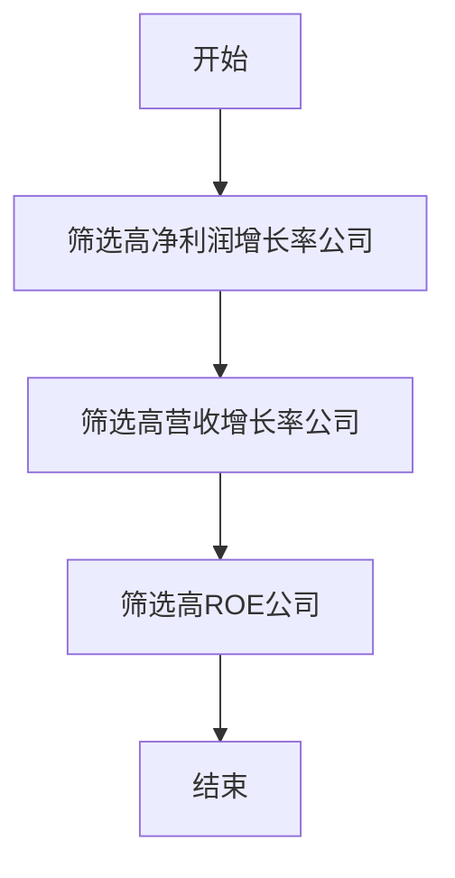
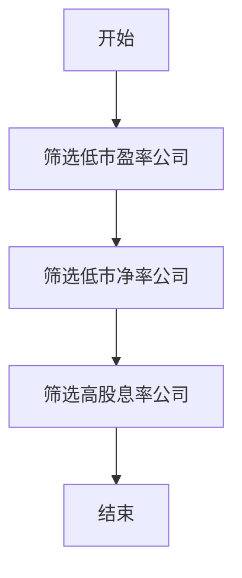
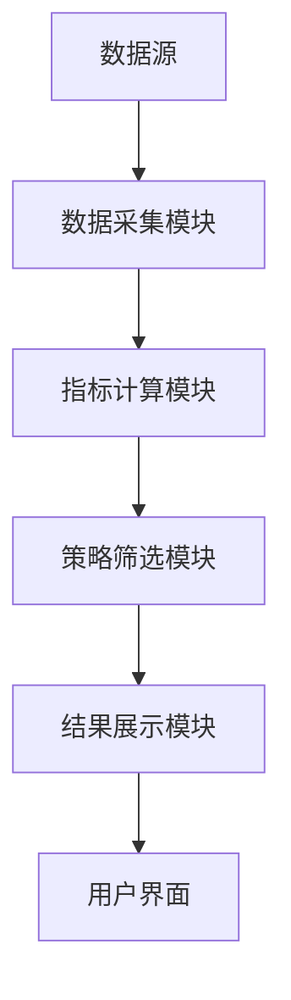
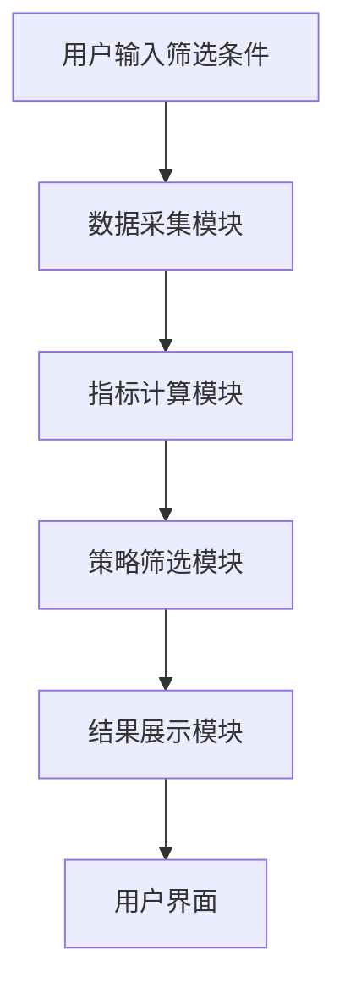

                 


# 彼得林奇的"质量成长"vs"价值重估"在不同市值公司中的应用

## 关键词：彼得林奇、质量成长、价值重估、投资策略、市值公司、股票分析

## 摘要：本文深入分析了彼得林奇提出的“质量成长”与“价值重估”两种投资策略在不同市值公司中的应用。通过对比两种策略的核心概念、数学模型和实际案例，探讨了它们在实际投资中的适用场景及优势，为投资者提供实用的参考和指导。

---

# 第一部分：彼得林奇投资策略概述

## 第1章：彼得林奇投资策略的背景与核心概念

### 1.1 投资学中的质量成长与价值重估

#### 1.1.1 质量成长的定义与特征

**质量成长**是指选择那些具有持续增长潜力、良好管理团队和稳定收益的公司进行投资。其核心在于公司未来成长能力，而非当前估值。质量成长策略适用于那些已经建立市场地位、具备竞争优势且能够持续扩张的企业。

**质量成长的核心特征**：
1. **稳定的收益增长**：公司净利润和营业收入持续增长。
2. **良好的管理团队**：公司治理结构透明，管理团队经验丰富。
3. **强大的竞争优势**：公司在行业中具有较高的市场占有率或独特的竞争优势。
4. **健康的财务状况**：低负债率、高利润率、现金流充裕。

#### 1.1.2 价值重估的定义与特征

**价值重估**是指选择那些市场价格低于其内在价值的公司进行投资。其核心在于寻找被市场低估的股票，通过分析公司的内在价值来判断其是否具备投资价值。

**价值重估的核心特征**：
1. **低市盈率（P/E）**：股价相对于每股收益较低。
2. **低市净率（P/B）**：股价相对于每股净资产较低。
3. **高股息率**：公司愿意派发较高的股息，通常表明公司具有稳定的收益能力。
4. **行业低估**：公司在当前行业周期中被低估，具有较大的估值修复空间。

#### 1.1.3 质量成长与价值重估的区别与联系

| 对比维度       | 质量成长                     | 价值重估                     |
|----------------|-----------------------------|-----------------------------|
| 核心目标       | 寻找具有持续增长潜力的公司     | 寻找市场价格低于内在价值的公司 |
| 关注重点       | 未来成长能力                 | 当前估值与内在价值的差异     |
| 适用场景       | 高成长性行业、新兴行业       | 传统行业、周期性行业         |
| 风险与收益     | 高风险、高收益               | 中等风险、中等收益           |

### 1.2 彼得林奇投资策略的核心要素

#### 1.2.1 质量成长策略的核心要素

1. **公司基本面分析**：分析公司的财务报表，评估其盈利能力、成长能力和财务健康状况。
2. **行业地位分析**：考察公司在行业中的竞争地位，是否具有持续的竞争优势。

#### 1.2.2 价值重估策略的核心要素

1. **估值分析**：通过市盈率、市净率等指标评估公司的相对估值水平。
2. **股价与内在价值的差异**：分析股价是否低于公司的内在价值，寻找被低估的投资标的。

#### 1.2.3 两种策略的适用场景

- **质量成长策略适用的公司类型**：高成长性行业、新兴行业中的龙头企业。
- **价值重估策略适用的公司类型**：传统行业、周期性行业中的低估公司。

---

## 第2章：质量成长与价值重估的数学模型与算法原理

### 2.1 质量成长策略的数学模型

#### 2.1.1 质量成长策略的核心指标

1. **净利润增长率**：$$\text{净利润增长率} = \frac{\text{本期净利润} - \text{上期净利润}}{\text{上期净利润}} \times 100\%$$
2. **营收增长率**：$$\text{营收增长率} = \frac{\text{本期营收} - \text{上期营收}}{\text{上期营收}} \times 100\%$$
3. **ROE（净资产收益率）**：$$\text{ROE} = \frac{\text{净利润}}{\text{净资产}}$$

#### 2.1.2 质量成长策略的筛选算法

质量成长策略的筛选流程如下：

1. **筛选高净利润增长率的公司**：$$\text{筛选条件：净利润增长率 > 15\%}$$
2. **筛选高营收增长率的公司**：$$\text{筛选条件：营收增长率 > 10\%}$$
3. **筛选高ROE的公司**：$$\text{筛选条件：ROE > 15\%}$$

**流程图如下**：


### 2.2 价值重估策略的数学模型

#### 2.2.1 价值重估策略的核心指标

1. **市盈率（P/E）**：$$\text{市盈率} = \frac{\text{股价}}{\text{每股收益}}$$
2. **市净率（P/B）**：$$\text{市净率} = \frac{\text{股价}}{\text{每股净资产}}$$
3. **股息率**：$$\text{股息率} = \frac{\text{每股股息}}{\text{股价}} \times 100\%$$

#### 2.2.2 价值重估策略的筛选算法

价值重估策略的筛选流程如下：

1. **筛选低市盈率的公司**：$$\text{筛选条件：市盈率 < 市场平均市盈率}$$
2. **筛选低市净率的公司**：$$\text{筛选条件：市净率 < 市场平均市净率}$$
3. **筛选高股息率的公司**：$$\text{筛选条件：股息率 > 市场平均股息率}$$

**流程图如下**：


---

## 第3章：质量成长与价值重估策略的系统架构与实现

### 3.1 系统分析与架构设计

#### 3.1.1 系统功能设计

1. **数据采集模块**：从金融数据源获取股票数据。
2. **指标计算模块**：计算质量成长和价值重估的核心指标。
3. **策略筛选模块**：根据筛选条件筛选符合条件的公司。
4. **结果展示模块**：展示筛选结果，包括公司列表和相关指标。

#### 3.1.2 系统架构设计



### 3.2 系统接口与交互设计

#### 3.2.1 数据接口设计

1. **数据输入接口**：从金融数据API获取股票数据。
2. **数据处理接口**：对数据进行清洗和预处理。
3. **数据输出接口**：将处理后的数据输出到结果展示模块。

#### 3.2.2 交互流程设计



---

## 第4章：质量成长与价值重估策略的项目实战

### 4.1 项目环境与工具安装

#### 4.1.1 数据获取工具安装

- **数据获取工具**：使用Yahoo Finance API获取股票数据。
- **数据处理工具**：使用Python的pandas库进行数据清洗和分析。

#### 4.1.2 算法实现工具安装

- **Python编程环境**：安装Python 3.8及以上版本。
- **Jupyter Notebook**：用于编写和运行代码。

### 4.2 核心代码实现

#### 4.2.1 质量成长策略的核心代码

```python
import pandas as pd

# 假设data是一个包含股票数据的DataFrame
# 计算净利润增长率
data['净利润增长率'] = (data['净利润'] - data['上期净利润']) / data['上期净利润'] * 100
# 计算营收增长率
data['营收增长率'] = (data['营收'] - data['上期营收']) / data['上期营收'] * 100
# 计算ROE
data['ROE'] = data['净利润'] / data['净资产']

# 筛选条件：净利润增长率 > 15%，营收增长率 > 10%，ROE > 15%
筛选结果 = data[(data['净利润增长率'] > 15) & (data['营收增长率'] > 10) & (data['ROE'] > 15)]
```

#### 4.2.2 价值重估策略的核心代码

```python
import pandas as pd

# 假设data是一个包含股票数据的DataFrame
# 计算市盈率
data['市盈率'] = data['股价'] / data['每股收益']
# 计算市净率
data['市净率'] = data['股价'] / data['每股净资产']
# 计算股息率
data['股息率'] = (data['每股股息'] / data['股价']) * 100

# 筛选条件：市盈率 < 市场平均市盈率，市净率 < 市场平均市净率，股息率 > 市场平均股息率
市场平均市盈率 = data['市盈率'].mean()
市场平均市净率 = data['市净率'].mean()
市场平均股息率 = data['股息率'].mean()

筛选结果 = data[(data['市盈率'] < 市场平均市盈率) & (data['市净率'] < 市场平均市净率) & (data['股息率'] > 市场平均股息率)]
```

### 4.3 实战案例分析

#### 4.3.1 小盘股中的质量成长策略应用

**案例分析**：假设我们有以下小盘股的数据：

| 公司名称 | 净利润增长率 | 营收增长率 | ROE |
|----------|--------------|------------|-----|
| 公司A    | 20%          | 15%        | 20% |
| 公司B    | 18%          | 12%        | 18% |
| 公司C    | 10%          | 8%         | 12% |

根据质量成长策略的筛选条件，筛选出公司A和公司B。

#### 4.3.2 大盘股中的价值重估策略应用

**案例分析**：假设我们有以下大盘股的数据：

| 公司名称 | 市盈率 | 市净率 | 股息率 |
|----------|--------|--------|--------|
| 公司D    | 12     | 1.5    | 5%     |
| 公司E    | 15     | 2.0    | 3%     |
| 公司F    | 10     | 1.0    | 6%     |

根据价值重估策略的筛选条件，筛选出公司D和公司F。

---

## 第5章：总结与展望

### 5.1 总结

彼得林奇的“质量成长”与“价值重估”策略在不同市值公司中的应用各有侧重。质量成长策略适合投资于具有高成长潜力的公司，而价值重估策略适合投资于被市场低估的公司。投资者可以根据自身的风险偏好和市场环境选择合适的策略。

### 5.2 投资建议

1. **长期投资者**：适合采用质量成长策略，投资于具有持续增长潜力的公司。
2. **短期投资者**：适合采用价值重估策略，寻找被市场低估的投资标的。
3. **组合投资**：将两种策略结合使用，分散投资风险，提高投资收益。

### 5.3 注意事项

- **市场风险**：投资需谨慎，市场波动可能会影响投资收益。
- **数据准确性**：确保数据来源可靠，避免因数据错误导致投资决策失误。
- **持续学习**：市场环境不断变化，投资者需持续学习和调整投资策略。

### 5.4 拓展阅读

- 彼得林奇的《股市长线思维》
- 《投资学原理》
- 《价值投资实战》

---

**作者：AI天才研究院/AI Genius Institute & 禅与计算机程序设计艺术/Zen And The Art of Computer Programming**

