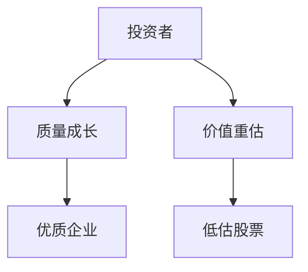
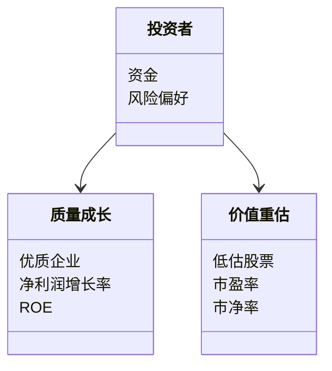
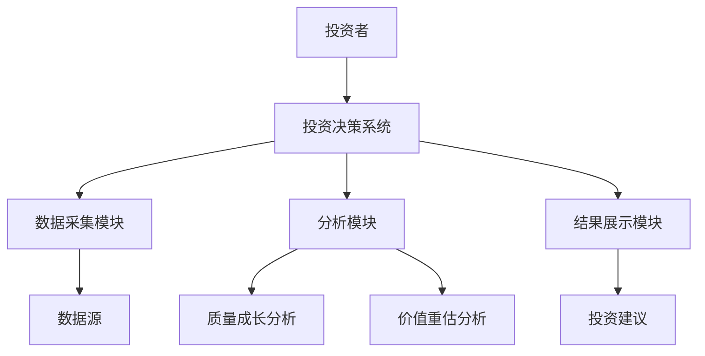
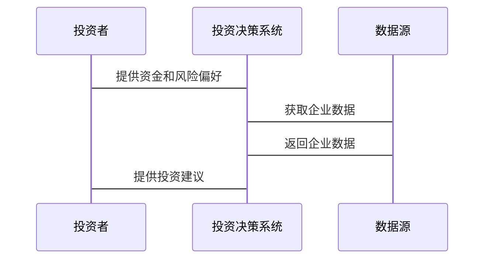

                 


# 彼得林奇的"质量成长"vs"价值重估"在不同行业的应用

**关键词**：彼得·林奇，质量成长，价值重估，投资策略，行业分析

**摘要**：本文深入探讨了彼得·林奇提出的“质量成长”和“价值重估”两种投资策略在不同行业中的应用。通过对比分析、系统架构设计和实际案例研究，本文详细阐述了这两种策略的核心概念、数学模型及其在科技、金融、消费等行业的具体应用。同时，本文还探讨了如何将这两种策略结合使用，以实现投资组合的优化和风险管理。

---

# 第一部分: 背景介绍

# 第1章: 彼得·林奇投资理念概述

## 1.1 什么是质量成长

### 1.1.1 质量成长的定义

质量成长是一种投资策略，强调投资于具有持续增长潜力的优质企业。这种策略关注企业的基本面，如盈利能力、市场地位、竞争优势和管理团队等。彼得·林奇认为，质量成长型企业具备以下特征：

1. **高ROE（净资产收益率）**：ROE反映了企业使用股东资金的效率，高ROE通常意味着企业具有较强的盈利能力。
2. **持续增长的净利润**：企业净利润的持续增长是质量成长的核心标志。
3. **强大的竞争优势**：企业在市场中具有独特的竞争优势，能够长期保持领先地位。

### 1.1.2 质量成长的核心要素

- **盈利能力**：企业的净利润增长率和ROE是衡量质量成长的关键指标。
- **市场地位**：企业在行业中的市场份额和品牌影响力。
- **竞争优势**：企业的技术壁垒、成本优势或商业模式创新。

### 1.1.3 质量成长与传统投资策略的区别

质量成长与传统价值投资的区别主要在于投资目标和时间跨度。质量成长注重长期增长，而价值投资注重短期低估。

| 比较维度 | 质量成长 | 价值重估 |
|----------|----------|----------|
| 投资目标 | 长期增长 | 短期价值 |
| 时间跨度 | 中长期 | 短期至中短期 |

## 1.2 什么是价值重估

### 1.2.1 价值重估的定义

价值重估是一种投资策略，关注被市场低估的股票。彼得·林奇认为，市场有时会过度反应，导致某些股票的价格偏离其内在价值。投资者可以通过分析企业的内在价值，寻找被低估的投资标的。

### 1.2.2 价值重估的核心要素

- **市盈率（P/E）**：市盈率越低，可能意味着股票被低估。
- **市净率（P/B）**：市净率越低，可能意味着股票被低估。
- **股息率**：高股息率可能意味着股票具有较高的分红回报。

### 1.2.3 价值重估与质量成长的对比

价值重估与质量成长的主要区别在于关注点。价值重估关注短期低估，而质量成长关注长期增长。

## 1.3 质量成长 vs 价值重估：核心概念对比分析

### 1.3.1 对比分析表格

| 比较维度 | 质量成长 | 价值重估 |
|----------|----------|----------|
| 投资目标 | 长期增长 | 短期价值 |
| 关注点 | 企业基本面 | 市场价格 |
| 适用场景 | 高增长行业 | 低估值行业 |

### 1.3.2 ER实体关系图



## 1.4 本章小结

---

# 第二部分: 核心概念与联系

# 第2章: 质量成长与价值重估的内在联系

## 2.1 质量成长与价值重估的协同效应

### 2.1.1 质量成长如何影响价值重估

质量成长企业的持续增长可能会推动其股价上涨，从而改变其估值指标（如市盈率、市净率等），使其不再被市场低估。因此，质量成长与价值重估之间存在动态平衡。

### 2.1.2 价值重估如何反哺质量成长

当市场重新评估一家企业的价值时，如果发现其股价被低估，可能会推动股价上涨，从而为质量成长企业提供更多的资金支持。

## 2.2 质量成长与价值重估的数学模型

### 2.2.1 质量成长的数学模型

$$\text{质量成长评分} = \frac{\text{净利润增长率} + \text{ROE} + \text{竞争优势}}{3}$$

### 2.2.2 价值重估的数学模型

$$\text{价值重估潜力} = \text{市盈率} \times \text{净利润增长率} \times \text{行业景气度}$$

## 2.3 质量成长与价值重估的对比分析

### 2.3.1 对比分析表格

| 比较维度 | 质量成长 | 价值重估 |
|----------|----------|----------|
| 投资目标 | 长期增长 | 短期价值 |
| 关注点 | 企业基本面 | 市场价格 |
| 适用场景 | 高增长行业 | 低估值行业 |

### 2.3.2 案例分析：科技行业中的质量成长与价值重估

---

# 第三部分: 系统分析与架构

## 第3章: 系统分析与架构设计方案

### 3.1 问题场景介绍

假设我们正在分析科技行业，我们需要构建一个投资决策系统，帮助投资者选择适合的质量成长和价值重估标的。

### 3.2 系统功能设计

#### 领域模型



### 3.3 系统架构设计

#### 系统架构图



### 3.4 系统接口设计

- **数据接口**：与金融数据源（如Yahoo Finance）对接，获取企业财务数据和股价数据。
- **用户接口**：提供投资者输入资金和风险偏好，输出投资建议。

### 3.5 系统交互设计



## 第4章: 项目实战

### 4.1 环境安装

#### 4.1.1 安装Python环境

使用Anaconda安装Python 3.8及以上版本。

#### 4.1.2 安装依赖库

```bash
pip install pandas numpy matplotlib requests
```

### 4.2 核心代码实现

#### 4.2.1 质量成长评分模型

```python
import pandas as pd
import numpy as np

def calculate_quality_growth_score(df):
    df['ROE'] = df['净利润'] / df['净资产']
    df['质量成长评分'] = (df['净利润增长率'] + df['ROE'] + df['竞争优势']) / 3
    return df

# 示例数据
data = {
    '净利润': [100, 200, 300],
    '净资产': [500, 600, 700],
    '净利润增长率': [20, 30, 25],
    '竞争优势': [80, 70, 85]
}
df = pd.DataFrame(data)
result = calculate_quality_growth_score(df)
print(result)
```

#### 4.2.2 价值重估潜力模型

```python
import requests

def get_stock_price(ticker):
    response = requests.get(f"https://api.example.com/stock/{ticker}")
    return response.json()['price']

def calculate_value_revaluation_potential(ticker):
    price = get_stock_price(ticker)
    pe_ratio = price / (earnings / 100)
    pb_ratio = price / (book_value / 100)
    value_potential = pe_ratio * pb_ratio
    return value_potential

# 示例数据
ticker = 'AAPL'
print(calculate_value_revaluation_potential(ticker))
```

### 4.3 案例分析

#### 4.3.1 科技行业中的质量成长策略

以苹果公司为例，分析其质量成长潜力。

```python
data = {
    '净利润': [100000, 120000, 130000],
    '净资产': [500000, 600000, 700000],
    '净利润增长率': [20, 30, 25],
    '竞争优势': [90, 85, 95]
}
df = pd.DataFrame(data)
result = calculate_quality_growth_score(df)
print(result)
```

#### 4.3.2 金融行业中的价值重估策略

以某银行为例，分析其价值重估潜力。

```python
ticker = 'BAC'
print(calculate_value_revaluation_potential(ticker))
```

## 4.4 本章小结

---

# 第四部分: 总结

## 第5章: 总结与展望

### 5.1 本章小结

彼得·林奇的质量成长和价值重估策略各有优劣，投资者可以根据市场环境和自身需求选择合适的策略。

### 5.2 投资注意事项

- **风险控制**：无论选择哪种策略，都需要注意风险控制。
- **长期投资**：质量成长需要长期持有，而价值重估需要耐心等待市场重新评估。
- **行业选择**：不同行业适合不同的策略，需要根据行业特点选择合适的策略。

### 5.3 拓展阅读

- 《彼得·林奇的投资哲学》
- 《价值投资实战指南》

---

# 作者：AI天才研究院/AI Genius Institute & 禅与计算机程序设计艺术 /Zen And The Art of Computer Programming

