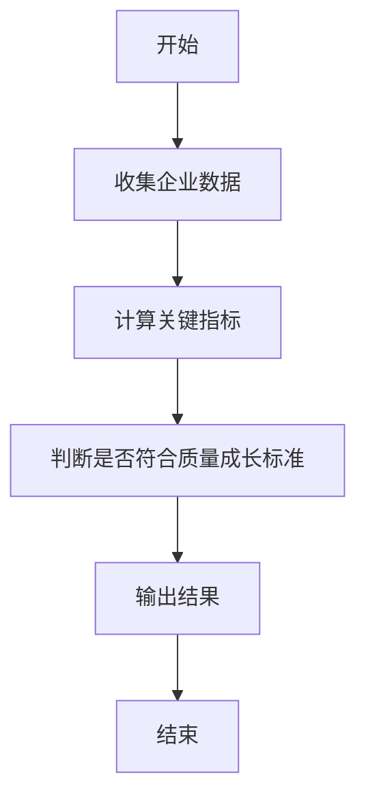
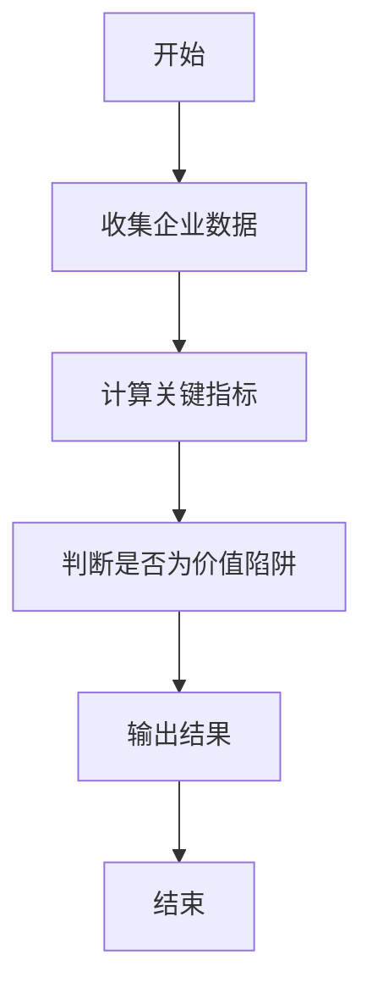
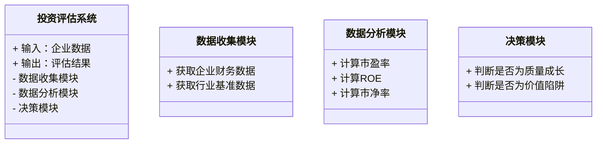
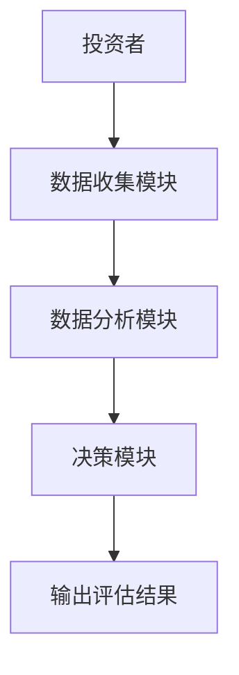

                 


# 彼得林奇的"质量成长"vs"价值陷阱"

## 关键词：彼得林奇，投资策略，质量成长，价值陷阱，股票分析，投资风险管理

## 摘要：  
本文深入探讨了彼得林奇提出的“质量成长”与“价值陷阱”两种投资策略的核心理念、评估方法及实际应用。通过对比分析，帮助投资者理解如何选择优质成长股，避开看似便宜实则存在风险的“价值陷阱”。文章结合数学模型、算法流程图及实际案例，为读者提供了一套系统化的投资评估方法。

---

# 目录大纲

## 第一部分: 背景与核心概念

### 第1章: 投资的基本概念与彼得林奇的策略

#### 1.1 投资的基本概念
- 1.1.1 什么是投资  
- 1.1.2 投资的分类与特点  
- 1.1.3 股票投资的核心要素  

#### 1.2 彼得林奇的背景与投资理念  
- 1.2.1 彼得林奇的生平简介  
- 1.2.2 彼得林奇的投资哲学  
- 1.2.3 彼得林奇的成功案例  

### 第2章: "质量成长"与"价值陷阱"的定义  

#### 2.1 质量成长的定义与特点  
- 2.1.1 质量成长的定义  
- 2.1.2 质量成长的核心要素  
- 2.1.3 质量成长的优势与局限  

#### 2.2 价值陷阱的定义与特点  
- 2.2.1 价值陷阱的定义  
- 2.2.2 价值陷阱的核心要素  
- 2.2.3 价值陷阱的风险与挑战  

### 第3章: 质量成长与价值陷阱的对比分析  

#### 3.1 核心概念对比  
- 3.1.1 质量成长与价值陷阱的对比表格  
- 3.1.2 质量成长与价值陷阱的ER实体关系图  

#### 3.2 质量成长与价值陷阱的异同  
- 3.2.1 从企业基本面分析的角度  
- 3.2.2 从投资策略的角度  
- 3.2.3 从风险与收益的角度  

---

## 第二部分: 投资策略的算法与数学模型

### 第4章: 质量成长的评估算法  

#### 4.1 质量成长评估的算法流程  


#### 4.2 算法实现  
```python
def assess_quality_growth(company_data):
    # 计算市盈率
    pe_ratio = company_data['市盈率']
    # 计算ROE
    roe = company_data['ROE']
    # 判断是否符合质量成长标准
    if pe_ratio < 15 and roe > 10:
        return "质量成长"
    else:
        return "非质量成长"
```

#### 4.3 数学模型与公式  
- 市盈率（PE）公式：  
$$ PE = \frac{股价}{每股收益} $$  
- 净资产收益率（ROE）公式：  
$$ ROE = \frac{净利润}{股东权益} $$  

### 第5章: 价值陷阱的识别算法  

#### 5.1 价值陷阱识别的算法流程  


#### 5.2 算法实现  
```python
def identify_value_trap(company_data):
    # 计算市净率
    pb_ratio = company_data['市净率']
    # 计算ROE
    roe = company_data['ROE']
    # 判断是否为价值陷阱
    if pb_ratio < 1 and roe < 5:
        return "价值陷阱"
    else:
        return "非价值陷阱"
```

#### 5.3 数学模型与公式  
- 市净率（PB）公式：  
$$ PB = \frac{股价}{每股净资产} $$  
- 净利润增长率公式：  
$$ 净利润增长率 = \frac{净利润增长量}{净利润基数} $$  

---

## 第三部分: 系统分析与架构设计

### 第6章: 投资评估系统的设计与实现  

#### 6.1 问题场景介绍  
- 投资者如何快速评估企业是否属于质量成长或价值陷阱  
- 系统需求分析：  
  - 数据收集模块  
  - 数据分析模块  
  - 决策模块  

#### 6.2 系统功能设计  


#### 6.3 系统架构设计  


---

## 第四部分: 项目实战与案例分析

### 第7章: 项目实战: 质量成长与价值陷阱的识别  

#### 7.1 环境安装与数据准备  
- 数据来源：公开企业财务数据  
- 数据清洗与预处理  

#### 7.2 系统核心实现源代码  
```python
def main():
    import pandas as pd
    # 读取数据
    df = pd.read_csv('company_data.csv')
    # 评估质量成长
    quality_growth = []
    value_trap = []
    for index, row in df.iterrows():
        pe = row['市盈率']
        roe = row['ROE']
        pb = row['市净率']
        
        if pe < 15 and roe > 10:
            quality_growth.append(row['公司名称'])
        elif pb < 1 and roe < 5:
            value_trap.append(row['公司名称'])
    
    print("质量成长公司:", quality_growth)
    print("价值陷阱公司:", value_trap)

if __name__ == "__main__":
    main()
```

#### 7.3 案例分析与解读  
- 案例1：质量成长公司的分析  
- 案例2：价值陷阱公司的分析  

---

## 第五部分: 最佳实践与小结

### 第8章: 投资策略的最佳实践  

#### 8.1 投资策略的实施建议  
- 选择优质成长股的技巧  
- 避开价值陷阱的策略  

#### 8.2 风险管理与投资分散化  
- 如何控制投资风险  
- 投资组合的优化  

### 第9章: 小结与注意事项  

#### 9.1 总结  
- 质量成长与价值陷阱的核心区别  
- 投资策略选择的关键因素  

#### 9.2 注意事项  
- 数据的准确性和完整性  
- 投资策略的动态调整  

---

## 第六部分: 拓展阅读与深入思考

### 第10章: 深入理解质量成长与价值陷阱  

#### 10.1 质量成长的长期表现分析  
- 长期回报率的统计与分析  

#### 10.2 价值陷阱的陷阱特征总结  
- 长期表现与短期估值的矛盾  

#### 10.3 投资者的心理偏差与行为偏差  
- 过度自信与从众心理的防范  

---

## 作者：AI天才研究院 & 禅与计算机程序设计艺术

