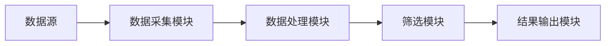

                 


# 彼得林奇的"质量成长"在不同市值公司中的应用

## 关键词：彼得林奇，质量成长，投资策略，市值公司，量化分析

## 摘要：本文深入探讨了彼得·林奇的“质量成长”投资理论在不同市值公司中的应用。通过分析小盘股、中盘股和大盘股的特点，结合量化指标和数学模型，详细讲解了如何筛选和投资具有持续成长潜力的公司。文章还提供了实战案例和系统架构设计，帮助读者更好地理解和应用这一策略。

---

## 第1章：彼得林奇“质量成长”投资理论的起源与核心概念

### 1.1 彼得林奇“质量成长”理论的背景

彼得·林奇是美国著名投资家，以其对成长型股票的投资策略而闻名。他的“质量成长”理论强调投资于那些具有持续增长潜力、管理良好、财务健康且估值合理的公司。这一策略区别于短期投机，注重长期价值的挖掘。

#### 1.1.1 彼得林奇的生平与投资理念

彼得·林奇（Peter Lynch）是富达投资集团的前经理，管理过麦哲伦基金，创造了辉煌的投资业绩。他认为，投资者应关注公司的基本面，如盈利能力、成长潜力和行业地位，而不是市场波动。

#### 1.1.2 “质量成长”投资策略的定义

质量成长策略是指选择那些具备以下特征的公司：
- **高成长性**：收入和利润持续增长。
- **良好的管理团队**：管理层稳健且透明。
- **合理的估值**：市盈率、市净率等指标处于合理区间。

#### 1.1.3 质量成长与其他投资策略的区别

- **价值投资**：寻找被市场低估的股票，关注价格与价值的差异。
- **成长投资**：侧重于公司未来的增长潜力，但可能忽视当前估值。
- **质量成长**：结合成长性和估值，寻找性价比高的投资标的。

---

### 1.2 质量成长的核心要素

质量成长策略的核心在于筛选出具有持续增长潜力且估值合理的公司。以下是其核心要素：

#### 1.2.1 质量成长的定义与特征

- **定义**：选择那些具备稳定增长潜力、财务健康且估值合理的公司。
- **特征**：
  - 高ROE（净资产收益率）。
  - 收入和利润持续增长。
  - 低债务负担，财务风险低。

#### 1.2.2 质量成长的核心要素分析

通过分析公司的财务数据，可以筛选出符合质量成长标准的公司。以下是关键指标的分析：

| 指标 | 定义 | 重要性 |
|------|------|--------|
| ROE  | 净资产收益率 | 反映公司盈利能力 |
|收入增长率| 收入年增长率 | 反映公司成长潜力 |
|市盈率 | 价格与收益比 | 评估公司估值是否合理 |

#### 1.2.3 质量成长与其他投资策略的对比

以下是质量成长与价值投资和成长投资的对比：

| 指标 | 质量成长 | 价值投资 | 成长投资 |
|------|----------|----------|----------|
| 重点 | 成长性与估值 | 价格与价值 | 成长潜力 |
| 风险 | 中等 | 较低 | 较高 |

---

## 第2章：质量成长在不同市值公司中的应用

### 2.1 不同市值公司的定义与特点

#### 2.1.1 小盘股、中盘股和大盘股的定义

- **小盘股**：市值在50亿以下的公司。
- **中盘股**：市值在50亿至500亿之间的公司。
- **大盘股**：市值在500亿以上的公司。

#### 2.1.2 不同市值公司的特点与投资机会

- **小盘股**：增长潜力大，但风险较高，流动性较差。
- **中盘股**：增长稳定，风险适中，流动性较好。
- **大盘股**：稳定性高，风险较低，流动性最好。

#### 2.1.3 市值对公司投资价值的影响

市值影响公司的流动性和抗风险能力。小盘股波动较大，适合风险承受能力强的投资者；大盘股波动较小，适合保守投资者。

---

### 2.2 质量成长在小盘股中的应用

#### 2.2.1 小盘股投资的机遇与挑战

- **机遇**：高增长潜力，估值较低。
- **挑战**：流动性差，风险高。

#### 2.2.2 小盘股中的质量成长公司筛选标准

- **收入增长率**：年均收入增长超过20%。
- **ROE**：高于行业平均水平。
- **市盈率**：低于行业平均水平。

#### 2.2.3 小盘股投资案例分析

**案例**：假设某小盘股公司收入增长率为25%，ROE为15%，市盈率为15倍。符合质量成长标准，适合投资。

---

### 2.3 质量成长在中盘股中的应用

#### 2.3.1 中盘股投资的特点

- 稳定性高，风险适中。
- 流动性较好。

#### 2.3.2 中盘股中的质量成长公司筛选标准

- **收入增长率**：年均收入增长15%-25%。
- **ROE**：高于行业平均水平。
- **市盈率**：合理区间内。

#### 2.3.3 中盘股投资案例分析

**案例**：某中盘股公司收入增长率为20%，ROE为12%，市盈率为18倍。符合质量成长标准，适合投资。

---

### 2.4 质量成长在大盘股中的应用

#### 2.4.1 大盘股投资的特点

- 稳定性高，风险低。
- 流动性最好。

#### 2.4.2 大盘股中的质量成长公司筛选标准

- **收入增长率**：年均收入增长10%-15%。
- **ROE**：高于行业平均水平。
- **市盈率**：合理区间内。

#### 2.4.3 大盘股投资案例分析

**案例**：某大盘股公司收入增长率为12%，ROE为10%，市盈率为16倍。符合质量成长标准，适合投资。

---

## 第3章：质量成长策略的数学模型与算法原理

### 3.1 质量成长的量化指标

#### 3.1.1 常用量化指标的定义与公式

- **ROE**：$$ROE = \frac{净利润}{平均股东权益}$$
- **收入增长率**：$$收入增长率 = \frac{今年收入 - 去年收入}{去年收入} \times 100\%$$
- **市盈率**：$$市盈率 = \frac{股价}{每股收益}$$

#### 3.1.2 质量成长的量化模型构建

通过以下步骤构建质量成长模型：
1. 收集目标公司的财务数据。
2. 计算ROE、收入增长率和市盈率。
3. 对比行业平均水平，筛选符合条件的公司。

---

## 第4章：质量成长策略的系统架构与实现

### 4.1 系统架构设计

#### 4.1.1 系统功能需求分析

- 数据采集：获取公司财务数据。
- 数据处理：计算量化指标。
- 筛选逻辑：根据质量成长标准筛选公司。

#### 4.1.2 系统架构设计图



#### 4.1.3 系统模块划分与功能说明

- 数据采集模块：负责获取公司财务数据。
- 数据处理模块：计算ROE、收入增长率和市盈率。
- 筛选模块：根据质量成长标准筛选公司。
- 结果输出模块：展示筛选结果。

---

## 第5章：质量成长策略的实战应用与案例分析

### 5.1 实战环境搭建

#### 5.1.1 环境配置与安装

- 安装Python和相关库（Pandas、NumPy、Matplotlib）。

#### 5.1.2 核心算法实现代码

```python
import pandas as pd
import numpy as np

# 数据采集模块
data = pd.read_csv('company_data.csv')

# 数据处理模块
data['ROE'] = data['净利润'] / data['平均股东权益']
data['收入增长率'] = (data['今年收入'] - data['去年收入']) / data['去年收入'] * 100
data['市盈率'] = data['股价'] / data['每股收益']

# 筛选模块
筛选标准 = data[(data['ROE'] > 行业平均水平) &
                (data['收入增长率'] > 15) &
                (data['市盈率'] < 合理区间上限)]
```

---

## 第6章：总结与展望

### 6.1 最佳实践 tips

- **长期持有**：质量成长策略强调长期投资，避免频繁交易。
- **分散投资**：不要将所有资金投入单一行业或公司。
- **持续学习**：关注行业动态和公司基本面变化。

### 6.2 小结

质量成长策略是一种有效的投资方法，通过筛选具有持续成长潜力且估值合理的公司，帮助投资者实现长期收益。

### 6.3 注意事项

- 投资有风险，需谨慎决策。
- 定期评估投资组合，及时调整。

### 6.4 拓展阅读

- 彼得·林奇的书籍：《彼得·林奇的成功投资》。
- 相关研究：《价值投资与成长投资的结合》。

---

## 作者：AI天才研究院 & 禅与计算机程序设计艺术

