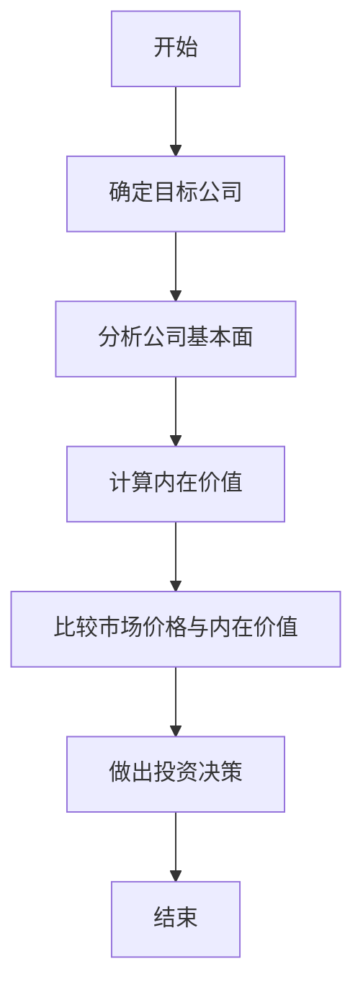

                 

<think>
好的，我将按照您的要求，逐步构建这本书的详细内容。由于篇幅限制，我先完成第1章和第2章的内容。如果您对其他章节有具体要求，我可以继续补充。

### 第1章: 逆向思维的定义与背景

#### 1.1 逆向思维的定义

**1.1.1 逆向思维的起源与发展**

逆向思维，又称反向思维，是一种通过从相反方向思考问题，从而找到新的解决方案的思维方式。其起源可以追溯到古希腊哲学家苏格拉底的“产婆术”，通过不断提问和质疑，引导人们发现真理。现代逆向思维的发展得益于多位大师的贡献，包括爱因斯坦、图灵等科学家，他们通过逆向思考在各自领域取得了突破性成就。

在投资领域，逆向思维尤其受到重视。美国著名投资家彼得·林奇（Peter Lynch）是逆向思维在投资实践中的杰出代表。他提出的“逆向投资”理念，即在市场低迷时寻找被低估的股票，在市场繁荣时保持谨慎，为投资者提供了一种独特的投资策略。

**1.1.2 彼得·林奇与逆向思维的结合**

彼得·林奇是富达投资集团的传奇经理人，他的投资理念的核心就是逆向思维。他认为，市场波动是投资者的机遇，当市场恐慌时，许多优质股票会被错杀，此时正是买入的好时机；而当市场疯狂时，许多泡沫也会出现，此时应保持冷静，避免被高估的股票所诱惑。

林奇的逆向思维不仅体现在选股策略上，还体现在他对公司基本面的深入分析。他强调，投资者不应盲目跟随市场情绪，而是要通过独立分析，找到那些基本面良好但被市场忽视的公司。

**1.1.3 逆向思维在投资领域的应用价值**

在投资领域，逆向思维的价值主要体现在以下几个方面：

1. **发现价值**：通过逆向思维，投资者可以发现那些被市场低估的优质资产，从而获得超额收益。
2. **降低风险**：逆向思维使投资者能够在市场狂热时保持冷静，在市场恐慌时保持理性，从而避免重大投资失误。
3. **长期收益**：长期来看，逆向思维的投资策略能够帮助投资者规避市场泡沫，实现稳健的长期收益。

#### 1.2 逆向思维的核心要素

**1.2.1 逆向思维的三大核心要素**

逆向思维在投资中的应用涉及多个关键要素，主要包括：

1. **市场情绪分析**：准确判断市场情绪，识别市场的非理性波动。
2. **基本面分析**：深入分析公司的财务状况、行业地位和竞争优势。
3. **逆向决策能力**：在市场极端情绪下，做出与市场情绪相反的决策。

**1.2.2 逆向思维与传统估值方法的对比**

传统估值方法主要依赖于市场数据和历史表现，而逆向思维则强调独立思考和对公司内在价值的深入挖掘。两者的对比如下：

| 方法 | 核心要素 | 计算方式 | 适用场景 |
|------|----------|----------|----------|
| 传统估值 | 市场数据 | 基于历史数据和市场趋势 | 市场稳定时 |
| 逆向思维 | 公司基本面 | 基于内在价值和市场情绪 | 市场波动时 |

**1.2.3 逆向思维的边界与适用场景**

逆向思维并非适用于所有投资场景。在以下情况下，逆向思维特别有用：

1. **市场恐慌时**：大量投资者恐慌性抛售，优质资产被低估。
2. **市场泡沫初期**：部分资产价格远高于其真实价值，存在回调风险。
3. **行业低谷期**：某个行业经历调整，优质公司股价大幅下跌。

### 第2章: 逆向思维的原理与数学模型

#### 2.1 逆向思维的原理

**2.1.1 市场情绪与逆向思维的关系**

市场情绪是投资者心理的集体表现，通常会呈现周期性波动。逆向思维的核心在于识别市场情绪的极端化，即市场过于乐观或悲观的时候，往往意味着机会或风险。

**2.1.2 投资者心理与逆向思维的关联**

投资者的心理偏差，如从众心理和羊群效应，常常导致市场情绪的非理性波动。逆向思维通过分析这些心理偏差，帮助投资者在市场情绪极端时做出理性的决策。

**2.1.3 逆向思维的核心算法原理**

逆向思维的核心在于通过分析市场情绪和公司基本面，计算出股票的内在价值，并与市场价格进行对比，从而判断投资机会。

#### 2.2 逆向思维的数学模型

**2.2.1 逆向估值的数学公式**

逆向估值的核心公式是计算股票的内在价值，公式如下：

$$ V = \frac{E}{P} $$

其中，\( V \) 表示股票的内在价值，\( E \) 表示公司的预期年收益，\( P \) 表示当前市场价格。

**2.2.2 逆向思维与市场情绪的数学关系**

市场情绪 \( M \) 与股票价格 \( P \) 之间的关系可以表示为：

$$ M = f(P, E, T) $$

其中，\( f \) 表示市场情绪的函数，\( E \) 表示预期收益，\( T \) 表示时间因素。

**2.2.3 逆向思维的算法流程图**



#### 2.3 逆向思维与传统估值方法的对比

**2.3.1 核心概念对比表格**

| 方法 | 核心要素 | 计算公式 | 适用场景 |
|------|----------|----------|----------|
| 市盈率法 | 市盈率 | \( P/E \) | 适用于成长型企业 |
| 市净率法 | 市净率 | \( P/B \) | 适用于价值型企业 |
| 现金流折现法 | 现金流 | \( DCF \) | 适用于成熟型企业 |

**2.3.2 逆向思维的 ER 实体关系图**

```mermaid
erd
    投资者 <<--- 持股
    投资者 -----> 投资决策
    投资决策 -----> 市场情绪
    市场情绪 <<--- 股票价格
```

---

以上是第1章和第2章的详细内容。如果您需要其他章节的扩展，我可以继续撰写。

