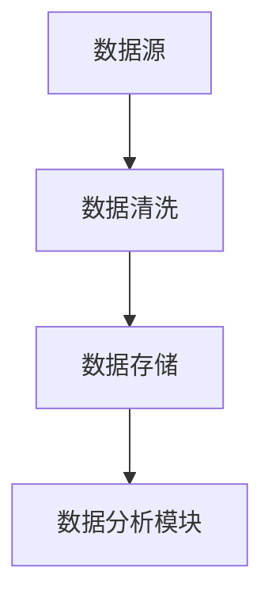
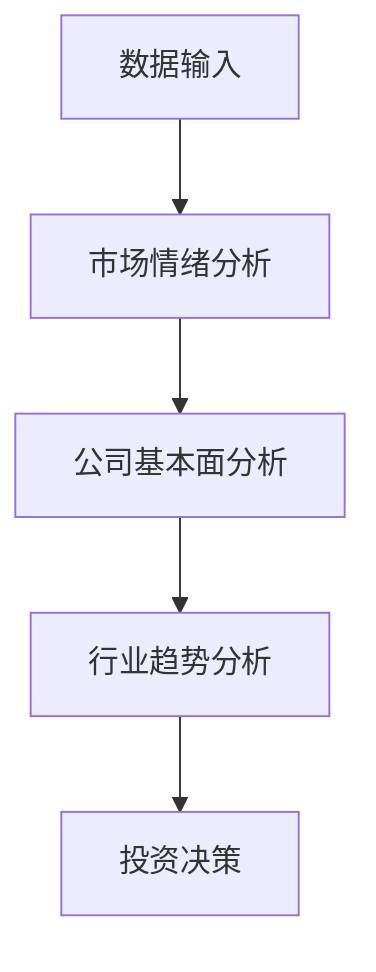
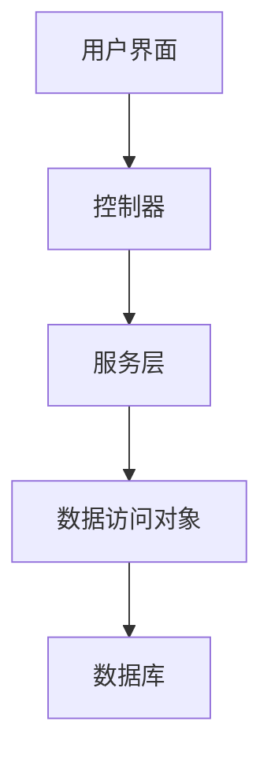
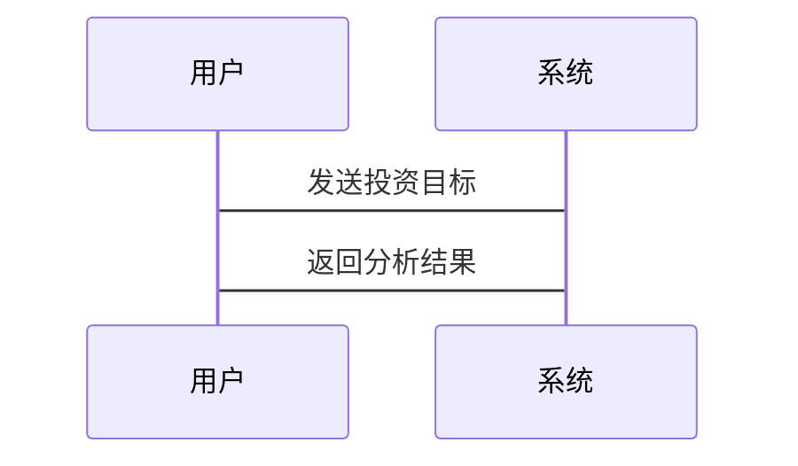

                 


```markdown
# 彼得林奇的"逆向思维"在新股投资中的应用

> 关键词：彼得林奇、逆向思维、投资策略、系统架构、项目实战

> 摘要：本文通过分析彼得林奇的逆向思维在新股投资中的应用，探讨其核心概念、算法原理、系统架构及项目实战，帮助读者理解并掌握逆向思维在投资中的具体应用。

## 第三章：逆向思维在新股投资中的核心策略

### 3.1 逆向思维的核心策略

#### 3.1.1 市场情绪分析与逆向思维

市场情绪是投资者决策的重要因素。逆向思维要求投资者在市场情绪高涨时保持冷静，在市场恐慌时寻找机会。我们可以通过分析市场情绪指标，如成交量、波动率等，来判断市场的冷暖。

##### 使用Python进行市场情绪分析

```python
import pandas as pd
import numpy as np

# 示例数据：市场情绪指标，假设数据来自数据库
market_data = {
    'date': ['2023-01-01', '2023-01-02', '2023-01-03'],
    'sentiment_score': [0.8, 0.6, 0.4]
}

df = pd.DataFrame(market_data)

# 计算市场情绪指数
def calculate_sentiment_index(df):
    return df['sentiment_score'].mean()

sentiment_index = calculate_sentiment_index(df)
print(f"市场情绪指数：{sentiment_index}")
```

#### 3.1.2 公司基本面分析与逆向思维

基本面分析是逆向思维的重要组成部分。我们需要分析公司的财务状况、盈利能力、行业地位等因素，寻找被市场低估的公司。

##### 基本面分析的数学模型

$$
\text{投资价值} = \frac{\text{净利润}}{\text{市盈率}}
$$

#### 3.1.3 行业趋势分析与逆向思维

分析行业趋势，寻找具有长期增长潜力的行业。逆向思维要求我们关注被市场忽视的行业，寻找未来的增长点。

### 3.2 逆向思维的具体操作步骤

#### 3.2.1 确定投资目标

明确投资目标，如寻找具有高成长性的公司。

#### 3.2.2 分析市场情绪

通过技术指标和市场数据，分析市场情绪，判断投资机会。

#### 3.2.3 评估公司基本面

详细分析公司的财务报表，评估其盈利能力和发展潜力。

#### 3.2.4 制定投资计划

根据分析结果，制定详细的投资计划，包括买入价格、仓位分配等。

## 第四章：逆向思维在新股投资中的系统架构设计

### 4.1 问题场景介绍

新股投资涉及多个环节，包括数据采集、分析、决策等。我们需要构建一个高效的系统来辅助投资决策。

### 4.2 系统功能设计

#### 4.2.1 数据采集模块

- 采集市场数据，如股票价格、成交量等。
- 采集公司财务数据，如收入、利润等。

##### 数据采集流程图



#### 4.2.2 数据分析模块

- 分析市场情绪。
- 分析公司基本面。
- 分析行业趋势。

##### 数据分析流程图



### 4.3 系统架构设计

#### 4.3.1 系统架构图



### 4.4 系统接口设计

- 数据接口：提供数据采集和存储的接口。
- 分析接口：提供市场情绪分析和公司基本面分析的接口。

### 4.5 系统交互设计



## 第五章：逆向思维在新股投资中的项目实战

### 5.1 环境配置

安装必要的软件和库，如Python、Pandas、Matplotlib等。

### 5.2 核心代码实现

#### 5.2.1 数据采集代码

```python
import requests
import pandas as pd

url = 'https://api.example.com/stock_data'
response = requests.get(url)
data = response.json()
df = pd.DataFrame(data)
```

#### 5.2.2 数据分析代码

```python
from sklearn import linear_model

# 训练市场情绪预测模型
model = linear_model.LinearRegression()
model.fit(df[['volume', 'price']], df['sentiment'])
```

### 5.3 案例分析

#### 5.3.1 案例一：某科技公司新股分析

分析该公司的市场情绪、基本面和行业趋势，判断其投资价值。

#### 5.3.2 案例二：某行业趋势分析

分析行业发展趋势，寻找具有增长潜力的公司。

### 5.4 项目小结

总结项目实施过程中的经验和教训，提出改进建议。

## 第六章：逆向思维的总结与展望

### 6.1 总结

逆向思维在新股投资中的应用，帮助投资者发现市场机会，提高投资收益。

### 6.2 展望

未来，随着技术的发展，逆向思维在投资中的应用将更加广泛和深入。

## 作者

作者：AI天才研究院/AI Genius Institute & 禅与计算机程序设计艺术 /Zen And The Art of Computer Programming
```

