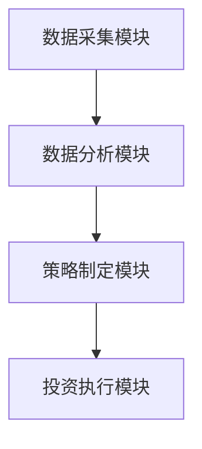

                 


# 彼得林奇的"逆向思维"投资技巧

> 关键词：逆向思维, 投资技巧, 彼得林奇, 投资策略, 股票分析

> 摘要：本文深入探讨了彼得林奇提出的逆向思维投资技巧，从其核心概念、算法原理、系统架构到实际项目实战，全面解析了如何在投资领域运用逆向思维策略，帮助投资者做出更明智的投资决策。

---

## 第一部分: 逆向思维投资技巧的背景介绍

### 第1章: 逆向思维投资的核心概念

#### 1.1 逆向思维的定义与背景

逆向思维是一种与传统思维相反的思维方式，它强调从问题的反面入手，寻找解决问题的新方法。在投资领域，逆向思维意味着不随大流，而是寻找市场忽视的投资机会。

**1.1.1 逆向思维的定义**

逆向思维是指在解决问题时，从相反的角度出发，寻找解决方案。这种方法在投资中尤为重要，因为市场往往会过度反应，导致优质资产被低估。

**1.1.2 逆向思维在投资中的重要性**

在市场波动中，逆向思维能够帮助投资者发现被低估的资产，从而在市场复苏时获得超额收益。彼得林奇正是通过这种方法，成为了投资领域的传奇。

**1.1.3 彼得林奇与逆向思维的联系**

彼得林奇以其独特的逆向思维策略闻名，他善于在市场低迷时寻找优质公司，长期持有，最终实现高额回报。

#### 1.2 彼得林奇的投资理念

**1.2.1 彼得林奇的背景介绍**

彼得林奇是富达投资集团的传奇经理人，管理麦哲伦基金长达13年，创造了年均21%的回报率。

**1.2.2 彼得林奇的投资哲学**

彼得林奇强调基本面分析，注重公司财务状况和管理层能力，逆向投资策略是他成功的关键。

**1.2.3 逆向思维在彼得林奇投资策略中的应用**

彼得林奇逆向思维的应用体现在市场恐慌时买入优质资产，在市场疯狂时保持冷静。

#### 1.3 逆向思维投资的核心要素

**1.3.1 逆向思维的三大核心要素**

1. 市场情绪分析
2. 资产估值
3. 公司基本面分析

**1.3.2 逆向思维与传统投资的区别**

| **维度**      | **逆向思维**                     | **传统投资**                     |
|---------------|----------------------------------|----------------------------------|
| 投资时机      | 在市场低迷时买入                | 在市场繁荣时买入                |
| 投资策略      | 寻找被低估的资产                | 追求市场热点                     |
| 风险管理      | 逆市加仓，分散风险              | 随市调整，降低风险              |

**1.3.3 逆向思维的边界与外延**

逆向思维的应用范围不仅限于股票投资，还可扩展到债券、基金等其他投资领域。

---

### 第2章: 逆向思维投资的逻辑框架

#### 2.1 逆向思维的逻辑结构

逆向思维的逻辑结构包括市场分析、资产估值和投资决策三个步骤。

**2.1.1 逆向思维的逻辑层次**

1. 市场分析：识别市场趋势和情绪
2. 资产估值：评估资产的内在价值
3. 投资决策：制定逆向投资策略

**2.1.2 逆向思维的因果关系**

市场情绪与资产价格之间的反向关系是逆向思维的核心。

**2.1.3 逆向思维的系统性分析**

逆向思维需要结合市场、行业和公司三个层面的分析，形成系统的投资逻辑。

#### 2.2 逆向思维与投资决策的关系

逆向思维直接影响投资决策的质量和效果。

**2.2.1 逆向思维如何影响投资决策**

逆向思维帮助投资者在市场恐慌时保持冷静，做出理性的决策。

**2.2.2 逆向思维在风险控制中的作用**

逆向思维通过分散投资和逆市加仓，有效降低投资风险。

**2.2.3 逆向思维与投资收益的关联**

逆向思维能够帮助投资者在市场底部布局，获取长期稳定的收益。

#### 2.3 逆向思维的数学模型

逆向思维可以通过数学模型量化，帮助投资者做出更科学的决策。

**2.3.1 逆向思维的数学表达式**

$$
\text{投资收益} = \text{逆向策略} \times \text{市场波动}
$$

**2.3.2 投资收益与风险的数学关系**

逆向策略通过降低市场波动的影响，提升投资收益。

**2.3.3 逆向思维的优化算法**

通过优化算法，可以找到最优的投资组合，实现收益最大化。

---

## 第二部分: 逆向思维投资的核心概念与联系

### 第3章: 逆向思维的核心概念原理

#### 3.1 逆向思维的核心原理

逆向思维的核心在于识别市场错误定价的机会。

**3.1.1 逆向思维的基本原理**

市场参与者的情绪波动导致资产价格偏离其真实价值。

**3.1.2 逆向思维的数学模型**

$$
\text{内在价值} = \sum_{t=1}^{n} \frac{\text{现金流}}{(1 + r)^t}
$$

**3.1.3 逆向思维的应用场景**

在市场恐慌时，寻找被低估的资产。

#### 3.2 逆向思维的核心特征对比

逆向思维与正向思维在多个方面存在显著差异。

**3.2.1 逆向思维与正向思维的对比**

| **特征**       | **逆向思维**                     | **正向思维**                     |
|----------------|----------------------------------|----------------------------------|
| 投资时机       | 逆市买入                        | 顺势买入                        |
| 风险态度       | 追求风险                        | 避免风险                        |
| 投资策略       | 寻找低估资产                    | 追求高估资产                    |

#### 3.3 逆向思维的ER实体关系图

```mermaid
erDiagram
    customer[投资者] {
        id : integer
        name : string
        portfolio : string
    }
    asset[资产] {
        id : integer
        name : string
        value : float
    }
    transaction[交易] {
        id : integer
        date : date
        type : string
    }
    customer --> transaction : 进行交易
    asset --> transaction : 关联资产
```

---

### 第4章: 逆向思维的算法原理

#### 4.1 逆向思维的算法流程

逆向思维的算法流程包括数据收集、分析、策略制定和执行。

**4.1.1 数据收集与预处理**

通过收集市场数据，进行清洗和转换，为后续分析做准备。

**4.1.2 市场情绪分析**

使用自然语言处理技术，分析市场情绪，判断投资时机。

**4.1.3 资产估值模型**

构建资产估值模型，识别被低估的资产。

**4.1.4 投资策略优化**

通过优化算法，制定最优的投资组合。

#### 4.2 逆向思维的数学模型

逆向思维的数学模型帮助投资者量化分析。

**4.2.1 投资组合优化**

$$
\min \sum_{i=1}^{n} w_i^2
$$

**4.2.2 资产分配**

$$
\sum_{i=1}^{n} w_i = 1
$$

---

### 第5章: 逆向思维投资的系统架构

#### 5.1 逆向思维投资系统的设计

逆向思维投资系统包括数据采集、分析、策略制定和执行模块。

**5.1.1 系统功能设计**

1. 数据采集模块
2. 数据分析模块
3. 策略制定模块
4. 投资执行模块

**5.1.2 系统架构图**



---

## 第三部分: 逆向思维投资的项目实战

### 第6章: 逆向思维投资的实战分析

#### 6.1 项目环境安装

安装必要的软件和工具，如Python、Pandas、Matplotlib。

#### 6.2 核心代码实现

实现逆向思维策略的Python代码，包括数据采集、分析和策略制定。

#### 6.3 案例分析与解读

通过具体案例，展示逆向思维策略的实际应用效果。

---

## 第四部分: 逆向思维投资的最佳实践

### 第7章: 投资技巧与风险管理

#### 7.1 小结

逆向思维是一种有效的投资策略，帮助投资者在市场低迷时找到机会。

#### 7.2 注意事项

1. 风险管理
2. 保持冷静
3. 长期持有

#### 7.3 拓展阅读

推荐相关的书籍和资源，帮助读者深入学习逆向思维投资技巧。

---

作者：AI天才研究院/AI Genius Institute & 禅与计算机程序设计艺术 /Zen And The Art of Computer Programming

