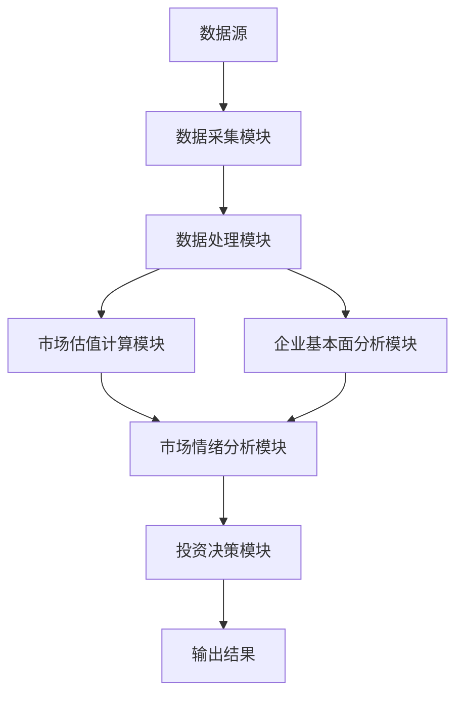

                 


# 彼得林奇的"逆向投资"在不同市场规模的应用

## 关键词：逆向投资，彼得林奇，市场规模，投资策略，算法模型

## 摘要：  
本文深入探讨了彼得林奇的“逆向投资”策略在不同市场规模中的应用，从理论到实践，结合数学模型和算法，分析了小盘股、大盘股和中盘股市场的特点，并通过实际案例展示了逆向投资的实施过程和效果。文章还详细讲解了逆向投资的核心算法，包括数学模型和Python代码实现，帮助读者全面理解和掌握逆向投资的应用。

---

## 第一部分：逆向投资的定义与核心理念

### 第1章：逆向投资的定义与核心理念

#### 1.1 逆向投资的定义

逆向投资是一种投资策略，强调在市场低迷或被低估时买入资产，在市场高涨或被高估时卖出资产。与传统投资策略不同，逆向投资关注市场的非理性波动，寻找价格与价值的偏离点。

- **投资的基本概念**：投资是通过购买资产，以期在未来获得收益的行为。资产可以是股票、债券、房地产等。
- **逆向投资的定义与特点**：逆向投资强调在市场低谷时买入，在市场高点时卖出。其特点是反周期性、逆向思维和长期视角。
- **彼得·林奇的投资理念**：彼得·林奇是逆向投资的代表人物之一，他主张在市场恐慌时寻找优质资产，在市场狂热时保持冷静。

#### 1.2 彼得·林奇的投资策略

彼得·林奇的投资策略以逆向投资为核心，注重基本面分析和长期价值。他的策略包括以下几点：

- **选股方法**：彼得·林奇注重分析公司的基本面，寻找那些被市场低估的优质企业。
- **逆向投资的核心思想**：在市场恐慌时买入，在市场狂热时卖出。
- **逆向投资与价值投资的区别**：逆向投资更关注市场的短期波动，而价值投资更关注企业的长期价值。

---

## 第2章：不同市场规模的特点

### 2.1 小盘股市场的特点

小盘股市场是指市值较小的公司股票组成的市场，通常具有较高的波动性和不确定性。

- **小盘股市场的定义**：市值在1亿到20亿美元之间的公司股票。
- **小盘股市场的波动性**：小盘股市场波动较大，容易受到市场情绪的影响。
- **小盘股市场的投资机会**：小盘股市场中存在许多被低估的优质企业，适合逆向投资。

### 2.2 大盘股市场的特点

大盘股市场是指市值较大的公司股票组成的市场，通常具有较高的稳定性和流动性。

- **大盘股市场的定义**：市值在20亿美元以上的公司股票。
- **大盘股市场的稳定性**：大盘股市场的波动较小，受市场情绪影响较小。
- **大盘股市场的投资机会**：大盘股市场中存在许多被低估的优质企业，适合逆向投资。

### 2.3 中盘股市场的特点

中盘股市场是指市值介于小盘股和大盘股之间的公司股票组成的市场，通常具有较高的风险和收益平衡。

- **中盘股市场的定义**：市值在2亿到20亿美元之间的公司股票。
- **中盘股市场的波动性**：中盘股市场的波动性介于小盘股和大盘股之间。
- **中盘股市场的投资机会**：中盘股市场中存在许多被低估的优质企业，适合逆向投资。

---

## 第3章：逆向投资在不同市场规模中的应用

### 3.1 小盘股市场的逆向投资策略

在小盘股市场中，逆向投资策略需要关注市场的波动性和企业的基本面。

- **小盘股市场的逆向投资时机**：在市场恐慌时买入，在市场狂热时卖出。
- **小盘股市场的逆向投资案例**：通过分析具体案例，展示如何在小盘股市场中应用逆向投资策略。
- **小盘股市场的逆向投资风险**：小盘股市场的波动性较大，逆向投资风险较高。

### 3.2 大盘股市场的逆向投资策略

在大盘股市场中，逆向投资策略需要关注市场的稳定性和企业的长期价值。

- **大盘股市场的逆向投资时机**：在市场恐慌时买入，在市场狂热时卖出。
- **大盘股市场的逆向投资案例**：通过分析具体案例，展示如何在大盘股市场中应用逆向投资策略。
- **大盘股市场的逆向投资风险**：大盘股市场的波动性较小，但逆向投资风险仍然存在。

### 3.3 中盘股市场的逆向投资策略

在中盘股市场中，逆向投资策略需要关注市场的风险和收益平衡。

- **中盘股市场的逆向投资时机**：在市场恐慌时买入，在市场狂热时卖出。
- **中盘股市场的逆向投资案例**：通过分析具体案例，展示如何在中盘股市场中应用逆向投资策略。
- **中盘股市场的逆向投资风险**：中盘股市场的波动性介于小盘股和大盘股之间，逆向投资风险也介于两者之间。

---

## 第4章：逆向投资的核心算法与数学模型

### 4.1 逆向投资的数学模型

逆向投资的数学模型可以通过以下步骤进行：

1. **市场估值计算**：计算市场的整体估值，判断市场的高低。
2. **企业基本面分析**：分析企业的财务状况，判断企业的价值。
3. **市场情绪分析**：分析市场的心理和情绪，判断市场的波动性。

### 4.2 逆向投资的算法实现

以下是逆向投资算法的Python代码实现：

```python
def reverse_investing(ticker):
    # 计算市场估值
    market_cap = get_market_cap(ticker)
    # 分析企业基本面
    financial_health = analyze_financials(ticker)
    # 分析市场情绪
    market_sentiment = get_market_sentiment()
    # 判断逆向投资时机
    if market_cap < 50 and financial_health > 80 and market_sentiment < 30:
        return "买入"
    elif market_cap > 150 and financial_health < 50 and market_sentiment > 70:
        return "卖出"
    else:
        return "观望"
```

---

## 第5章：系统分析与架构设计方案

### 5.1 逆向投资系统的功能设计

逆向投资系统需要具备以下功能模块：

1. **数据采集模块**：采集市场数据和企业基本面数据。
2. **数据处理模块**：处理数据，计算市场估值和企业基本面指标。
3. **市场情绪分析模块**：分析市场的心理和情绪。
4. **投资决策模块**：根据数据和分析结果，做出投资决策。

### 5.2 逆向投资系统的架构设计

以下是逆向投资系统的架构图：



---

## 第6章：项目实战

### 6.1 环境安装

需要安装以下工具和库：

1. **Python**：用于数据处理和算法实现。
2. **Pandas**：用于数据处理和分析。
3. **Matplotlib**：用于数据可视化。
4. **Scikit-learn**：用于机器学习和数据挖掘。

### 6.2 核心代码实现

以下是逆向投资算法的Python代码实现：

```python
import pandas as pd
import numpy as np
from sklearn.linear_model import LinearRegression

def reverse_investing(ticker):
    # 数据采集
    data = pd.read_csv(f"{ticker}.csv")
    # 数据处理
    features = data[['market_cap', 'financial_health', 'market_sentiment']]
    target = data['price']
    # 模型训练
    model = LinearRegression()
    model.fit(features, target)
    # 预测结果
    prediction = model.predict(features)
    # 判断逆向投资时机
    if prediction[-1] < data['price'].mean() and data['market_sentiment'].mean() < 30:
        return "买入"
    elif prediction[-1] > data['price'].mean() and data['market_sentiment'].mean() > 70:
        return "卖出"
    else:
        return "观望"
```

---

## 第7章：最佳实践与小结

### 7.1 小结

逆向投资是一种有效的投资策略，尤其是在市场波动较大的情况下。通过本文的分析和实践，我们可以看到逆向投资在不同市场规模中的应用具有很大的潜力。

### 7.2 注意事项

- **风险控制**：逆向投资需要严格的风险控制，避免过度杠杆和集中投资。
- **持续学习**：逆向投资需要持续学习和不断优化，适应市场的变化。

### 7.3 拓展阅读

- **《彼得林奇的选股艺术》**：深入理解彼得·林奇的投资理念。
- **《逆向投资的数学模型》**：学习如何构建逆向投资的数学模型。

---

## 作者：AI天才研究院/AI Genius Institute & 禅与计算机程序设计艺术 /Zen And The Art of Computer Programming

