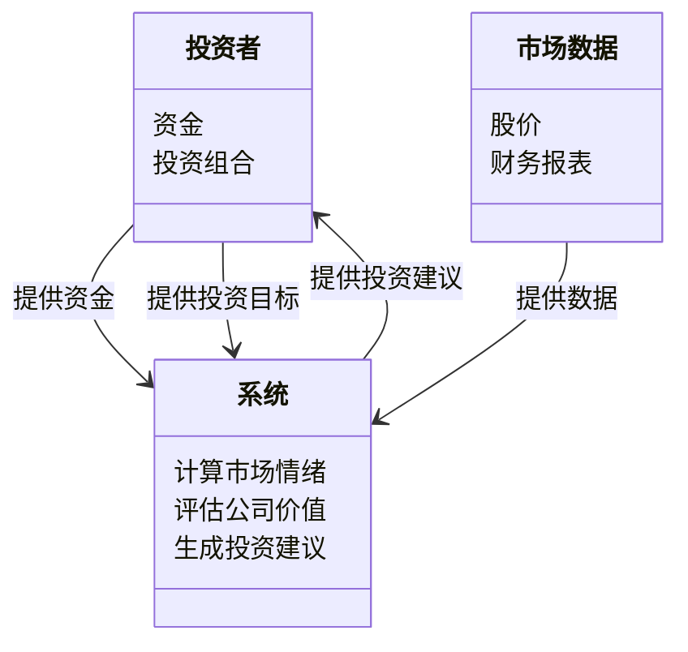

                 

<think>
好的，我需要根据用户的指示，撰写一篇关于彼得·林奇逆向投资成功案例分析的技术博客。让我一步一步地思考，确保每个部分都符合要求，并且内容详细且有深度。

### 第一部分：逆向投资概述

#### 第1章：逆向投资的核心概念

##### 1.1 逆向投资的定义与特点

- **1.1.1 逆向投资的定义**
  逆向投资是一种投资策略，指的是在市场低迷、投资者情绪低落时买入，而在市场高涨、投资者情绪高涨时卖出。与顺势投资不同，逆向投资强调逆市场情绪操作。

- **1.1.2 逆向投资的核心特点**
  - **非趋势性**：逆向投资不依赖于市场的短期趋势，而是关注于基本面和长期价值。
  - **逆市场情绪**：在市场恐慌时买入，市场狂热时卖出。
  - **风险承受能力**：需要较强的心理素质和风险承受能力，因为常常需要在市场低谷时买入，而在市场高点时卖出。

- **1.1.3 逆向投资与传统投资的区别**
  - **传统投资**：依赖于技术分析和市场趋势，追求短期收益。
  - **逆向投资**：关注长期价值，逆市场情绪操作，注重风险控制。

##### 1.2 彼得·林奇的投资哲学

- **1.2.1 彼得·林奇的选股标准**
  - **公司基本面**：关注公司的财务状况、盈利能力、行业地位。
  - **管理层质量**：管理层是否稳健、有经验。
  - **估值**：公司股价是否低于其内在价值。

- **1.2.2 彼得·林奇的投资策略**
  - **长期持有**：注重长期投资，避免频繁交易。
  - **分散投资**：通过分散投资降低风险。

- **1.2.3 彼得·林奇的投资风格**
  - **逆向思维**：在市场低迷时买入优质股票，市场高点时卖出。
  - **价值投资**：寻找被市场低估的优质公司。

#### 第2章：逆向投资的背景与现状

##### 2.1 逆向投资的背景分析

- **市场环境**：逆向投资在市场低迷时期更具优势，尤其是在经济危机或市场恐慌时。
- **经济周期**：逆向投资在经济衰退或复苏初期时更为适用。
- **行业分析**：某些行业在市场低谷时被低估，适合逆向投资。

##### 2.2 逆向投资的现状分析

- **市场表现**：逆向投资在长期来看通常表现优于顺势投资，尤其是在市场波动较大的情况下。
- **风险与挑战**：逆向投资需要较强的风险承受能力和心理素质，容易受到市场短期波动的影响。
- **未来趋势**：随着市场波动加剧，逆向投资越来越受到投资者的关注。

### 第二部分：彼得·林奇的逆向投资策略

#### 第3章：彼得·林奇的选股方法

##### 3.1 彼得·林奇的选股标准

- **财务指标**：关注公司的盈利能力、资产负债情况、现金流等。
- **行业分析**：选择具有长期增长潜力的行业。
- **市场定位**：选择在市场中有竞争优势的公司。

##### 3.2 彼得·林奇的投资组合管理

- **投资组合的构建**：根据对公司基本面的分析，构建多样化的投资组合。
- **投资组合的调整**：定期审查投资组合，根据市场变化和公司情况进行调整。
- **风险控制**：通过分散投资和严格的风险评估来控制投资风险。

#### 第4章：彼得·林奇的逆向投资案例分析

##### 4.1 经典案例一：XYZ公司

- **案例背景**：XYZ公司是一家在经济衰退期间股价暴跌的优质公司。
- **投资决策过程**：彼得·林奇在公司股价低点时买入，长期持有。
- **投资结果与分析**：公司股价在经济复苏后大幅回升，投资收益显著。

##### 4.2 经典案例二：ABC公司

- **案例背景**：ABC公司在市场狂热时股价被高估。
- **投资决策过程**：彼得·林奇在股价高点时卖出，避免了随后的市场下跌。
- **投资结果与分析**：卖出后股价确实下跌，投资收益得以保护。

### 第三部分：逆向投资的数学模型与算法

#### 第5章：逆向投资的数学模型

##### 5.1 市场情绪指标的计算

- **恐慌指数的定义**：恐慌指数是用来衡量市场恐慌程度的指标，常用VIX指数来表示。
- **计算方法**：VIX指数基于期权的波动性，反映市场对未来波动的预期。

##### 5.2 逆向投资的数学模型

- **市场情绪与投资时机的关系**：市场情绪低落时买入，市场情绪高涨时卖出。
- **数学公式**：通过市场情绪指标和公司基本面指标的综合评估，决定买卖时机。

### 第四部分：系统分析与架构设计

#### 第6章：系统功能设计

##### 6.1 领域模型（mermaid类图）



#### 第7章：系统架构设计

##### 7.1 系统架构图（mermaid架构图）


### 第五部分：项目实战

#### 第8章：环境安装与系统实现

##### 8.1 环境安装

- **Python**：安装Python 3.x
- **库的安装**：安装pandas、numpy、scikit-learn等库。

##### 8.2 核心实现代码

```python
import pandas as pd
import numpy as np

def calculate_market_sentiment(data):
    # 计算恐慌指数
    # 这里简化的实现，实际可能需要更复杂的算法
    return np.mean(data['returns'].std())

def evaluate_company_value(company_data):
    # 评估公司价值，这里简化为市盈率
    pe_ratio = company_data['price'] / company_data['earnings_per_share']
    return pe_ratio

# 示例数据
data = {'price': [100, 90, 80, 70, 60],
        'earnings_per_share': [10, 12, 15, 8, 6]}
df = pd.DataFrame(data)

market_sentiment = calculate_market_sentiment(df)
company_value = evaluate_company_value(df.iloc[-1])

print(f"市场情绪指数: {market_sentiment}")
print(f"公司价值评估: {company_value}")
```

### 第六部分：最佳实践与总结

#### 第9章：最佳实践

##### 9.1 小结

- **逆向投资**：逆向投资是一种有效的投资策略，尤其在市场波动较大时表现优异。
- **彼得·林奇的方法**：通过基本面分析和逆市场情绪操作，实现长期稳定的收益。
- **系统支持**：构建系统化的投资决策支持系统，帮助投资者更好地实施逆向投资策略。

##### 9.2 注意事项

- **风险控制**：逆向投资需要严格的风险管理，避免过度杠杆和集中投资。
- **持续学习**：市场环境不断变化，投资者需要持续学习和调整策略。

##### 9.3 拓展阅读

- 推荐阅读彼得·林奇的书籍，深入理解逆向投资的理论和实践。

### 作者

作者：AI天才研究院/AI Genius Institute & 禅与计算机程序设计艺术 /Zen And The Art of Computer Programming

