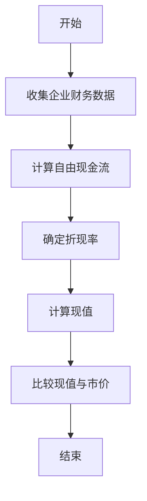
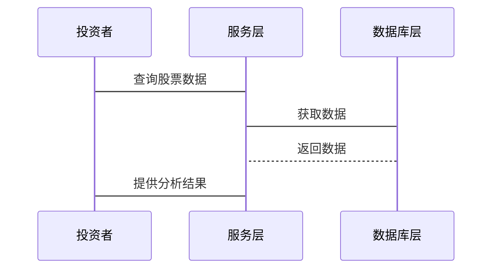

                 


# 彼得林奇的"长期价值"vs"短期波动"

## 关键词：投资哲学，长期价值，短期波动，彼得林奇，投资策略

## 摘要：本文深入探讨了彼得林奇的投资哲学，分析了长期价值与短期波动的关系，通过数学模型和算法原理，展示了如何在投资中平衡这两者。文章还提供了系统架构设计和实战案例，帮助读者更好地理解和应用这些概念。

---

# 第一部分：长期价值与短期波动的背景介绍

## 第1章：长期价值与短期波动的背景介绍

### 1.1 长期价值的定义与核心要素

#### 1.1.1 长期价值的定义
长期价值是指企业在未来较长一段时间内的预期收益，通常基于其内在的盈利能力、行业地位和竞争优势。彼得林奇认为，长期价值来源于企业的基本面，包括财务状况、管理团队和市场前景。

#### 1.1.2 长期价值的核心要素
- **盈利能力**：企业的净利润率、ROE等指标。
- **行业地位**：企业在行业中的竞争力和市场份额。
- **竞争优势**：企业的独特优势，如专利、品牌或成本优势。
- **管理团队**：领导层的能力和战略规划。

#### 1.1.3 长期价值的边界与外延
长期价值的外延包括企业未来的增长潜力和行业趋势，而边界则在于企业的实际经营能力和外部环境的限制。

### 1.2 短期波动的定义与核心要素

#### 1.2.1 短期波动的定义
短期波动是指股票价格在短时间内因市场情绪、突发事件或技术因素而产生的非理性变动。

#### 1.2.2 短期波动的核心要素
- **市场情绪**：投资者的心理预期影响价格。
- **突发事件**：如政策变化、自然灾害等。
- **技术因素**：如交易量和买卖双方力量对比。

### 1.3 长期价值与短期波动的关系

#### 1.3.1 长期价值与短期波动的相互作用
长期价值为投资者提供了投资目标，而短期波动则可能影响投资组合的短期表现。

#### 1.3.2 短期波动对长期价值的影响
短期波动可能导致市场恐慌，但长期价值取决于企业的基本面。

#### 1.3.3 长期价值对短期波动的指导意义
长期价值帮助投资者在短期波动中保持冷静，避免非理性决策。

### 1.4 彼得林奇投资哲学的背景

#### 1.4.1 彼得林奇的生平简介
彼得·林奇是富达投资的传奇经理人，以其长期价值投资策略闻名。

#### 1.4.2 彼得林奇投资哲学的核心思想
他强调基本面分析和长期持有优质股票。

#### 1.4.3 彼得林奇投资哲学的演变
从早期的快速增长股到后期的防御性投资，林奇的投资策略逐步演变。

### 1.5 本章小结
长期价值与短期波动是投资中的核心概念，理解它们的关系和彼得林奇的投资哲学，为后续分析奠定了基础。

---

## 第2章：长期价值与短期波动的核心概念与联系

### 2.1 长期价值与短期波动的核心原理

#### 2.1.1 长期价值的形成机制
企业通过持续的盈利能力和竞争优势，逐步积累长期价值。

#### 2.1.2 短期波动的驱动因素
市场情绪和突发事件引发短期波动。

#### 2.1.3 两者关系的数学模型
可以用回归分析来量化短期波动对长期价值的影响。

### 2.2 长期价值与短期波动的属性对比

#### 2.2.1 属性特征对比表格
| 属性 | 长期价值 | 短期波动 |
|------|----------|----------|
| 时间跨度 | 长期 | 短期 |
| 变化幅度 | 较小 | 较大 |
| 可预测性 | 较高 | 较低 |

#### 2.2.2 ER实体关系图
```mermaid
er
  actor 投资者 {
    <指向> 企业 {
      <拥有> 价值 {
        <拥有> 波动
      }
    }
  }
```

### 2.3 长期价值与短期波动的联系

#### 2.3.1 彼得林奇投资策略中的长期价值
通过基本面分析，选择具有长期增长潜力的企业。

#### 2.3.2 短期波动中的投资机会
短期波动可能带来低估股票的买入机会。

#### 2.3.3 平衡策略
长期价值指导投资方向，而短期波动提供交易机会。

---

## 第3章：长期价值评估的算法原理

### 3.1 算法原理概述

#### 3.1.1 核心算法
使用现金流折现模型（DCF）评估企业内在价值。

#### 3.1.2 算法流程图


### 3.2 算法实现

#### 3.2.1 Python代码示例
```python
def discounted_cash_flow(revenue, cost, growth_rate, discount_rate, periods):
    cash_flows = []
    for i in range(periods):
        cash_flow = (revenue - cost) * (1 + growth_rate)**i
        cash_flows.append(cash_flow)
    pv = sum(cash_flow / (1 + discount_rate)**i for i in range(periods))
    return pv
```

#### 3.2.2 数学公式
$$ PV = \sum_{t=1}^{n} \frac{CF_t}{(1 + r)^t} $$
其中，CF_t为第t期的现金流，r为折现率。

### 3.3 应用场景

#### 3.3.1 案例分析
分析某企业的未来现金流，计算其内在价值，与当前股价对比，判断投资机会。

---

## 第4章：系统架构设计与实现

### 4.1 问题场景介绍
设计一个投资分析系统，帮助投资者评估长期价值和应对短期波动。

### 4.2 系统功能设计

#### 4.2.1 领域模型类图


### 4.3 系统架构设计

#### 4.3.1 系统架构图


#### 4.3.2 服务层接口
提供数据获取、分析和决策支持功能。

### 4.4 实现细节

#### 4.4.1 数据库设计
存储股票数据、市场情绪指标和事件驱动因素。

#### 4.4.2 交互流程图


---

## 第5章：项目实战

### 5.1 环境安装
安装Python、Pandas、NumPy等工具。

### 5.2 核心代码实现

#### 5.2.1 数据获取
使用Yahoo Finance API获取股票数据。

#### 5.2.2 波动分析
计算波动率和相关指标。

### 5.3 案例分析

#### 5.3.1 分析苹果公司
计算其DCF模型下的内在价值，对比市场价格，判断投资机会。

#### 5.3.2 应对短期波动
制定在波动中的投资策略，如分批建仓。

### 5.4 代码解读与分析
详细解释代码功能，展示如何实现长期价值评估和波动分析。

---

## 第6章：最佳实践与小结

### 6.1 小结
长期价值与短期波动是投资中的双刃剑，平衡两者是成功的关键。

### 6.2 注意事项
- 避免过度关注短期波动。
- 定期评估投资组合的长期价值。

### 6.3 拓展阅读
推荐书籍：《彼得·林奇的成功投资》。

---

作者：AI天才研究院/AI Genius Institute & 禅与计算机程序设计艺术/Zen And The Art of Computer Programming

