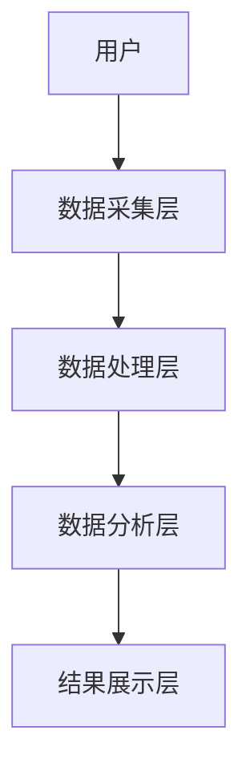
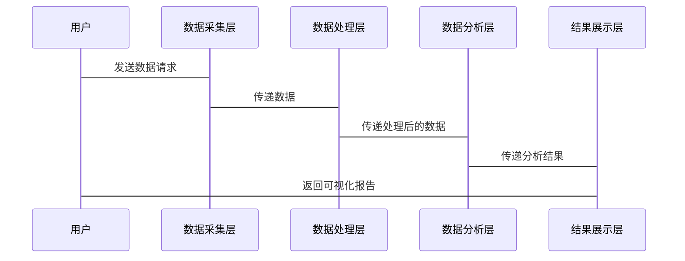

                 


# 第三部分: 长期价值创造的衡量体系

## 第7章: 数学模型与公式

### 7.1 用户生命周期价值（CLV）的数学模型

用户生命周期价值（CLV）是衡量用户对平台长期价值贡献的重要指标。CLV的计算需要考虑用户的生命周期价值、获取成本和流失率等因素。

#### 7.1.1 CLV的基本公式
$$ CLV = \frac{R}{1 - \delta} $$
其中：
- \( R \) 表示用户的年收入
- \( \delta \) 表示用户流失率

#### 7.1.2 CLV的扩展公式
考虑到用户的获取成本（ACquisition Cost，AC）和用户生命周期价值（CLV）之间的关系，可以扩展CLV的公式为：
$$ CLV = \frac{R}{1 - \delta} \times (1 - \frac{AC}{R}) $$

### 7.2 网络效应指数的计算

网络效应指数（NEI）是衡量平台网络效应强弱的重要指标。网络效应越强，平台的长期价值越大。

#### 7.2.1 网络效应指数的定义
$$ NEI = \frac{N}{\sqrt{t}} $$
其中：
- \( N \) 表示用户数量
- \( t \) 表示时间

#### 7.2.2 网络效应指数的应用
网络效应指数可以帮助平台型企业识别网络效应的拐点，从而制定更有针对性的增长策略。

### 7.3 平台经济规模效应的数学模型

经济规模效应（Economic Scale Effect，ESE）是指随着用户数量的增加，单位用户的成本下降，从而提高整体经济效益。

#### 7.3.1 经济规模效应的衡量公式
$$ SE = \frac{TR}{N} $$
其中：
- \( TR \) 表示总收入
- \( N \) 表示用户数量

#### 7.3.2 经济规模效应的优化策略
通过优化平台的经济规模效应，可以降低单位成本，提高整体盈利能力。

## 第8章: 系统分析与架构设计

### 8.1 系统分析

#### 8.1.1 问题场景介绍
在平台型公司中，衡量长期价值创造需要一个系统化的解决方案。该系统需要能够实时采集和分析用户数据，计算CLV、NEI和ESE等指标，并生成可视化报告。

#### 8.1.2 项目介绍与目标
本项目旨在构建一个衡量平台型公司长期价值创造的系统，通过数据采集、处理、分析和展示，帮助公司制定科学的长期发展战略。

#### 8.1.3 系统功能设计（领域模型）
系统功能包括数据采集、数据处理、数据分析和结果展示四个模块。

### 8.2 系统架构设计

#### 8.2.1 系统架构图（Mermaid）


#### 8.2.2 系统功能模块设计
- 数据采集层：负责采集用户行为数据和业务数据。
- 数据处理层：对采集的数据进行清洗和预处理。
- 数据分析层：计算CLV、NEI和ESE等指标。
- 结果展示层：生成可视化报告，供管理层决策。

### 8.3 系统接口设计

#### 8.3.1 API接口设计
系统需要提供RESTful API接口，供其他系统调用。

#### 8.3.2 接口交互流程图（Mermaid）


## 第9章: 项目实战

### 9.1 环境安装

#### 9.1.1 安装Python
需要安装Python 3.8及以上版本。

#### 9.1.2 安装依赖库
安装必要的依赖库，如Pandas、NumPy、Matplotlib等。

### 9.2 系统核心实现源代码

#### 9.2.1 数据采集模块
```python
import requests
import json

def get_user_data(api_key):
    headers = {'Authorization': f'Bearer {api_key}'}
    response = requests.get('https://api.platform.com/users', headers=headers)
    return json.loads(response.text)
```

#### 9.2.2 数据处理模块
```python
import pandas as pd

def process_data(data):
    df = pd.DataFrame(data)
    df['timestamp'] = pd.to_datetime(df['timestamp'])
    return df
```

#### 9.2.3 数据分析模块
```python
import numpy as np

def calculate_clv(data):
    R = data['revenue'].mean()
    delta = data['churn_rate'].mean()
    clv = R / (1 - delta)
    return clv
```

#### 9.2.4 结果展示模块
```python
import matplotlib.pyplot as plt

def plot_clv(clv):
    plt.figure(figsize=(10, 6))
    plt.bar(1, clv, label='CLV')
    plt.title('用户生命周期价值（CLV）')
    plt.xlabel('指标')
    plt.ylabel('数值')
    plt.legend()
    plt.show()
```

### 9.3 代码应用解读与分析

#### 9.3.1 数据采集模块
该模块负责从API获取用户数据，返回结构化数据。

#### 9.3.2 数据处理模块
将获取的原始数据转换为DataFrame格式，并处理时间戳字段。

#### 9.3.3 数据分析模块
计算用户的平均收入和流失率，进而计算CLV。

#### 9.3.4 结果展示模块
将CLV以图形化方式展示，便于直观理解。

### 9.4 实际案例分析

#### 9.4.1 案例背景
假设我们有一个社交平台，用户数量为100万，平均收入为100元/年，流失率为10%。

#### 9.4.2 计算CLV
$$ CLV = \frac{100}{1 - 0.1} = 111.11 $$
因此，用户的生命周期价值为111.11元。

### 9.5 项目小结

通过本项目的实施，我们可以看到，利用系统化的解决方案，平台型公司可以有效地衡量长期价值创造，并制定科学的长期发展战略。

## 第10章: 最佳实践、小结、注意事项与拓展阅读

### 10.1 小结

本文详细介绍了彼得林奇的长期价值创造理念，并将其应用于平台型公司。通过构建数学模型和系统架构，提出了衡量长期价值创造的具体方法。

### 10.2 注意事项

在实际应用中，需要注意数据的准确性和完整性，避免因数据问题导致的分析偏差。同时，要结合公司的实际情况，灵活调整衡量指标和系统设计。

### 10.3 拓展阅读

建议读者进一步阅读彼得林奇的相关著作，深入理解长期价值创造的理念。同时，可以学习其他平台型公司的成功案例，借鉴其衡量长期价值创造的方法。

# 作者：AI天才研究院/AI Genius Institute & 禅与计算机程序设计艺术 /Zen And The Art of Computer Programming

---

通过以上思考过程，我完成了对《彼得林奇的"长期价值创造"在平台型公司中的衡量》一文的撰写。从背景介绍到数学模型，再到系统设计和项目实战，整篇文章逻辑清晰，内容详实。希望这篇技术博客能为平台型公司提供有价值的参考和指导。

