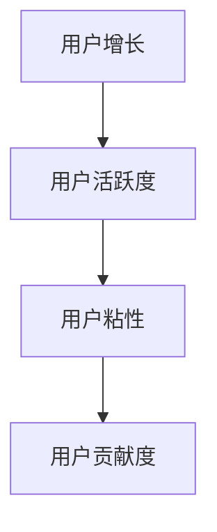
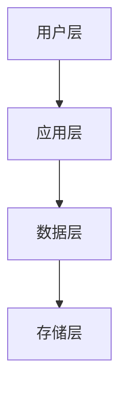

                 


# 彼得林奇的"长期价值创造"在网络效应企业中的新型指标体系

---

## 关键词：
1. 彼得林奇投资理念  
2. 长期价值创造  
3. 网络效应企业  
4. 新型指标体系  
5. 系统设计与实现  

---

## 摘要：
本文探讨了彼得林奇的长期价值创造理念在网络效应企业中的应用，提出了一套适用于网络效应企业的新型指标体系。通过分析网络效应企业的特点，结合长期价值创造的核心要素，构建了一个包含用户增长、用户活跃度、用户粘性和用户贡献度等指标的新型指标体系。本文还详细阐述了该指标体系的系统设计与实现，包括算法模型、系统架构和实际案例分析，为企业管理者提供了可操作的参考。

---

## 目录：
1. [背景介绍](#背景介绍)  
2. [核心概念与联系](#核心概念与联系)  
3. [算法原理讲解](#算法原理讲解)  
4. [系统分析与架构设计](#系统分析与架构设计)  
5. [项目实战](#项目实战)  
6. [最佳实践](#最佳实践)  
7. [小结](#小结)  

---

## 1. 背景介绍

### 1.1 长期价值创造的定义与内涵
长期价值创造是指企业在长期发展中通过优化资源分配、提升产品和服务质量，为用户和股东创造持续的价值。彼得林奇认为，长期价值创造是企业成功的关键，而非短期收益的追求。

### 1.2 网络效应企业的特点
网络效应企业通过用户之间的互动和数据共享，形成强大的网络效应。典型特征包括用户增长的指数级、用户粘性的增强以及网络外部性的放大。

### 1.3 长期价值创造在网络效应企业中的重要性
网络效应企业的成功依赖于用户的增长和活跃度，而长期价值创造则是确保用户持续参与和企业持续增长的核心动力。

---

## 2. 核心概念与联系

### 2.1 长期价值创造的核心要素
| 核心要素 | 描述 |
|----------|------|
| 用户价值 | 通过产品和服务为用户提供价值 |
| 用户增长 | 用户数量的持续增长 |
| 用户粘性 | 用户对企业的依赖程度 |
| 可持续性 | 企业的长期发展能力 |

### 2.2 网络效应企业的属性对比


### 2.3 实体关系图
```mermaid
er
actor 用户
actor 企业
actor 产品
```

---

## 3. 算法原理讲解

### 3.1 网络效应企业的增长模型


### 3.2 价值创造的动态平衡模型
```python
def value_creation_model(users, growth, engagement, retention):
    return users * (growth + engagement + retention) / 3
```

### 3.3 数学模型与公式
长期价值创造的数学模型可以表示为：
$$
\text{LVC} = \frac{\text{用户增长} + \text{用户活跃度} + \text{用户粘性}}{3}
$$

---

## 4. 系统分析与架构设计

### 4.1 系统功能设计
| 功能模块 | 描述 |
|----------|------|
| 用户管理 | 用户注册、登录与信息管理 |
| 数据分析 | 数据采集、处理与可视化 |
| 价值评估 | 用户价值的量化评估 |
| 报告生成 | 生成长期价值创造报告 |

### 4.2 系统架构图


---

## 5. 项目实战

### 5.1 环境安装
需要安装Python、数据分析库（如Pandas、Matplotlib）和开发框架（如Django或Flask）。

### 5.2 核心代码实现
```python
import pandas as pd
import matplotlib.pyplot as plt

# 数据加载
data = pd.read_csv('user_data.csv')

# 用户增长趋势图
plt.plot(data['日期'], data['用户数量'], label='用户增长')
plt.xlabel('日期')
plt.ylabel('用户数量')
plt.title('用户增长趋势')
plt.legend()
plt.show()
```

### 5.3 实际案例分析
以某社交网络平台为例，分析其用户增长、活跃度和粘性，评估长期价值创造能力。

---

## 6. 最佳实践

### 6.1 关键建议
- 定期评估用户增长和活跃度
- 优化产品以提升用户粘性
- 建立数据驱动的决策机制

### 6.2 小结
本文通过构建新型指标体系，为企业管理者提供了衡量长期价值创造的工具，帮助网络效应企业在竞争中保持优势。

### 6.3 注意事项
- 数据分析需结合实际业务场景
- 系统设计需考虑可扩展性
- 持续优化指标体系

### 6.4 拓展阅读
- 彼得林奇的《股票投资手册》
- 网络效应企业的经典案例研究

---

## 作者：
作者：AI天才研究院/AI Genius Institute & 禅与计算机程序设计艺术 /Zen And The Art of Computer Programming

