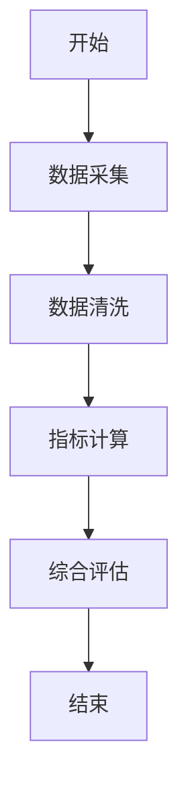
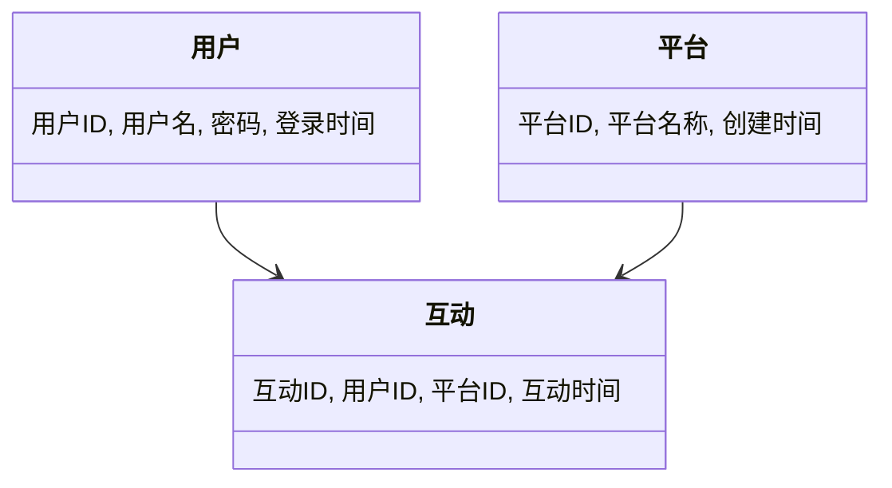
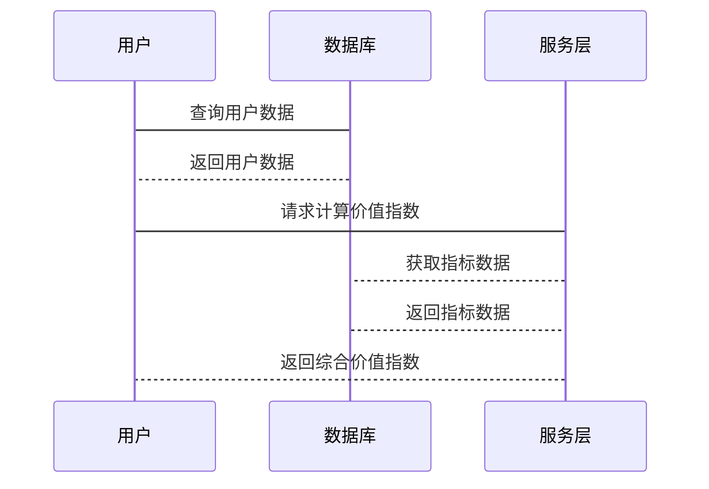

                 


# 彼得林奇的"长期价值创造"在网络效应企业中的新指标

## 关键词：彼得林奇、长期价值创造、网络效应企业、企业价值评估、投资指标

## 摘要：本文探讨了彼得林奇的长期价值创造理念在网络效应企业中的新应用，提出了基于用户增长、网络效应强度和企业价值评估的新指标体系。通过数学模型和算法实现，结合实际案例分析，展示了如何在网络效应企业中量化长期价值创造，为投资者和企业管理者提供新的思路。

---

# 第1章：长期价值创造概述

## 1.1 长期价值创造的核心概念

### 1.1.1 长期价值创造的基本概念

长期价值创造是指企业在较长的时间跨度内，通过优化资源配置、提升产品和服务质量、拓展市场等方式，为客户和股东创造持续增长的价值。这种创造不仅体现在财务指标上，更体现在企业生态系统的可持续发展能力上。

### 1.1.2 长期价值创造的核心要素

- **战略定位**：明确企业的市场定位和长期发展目标。
- **创新驱动**：通过技术创新和模式创新推动企业成长。
- **用户价值**：关注用户需求，提升用户满意度和忠诚度。
- **生态系统**：构建开放的生态系统，促进多方共赢。

### 1.1.3 长期价值创造的边界与外延

长期价值创造并非无边界，需要考虑企业的资源限制、市场环境和竞争态势。其外延包括企业内部管理优化、外部合作伙伴关系的建立，以及社会责任的履行。

## 1.2 网络效应企业的定义与特点

### 1.2.1 网络效应企业的基本概念

网络效应企业是指通过平台连接多个参与者（如用户、供应商、开发者等），形成双边或多边市场，使得随着参与者数量的增加，平台的价值呈指数级增长的企业。

### 1.2.2 网络效应的核心特征

- **双边市场**：连接两个或多个不同群体的用户。
- **网络外部性**：用户价值随着网络规模的扩大而增加。
- **平台效应**：平台本身不创造价值，但通过连接各方创造价值。

### 1.2.3 网络效应企业的典型模式

- **社交媒体平台**：如Facebook、Twitter。
- **电子商务平台**：如亚马逊、 eBay。
- **在线支付平台**：如支付宝、PayPal。

## 1.3 彼得林奇投资理念的现代应用

### 1.3.1 彼得林奇的投资哲学

彼得林奇主张长期投资，寻找那些具有持续增长潜力的企业。他认为，投资的关键在于理解企业如何为股东创造价值。

### 1.3.2 长期价值创造在投资中的意义

长期价值创造是企业持续增长的基石，投资者应关注企业如何通过创新和优化为股东创造超额回报。

### 1.3.3 网络效应企业在投资中的特殊性

网络效应企业具有较高的市场进入壁垒和 scalability，适合长期投资。然而，其价值创造过程往往涉及复杂的网络效应，需要新的指标体系来评估。

---

# 第2章：网络效应企业的核心指标分析

## 2.1 网络效应企业的核心指标

### 2.1.1 用户增长指标

用户增长是网络效应企业的核心驱动力。常用指标包括用户增长率、新增用户数、用户留存率等。

- **用户增长率**：($ \text{用户增长率} = \frac{\text{新增用户数}}{\text{原有用户数}} $)
- **用户留存率**：衡量用户粘性的重要指标。

### 2.1.2 用户活跃度指标

用户活跃度反映用户对平台的使用频率和深度。

- **日活跃用户数（DAU）**：衡量用户粘性。
- **月活跃用户数（MAU）**：衡量用户规模。
- **DAU/MAU比值**：衡量用户活跃度。

### 2.1.3 网络效应强度指标

网络效应强度衡量平台连接的参与者数量及其互动频率。

- **参与者数量**：平台上的用户、供应商、开发者等数量。
- **互动频率**：参与者之间的互动次数。
- **网络效应指数**：($ \text{网络效应指数} = \frac{\text{参与者数量} \times \text{互动频率}}{\text{平台规模}} $)

## 2.2 核心指标的相互关系

### 2.2.1 用户增长与网络效应的关系

用户增长是网络效应的基石，而网络效应又反过来促进用户增长。两者呈正相关关系。

### 2.2.2 网络效应与企业价值的关系

网络效应强的企业，其市场价值往往高于传统企业，因为其具有更高的 scalability 和网络外部性。

### 2.2.3 指标间的协同效应

用户增长、活跃度和网络效应强度三者相互作用，共同推动企业价值增长。

## 2.3 指标体系的构建与优化

### 2.3.1 指标体系的设计原则

- **全面性**：涵盖用户、网络效应和企业价值等多个维度。
- **可操作性**：指标应易于数据收集和计算。
- **动态调整**：根据市场变化和企业发展阶段调整指标权重。

### 2.3.2 指标的权重分配

- 用户增长指标权重：30%
- 用户活跃度指标权重：30%
- 网络效应强度指标权重：40%

### 2.3.3 指标体系的动态调整

根据企业实际表现和市场环境变化，定期调整指标权重和计算方法。

---

# 第3章：长期价值创造的算法与模型

## 3.1 算法原理概述

### 3.1.1 算法的基本思路

通过收集和分析用户增长、活跃度和网络效应强度等指标，构建数学模型，量化长期价值创造。

### 3.1.2 算法的核心步骤

1. 数据采集：获取用户增长、活跃度和网络效应强度数据。
2. 数据清洗：处理异常值和缺失值。
3. 指标计算：计算各指标的数值。
4. 综合评估：根据指标权重计算综合价值指数。

### 3.1.3 算法的数学模型

综合价值指数计算公式：

$$
\text{综合价值指数} = w_1 \times \text{用户增长指标} + w_2 \times \text{用户活跃度指标} + w_3 \times \text{网络效应强度指标}
$$

其中，$w_1, w_2, w_3$ 分别为各指标的权重。

## 3.2 算法实现

### 3.2.1 算法流程图（使用 Mermaid）



### 3.2.2 算法的Python实现

```python
def calculate_长期价值创造(user_growth, user_activity, network_effect):
    weights = [0.3, 0.3, 0.4]
    return sum(w * val for w, val in zip(weights, [user_growth, user_activity, network_effect]))

# 示例数据
user_growth = 0.2
user_activity = 0.15
network_effect = 0.3

value = calculate_长期价值创造(user_growth, user_activity, network_effect)
print(f"综合价值指数为：{value}")
```

---

# 第4章：系统分析与架构设计

## 4.1 系统功能设计

### 4.1.1 领域模型类图（使用 Mermaid）



### 4.1.2 系统架构设计（使用 Mermaid）

```mermaid
container 网络效应企业系统 {
    数据库 --> 服务层
    服务层 --> 控制器
    控制器 --> 视图层
}

数据库 --> 第三方服务
```

### 4.1.3 系统接口设计

- **数据接口**：API用于数据采集和传输。
- **计算接口**：API用于指标计算和结果返回。
- **展示接口**：API用于结果展示和用户交互。

### 4.1.4 系统交互序列图（使用 Mermaid）



---

# 第5章：项目实战

## 5.1 环境安装

- **Python**：安装Python 3.8+
- **依赖库**：安装numpy、pandas、matplotlib

```bash
pip install numpy pandas matplotlib
```

## 5.2 核心代码实现

```python
import numpy as np
import pandas as pd
import matplotlib.pyplot as plt

def calculate_长期价值创造(user_growth, user_activity, network_effect):
    weights = [0.3, 0.3, 0.4]
    return sum(w * val for w, val in zip(weights, [user_growth, user_activity, network_effect]))

# 示例数据
data = {
    '用户增长': [0.2, 0.15, 0.3],
    '用户活跃度': [0.15, 0.2, 0.25],
    '网络效应强度': [0.3, 0.25, 0.4]
}

df = pd.DataFrame(data)
df['综合价值指数'] = df.apply(lambda x: calculate_长期价值创造(x['用户增长'], x['用户活跃度'], x['网络效应强度']), axis=1)

print(df)
```

## 5.3 案例分析

以某社交媒体平台为例，分析其长期价值创造过程：

- **初始阶段**：用户增长迅速，但活跃度较低，网络效应强度有限。
- **发展阶段**：用户增长放缓，活跃度提升，网络效应强度增强。
- **成熟阶段**：用户增长稳定，活跃度高，网络效应强度强。

---

# 第6章：最佳实践与小结

## 6.1 最佳实践

- 定期监控核心指标，及时调整策略。
- 结合企业实际情况，动态调整指标权重。
- 注重用户反馈，提升用户体验。

## 6.2 小结

本文提出了基于用户增长、活跃度和网络效应强度的长期价值创造新指标体系，并通过算法和系统设计展示了其应用。这些指标为投资者和企业管理者提供了新的评估工具，帮助他们在网络效应企业中创造和评估长期价值。

---

# 第7章：拓展阅读与深入思考

## 7.1 拓展阅读

- 《彼得林奇的投资哲学》
- 《网络效应企业的商业模式》
- 《企业价值评估的数学模型》

## 7.2 深入思考

- 网络效应企业的边界在哪里？
- 如何平衡短期收益与长期价值创造？
- 数字化时代，长期价值创造的实现路径有哪些？

---

# 作者：AI天才研究院/AI Genius Institute & 禅与计算机程序设计艺术/Zen And The Art of Computer Programming

