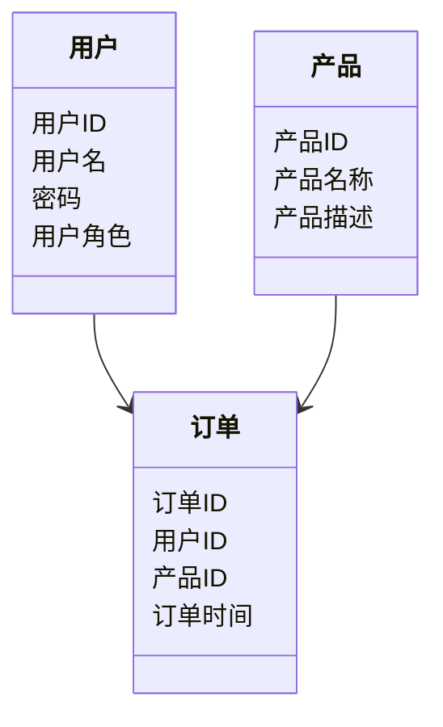
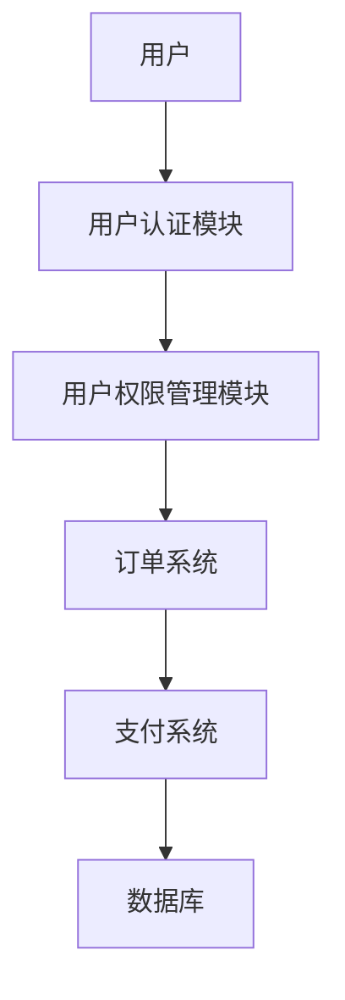

                 


# 彼得林奇的"长期价值创造"在网络效应企业中的衡量

> 关键词：长期价值创造，网络效应企业，彼得林奇，投资理论，用户生命周期价值

> 摘要：本文探讨了彼得林奇的长期价值创造理论在网络效应企业中的应用，分析了网络效应企业的特点及其与长期价值创造的结合，提出了衡量长期价值创造的数学模型和系统架构设计方案，并通过实际案例进行了验证。本文还提供了最佳实践建议，帮助读者更好地理解和应用这些理论。

---

# 第一部分: 长期价值创造与网络效应企业的背景

## 第1章: 长期价值创造的定义与背景

### 1.1 长期价值创造的核心概念

#### 1.1.1 长期价值创造的定义
长期价值创造是指企业通过持续优化产品、服务和运营模式，为用户和股东创造持久的价值。它强调企业不仅要追求短期收益，还要关注长期的可持续发展。

#### 1.1.2 长期价值创造的核心要素
- **用户价值**：通过产品和服务满足用户需求，提升用户满意度和忠诚度。
- **创新**：通过技术创新和模式创新保持企业的竞争优势。
- **可持续性**：确保企业在经济、社会和环境三个方面实现可持续发展。

#### 1.1.3 长期价值创造的边界与外延
长期价值创造的边界包括企业的核心业务和相关生态，外延则涉及供应链、合作伙伴和用户社区。

### 1.2 网络效应企业的定义与特点

#### 1.2.1 网络效应企业的定义
网络效应企业是指通过用户之间的互动和数据共享，形成网络效应，从而实现快速成长的企业。例如，社交媒体平台、电子商务平台等。

#### 1.2.2 网络效应企业的关键特征
- **用户增长的快**：通过网络效应，用户数量可以指数级增长。
- **数据驱动**：通过用户数据优化产品和服务。
- **平台化**：网络效应企业通常以平台模式运营，连接供需双方。

#### 1.2.3 网络效应企业与传统企业的对比
| 特性             | 网络效应企业               | 传统企业                  |
|------------------|---------------------------|--------------------------|
| 用户增长模式      | 网络效应驱动               | 线性增长                  |
| 数据依赖性        | 高度依赖                  | 较低依赖                  |
| 价值创造方式      | 平台化、生态化              | 产品化、服务化            |

### 1.3 彼得林奇长期价值创造理论的背景

#### 1.3.1 彼得林奇投资理论的概述
彼得林奇是美国著名投资经理人，他主张长期投资，关注企业的基本面和长期价值创造能力。

#### 1.3.2 长期价值创造在投资中的重要性
长期价值创造是企业持续增长的核心，也是投资者选择企业的关键指标。

#### 1.3.3 网络效应企业与长期价值创造的结合
网络效应企业通过平台化和数据化，能够快速实现长期价值创造。

---

## 第2章: 彼得林奇长期价值创造理论的核心要素

### 2.1 长期价值创造的核心要素

#### 2.1.1 企业核心竞争力的构建
企业核心竞争力是长期价值创造的基础，包括技术创新、产品差异化和成本优势。

#### 2.1.2 企业持续增长的驱动力
用户需求的深度挖掘和网络效应是驱动企业持续增长的核心动力。

#### 2.1.3 企业价值的衡量
企业价值的衡量包括财务指标（如净利润、ROE）和非财务指标（如用户满意度、品牌影响力）。

---

## 第3章: 长期价值创造与网络效应企业的结合

### 3.1 网络效应企业的长期价值创造特点

#### 3.1.1 网络效应企业的长期价值创造模式
网络效应企业通过平台化和生态化实现长期价值创造。

#### 3.1.2 网络效应企业的长期价值衡量指标
- 用户增长率
- 用户留存率
- 用户生命周期价值（CLV）

---

## 第4章: 彼得林奇长期价值创造理论在网络效应企业的应用

### 4.1 彼得林奇长期价值创造理论的应用场景

#### 4.1.1 网络效应企业的价值创造过程
1. 用户增长阶段：通过网络效应快速吸引用户。
2. 用户留存阶段：通过产品优化提升用户留存率。
3. 用户价值提升阶段：通过数据分析和个性化服务提升用户价值。

### 4.2 网络效应企业的长期价值创造策略

#### 4.2.1 用户增长策略
- 通过营销和推广吸引用户。
- 通过产品创新提升用户体验。

#### 4.2.2 用户留存策略
- 提供优质的产品和服务。
- 通过用户激励机制提升用户粘性。

---

## 第5章: 网络效应企业的长期价值创造的数学模型

### 5.1 用户生命周期价值（CLV）的计算

#### 5.1.1 CLV的数学模型
$$ CLV = \frac{R - W}{1 - \beta} $$
其中：
- R = 用户的年收入
- W = 用户获取成本
- β = 用户流失率

#### 5.1.2 CLV计算的步骤
1. 确定用户的年收入（R）。
2. 确定用户获取成本（W）。
3. 确定用户流失率（β）。
4. 计算CLV。

---

## 第6章: 网络效应企业的系统架构设计

### 6.1 系统功能设计

#### 6.1.1 领域模型


### 6.2 系统架构设计

#### 6.2.1 架构图


---

## 第7章: 项目实战

### 7.1 环境安装

#### 7.1.1 系统环境要求
- 操作系统：Linux/Windows/MacOS
- 开发工具：Python/Java/Go
- 数据库：MySQL/PostgreSQL

### 7.2 核心代码实现

#### 7.2.1 用户生命周期价值（CLV）的计算代码
```python
def calculate_clv(revenue, cost, beta):
    return (revenue - cost) / (1 - beta)

# 示例
revenue = 100
cost = 50
beta = 0.1
clv = calculate_clv(revenue, cost, beta)
print(f"用户生命周期价值为：{clv}")
```

---

## 第8章: 最佳实践

### 8.1 小结

### 8.2 注意事项
- 在网络效应企业中，用户增长和用户留存是长期价值创造的关键。
- 在实际应用中，需要结合企业的实际情况调整CLV的计算模型。

### 8.3 拓展阅读
- 《彼得林奇的投资哲学》
- 《网络效应企业的成功之路》

---

作者：AI天才研究院 & 禅与计算机程序设计艺术

