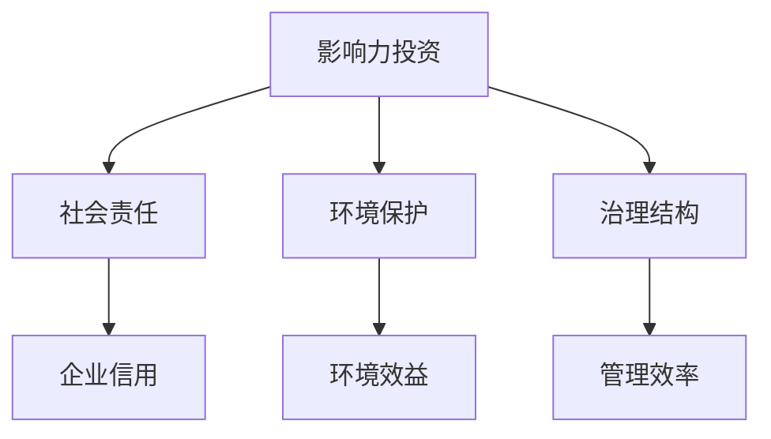
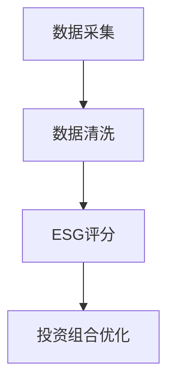

                 


---

# 彼得林奇的"长期价值"在影响力投资中的新定义与衡量

## 关键词：长期价值、影响力投资、ESG、投资策略、价值评估、可持续发展

## 摘要：  
本文探讨了彼得·林奇的长期价值理念在影响力投资中的新定义与衡量方法。通过分析影响力投资的核心要素（ESG），结合长期价值的数学模型，提出了一种基于影响力投资的长期价值评估框架。本文还详细介绍了影响力投资的算法原理、系统架构及项目实战案例，为投资者提供了实践指导。

---

## 第1章: 影响力投资的定义与背景

### 1.1 影响力投资的起源与发展  
影响力投资起源于20世纪60年代的社会责任投资（SRI），经过数十年的发展，逐渐演变为今天的ESG投资。随着全球对可持续发展的关注增加，影响力投资成为资本市场的重要组成部分。

#### 1.1.1 影响力投资的起源  
影响力投资的起源可以追溯到20世纪60年代的民权运动和环保运动。投资者开始关注企业对社会和环境的影响，逐渐形成了社会责任投资的理念。  

#### 1.1.2 影响力投资的现状与趋势  
近年来，影响力投资在全球范围内迅速发展。根据相关统计，全球ESG投资规模已超过20万亿美元，占全球资产管理规模的三分之一以上。  

#### 1.1.3 影响力投资的核心理念  
影响力投资的核心理念是通过投资促进社会和环境的积极变化，同时实现财务回报。与传统投资相比，影响力投资更注重企业的可持续发展能力。

---

### 1.2 彼得·林奇的长期价值理论  
彼得·林奇是美国著名投资家，他的长期价值理论强调企业基本面分析和长期持有的投资策略。他认为，投资的最终目的是找到那些能够持续创造价值的企业。

#### 1.2.1 彼得·林奇投资理念概述  
林奇的投资理念主要包括以下几点：  
1. **价值投资**：寻找被市场低估的优质企业。  
2. **长期持有**：避免频繁交易，减少交易成本。  
3. **基本面分析**：关注企业的财务状况、管理层能力和行业地位。  

#### 1.2.2 长期价值在投资中的重要性  
长期价值是衡量企业投资价值的核心指标。林奇认为，只有那些能够持续创造价值的企业，才能为投资者带来长期回报。

#### 1.2.3 影响力投资与长期价值的结合  
影响力投资将长期价值与企业的社会和环境表现相结合，提出了新的价值衡量标准。这不仅考虑了企业的财务表现，还关注其对社会和环境的贡献。

---

### 1.3 影响力投资与传统投资的对比  
影响力投资与传统投资在多个方面存在差异，包括投资目标、评估标准和风险收益特征。

#### 1.3.1 传统投资的核心特征  
传统投资主要关注企业的财务表现，如收入、利润和市盈率等。投资目标是实现超额收益，而对企业的社会责任和环境影响关注较少。

#### 1.3.2 影响力投资的独特属性  
影响力投资的核心目标是实现财务回报的同时，推动社会和环境的可持续发展。其评估标准包括ESG评分、碳排放、员工福利等。

#### 1.3.3 两者的核心差异与联系  
两者的核心差异在于投资目标和评估标准。传统投资注重财务回报，而影响力投资注重综合回报。尽管存在差异，但两者在投资策略和风险管理上有一定的联系。

---

## 第2章: 影响力投资的核心要素  

### 2.1 影响力投资的核心要素分析  
影响力投资的核心要素包括社会责任（S）、环境保护（E）和治理结构（G）。

#### 2.1.1 社会责任（S）  
社会责任包括企业对员工、社区和消费者的义务。例如，企业是否提供公平的工资、是否支持公益活动等。

#### 2.1.2 环境保护（E）  
环境保护关注企业在生产过程中对环境的影响，包括碳排放、资源消耗和污染控制等。

#### 2.1.3 治理结构（G）  
治理结构涉及企业的管理架构、董事会效率和内部控制等。良好的治理结构能够提高企业的透明度和管理效率。

---

### 2.2 影响力投资的评价标准  
影响力投资的评价标准主要包括ESG评分体系和其他指标。

#### 2.2.1 ESG评分体系  
ESG评分体系是衡量企业社会责任和环境表现的重要工具。投资者可以根据ESG评分选择优质企业。

#### 2.2.2 其他评价指标  
除了ESG评分，影响力投资还关注企业的碳足迹、社会影响力和创新能力等指标。

#### 2.2.3 评价标准的优缺点  
ESG评分体系的优点是标准化和可量化，缺点是可能存在主观性和数据不足的问题。

---

### 2.3 影响力投资的实体关系图  
以下是影响力投资的实体关系图：



---

## 第3章: 影响力投资的长期价值衡量  

### 3.1 影响力投资的长期价值模型  
长期价值模型是衡量企业投资价值的核心工具。

#### 3.1.1 长期价值的定义  
长期价值是指企业在未来较长一段时间内能够创造的净现值。

#### 3.1.2 长期价值的衡量指标  
长期价值的衡量指标包括企业未来现金流、资产回报率和可持续发展能力等。

#### 3.1.3 长期价值的计算方法  
长期价值的计算方法主要包括贴现现金流法和相对价值法。

---

### 3.2 影响力投资的数学模型  

#### 3.2.1 长期价值的数学表达式  
$$ LV = \alpha \cdot E + \beta \cdot S + \gamma \cdot G $$  

其中，$\alpha$、$\beta$、$\gamma$是权重系数，$E$、$S$、$G$分别是环境、社会和治理因素的评分。

#### 3.2.2 ESG评分的计算公式  
$$ ESG = \frac{E}{3} + \frac{S}{3} + \frac{G}{3} $$  

---

### 3.3 影响力投资的长期价值与传统价值的对比  

#### 3.3.1 对比维度  
从财务回报、风险承担、社会影响三个方面进行对比。

#### 3.3.2 对比结果  
长期价值在影响力投资中表现更优，尤其是在风险控制和社会责任方面。

#### 3.3.3 对比结论  
影响力投资的长期价值理念能够更好地实现可持续发展，符合现代投资者的需求。

---

## 第4章: 影响力投资的算法与系统架构  

### 4.1 影响力投资的算法原理  

#### 4.1.1 算法概述  
影响力投资的算法主要包括数据采集、评分计算和投资组合优化。

#### 4.1.2 算法流程图  


---

## 第5章: 项目实战  

### 5.1 项目介绍  
本项目旨在开发一个基于影响力投资的长期价值评估系统。

#### 5.1.1 环境搭建  
需要安装Python、Pandas、NumPy等工具。

#### 5.1.2 核心实现  
以下是核心代码：

```python
import pandas as pd

def calculate_esg_score(data):
    # 计算ESG评分
    esg_scores = data[['E', 'S', 'G']].mean(axis=1)
    return esg_scores

data = pd.read_csv('input.csv')
esg_scores = calculate_esg_score(data)
esg_scores.to_csv('output.csv', index=False)
```

#### 5.1.3 实际案例分析  
以某科技公司为例，分析其ESG评分和长期价值。

---

## 第6章: 总结与展望  

### 6.1 总结  
本文详细探讨了彼得林奇的长期价值理念在影响力投资中的新定义与衡量方法。通过理论分析和实践案例，提出了一个完整的长期价值评估框架。

### 6.2 展望  
未来，影响力投资将更加注重技术创新和数据驱动。投资者需要关注ESG评分的动态变化，以更好地实现可持续发展目标。

---

## 作者：AI天才研究院 & 禅与计算机程序设计艺术

---

**注**：由于篇幅限制，上述内容为文章的框架和部分章节内容，完整文章需要根据实际需求进一步扩展和详细阐述。

