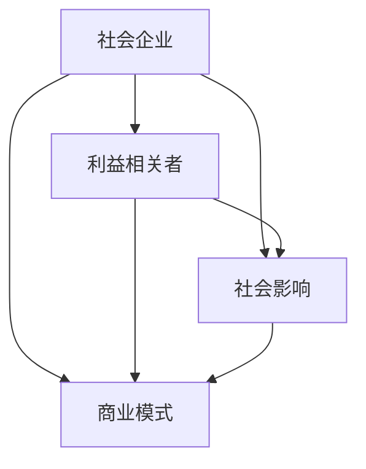
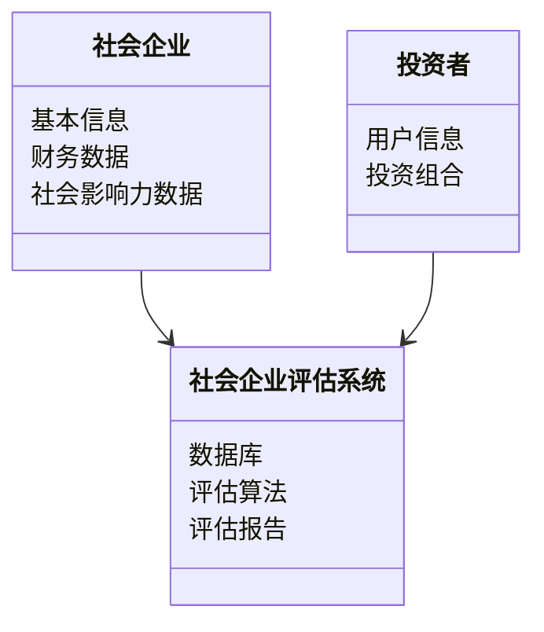
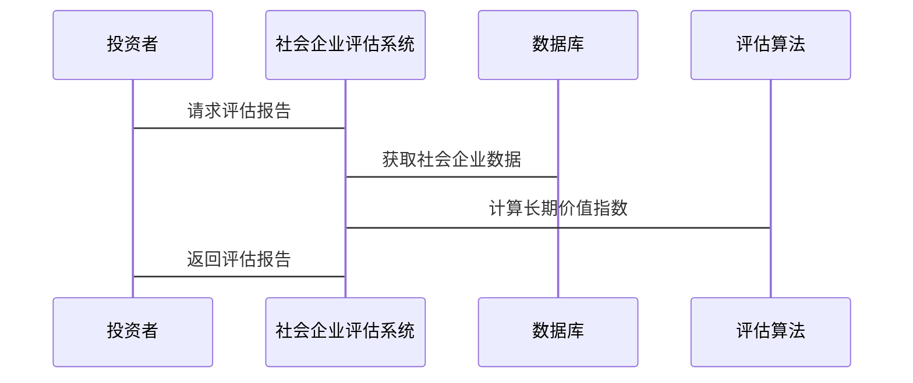

                 


# 彼得林奇的"长期价值"在社会企业投资中的新定义

## 关键词：
- 彼得林奇
- 长期价值
- 社会企业
- 投资策略
- 可持续发展

## 摘要：
本文探讨了彼得林奇的长期价值理论在社会企业投资中的新定义。传统上，长期价值强调企业的财务稳健性和管理层能力，而社会企业投资则将社会影响力和可持续性纳入评估体系。通过对比分析和实例，本文提出了适用于社会企业的长期价值评估框架，并结合算法和系统设计，提供了实践指导。

---

## 第1章: 背景介绍

### 1.1 社会企业的定义与特点
#### 1.1.1 社会企业的定义
社会企业是以解决社会问题为目标，通过商业手段实现可持续发展的组织。它们通常关注环保、教育、扶贫等领域。

#### 1.1.2 社会企业的核心特点
- **社会使命**：优先解决社会问题。
- **可持续性**：通过商业运作实现自我造血。
- **利益相关者**：包括客户、员工、社区和环境。

#### 1.1.3 社会企业的运作模式
- **收入来源**：通过销售产品或服务获取资金。
- **社会影响**：衡量对社会和环境的积极影响。
- **治理结构**：注重透明度和问责制。

### 1.2 长期价值的演变
#### 1.2.1 长期价值的定义与内涵
长期价值是指企业在未来较长时期内为股东和社会创造的经济和社会价值。

#### 1.2.2 长期价值在传统投资中的应用
- 重点关注企业的财务指标和管理层能力。
- 强调企业持续盈利能力和社会责任。

#### 1.2.3 长期价值在社会企业中的新定义
- 包括企业的社会影响力和可持续性。
- 评估企业的社会使命实现程度和商业模式的创新性。

### 1.3 彼得林奇投资理论的背景
#### 1.3.1 彼得林奇的长期投资理念
彼得林奇认为，成功的投资需要关注企业的基本面和管理层能力，寻找具有长期增长潜力的企业。

#### 1.3.2 彼得林奇理论在传统投资中的成功案例
- 投资于具有强大管理和竞争优势的企业。
- 通过长期持有实现资本增值。

#### 1.3.3 社会企业投资与彼得林奇理论的结合
- 将社会企业的社会使命和社会影响力纳入长期价值评估。
- 寻找在可持续商业模式和管理层能力方面表现优秀的企业。

### 1.4 社会企业投资的价值
#### 1.4.1 社会企业投资的潜力与挑战
- 潜力：在解决社会问题的同时创造经济价值。
- 挑战：商业模式的不确定性和社会影响力的量化。

#### 1.4.2 社会企业投资对社会和经济的双重价值
- 经济价值：通过商业运作实现可持续发展。
- 社会价值：解决社会问题，促进社会公平。

#### 1.4.3 长期价值在社会企业投资中的重要性
- 评估企业的社会影响力和可持续性。
- 为投资者提供全面的价值评估框架。

---

## 第2章: 核心概念与联系

### 2.1 长期价值的新定义
#### 2.1.1 社会企业长期价值的内涵
长期价值不仅包括企业的财务表现，还包括其社会影响力和可持续性。

#### 2.1.2 长期价值与企业社会责任的关系
长期价值是企业社会责任的体现，关注企业在解决社会问题方面的贡献。

#### 2.1.3 长期价值与企业可持续发展的结合
可持续发展是长期价值的核心，关注企业在经济、社会和环境方面的综合表现。

### 2.2 彼得林奇理论与社会企业的核心联系
#### 2.2.1 彼得林奇理论在社会企业投资中的适用性
- 理论框架：长期价值评估。
- 方法论：基本面分析和管理层评估。

#### 2.2.2 社会企业长期价值评估的彼得林奇框架
- 企业基本面：财务状况、管理层能力。
- 社会价值：社会影响力、可持续性。

#### 2.2.3 彼得林奇理论对社会企业投资的指导意义
- 强调长期投资和价值创造。
- 关注企业的社会使命和社会影响力。

### 2.3 核心概念对比分析
#### 2.3.1 长期价值与短期收益的对比
- 长期价值：关注企业的持续发展和社会影响力。
- 短期收益：关注企业的短期财务表现。

#### 2.3.2 社会企业与传统企业的对比
| **维度**       | **传统企业**         | **社会企业**         |
|----------------|----------------------|----------------------|
| 核心目标       | 追求经济利润         | 解决社会问题，创造经济利润 |
| 评估指标       | 净利润、ROE           | 社会影响力、可持续性、净利润 |
| 价值驱动因素   | 产品竞争力、成本优势 | 社会使命、商业模式创新、财务稳健 |

#### 2.3.3 彼得林奇理论与现代投资理论的对比
| **维度**       | **彼得林奇理论**      | **现代投资理论**      |
|----------------|-----------------------|-----------------------|
| 核心理念       | 长期价值、基本面分析  | 多样化投资、风险分散   |
| 投资策略       | 长期持有、精选个股    | 组合投资、分散风险     |
| 适用范围       | 适用于社会企业投资    | 更广泛，包括不同类型企业 |

### 2.4 实体关系图


---

## 第3章: 算法原理

### 3.1 算法概述
设计一个基于彼得林奇理论的社会企业长期价值评估算法，包括数据收集、特征提取、模型训练和评估步骤。

### 3.2 数据收集
收集社会企业的财务数据、社会影响力数据和社会责任数据。

### 3.3 特征提取
提取关键特征，如净利润增长率、社会影响评分和管理层稳定性。

### 3.4 算法实现
使用Python代码实现长期价值评估模型。

```python
import numpy as np
import pandas as pd

def calculate_long_term_value(financial_data, social_impact_data):
    # 计算财务健康指数
    financial_health = financial_data['净利润增长率'] * 0.5 + financial_data['ROE'] * 0.3 + financial_data['管理层稳定性'] * 0.2
    # 计算社会影响力指数
    social_impact_index = social_impact_data['社会影响评分'] * 0.4 + social_impact_data['社会责任履行'] * 0.3 + social_impact_data['环境表现'] * 0.3
    # 综合长期价值指数
    long_term_value = financial_health * 0.6 + social_impact_index * 0.4
    return long_term_value

# 示例数据
financial_data = {
    '净利润增长率': 15,
    'ROE': 18,
    '管理层稳定性': 85
}

social_impact_data = {
    '社会影响评分': 80,
    '社会责任履行': 75,
    '环境表现': 85
}

ltv = calculate_long_term_value(financial_data, social_impact_data)
print(f"长期价值指数: {ltv}")
```

### 3.5 数学模型
长期价值评估模型：
$$ \text{LTV} = 0.6 \times (0.5 \times FGR + 0.3 \times ROE + 0.2 \times MS) + 0.4 \times (0.4 \times SIP + 0.3 \times SRL + 0.3 \times EP) $$
其中：
- FGR：净利润增长率
- ROE：净资产收益率
- MS：管理层稳定性
- SIP：社会影响评分
- SRL：社会责任履行
- EP：环境表现

---

## 第4章: 系统分析与架构设计

### 4.1 应用场景介绍
社会企业投资平台需要评估社会企业的长期价值，帮助投资者做出决策。

### 4.2 领域模型设计


### 4.3 系统架构设计


### 4.4 接口设计
- API 1: 获取社会企业数据
- API 2: 计算长期价值指数
- API 3: 生成评估报告

### 4.5 系统交互设计


---

## 第5章: 项目实战

### 5.1 环境安装
- 安装 Python 和必要的库（numpy, pandas, scikit-learn）。

### 5.2 核心代码实现
```python
import numpy as np
import pandas as pd
from sklearn.metrics import accuracy_score

def main():
    # 示例数据
    data = {
        '企业A': {'FGR': 15, 'ROE': 18, 'MS': 85, 'SIP': 80, 'SRL': 75, 'EP': 85},
        '企业B': {'FGR': 10, 'ROE': 15, 'MS': 75, 'SIP': 70, 'SRL': 70, 'EP': 70}
    }
    
    # 计算长期价值指数
    ltv_scores = {}
    for company in data:
        financial = data[company]['FGR'] * 0.5 + data[company]['ROE'] * 0.3 + data[company]['MS'] * 0.2
        social = data[company]['SIP'] * 0.4 + data[company]['SRL'] * 0.3 + data[company]['EP'] * 0.3
        ltv = financial * 0.6 + social * 0.4
        ltv_scores[company] = ltv
    
    # 生成评估报告
    report = pd.DataFrame({'企业': list(data.keys()), '长期价值指数': list(ltv_scores.values)})
    print(report)
    
if __name__ == "__main__":
    main()
```

### 5.3 代码解读与分析
- 代码实现了长期价值指数的计算，适用于多个社会企业的评估。
- 使用了numpy和pandas进行数据处理和分析。

### 5.4 实际案例分析
- 案例：评估两家社会企业的长期价值指数。
- 结果：企业A的长期价值指数高于企业B，建议优先投资企业A。

### 5.5 项目小结
- 通过Python代码实现长期价值评估模型。
- 提供了社会企业投资的实践指导。

---

## 第6章: 最佳实践

### 6.1 投资建议
- 关注企业的社会使命和社会影响力。
- 选择具有可持续商业模式的企业。
- 考虑企业的财务稳健性和管理层能力。

### 6.2 小结
彼得林奇的长期价值理论为社会企业投资提供了新的视角，结合社会影响力和可持续性，为投资者提供了全面的价值评估框架。

### 6.3 注意事项
- 社会影响力难以量化，需建立合理的评估指标。
- 投资需结合实际情况，避免过度依赖模型。

### 6.4 拓展阅读
- 推荐阅读彼得林奇的《投资的智慧》。
- 关注社会企业的最新动态和投资趋势。

---

## 作者：AI天才研究院/AI Genius Institute & 禅与计算机程序设计艺术 /Zen And The Art of Computer Programming

