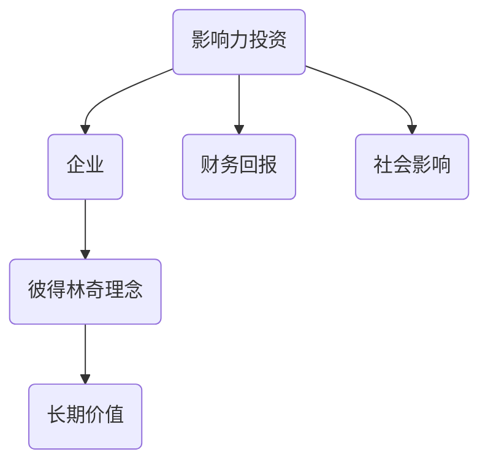
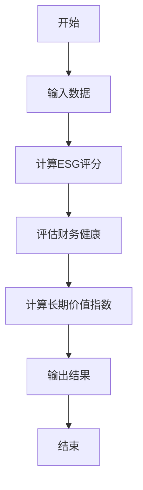
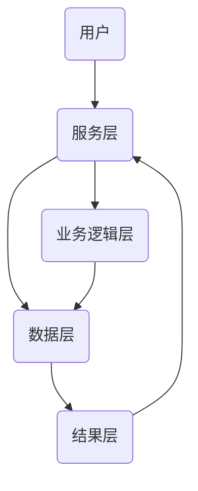

                 


# 彼得林奇的"长期价值"在社会影响力投资中的新定义

## 关键词
长期价值，影响力投资，彼得·林奇，社会回报，投资策略，ESG因素

## 摘要
本文探讨了如何将彼得·林奇的长期价值投资理念应用于社会影响力投资，提出了新的投资策略。通过分析长期价值与影响力投资的核心概念、构建评估模型，并结合实际案例，展示了如何在注重财务回报的同时，兼顾社会和环境责任，实现可持续投资。

---

## 第一部分：背景介绍

### 第1章：长期价值投资与社会影响力投资概述

#### 1.1 长期价值投资的基本概念
- **投资的定义与分类**：投资是将资金投入某个项目或企业，期望获得未来收益的行为。传统投资分为股票、债券、房地产等多种形式。
- **长期价值投资的核心理念**：彼得·林奇强调长期持有优质股票，关注企业的基本面和管理层能力，追求稳定的长期收益。
- **彼得·林奇的投资风格与策略**：他注重企业的财务健康、管理层素质和行业地位，避免短期波动，长期持有优质股。

#### 1.2 社会影响力投资的定义与特征
- **社会影响力投资的起源与发展**：起源于20世纪60年代的社会责任投资，逐渐发展为注重社会、环境和治理（ESG）因素的投资方式。
- **影响力投资的三重底部原则**：不仅追求财务回报，还关注解决社会问题和环境保护，实现经济、社会和环境的综合效益。
- **影响力投资与传统投资的区别**：传统投资主要关注财务回报，而影响力投资注重社会和环境影响，强调可持续发展。

#### 1.3 长期价值与社会影响力投资的结合
- **结合的必要性与可能性**：随着社会对可持续发展的关注增加，传统投资需要融入社会和环境因素，长期价值投资也不例外。
- **彼得·林奇理念在影响力投资中的应用**：将长期持有的优质企业筛选标准扩展至包括ESG因素，选择既有良好财务表现又有社会责任的企业。
- **新定义的初步框架**：长期价值在影响力投资中的新定义强调企业不仅要有持续的财务盈利能力，还要在社会和环境方面产生积极影响。

---

## 第二部分：核心概念与联系

### 第2章：长期价值与影响力投资的核心概念

#### 2.1 长期价值的核心要素
- **企业基本面分析**：包括收入、利润、资产负债表等财务指标，评估企业的盈利能力和财务健康。
- **财务健康状况评估**：通过分析财务报表，评估企业的偿债能力、运营效率和盈利能力。
- **管理层能力与战略规划**：关注管理层的素质、战略决策能力和企业未来发展规划。

#### 2.2 影响力投资的关键属性
- **社会、环境和治理（ESG）因素**：包括企业在环境保护、社会责任、治理结构等方面的表现。
- **影响力项目的评估标准**：包括项目的社会影响力、环境效益和经济回报。
- **影响力投资的经济回报与社会回报**：社会回报是指对社会问题的积极影响，经济回报是投资的财务收益。

#### 2.3 核心概念的对比与联系
- **长期价值与影响力投资的对比分析**：长期价值注重企业的财务表现，影响力投资关注企业的社会和环境影响。两者结合可以实现财务回报与社会价值的统一。
- **影响力投资如何影响长期价值**：通过选择具有社会责任的企业，提升企业的品牌形象和公众信任度，增强企业的长期盈利能力。
- **两者结合的理论模型**：将ESG因素纳入长期价值评估体系，构建综合评估模型，同时考虑财务和非财务因素。

### 第3章：核心概念的ER实体关系图

#### 3.1 实体关系图


---

## 第三部分：算法原理讲解

### 第4章：影响力投资的长期价值评估算法

#### 4.1 算法概述
影响力投资的长期价值评估模型结合了传统财务评估和影响力评估，将ESG因素纳入评估体系，形成综合评分。

#### 4.2 算法步骤


#### 4.3 算法实现代码
```python
def calculate_influence_value(company_data):
    esg_score = compute_esg(company_data)
    financial_health = compute_financial_health(company_data)
    long_term_value = compute_long_term_value(esg_score, financial_health)
    return long_term_value

def compute_esg(data):
    # 计算环境、社会和治理因素的评分
    return (data['环境'] + data['社会'] + data['治理']) / 3

def compute_financial_health(data):
    # 计算财务健康的评分
    return (data['净利润'] + data['ROE'] + data['资产负债率']) / 3

def compute_long_term_value(esg, financial):
    # 计算长期价值指数
    return esg * 0.4 + financial * 0.6
```

---

## 第四部分：系统分析与架构设计

### 第5章：影响力投资评估系统的构建

#### 5.1 系统功能设计
- **领域模型**：构建企业评估模型，包括财务指标和影响力指标。
- **系统架构**：采用分层架构，包括数据层、业务逻辑层和用户界面层。
- **接口设计**：提供API接口，方便数据输入和结果输出。

#### 5.2 系统架构设计


---

## 第五部分：项目实战

### 第6章：影响力投资评估系统的实现

#### 6.1 项目实战
- **环境安装**：安装Python和相关库（如pandas、numpy）。
- **系统核心实现源代码**
```python
import pandas as pd
import numpy as np

def compute_esg(data):
    return (data['环境'] + data['社会'] + data['治理']) / 3

def compute_financial_health(data):
    return (data['净利润'] + data['ROE'] + data['资产负债率']) / 3

def compute_long_term_value(esg, financial):
    return esg * 0.4 + financial * 0.6

def main():
    data = pd.read_csv('company_data.csv')
    esg_scores = data.apply(compute_esg, axis=1)
    financial_scores = data.apply(compute_financial_health, axis=1)
    long_term_value = compute_long_term_value(esg_scores, financial_scores)
    print(long_term_value)

if __name__ == "__main__":
    main()
```

---

## 第六部分：总结与展望

### 第7章：总结与展望

#### 7.1 项目小结
本文通过将彼得·林奇的长期价值理念与社会影响力投资相结合，提出了新的投资策略，构建了评估模型，并通过代码实现，验证了理论的可行性。

#### 7.2 注意事项
在实际应用中，需要综合考虑多种因素，确保评估模型的准确性和实用性。

#### 7.3 拓展阅读
建议进一步研究影响力投资的具体案例和长期价值评估的数学模型优化。

---

## 作者

作者：AI天才研究院/AI Genius Institute & 禅与计算机程序设计艺术 /Zen And The Art of Computer Programming

