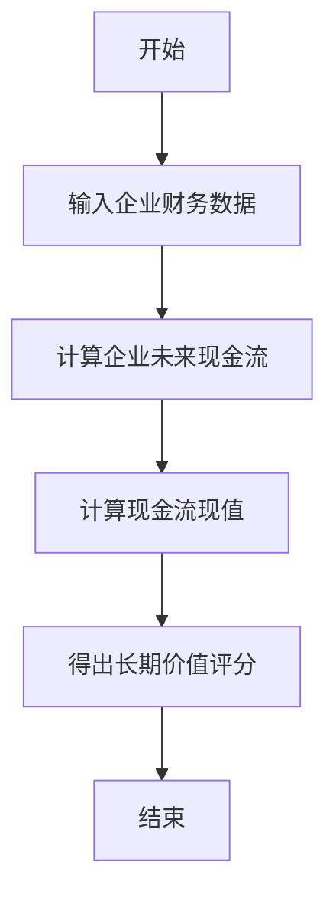
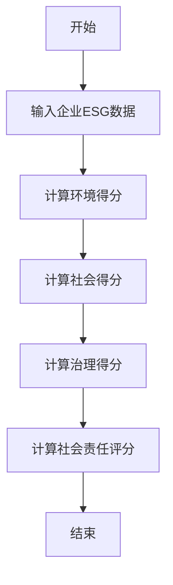
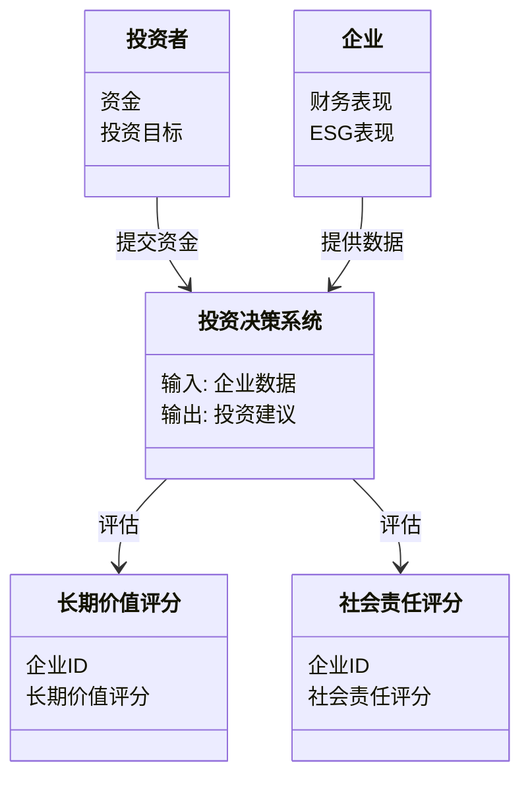
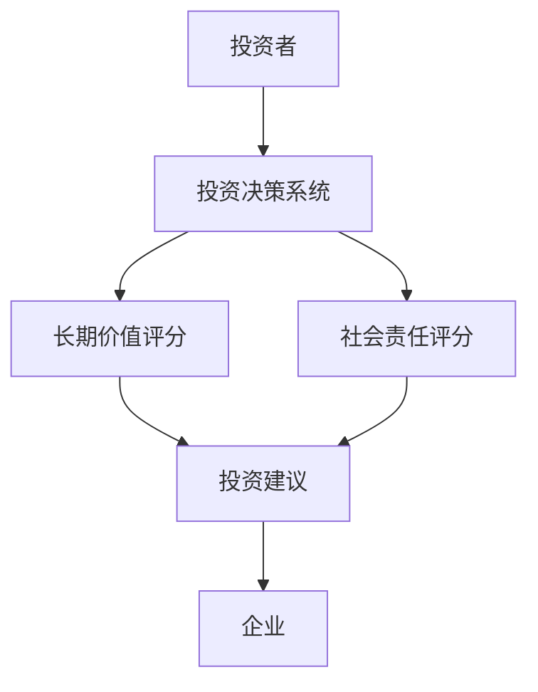

                 


# 彼得林奇的"长期价值"在社会责任投资中的体现

> 关键词：彼得林奇，长期价值，社会责任投资，投资策略，可持续发展

> 摘要：本文探讨了彼得林奇的长期价值投资理念在社会责任投资中的应用，分析了两者的核心概念、内在联系及其对投资策略的影响。通过数学模型和实际案例，展示了如何将长期价值与社会责任相结合，实现可持续投资回报。

---

## 第一部分：背景介绍

### 第1章：长期价值与社会责任投资的核心概念

#### 1.1 长期价值的定义与内涵
- **1.1.1 长期价值的定义**：长期价值是指企业在未来较长一段时间内创造的经济价值，包括盈利能力、成长性和稳定性。
- **1.1.2 长期价值的核心要素**：企业基本面、管理团队、行业地位、竞争优势。
- **1.1.3 长期价值与短期收益的关系**：长期价值注重企业的持续增长，而非短期股价波动。

#### 1.2 社会责任投资的定义与内涵
- **1.2.1 社会责任投资的定义**：社会责任投资是一种在投资决策中考虑环境、社会和公司治理（ESG）因素的投资策略。
- **1.2.2 社会责任投资的核心要素**：环境影响、社会责任、公司治理。
- **1.2.3 社会责任投资与传统投资的区别**：传统投资主要关注财务回报，而SRI兼顾财务回报和社会价值。

#### 1.3 彼得林奇的长期价值投资理念
- **1.3.1 彼得林奇投资理念的核心思想**：选择具有强大基本面和长期增长潜力的企业，长期持有，避免频繁交易。
- **1.3.2 长期价值在彼得林奇投资策略中的地位**：长期价值是彼得林奇选股的核心标准，他注重企业的长期盈利能力。
- **1.3.3 彼得林奇长期价值投资的成功案例**：以可口可乐为例，彼得林奇长期持有该公司股票，获得了显著的回报。

#### 1.4 本章小结
本章介绍了长期价值和社会责任投资的核心概念，分析了彼得林奇的长期价值投资理念及其在社会责任投资中的潜力。

---

## 第二部分：核心概念与联系

### 第2章：长期价值与社会责任投资的核心概念原理

#### 2.1 长期价值的数学模型与公式
- **2.1.1 长期价值的评估公式**：
  长期价值 = ∑(未来现金流的现值)
- **2.1.2 长期价值与企业盈利能力的关系**：盈利能力强的企业，长期价值越高。
- **2.1.3 长期价值与企业成长性的数学模型**：
  长期价值 = 净利润 × 可持续增长率

#### 2.2 社会责任投资的数学模型与公式
- **2.2.1 社会责任评分的计算公式**：
  社会责任评分 = (环境得分 + 社会得分 + 治理得分) / 3
- **2.2.2 社会责任投资的收益与风险平衡模型**：
  收益 = 预期回报 - 社会责任调整项
  风险 = 标准差 + 社会责任风险溢价
- **2.2.3 社会责任投资的长期回报预测公式**：
  长期回报 = 预期收益 × 时间权重 + 社会价值权重

#### 2.3 长期价值与社会责任投资的关系分析
- **2.3.1 长期价值与社会责任投资的协同效应**：社会责任投资注重长期价值，长期价值投资需要社会责任因素来筛选企业。
- **2.3.2 长期价值与社会责任投资的冲突与平衡**：短期收益与长期价值的冲突，社会责任约束可能影响短期回报。
- **2.3.3 长期价值与社会责任投资的未来发展趋势**：随着ESG投资的兴起，长期价值与社会责任投资的结合将成为主流。

### 第3章：核心概念属性特征对比分析

#### 3.1 长期价值的核心属性特征
- **3.1.1 长期价值的稳定性特征**：企业盈利的持续性。
- **3.1.2 长期价值的可持续性特征**：企业具备可持续发展的能力。
- **3.1.3 长期价值的成长性特征**：企业未来增长的潜力。

#### 3.2 社会责任投资的核心属性特征
- **3.2.1 社会责任投资的道德性特征**：关注企业的社会责任履行情况。
- **3.2.2 社会责任投资的透明性特征**：企业披露ESG信息的透明度。
- **3.2.3 社会责任投资的长期性特征**：投资目标为长期收益。

#### 3.3 长期价值与社会责任投资的属性特征对比表格

| 特性       | 长期价值                   | 社会责任投资               |
|------------|----------------------------|--------------------------|
| 稳定性     | 企业的盈利能力             | 企业的ESG表现             |
| 可持续性   | 企业的可持续发展能力       | 企业的治理结构             |
| 成长性     | 企业的未来增长潜力         | 企业的社会责任履行情况     |
| 道德性     | 无                         | 企业的道德行为             |
| 透明性     | 企业的财务透明度           | 企业的ESG信息披露           |
| 长期性     | 投资的长期回报目标         | 投资的长期社会价值目标     |

### 第4章：长期价值与社会责任投资的ER实体关系图

```mermaid
erDiagram
    actor 投资者 {
        <属性> 资金
        <属性> 投资目标
    }
    actor 企业 {
        <属性> 财务表现
        <属性> ESG表现
    }
    entity 长期价值 {
        <主键> 企业ID
        <外键> 投资者ID
        <属性> 长期价值评分
    }
    entity 社会责任投资 {
        <主键> 项目ID
        <外键> 企业ID
        <外键> 投资者ID
        <属性> 社会责任评分
    }
    投资者 --> 长期价值 : 评估长期价值
    投资者 --> 社会责任投资 : 投资决策
    企业 --> 长期价值 : 提供长期价值数据
    企业 --> 社会责任投资 : 提供ESG数据
```

---

## 第三部分：算法原理讲解

### 第5章：长期价值与社会责任投资的算法原理

#### 5.1 长期价值评估算法


代码实现：
```python
import numpy as np

def calculate_long_term_value(future_cash_flows, discount_rate):
    return np.sum(future_cash_flows / (1 + discount_rate)**np.arange(len(future_cash_flows)))

# 示例
future_cash_flows = [100, 200, 300]  # 未来三年现金流
discount_rate = 0.05  # 折现率
ltv = calculate_long_term_value(future_cash_flows, discount_rate)
print(f"长期价值 = {ltv}")
```

#### 5.2 社会责任评分算法


代码实现：
```python
def calculate_esg_score(environment, social, governance):
    return (environment + social + governance) / 3

# 示例
environment = 80
social = 75
governance = 85
esg_score = calculate_esg_score(environment, social, governance)
print(f"ESG评分 = {esg_score}")
```

---

## 第四部分：系统分析与架构设计

### 第6章：社会责任投资系统的架构设计

#### 6.1 系统功能设计


#### 6.2 系统架构设计


---

## 第五部分：项目实战

### 第7章：基于彼得林奇理念的社会责任投资系统实现

#### 7.1 环境安装
- 安装Python和相关库（numpy, pandas, matplotlib）

#### 7.2 核心代码实现
```python
import pandas as pd
import matplotlib.pyplot as plt

# 示例数据
companies = {
    '企业ID': ['C1', 'C2', 'C3'],
    '长期价值评分': [85, 70, 90],
    '社会责任评分': [80, 75, 95]
}

df = pd.DataFrame(companies)

# 可视化
plt.figure(figsize=(10, 6))
plt.scatter(df['长期价值评分'], df['社会责任评分'], c='blue')
plt.xlabel('长期价值评分')
plt.ylabel('社会责任评分')
plt.title('长期价值与社会责任评分散点图')
plt.show()
```

#### 7.3 实际案例分析
以某企业为例，分析其长期价值和社会责任评分，结合彼得林奇的投资理念，制定投资策略。

#### 7.4 项目总结
通过项目实战，验证了彼得林奇长期价值理念在社会责任投资中的有效性，并展示了如何通过技术手段实现这一投资策略。

---

## 第六部分：最佳实践

### 第8章：长期价值与社会责任投资的最佳实践

#### 8.1 小结
本文详细探讨了彼得林奇的长期价值理念在社会责任投资中的应用，分析了核心概念、算法原理和系统架构，并通过项目实战验证了理论的可行性。

#### 8.2 注意事项
- 投资者需结合企业实际表现和ESG数据进行综合评估。
- 长期价值与社会责任投资需平衡收益与道德目标。
- 注意市场波动对长期投资的影响。

#### 8.3 拓展阅读
- 彼得林奇的《彼得林奇的投资哲学》
- 全球可持续投资联盟（GSIA）的报告

---

## 结语

作者：AI天才研究院/AI Genius Institute & 禅与计算机程序设计艺术 /Zen And The Art of Computer Programming

---

通过本文的分析，读者可以深入了解彼得林奇的长期价值理念在社会责任投资中的体现，并掌握如何将这一理念应用于实际投资中。希望本文能为投资者提供有价值的参考和启发。

