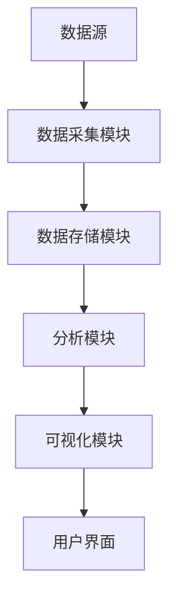

                 


# 彼得林奇的"长期价值"投资案例分析

## 关键词：彼得林奇，长期价值投资，投资策略，股票分析，财务报表

## 摘要：  
彼得林奇是全球最著名的投资专家之一，他的长期价值投资理念强调通过深入分析企业的基本面和行业趋势，选择具有长期增长潜力的优质股票进行投资。本文通过分析彼得林奇的投资哲学、经典案例、数学模型和系统架构，全面解读长期价值投资的核心要素和实际应用。

---

## 第一部分：长期价值投资的背景与核心概念

### 第1章：长期价值投资的背景与核心概念

#### 1.1 长期价值投资的定义与背景
长期价值投资是一种以企业基本面分析为基础的投资策略，强调长期持有优质股票，追求企业内在价值的增长。彼得林奇是这一理念的代表人物，他通过深入研究企业的财务状况、行业地位和竞争优势，选择那些具有持续增长潜力的企业进行投资。

#### 1.2 长期价值投资的核心要素
- **企业基本面分析**：包括收入、利润、资产负债表等财务指标。
- **行业分析**：评估行业发展趋势和企业的竞争优势。
- **财务报表分析**：通过利润表、资产负债表和现金流量表评估企业的财务健康状况。

#### 1.3 彼得林奇与长期价值投资的关联
彼得林奇的投资理念强调长期持有优质股票，避免短期市场波动的干扰。他通过对企业基本面的深入研究，选择那些具有持续增长潜力的企业进行投资。

---

### 第2章：彼得林奇的投资哲学与方法论

#### 2.1 彼得林奇的生平与成就
彼得林奇是美国著名投资专家，曾管理富达麦哲伦基金，创造了卓越的投资业绩。他的投资哲学强调长期持有优质股票，注重企业基本面分析。

#### 2.2 彼得林奇的投资策略
- **长期持有**：彼得林奇主张长期持有优质股票，避免频繁交易。
- **价值投资**：通过对企业基本面的深入分析，选择那些具有长期增长潜力的企业。
- **风险控制**：通过分散投资和严格的风险评估，降低投资风险。

#### 2.3 彼得林奇的投资分析框架
- **企业估值**：通过市盈率、市净率等指标评估企业的内在价值。
- **行业趋势**：分析行业发展趋势，选择具有竞争优势的企业。
- **财务指标分析**：通过利润表、资产负债表等财务报表分析企业的财务状况。

---

## 第二部分：彼得林奇的长期价值投资案例分析

### 第3章：彼得林奇的经典投资案例

#### 3.1 微软公司的长期投资案例
彼得林奇早期投资于微软公司，因为他认为微软在操作系统和软件行业具有强大的竞争优势。通过长期持有微软股票，他获得了巨大的投资收益。

#### 3.2 亚马逊的早期投资分析
亚马逊在早期阶段是一家小型公司，但彼得林奇通过对其商业模式和行业趋势的深入分析，认为亚马逊具有巨大的增长潜力，因此选择投资。

#### 3.3 苹果公司的价值评估
苹果公司是一家具有强大品牌影响力和技术优势的企业，彼得林奇通过对其财务状况和行业地位的分析，认为苹果公司具有长期增长潜力。

---

### 第4章：彼得林奇投资理念的数学模型与算法原理

#### 4.1 长期价值投资的数学模型
- **市盈率模型**：$$市盈率 = \frac{P}{EPS}$$
- **市净率模型**：$$市净率 = \frac{P}{B}$$
- **ROE模型**：$$ROE = \frac{净利润}{所有者权益}$$

#### 4.2 投资分析算法的实现
通过Python代码实现企业基本面分析的算法，例如计算市盈率、市净率等指标。

```python
import pandas as pd

# 假设我们有一个包含财务数据的DataFrame
financial_data = pd.DataFrame({
    '公司': ['公司A', '公司B', '公司C'],
    '股价': [100, 200, 150],
    '每股收益': [10, 20, 15],
    '每股净资产': [50, 100, 75]
})

# 计算市盈率和市净率
financial_data['市盈率'] = financial_data['股价'] / financial_data['每股收益']
financial_data['市净率'] = financial_data['股价'] / financial_data['每股净资产']

print(financial_data)
```

---

## 第三部分：系统分析与架构设计

### 第5章：系统分析与架构设计方案

#### 5.1 问题场景介绍
我们设计一个基于长期价值投资理念的投资分析系统，用于辅助投资者进行企业基本面分析和投资决策。

#### 5.2 系统功能设计
- 数据采集模块：从财务报表中提取企业基本面数据。
- 分析模块：计算市盈率、市净率等指标，评估企业的内在价值。
- 可视化模块：生成图表和报告，帮助投资者进行决策。

#### 5.3 系统架构设计
使用Mermaid架构图展示系统的整体架构。



---

## 第四部分：项目实战

### 第6章：项目实战与案例分析

#### 6.1 环境安装
安装必要的Python库，如Pandas和Matplotlib。

#### 6.2 核心实现
编写Python代码，实现企业基本面分析和投资决策。

```python
import pandas as pd
import matplotlib.pyplot as plt

# 读取财务数据
data = pd.read_csv('financial_data.csv')

# 计算市盈率和市净率
data['市盈率'] = data['股价'] / data['每股收益']
data['市净率'] = data['股价'] / data['每股净资产']

# 可视化市盈率和市净率
data.plot(kind='scatter', x='市盈率', y='市净率', color='red')
plt.show()
```

---

## 第五部分：最佳实践与小结

### 第7章：最佳实践与小结

#### 7.1 投资策略总结
- 长期价值投资需要深入分析企业的基本面和行业趋势。
- 选择具有持续增长潜力的优质企业进行投资。
- 通过分散投资和严格的风险评估，降低投资风险。

#### 7.2 投资建议
- 投资者应该注重企业的基本面分析，选择具有长期增长潜力的企业。
- 避免短期市场波动的干扰，长期持有优质股票。
- 通过分散投资和严格的风险评估，降低投资风险。

#### 7.3 拓展阅读
- 彼得林奇的《彼得林奇的投资哲学》
- 《价值投资入门：如何选择优质股票》

---

## 作者：AI天才研究院/AI Genius Institute & 禅与计算机程序设计艺术 /Zen And The Art of Computer Programming

