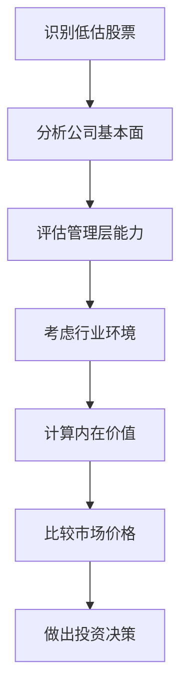
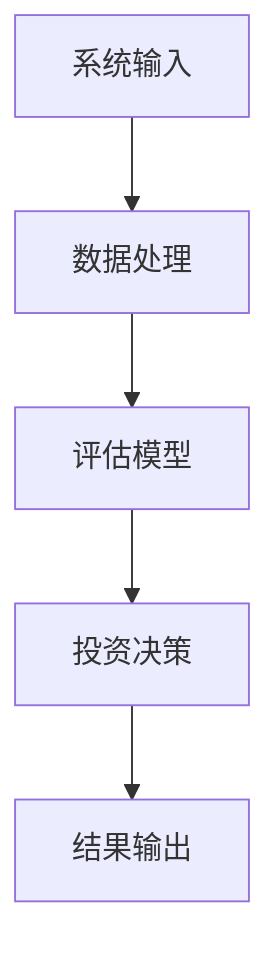

                 


# 彼得林奇的"长期价值"投资理念

> 关键词：长期价值投资，彼得林奇，投资策略，投资理念，投资分析

> 摘要：本文深入探讨了彼得林奇的长期价值投资理念，从其核心概念、算法原理、系统架构到实际项目实战，全面分析了这一投资策略的精髓。通过详细的背景介绍、核心概念对比、数学模型阐述以及实际案例分析，读者可以全面理解并掌握如何在实际投资中应用长期价值投资理念，实现稳健的投资回报。

---

## 第1章: 投资的演变与彼得林奇的背景

### 1.1 投资的演变历程
- **1.1.1 从传统投资到现代投资的演变**  
  - 传统投资的局限性  
  - 现代投资的多样化与系统化  
  - 长期价值投资的兴起与发展

- **1.1.2 彼得林奇在投资界的地位**  
  - 彼得林奇的生平简介  
  - 他对投资界的主要贡献  
  - 他的投资理念对现代投资者的影响

- **1.1.3 长期价值投资的定义与核心理念**  
  - 长期价值投资的核心定义  
  - 它与其他投资策略的主要区别  
  - 长期价值投资的核心理念与目标

---

## 第2章: 长期价值投资的核心概念

### 2.1 长期价值投资的定义与特征
- **2.1.1 长期价值投资的定义与特征对比表**  
  | 投资策略   | 长期价值投资 | 短期交易策略 | 随机交易 |
  |------------|--------------|--------------|----------|
  | 投资目标   | 实现资产增值 | 赚取价差收益 | 不确定 |
  | 投资期限   | 长期持有     | 短期操作     | 随机性  |
  | 风险控制   | 低风险       | 高风险       | 中风险  |

- **2.1.2 长期价值投资的核心要素**  
  - 投资标的：优质企业  
  - 投资逻辑：基本面分析  
  - 投资目标：内在价值  

- **2.1.3 长期价值投资的ER实体关系图**  
  ```mermaid
  graph TD
    I[投资者] --> C[公司]
    C --> F[财务数据]
    C --> M[管理层]
    C --> G[行业环境]
    I --> D[数据处理]
    D --> A[评估结果]
    A --> I[投资决策]
  ```

---

## 第3章: 长期价值投资的算法原理

### 3.1 长期价值投资的数学模型

- **3.1.1 投资回报的数学公式**  
  投资回报率 = (最终价值 - 初始价值) / 初始价值

- **3.1.2 内在价值的计算公式**  
  $$ 内在价值 = \sum_{t=1}^{n} \frac{CF_t}{(1 + r)^t} $$
  其中，CF_t为第t年的现金流，r为折现率。

- **3.1.3 风险调整后的回报模型**  
  $$ R = R_m + β(R_m - R_f) + α $$
  其中，R为投资回报，R_m为市场回报，R_f为无风险利率，β为贝塔系数，α为超额收益。

### 3.2 投资决策的流程图



---

## 第4章: 长期价值投资的系统架构设计

### 4.1 投资决策的系统功能设计

- **4.1.1 投资目标设定**  
  - 确定投资期限  
  - 设定风险承受能力  
  - 明确收益目标  

- **4.1.2 股票筛选标准**  
  - 市盈率低于行业平均水平  
  - 净利润增长率稳定  
  - 负债率合理  

- **4.1.3 投资组合管理**  
  - 分散投资以降低风险  
  - 定期复盘与调整  
  - 动态跟踪市场变化  

### 4.2 系统架构的流程图



---

## 第5章: 长期价值投资的项目实战

### 5.1 环境安装与数据准备

- **5.1.1 投资分析工具的安装**  
  - 安装财务分析软件（如Excel、Python库）  
  - 下载历史股价数据和财务报表  

- **5.1.2 数据源的选择与获取**  
  - 选择可靠的金融数据源（如Yahoo Finance）  
  - 获取目标公司的财务数据  

- **5.1.3 数据清洗与预处理**  
  - 处理缺失数据  
  - 标准化数据格式  

### 5.2 核心代码实现

- **5.2.1 投资策略的代码实现**  
  ```python
  import pandas as pd

  def calculate_intrinsic_value(financial_data, discount_rate):
      cf = financial_data['现金流']
      iv = sum(cf / (1 + discount_rate) ** t for t in range(len(cf)))
      return iv

  data = pd.read_csv('company_financials.csv')
  iv = calculate_intrinsic_value(data, 0.05)
  print(f"公司内在价值为：{iv}")
  ```

- **5.2.2 数据分析与可视化**  
  ```python
  import matplotlib.pyplot as plt

  plt.plot(data['股价'], label='股价')
  plt.plot(data['内在价值'], label='内在价值')
  plt.xlabel('时间')
  plt.ylabel('价值')
  plt.legend()
  plt.show()
  ```

- **5.2.3 投资组合优化的代码实现**  
  ```python
  import numpy as np

  def optimize_portfolio(returns):
      n = len(returns.columns)
      returns_matrix = returns.values.T
      cov_matrix = np.cov(returns_matrix)
      inv_cov = np.linalg.inv(cov_matrix)
      weights = np.dot(inv_cov, np.ones(n)) / np.sum(inv_cov.dot(np.ones(n)))
      return weights

  portfolio = optimize_portfolio(data_returns)
  print(f"最优权重为：{portfolio}")
  ```

### 5.3 案例分析与详细讲解

- **案例分析：假设某公司财务数据如下**
  | 年份 | 股价 | 净利润 | 股东权益 |
  |------|------|--------|----------|
  | 2020 | 10   | 500    | 2000     |
  | 2021 | 12   | 600    | 2400     |
  | 2022 | 15   | 750    | 3000     |

- **计算内在价值**  
  假设折现率为5%：
  $$ 内在价值 = \frac{500}{1.05^1} + \frac{600}{1.05^2} + \frac{750}{1.05^3} \approx 1333.93 $$

- **投资建议**  
  当前股价为15，低于内在价值1333.93，适合买入并长期持有。

---

## 第6章: 长期价值投资的最佳实践与注意事项

### 6.1 投资中的最佳实践

- **长期持有与定期复盘**  
  - 定期检查投资组合  
  - 评估投资标的的内在价值变化  

- **风险控制与仓位管理**  
  - 分散投资以降低风险  
  - 设定止损点以限制损失  

- **价值发现与市场波动应对**  
  - 识别市场低估机会  
  - 在市场恐慌时增加投资  

### 6.2 投资中的注意事项

- **避免短期波动干扰**  
  - 不要因短期市场波动而改变投资策略  
  - 长期关注企业的基本面  

- **防范企业基本面变化**  
  - 定期跟踪企业财务数据  
  - 评估管理层的稳定性  

- **注意市场环境变化**  
  - 关注宏观经济环境  
  - 适应市场周期变化  

---

## 第7章: 小结与拓展阅读

### 7.1 小结

- 彼得林奇的长期价值投资理念强调基本面分析和长期持有优质企业。  
- 通过系统的投资分析和风险控制，投资者可以在长期实现稳健的回报。  

### 7.2 拓展阅读

- 推荐书籍：《彼得林奇的投资哲学》  
- 推荐博客：深入探讨长期价值投资的实际应用  

---

## 作者：AI天才研究院/AI Genius Institute & 禅与计算机程序设计艺术 /Zen And The Art of Computer Programming

