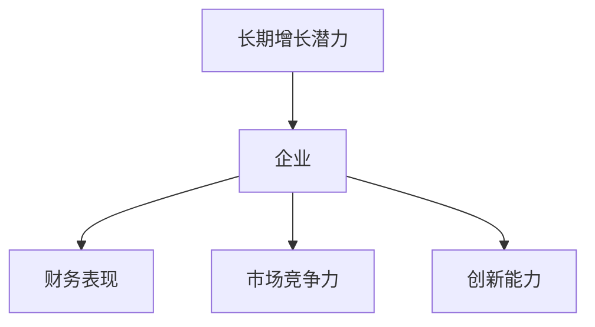
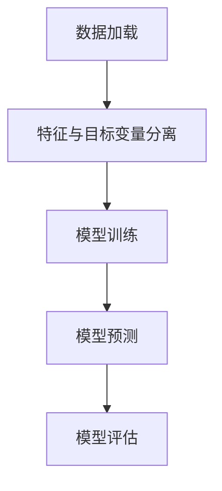
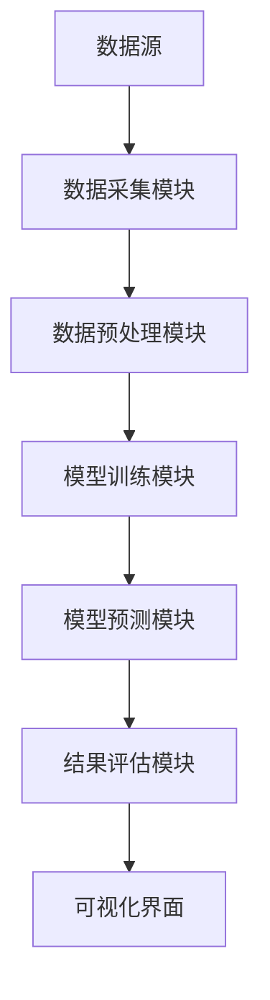
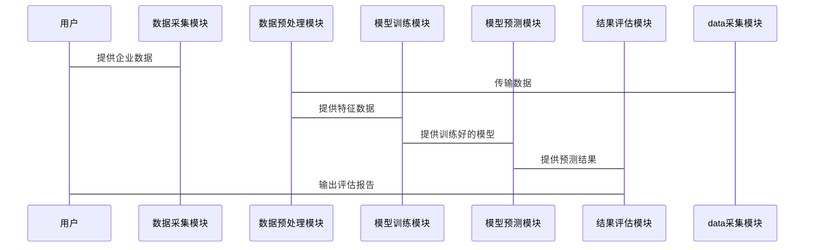

                 


# 彼得林奇的"长期增长"潜力在人工智能行业的识别方法

> **关键词**：彼得林奇、长期增长潜力、人工智能、投资分析、机器学习、金融领域  
> **摘要**：本文通过分析彼得林奇的投资理念，结合人工智能技术，详细探讨如何利用AI识别和评估企业的长期增长潜力。文章从核心概念、算法原理、系统架构到项目实战，全面解析长期增长潜力的识别方法，并结合实际案例进行深入分析。

---

## 第一部分：背景与核心概念

### 第1章：彼得林奇投资理念与长期增长潜力

#### 1.1 彼得林奇投资理念概述

彼得·林奇（Peter Lynch）是全球著名的职业基金经理人，以其卓越的投资业绩和长期增长型投资策略闻名。他强调投资的长期性，认为企业价值的增长是投资成功的关键。长期增长潜力是指企业在未来一段时间内，通过市场扩展、技术创新、成本优化等方式实现收入和利润持续增长的能力。这种潜力是彼得林奇投资策略的核心关注点。

#### 1.2 人工智能在投资分析中的应用

随着人工智能技术的飞速发展，其在金融领域的应用越来越广泛。AI技术能够通过大数据分析、模式识别和预测模型，帮助投资者快速识别潜在的长期增长型企业。通过机器学习算法，AI可以从海量数据中提取关键信息，辅助投资者做出更精准的投资决策。

#### 1.3 本书研究目标与意义

本文旨在通过人工智能技术，探索如何有效识别企业的长期增长潜力。研究目标包括：  
1. 提供一套基于AI的长期增长潜力评估方法。  
2. 结合彼得林奇的投资理念，优化长期增长潜力的识别流程。  
3. 通过实际案例分析，验证方法的有效性。  

研究意义在于，通过AI技术提升投资效率，降低投资风险，为投资者提供更精准的决策支持。

---

## 第二部分：长期增长潜力的核心概念

### 第2章：长期增长潜力的定义与核心要素

#### 2.1 长期增长潜力的定义

长期增长潜力是指企业在未来5-10年内，通过核心业务扩展、技术创新、市场拓展等方式实现收入和利润持续增长的能力。它不仅关注企业的当前表现，还强调其未来发展的可持续性。

#### 2.2 核心概念与属性特征对比表

下表详细对比了长期增长潜力的核心概念及其属性特征：

| **核心概念** | **属性特征** |  
|--------------|--------------|  
| 财务表现      | 收入、利润、ROE |  
| 市场竞争力    | 市场份额、品牌影响力 |  
| 创新能力      | R&D投入、专利数量 |  

#### 2.3 ER实体关系图（Mermaid流程图）



---

## 第三部分：算法原理与数学模型

### 第3章：基于AI的长期增长潜力识别算法

#### 3.1 算法原理概述

基于AI的长期增长潜力识别算法主要采用机器学习模型，包括回归分析和分类算法。回归分析用于预测企业的财务表现，而分类算法则用于判断企业的市场竞争力和创新能力。

#### 3.2 数学模型与公式

##### 3.2.1 线性回归模型

线性回归模型用于预测企业的收入增长潜力，其数学公式为：

$$ y = \beta_0 + \beta_1x_1 + \beta_2x_2 + \cdots + \beta_nx_n $$

其中：  
- $y$ 表示企业的收入增长率。  
- $\beta_0$ 是截距项。  
- $\beta_1, \beta_2, \cdots, \beta_n$ 是各变量的回归系数。  
- $x_1, x_2, \cdots, x_n$ 表示企业的财务指标，如收入、利润等。

##### 3.2.2 逻辑回归模型

逻辑回归模型用于判断企业的市场竞争力，其数学公式为：

$$ P(y=1|x) = \frac{e^{\beta_0 + \beta_1x_1 + \beta_2x_2 + \cdots + \beta_nx_n}}{1 + e^{\beta_0 + \beta_1x_1 + \beta_2x_2 + \cdots + \beta_nx_n}} $$

其中：  
- $P(y=1|x)$ 表示企业具有市场竞争力的概率。  
- $\beta_0, \beta_1, \cdots, \beta_n$ 是模型参数。  
- $x_1, x_2, \cdots, x_n$ 表示企业的市场指标，如市场份额、品牌影响力等。

#### 3.3 代码实现与流程图

##### 3.3.1 代码实现

以下是一个基于Python的长期增长潜力识别算法示例代码：

```python
import pandas as pd
from sklearn.linear_model import LinearRegression
from sklearn.metrics import accuracy_score

# 数据加载
data = pd.read_csv('long_term_growth.csv')

# 特征与目标变量分离
X = data[['收入', '利润', 'ROE']]
y = data['市场竞争力']

# 模型训练
model = LinearRegression()
model.fit(X, y)

# 模型预测
y_pred = model.predict(X)

# 模型评估
print('回归系数:', model.coef_)
print('回归截距:', model.intercept_)
print('准确率:', accuracy_score(y, y_pred))
```

##### 3.3.2 流程图（Mermaid）



---

## 第四部分：系统分析与架构设计

### 第4章：系统架构与功能设计

#### 4.1 问题场景介绍

本文设计了一个基于AI的长期增长潜力识别系统，旨在通过数据采集、模型训练、预测评估等功能，帮助企业投资者快速识别具有长期增长潜力的企业。

#### 4.2 系统功能设计

系统功能模块包括：  
1. 数据采集模块：从公开数据库获取企业的财务数据、市场数据等。  
2. 数据预处理模块：对数据进行清洗、特征提取和标准化处理。  
3. 模型训练模块：基于机器学习算法训练长期增长潜力识别模型。  
4. 模型预测模块：根据输入的企业数据，预测其长期增长潜力。  
5. 结果评估模块：对模型的预测结果进行评估和可视化分析。  

#### 4.3 系统架构设计（Mermaid架构图）



#### 4.4 系统接口与交互设计

##### 4.4.1 系统接口设计

系统主要接口包括：  
1. 数据输入接口：接收企业的财务数据和市场数据。  
2. 模型调用接口：调用机器学习模型进行预测。  
3. 结果输出接口：输出模型预测结果和评估报告。  

##### 4.4.2 系统交互流程图（Mermaid序列图）



---

## 第五部分：项目实战

### 第5章：项目实战与案例分析

#### 5.1 环境安装与数据准备

##### 5.1.1 环境安装

安装所需的Python库：

```bash
pip install pandas scikit-learn matplotlib
```

##### 5.1.2 数据准备

数据文件示例：

```csv
企业名称,收入,利润,ROE,市场竞争力
企业A,100,20,0.15,高
企业B,150,30,0.20,中
企业C,200,40,0.25,高
```

#### 5.2 系统核心实现

##### 5.2.1 数据预处理

```python
import pandas as pd

data = pd.read_csv('long_term_growth.csv')
data.head()
```

##### 5.2.2 模型训练

```python
from sklearn.linear_model import LinearRegression

model = LinearRegression()
model.fit(X, y)
```

##### 5.2.3 模型预测

```python
y_pred = model.predict(X)
print(y_pred)
```

##### 5.2.4 结果评估

```python
from sklearn.metrics import mean_squared_error

mse = mean_squared_error(y, y_pred)
print(f"均方误差：{mse}")
```

#### 5.3 案例分析

以企业A为例，假设输入数据为：

```python
import numpy as np

test_input = np.array([[100, 20, 0.15]])
test_output = model.predict(test_input)
print(f"预测的市场竞争力：{test_output}")
```

结果解读：  
预测的市场竞争力为“中”，说明企业在当前条件下市场竞争力一般，但具有较大的增长潜力。

---

## 第六部分：最佳实践与总结

### 第6章：最佳实践与小结

#### 6.1 最佳实践

1. 数据质量：确保数据的完整性和准确性。  
2. 模型选择：根据具体问题选择合适的算法。  
3. 模型调优：通过交叉验证优化模型参数。  
4. 结果解读：结合业务背景分析模型预测结果。  

#### 6.2 小结

本文通过彼得林奇的投资理念，结合人工智能技术，提出了长期增长潜力的识别方法。通过机器学习算法和系统架构设计，实现了对企业长期增长潜力的精准预测和评估。这种方法不仅提高了投资效率，还降低了投资风险。

#### 6.3 注意事项

1. 数据隐私：注意保护企业数据的隐私和安全。  
2. 模型局限：AI模型的结果仅供参考，需结合人工判断。  
3. 技术更新：及时跟进AI技术的发展，优化模型性能。  

#### 6.4 拓展阅读

1. 《彼得林奇的投资哲学》  
2. 《机器学习实战》  
3. 《人工智能在金融领域的应用》  

---

## 结语

通过本文的分析与实践，读者可以深入了解如何利用人工智能技术识别企业的长期增长潜力。这种方法不仅适用于金融投资领域，还可推广至其他行业的长期发展潜力评估。

---

**作者：AI天才研究院/AI Genius Institute & 禅与计算机程序设计艺术 /Zen And The Art of Computer Programming**

