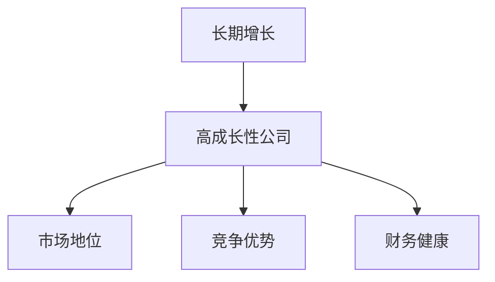

                 

# 彼得林奇的"长期增长"潜力在新兴科技领域的识别方法

> 关键词：彼得·林奇，长期增长，新兴科技，投资方法，风险管理，行业分析，案例分析

> 摘要：本文探讨了彼得·林奇的长期增长投资理论在新兴科技领域的应用，分析了如何识别具有长期增长潜力的企业，并结合具体案例进行深入解读。文章还介绍了风险管理策略和行业分析方法，为投资者提供了系统的指导和实用建议。

---

## 目录

1. **彼得·林奇投资理论概述**
   1.1 彼得·林奇及其投资理念
   1.2 长期增长投资的定义与特点
   1.3 新兴科技领域的投资机会

2. **长期增长潜力的识别方法**
   2.1 高成长性公司的判断标准
   2.2 市场地位与竞争优势的评估
   2.3 财务数据的分析与解读

3. **新兴科技领域的特点与分析**
   3.1 人工智能与大数据
   3.2 5G与物联网
   3.3 区块链与加密货币

4. **彼得·林奇理论在新兴科技领域的应用**
   4.1 投资策略的制定
   4.2 风险控制与投资组合优化
   4.3 长期投资规划的制定

5. **高成长性公司的识别与分析**
   5.1 高成长性公司的定义与特征
   5.2 财务指标的计算与分析
   5.3 行业趋势与竞争环境的影响

6. **投资决策中的风险控制与优化**
   6.1 风险控制的重要性
   6.2 投资组合的优化策略
   6.3 风险管理的实施与监控

---

## 正文

### 第1章 彼得·林奇投资理论概述

#### 1.1 彼得·林奇及其投资理念

彼得·林奇（Peter Lynch）是美国著名的投资经理人，以其在共同基金领域的卓越表现而闻名。他的投资理念强调长期增长和价值发现，认为投资的核心是寻找那些能够持续增长的公司，并在合适的时机买入并长期持有。

**背景介绍：**  
彼得·林奇的职业生涯始于20世纪70年代，他管理的麦哲伦基金（Fidelity Magellan）在任期内取得了年均29%的回报率，远超同期市场表现。他的成功源于对公司的深入研究和对行业趋势的敏锐洞察。

**核心概念：**  
长期增长投资是指通过投资那些收入和利润能够持续增长的公司，以实现资本的长期增值。与短期交易相比，长期增长投资更注重公司的基本面和未来发展潜力。

**图表：**  
以下是彼得·林奇长期增长投资理论的核心要素：

#### 1.2 长期增长投资的定义与特点

**定义：**  
长期增长投资是指通过投资那些具有持续增长潜力的公司，以实现资产的长期增值。这种投资策略强调对公司基本面的深入分析，包括收入增长、利润水平、市场地位等因素。

**特点：**  
- **持续性：** 投资目标公司具有长期的增长潜力。
- **稳定性：** 公司财务状况健康，抗风险能力强。
- **选择性：** 投资于具有竞争优势和市场地位的公司。

**对比：**  
下表展示了长期增长投资与短期投资的核心区别：

| **指标**       | 长期增长投资          | 短期投资           |
|----------------|----------------------|-------------------|
| 投资期限       | 5年以上              | 1年以内           |
| 投资目标       | 寻找高成长性公司      | 利用价格波动获利   |
| 风险承受能力   | 较低                 | 较高              |

#### 1.3 新兴科技领域的投资机会

**新兴科技领域：**  
包括人工智能、大数据、5G、物联网、区块链等领域。这些领域的技术创新和市场扩张为投资者提供了丰富的投资机会。

**投资机会：**  
- **技术驱动：** 新兴科技领域的公司往往依靠技术创新获得竞争优势。
- **市场潜力：** 这些领域市场增长迅速，具有广阔的发展前景。
- **投资风险：** 技术更新快，市场竞争激烈，投资风险较高。

**案例：**  
以人工智能为例，近年来AI技术的快速发展推动了许多公司业绩的增长。例如，某些公司通过AI技术提升了生产效率，从而实现了收入的快速增长。

---

### 第2章 长期增长潜力的识别方法

#### 2.1 高成长性公司的判断标准

**收入增长率：**  
收入增长率是衡量公司成长性的重要指标。通常，收入增长率高于行业平均水平的公司具有更大的增长潜力。

**净利润增长率：**  
净利润增长率反映了公司盈利能力的提升。高净利润增长率通常意味着公司能够有效控制成本或提高产品价格。

**资产周转率：**  
资产周转率衡量了公司利用资产产生收入的效率。高资产周转率通常表明公司管理效率较高，具有更强的盈利能力。

**图表：**  
以下是收入增长率和净利润增长率的计算公式：

$$
收入增长率 = \frac{当前收入 - 上期收入}{上期收入} \times 100\%
$$

$$
净利润增长率 = \frac{当前净利润 - 上期净利润}{上期净利润} \times 100\%
$$

#### 2.2 市场地位与竞争优势的评估

**市场地位：**  
市场地位强的公司通常具有较高的市场份额和品牌影响力，能够在竞争中占据优势地位。

**竞争优势：**  
竞争优势包括技术优势、成本优势、资源优势等。具有独特竞争优势的公司更容易实现长期增长。

**案例：**  
以苹果公司为例，其在智能手机市场的强大市场地位和技术创新优势，使其成为长期增长的典范。

#### 2.3 财务数据的分析与解读

**财务健康：**  
财务健康包括资产负债表、利润表和现金流量表的分析。健康的财务状况是公司长期增长的基础。

**盈利能力：**  
盈利能力包括净利率、毛利率等指标。高盈利能力的公司通常具有更强的自我造血能力。

**现金流：**  
正的现金流表明公司具有良好的财务健康状况，能够支持长期增长。

---

### 第3章 新兴科技领域的特点与分析

#### 3.1 人工智能与大数据

**人工智能：**  
AI技术的应用正在改变多个行业，包括医疗、金融、制造业等。AI技术的普及将推动相关公司业绩的增长。

**大数据：**  
大数据技术的应用能够帮助企业提高决策效率和市场响应速度，从而提升竞争力。

**案例：**  
某些科技公司通过大数据分析优化了市场营销策略，显著提升了销售额。

#### 3.2 5G与物联网

**5G技术：**  
5G的普及将推动通信设备、网络服务等相关行业的发展，为相关公司带来增长机会。

**物联网：**  
物联网技术的应用将推动智能家居、智慧城市等领域的快速发展，为相关公司提供广阔的市场空间。

**案例：**  
某些通信设备制造商通过5G技术的推广实现了收入的快速增长。

#### 3.3 区块链与加密货币

**区块链技术：**  
区块链技术的应用正在改变金融、物流、医疗等多个行业，为相关公司提供了新的增长点。

**加密货币：**  
加密货币市场的波动性较高，但某些具有技术创新的公司仍然具有较大的增长潜力。

**风险：**  
区块链和加密货币领域存在较高的技术风险和市场风险，投资者需要谨慎评估。

---

### 第4章 彼得·林奇理论在新兴科技领域的应用

#### 4.1 投资策略的制定

**长期投资策略：**  
投资者应该选择那些具有长期增长潜力的公司，进行长期持有。

**行业选择：**  
在新兴科技领域，投资者应该选择那些具有广阔市场前景和技术创新优势的行业。

**公司选择：**  
在具体公司选择上，投资者应该综合考虑公司的市场地位、竞争优势和财务状况。

#### 4.2 风险控制与投资组合优化

**风险控制：**  
投资者应该分散投资，避免过度集中于某一行业或公司，以降低投资风险。

**投资组合优化：**  
通过合理配置不同类型资产，优化投资组合的风险收益比。

**案例：**  
某投资者通过分散投资于人工智能、5G和区块链领域的公司，有效降低了投资风险。

#### 4.3 长期投资规划的制定

**长期规划：**  
投资者应该制定长期的投资计划，根据市场变化和公司情况调整投资组合。

**定期评估：**  
定期对投资组合进行评估和调整，确保投资策略的有效性。

**风险管理：**  
在长期投资过程中，投资者需要密切关注市场变化，及时应对可能出现的风险。

---

### 第5章 高成长性公司的识别与分析

#### 5.1 高成长性公司的定义与特征

**定义：**  
高成长性公司是指那些收入和利润能够持续增长的公司。

**特征：**  
- 高收入增长率
- 高净利润增长率
- 强大的市场地位和竞争优势
- 健康的财务状况

**对比：**  
下表展示了高成长性公司与低成长性公司在几个关键指标上的对比：

| **指标**       | 高成长性公司          | 低成长性公司          |
|----------------|----------------------|----------------------|
| 收入增长率       | 高                   | 低                   |
| 净利润增长率     | 高                   | 低                   |
| 市场地位         | 强                   | 弱                   |

#### 5.2 财务指标的计算与分析

**收入增长率：**  
收入增长率的计算公式如前所述。

**净利润增长率：**  
净利润增长率的计算公式如前所述。

**资产周转率：**  
资产周转率 = 销售收入 / 平均资产总额

**案例：**  
某科技公司过去三年的收入分别为100万元、150万元、200万元，其收入增长率为：

$$
收入增长率 = \frac{200 - 150}{150} \times 100\% = 33.33\%
$$

---

### 第6章 投资决策中的风险控制与优化

#### 6.1 风险控制的重要性

**风险控制：**  
在新兴科技领域投资，风险控制至关重要。投资者需要识别和评估各种风险，包括市场风险、技术风险和财务风险。

**风险管理策略：**  
- 分散投资：避免过度集中
- 设置止损：控制潜在损失
- 定期评估：及时调整投资策略

**案例：**  
某投资者在新兴科技领域投资时，通过分散投资于多个公司和行业，有效降低了投资风险。

#### 6.2 投资组合的优化策略

**投资组合优化：**  
通过合理配置资产，优化投资组合的风险收益比。

**资产配置：**  
投资者可以根据自身的风险承受能力和收益目标，合理配置股票、债券、现金等资产。

**定期调整：**  
根据市场变化和公司情况，定期调整投资组合。

#### 6.3 风险管理的实施与监控

**风险管理实施：**  
- 定期评估投资组合的风险
- 监控市场变化和公司动态
- 及时应对可能出现的风险

**风险管理监控：**  
- 使用风险评估模型
- 监控市场指数和行业趋势
- 定期与投资顾问沟通

---

## 结语

彼得·林奇的长期增长投资理论为新兴科技领域的投资提供了重要的指导。通过识别具有长期增长潜力的公司，投资者可以在新兴科技领域实现资本的增值。然而，投资过程中需要注重风险控制和投资组合优化，以确保投资的安全性和收益性。

---

## 作者信息

作者：AI天才研究院/AI Genius Institute & 禅与计算机程序设计艺术 /Zen And The Art of Computer Programming

---

**温馨提示：**  
本文仅为理论探讨，不构成具体的投资建议。实际投资需根据市场情况和自身风险承受能力进行决策。

