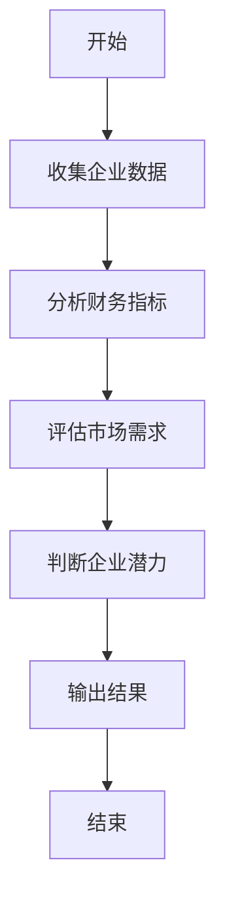
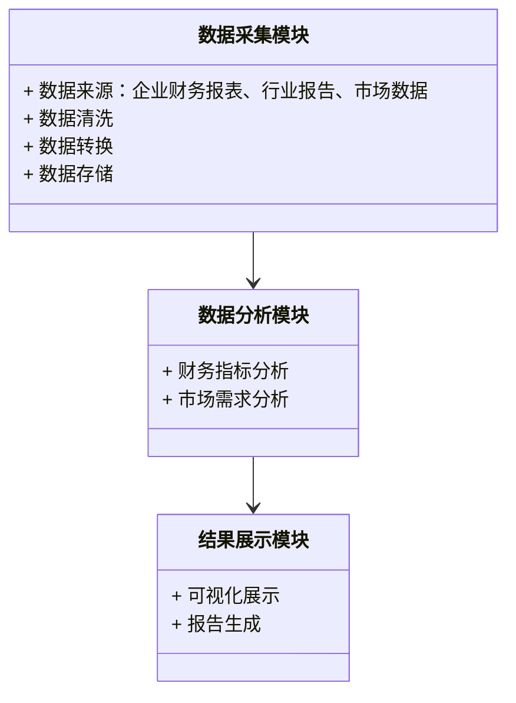

                 

# 彼得林奇的"长期增长"潜力识别方法

## 关键词：
长期增长、投资方法、彼得林奇、潜力识别、财务分析、系统架构、项目实战

## 摘要：
本文深入探讨了彼得·林奇的长期增长潜力识别方法，分析了其核心概念、算法原理、系统架构和项目实战。通过详细阐述财务指标、市场需求分析和投资策略，结合实际案例，帮助读者掌握如何识别具有长期增长潜力的企业。

---

# 第1章：长期增长潜力识别方法概述

## 1.1 投资的基本概念

### 1.1.1 什么是投资
投资是指将资金投入到某个项目或企业，以期获得未来收益的行为。投资的核心在于通过分析企业的基本面和市场环境，判断其未来的盈利能力。

### 1.1.2 长期增长的定义
长期增长是指企业在未来较长的时间内，能够持续扩大收入、利润和市场份额的能力。这种增长通常与企业的创新能力和市场竞争力密切相关。

### 1.1.3 彼得·林奇的投资理念
彼得·林奇是美国著名的投资专家，以其独特的“基本面分析”方法闻名。他认为，投资成功的关键在于选择那些具有持续增长潜力的企业，并长期持有。

## 1.2 彼得·林奇及其投资方法

### 1.2.1 彼得·林奇的背景
彼得·林奇是富达投资集团的传奇基金经理，管理过麦哲伦基金，创造了卓越的投资业绩。他的投资理念强调深入研究企业的基本面，寻找那些具有长期增长潜力的企业。

### 1.2.2 林奇的长期增长策略
林奇的策略包括：
1. **深入研究企业**：分析企业的财务状况、行业地位和竞争优势。
2. **关注市场需求**：判断企业所在行业的市场规模和增长潜力。
3. **长期持有**：选择具有持续增长能力的企业，长期持有以获得复利效应。

### 1.2.3 方法的适用性和局限性
**适用性**：
- 适用于寻找具有长期增长潜力的企业。
- 适合长期投资者。

**局限性**：
- 需要大量的时间和精力进行研究。
- 无法应对短期市场波动。

---

# 第2章：长期增长潜力的核心要素

## 2.1 企业的基本面分析

### 2.1.1 收入与利润分析
收入是企业运营的核心指标，利润是衡量企业盈利能力的重要指标。通过分析收入和利润的趋势，可以判断企业的经营状况。

- **收入分析**：包括主营业务收入、其他业务收入和收入增长率。
- **利润分析**：包括净利润、毛利率和净利率。

### 2.1.2 财务健康状况评估
财务健康状况是判断企业是否具备长期增长潜力的重要依据。关键的财务指标包括：
- **资产负债率**：$$资产负债率 = \frac{负债总额}{资产总额}$$
- **流动比率**：$$流动比率 = \frac{流动资产}{流动负债}$$

### 2.1.3 行业地位与竞争优势
企业是否具备竞争优势，是判断其是否能够持续增长的关键。竞争优势包括：
- **成本优势**：企业是否在生产成本上有竞争优势。
- **技术优势**：企业是否掌握核心技术。
- **品牌优势**：企业品牌是否具有影响力。

## 2.2 市场需求与企业潜力

### 2.2.1 市场容量分析
市场需求是企业增长的核心驱动因素。通过分析市场规模和增长趋势，可以判断企业的潜在发展空间。

- **市场规模**：$$市场规模 = 价格 \times 数量$$
- **市场增长率**：$$市场增长率 = \frac{今年的销售额 - 去年的销售额}{去年的销售额} \times 100\%$$

### 2.2.2 消费者需求预测
消费者需求是企业增长的基础。通过分析消费者行为和偏好，可以预测未来的市场需求。

- **消费者偏好**：消费者对产品的偏好和需求变化。
- **消费趋势**：行业内的消费趋势和潮流。

### 2.2.3 行业发展趋势
行业发展趋势是判断企业长期增长潜力的重要依据。通过分析行业的周期性、技术进步和政策环境，可以判断行业的未来发展方向。

---

# 第3章：长期增长潜力识别的算法原理

## 3.1 算法流程图

## 3.2 财务指标分析

### 3.2.1 市盈率（P/E）计算
市盈率是衡量企业股票价值的重要指标，公式如下：
$$市盈率 = \frac{股价}{每股收益}$$

例如，某公司股价为50元，每股收益为5元，市盈率为10倍。

### 3.2.2 净利润率计算
净利润率是衡量企业盈利能力的重要指标，公式如下：
$$净利润率 = \frac{净利润}{收入}$$

例如，某公司收入为1000万元，净利润为200万元，净利润率为20%。

---

# 第4章：长期增长潜力识别系统架构

## 4.1 系统功能设计

### 4.1.1 数据采集模块
- 数据来源：企业财务报表、行业报告、市场数据。
- 数据处理：清洗、转换和存储。

### 4.1.2 数据分析模块
- 财务指标分析：市盈率、净利润率等。
- 市场需求分析：市场规模、市场增长率等。

### 4.1.3 结果展示模块
- 可视化展示：图表、仪表盘。
- 报告生成：分析报告。

## 4.2 系统架构图

---

# 第5章：项目实战

## 5.1 案例分析

### 5.1.1 案例选择
选择一家具有长期增长潜力的企业，例如某科技公司。

### 5.1.2 分析步骤
1. **收集数据**：获取企业财务报表和行业报告。
2. **计算财务指标**：市盈率、净利润率等。
3. **评估市场需求**：市场规模、市场增长率。
4. **判断企业潜力**：结合财务指标和市场需求，判断企业是否具有长期增长潜力。

### 5.1.3 结果解读
通过分析，得出该企业具有长期增长潜力，并给出投资建议。

---

# 第6章：最佳实践与总结

## 6.1 投资策略小结

### 6.1.1 长期投资的重要性
长期投资能够获得复利效应，是实现财富增长的重要途径。

### 6.1.2 风险管理的关键性
在投资过程中，必须重视风险管理，避免因市场波动导致的重大损失。

## 6.2 拓展阅读与学习资源

### 6.2.1 推荐书籍
- 《彼得·林奇的成功投资：选股很简单》
- 《投资学原理》

### 6.2.2 在线课程与投资社区
- 网易云课堂：投资学课程
- 知乎：投资相关话题

---

# 作者：AI天才研究院 & 禅与计算机程序设计艺术

