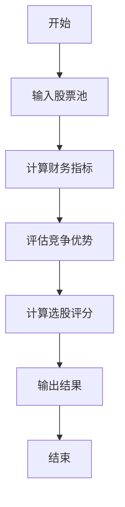

                 

# 彼得林奇的"长期增长"选股策略详解

## 关键词：彼得林奇，长期增长，选股策略，投资分析，财务指标，竞争优势

## 摘要：  
本文详细解析了彼得林奇的"长期增长"选股策略，从其核心理念、选股标准、分析方法到风险管理、组合管理等方面进行了全面探讨。通过系统的分析框架和实际案例，揭示了这一策略在投资实践中如何帮助投资者筛选出具有持续增长潜力的优质企业。文章内容涵盖背景介绍、核心概念、算法原理、系统分析和项目实战，旨在为投资者提供一套科学、系统的选股方法。

---

## 第一部分：引言

### 第1章：彼得林奇与长期增长选股策略概述

#### 1.1 彼得林奇的投资理念  
彼得林奇是美国著名投资家，被誉为“股神”巴菲特之后最伟大的基金经理之一。他管理的麦哲伦基金在20世纪80年代至90年代取得了辉煌的业绩，年复合收益率超过29%。彼得林奇的成功秘诀在于他独创的“长期增长”选股策略，即通过深入分析企业的基本面，寻找那些具有持续增长潜力的公司进行投资。

#### 1.2 长期增长选股策略的背景  
在20世纪80年代，美国股市经历了剧烈的波动，传统估值方法（如市盈率）在动荡的市场中显得力不从心。彼得林奇意识到，仅仅依赖市场估值指标是不够的，必须深入分析企业的财务状况、行业地位和竞争优势，才能找到真正具有长期增长潜力的企业。

#### 1.3 本书的核心目标与结构  
本书旨在通过系统的分析框架，详细介绍彼得林奇的长期增长选股策略，帮助投资者掌握这一方法，并在实际操作中应用。文章结构如下：  
1. **引言**：介绍彼得林奇及其投资理念。  
2. **核心理念**：解析长期增长的定义与特征，以及彼得林奇的投资哲学。  
3. **选股标准**：详细阐述选股的核心指标与方法。  
4. **分析方法**：从财务指标、行业地位到竞争优势，全面解析选股逻辑。  
5. **风险管理**：探讨如何规避投资风险，保持长期增长策略的稳健性。  
6. **组合管理**：如何构建投资组合，实现长期稳健收益。  
7. **项目实战**：通过实际案例，展示长期增长选股策略的应用。  

---

## 第二部分：长期增长选股策略的核心理念

### 第2章：长期增长的定义与特征  

#### 2.1 长期增长的定义  
长期增长是指企业在未来5-10年中，能够保持稳定的收入和利润增长，且其增长率高于行业平均水平。这种增长不仅体现在财务数据上，还体现在企业的竞争优势和行业地位上。

#### 2.2 长期增长的核心特征  
- **稳定的收入增长**：企业过去3-5年的收入增长率稳定且高于行业平均水平。  
- **健康的盈利能力**：企业净利润率持续增长，且具备较高的ROE（净资产收益率）。  
- **强大的竞争优势**：企业在行业内具有明显的竞争优势，如品牌、技术、成本优势等。  
- **良好的财务状况**：企业资产负债表健康，现金流充裕，无重大财务风险。  

#### 2.3 长期增长与其他投资策略的区别  
| 投资策略       | 长期增长策略            | 价值投资策略           | 成长投资策略           |
|----------------|-------------------------|-------------------------|-------------------------|
| 核心逻辑       | 寻找具有持续增长潜力的企业 | 买入被市场低估的优质企业 | 投资高速成长的新兴企业 |
| 关注点         | 收入增长率、净利润率、竞争优势 | 市盈率、市净率、股息率 | 市盈率、PEG比率（市盈率相对盈利增长比率） |
| 适合市场阶段 | 经济稳步增长阶段        | 市场低迷阶段            | 经济快速增长阶段        |

### 第3章：彼得林奇投资哲学的逻辑框架  

#### 3.1 投资的三要素：价值、成长与风险  
彼得林奇认为，投资成功的三要素是价值、成长和风险。他强调，在选择股票时，必须综合考虑企业的内在价值、成长潜力和投资风险。  

#### 3.2 价值投资与成长投资的平衡  
彼得林奇的长期增长策略是价值投资与成长投资的结合。他既关注企业的内在价值（如盈利能力、财务状况），又关注企业的成长潜力（如收入增长率、竞争优势）。  

#### 3.3 长期增长策略的数学模型与公式  
彼得林奇的选股评分模型如下：  
$$ \text{选股评分} = w_1 \cdot f_1 + w_2 \cdot f_2 + \dots + w_n \cdot f_n $$  
其中，$w_i$ 是第$i$个指标的权重，$f_i$ 是第$i$个指标的评分（1-10分）。  

---

## 第三部分：长期增长选股策略的系统分析

### 第4章：长期增长选股的算法原理  

#### 4.1 算法原理概述  
长期增长选股算法的核心是通过对企业基本面的全面分析，筛选出那些具有持续增长潜力的公司。具体步骤包括：  
1. **输入股票池**：从市场中筛选出符合条件的股票池。  
2. **计算财务指标**：计算企业的收入增长率、净利润率、ROE等关键财务指标。  
3. **评估竞争优势**：分析企业的行业地位、品牌优势、技术壁垒等。  
4. **计算选股评分**：根据权重和评分模型，计算每只股票的综合评分。  
5. **输出结果**：根据评分排序，选出评分最高的股票作为投资标的。  

#### 4.2 算法流程图  

---

## 第四部分：项目实战

### 第5章：长期增长选股策略的实际应用  

#### 5.1 案例分析：苹果公司  
以苹果公司为例，分析其是否符合长期增长选股标准。  

1. **财务分析**：  
   - 收入增长率：过去5年平均收入增长率约为10%。  
   - 净利润率：过去5年平均净利润率约为20%。  
   - ROE：过去5年平均ROE约为30%。  

2. **竞争优势**：  
   - 苹果公司在智能手机、平板电脑、计算机等领域具有强大的品牌优势和技术壁垒。  
   - 公司具有强大的研发能力和创新文化。  

3. **行业地位**：  
   - 苹果公司是全球最大的科技公司之一，市场占有率高。  

#### 5.2 投资决策  
根据上述分析，苹果公司符合长期增长选股标准，值得长期投资。  

---

## 第五部分：风险管理与组合管理

### 第6章：风险管理  

#### 6.1 如何规避投资风险  
- **分散投资**：不要将所有资金投入单一行业或股票。  
- **定期评估**：定期检查投资组合，及时调整不符合条件的股票。  
- **关注市场周期**：在市场低迷时，适当增加对优质股票的配置。  

### 第7章：组合管理  

#### 7.1 投资组合的构建  
- 根据选股评分，将股票分为不同类别（如优秀、良好、一般）。  
- 根据风险偏好和资金规模，合理分配资金比例。  

#### 7.2 投资组合的调整  
- 定期回顾投资组合的表现，根据市场变化和企业基本面调整持仓。  
- 及时剔除不符合长期增长标准的股票。  

---

## 第六部分：总结与展望

### 第8章：总结与展望  

#### 8.1 本文总结  
彼得林奇的长期增长选股策略是一种科学、系统的投资方法，通过对企业基本面的全面分析，筛选出具有持续增长潜力的优质企业。投资者可以通过这一策略，在长期投资中实现稳健的收益。  

#### 8.2 未来展望  
随着全球经济的发展和技术的进步，长期增长选股策略将不断进化和优化。投资者需要持续学习和实践，才能在复杂多变的市场中把握投资机会。

---

## 作者：AI天才研究院/AI Genius Institute & 禅与计算机程序设计艺术 /Zen And The Art of Computer Programming

