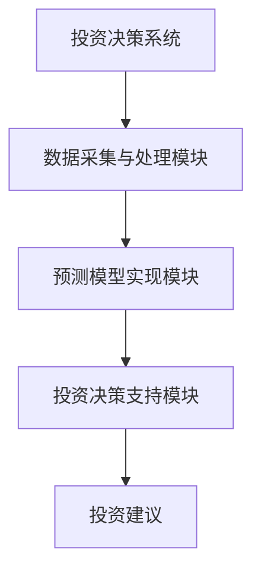

                 

好的，我将按照您的要求撰写一篇专业、技术化、逻辑清晰的博客文章。让我们先来看看文章的结构和主要内容。

# 彼得林奇的"长期增长"预测方法

## 关键词：  
- 彼得·林奇  
- 长期增长预测  
- 股票投资  
- 成长股  
- 投资策略  

## 摘要：  
本文将深入探讨彼得·林奇的"长期增长"预测方法，从理论基础、算法原理到实际应用，系统性地分析这一经典投资策略。我们将从背景介绍、核心概念、预测模型、系统架构设计到项目实战，逐步解析这一方法的核心思想和技术实现。通过本文，您将能够理解并掌握如何在实际投资中应用彼得·林奇的长期增长预测方法。

---

## 目录  

1. 彼得·林奇与长期增长投资理念  
1.1 彼得·林奇的生平与投资理念  
1.2 长期增长预测方法的背景与意义  
1.3 长期增长预测方法的适用范围与限制  

2. 长期增长预测的核心概念与框架  
2.1 长期增长预测的核心概念  
2.2 林奇的成长股投资法  
2.3 长期增长预测的框架体系  

3. 长期增长预测的算法原理  
3.1 林奇选股标准的数学模型  
3.2 长期增长预测的算法流程  
3.3 预测模型的优化与调整  

4. 长期增长预测的系统分析与架构设计  
4.1 投资决策系统的总体架构  
4.2 数据采集与处理模块  
4.3 预测模型的实现模块  
4.4 投资决策支持模块  

5. 长期增长预测的项目实战  
5.1 项目背景与目标  
5.2 数据采集与处理  
5.3 模型实现与优化  
5.4 投资决策支持与应用  

6. 长期增长预测的最佳实践与总结  
6.1 最佳实践 Tips  

---

## 1. 彼得·林奇与长期增长投资理念  

### 1.1 彼得·林奇的生平与投资理念  
彼得·林奇（Peter Lynch）是美国著名的职业基金经理，被誉为“成长股投资之父”。他在富达麦哲伦基金（Fidelity Magellen Fund）的管理中取得了辉煌的成绩，年化回报率超过29%，远超同期市场表现。  

#### 1.1.1 彼得·林奇的生平简介  
彼得·林奇于1942年出生于美国波士顿，毕业于波士顿学院，并在波士顿大学法学院获得法学学位。然而，他对投资产生了浓厚兴趣，并在职业生涯中转向金融领域，成为富达投资的明星基金经理。  

#### 1.1.2 林奇的投资哲学与核心理念  
林奇的核心投资理念是“长期投资，专注于成长股”。他认为，投资者应该选择那些具有持续增长潜力的公司，并长期持有，而不是频繁交易以追求短期收益。  

#### 1.1.3 林奇与长期增长投资方法的形成  
林奇的成功源于他对市场的深刻理解以及对成长股的精准判断。他通过分析公司的基本面、行业地位以及管理层能力，找到那些能够持续增长的企业，并长期持有这些股票。  

### 1.2 长期增长预测方法的背景与意义  
长期增长预测方法是彼得·林奇投资策略的核心。这种方法旨在通过分析企业的财务数据、行业地位和竞争优势，预测企业的未来增长潜力，并据此做出投资决策。  

#### 1.2.1 长期增长预测方法的定义  
长期增长预测方法是一种基于企业基本面分析的投资策略，旨在通过预测企业的未来盈利能力和增长潜力，选择具有长期增长潜力的股票进行投资。  

#### 1.2.2 长期增长预测方法的核心要素  
- 企业盈利增长能力  
- 行业地位与竞争优势  
- 财务健康状况  
- 管理层能力  

#### 1.2.3 长期增长预测方法在投资中的作用  
通过长期增长预测方法，投资者可以更准确地识别具有长期增长潜力的企业，从而在长期投资中获得超额收益。  

### 1.3 长期增长预测方法的适用范围与限制  

#### 1.3.1 适用的行业与企业类型  
长期增长预测方法适用于那些具有持续增长潜力的行业，如科技、消费、医疗等。同时，该方法更适合那些具有强大竞争优势和良好财务状况的企业。  

#### 1.3.2 方法的局限性与挑战  
- 市场波动性的影响  
- 管理层决策的不确定性  
- 数据的局限性  

#### 1.3.3 如何克服方法的局限性  
- 多因素分析  
- 定期调整投资组合  
- 风险管理  

---

## 2. 长期增长预测的核心概念与框架  

### 2.1 长期增长预测的核心概念  
长期增长预测的核心概念包括企业增长的驱动因素、市场地位与竞争优势、财务健康状况与盈利能力等。  

#### 2.1.1 企业增长的驱动因素  
- 市场需求  
- 行业竞争格局  
- 技术创新  

#### 2.1.2 市场地位与竞争优势  
- 市场份额  
- 产品差异化  
- 供应链优势  

#### 2.1.3 财务健康状况与盈利能力  
- 净利润增长  
- 资产负债状况  
- 现金流健康  

### 2.2 林奇的成长股投资法  
成长股投资法是彼得·林奇长期增长预测方法的核心。  

#### 2.2.1 成长股的定义与特征  
- 成长股是指那些具有持续盈利增长能力的股票。  
- 这些股票通常具有较高的市盈率，但其盈利增长率也较高。  

#### 2.2.2 成长股的投资策略  
- 选择具有持续增长潜力的公司  
- 长期持有，避免频繁交易  
- 定期调整投资组合  

#### 2.2.3 成长股与价值股的区别  
| 成长股 | 价值股 |  
|------|------|  
| 高市盈率 | 低市盈率 |  
| 高盈利增长率 | 低盈利增长率 |  
| 高风险 | 低风险 |  

### 2.3 长期增长预测的框架体系  

#### 2.3.1 预测框架的核心要素  
- 企业基本面分析  
- 行业趋势分析  
- 竞争优势分析  

#### 2.3.2 预测框架的逻辑流程  
1. 分析企业的财务数据  
2. 评估企业的行业地位  
3. 评估企业的竞争优势  
4. 预测企业的未来增长潜力  

#### 2.3.3 预测框架的实施步骤  
1. 数据收集与整理  
2. 数据分析与特征提取  
3. 模型构建与验证  
4. 投资决策  

---

## 3. 长期增长预测的算法原理  

### 3.1 林奇选股标准的数学模型  

#### 3.1.1 市盈率与盈利增长率的关系  
市盈率（P/E）= 股价 / 每股净利润  
盈利增长率 = (净利润增长 / 净利润) × 100%  

#### 3.1.2 PEG指标的计算与应用  
PEG指标 = 市盈率 / 盈利增长率  

#### 3.1.3 市场资本化率与企业规模的关系  
市场资本化率 = 市价 × 总股数  
企业规模 = 收入 / 市场资本化率  

### 3.2 长期增长预测的算法流程  

#### 3.2.1 数据收集与整理  
1. 收集企业的财务数据（收入、利润、现金流等）  
2. 收集行业的趋势数据（市场需求、竞争格局等）  

#### 3.2.2 数据分析与特征提取  
1. 计算企业的市盈率、盈利增长率等指标  
2. 评估企业的竞争优势和市场地位  

#### 3.2.3 模型构建与验证  
1. 构建PEG指标模型  
2. 验证模型的准确性与可靠性  

#### 3.2.4 结果输出与投资决策  
1. 根据模型结果筛选成长股  
2. 制定投资组合  

### 3.3 预测模型的优化与调整  

#### 3.3.1 模型参数的优化  
1. 调整PEG指标的权重  
2. 引入其他指标（如ROE、ROA等）  

#### 3.3.2 模型的验证与测试  
1. 使用历史数据验证模型  
2. 定期更新模型参数  

#### 3.3.3 模型的持续改进  
1. 根据市场变化调整模型  
2. 引入新技术与新方法  

---

## 4. 长期增长预测的系统分析与架构设计  

### 4.1 投资决策系统的总体架构  

#### 4.1.1 系统的功能模块划分  
- 数据采集与处理模块  
- 预测模型实现模块  
- 投资决策支持模块  

#### 4.1.2 系统的输入输出设计  
输入：企业财务数据、行业数据  
输出：成长股筛选结果、投资建议  

#### 4.1.3 系统的架构图展示  

### 4.2 数据采集与处理模块  

#### 4.2.1 数据来源与采集方式  
- 财务报表数据：收入、利润、现金流  
- 行业数据：市场需求、竞争格局  

#### 4.2.2 数据清洗与预处理  
1. 处理缺失值  
2. 标准化数据  

#### 4.2.3 数据存储与管理  
- 数据库存储  
- 数据可视化  

### 4.3 预测模型的实现模块  

#### 4.3.1 模型训练与参数设置  
1. 构建PEG指标模型  
2. 设置模型参数  

#### 4.3.2 模型预测与结果输出  
1. 预测成长股  
2. 输出筛选结果  

#### 4.3.3 模型的可解释性分析  
1. 解释模型结果  
2. 提供投资建议  

### 4.4 投资决策支持模块  

#### 4.4.1 决策支持的逻辑流程  
1. 数据输入  
2. 模型预测  
3. 投资建议  

#### 4.4.2 决策支持的可视化界面  
- 数据可视化  
- 投资组合展示  

#### 4.4.3 决策支持的输出报告  
- 成长股筛选报告  
- 投资策略报告  

---

## 5. 长期增长预测的项目实战  

### 5.1 项目背景与目标  
本项目旨在通过彼得·林奇的长期增长预测方法，筛选出具有长期增长潜力的股票，并制定相应的投资策略。  

### 5.2 数据采集与处理  
1. 收集目标企业的财务数据  
2. 处理数据并存储  

### 5.3 模型实现与优化  
1. 构建PEG指标模型  
2. 优化模型参数  

### 5.4 投资决策支持与应用  
1. 筛选出成长股  
2. 制定投资策略  

---

## 6. 长期增长预测的最佳实践与总结  

### 6.1 最佳实践 Tips  
- 定期调整投资组合  
- 风险管理  
- 长期持有  

---

## 作者：  
AI天才研究院/AI Genius Institute  
禅与计算机程序设计艺术 /Zen And The Art of Computer Programming

