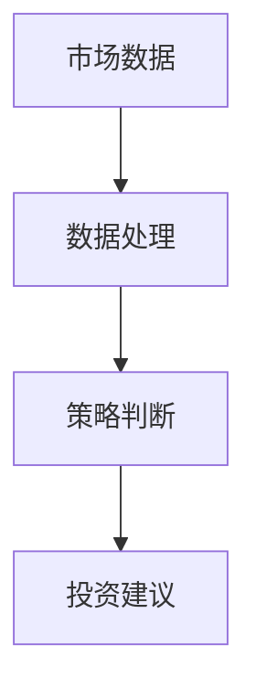

                 

# 彼得林奇的"长期持有"vs"动态调整"的决策框架

> 关键词：彼得林奇，长期持有，动态调整，投资策略，股票分析，风险管理

> 摘要：本文深入探讨了彼得林奇的两种投资策略——长期持有和动态调整，分析了它们的优缺点、适用场景以及如何结合实际案例进行投资决策。通过系统架构和项目实战，展示了如何在实际投资中应用这两种策略，并提供了最佳实践建议。

---

## 第1章：彼得林奇的投资哲学

### 1.1 彼得林奇的生平简介

彼得·林奇（Peter Lynch）是美国著名的投资专家，曾担任富达投资管理公司的基金经理，管理着规模庞大的麦哲伦基金（Fidelity Magellan）。他在任职期间取得了卓越的投资业绩，年化回报率超过29%，并多次获得“最佳基金经理”的称号。彼得林奇的成功不仅在于他的投资技巧，更在于他对市场和公司的深刻理解以及他提出的独特投资策略。

### 1.2 长期持有与动态调整的起源

彼得林奇的投资哲学以两种核心策略为基础：**长期持有**和**动态调整**。这两种策略分别适用于不同的市场环境和投资目标。

- **长期持有**：基于对公司基本面的深入分析，选择具有长期增长潜力的公司股票，并长期持有，避免频繁交易。
- **动态调整**：根据市场变化和公司业绩的波动，动态调整投资组合，优化资产配置。

### 1.3 两种策略的哲学对比

| 策略 | 核心理念 | 适用场景 | 优势 | 劣势 |
|------|----------|----------|------|------|
| 长期持有 | 价值投资，相信优质公司会持续增长 | 稳定的市场环境，公司基本面良好 | 稳定性，复利效应，交易成本低 | 市场波动影响较小，可能错过短期机会 |
| 动态调整 | 灵活应对市场变化，捕捉短期机会 | 不稳定的市场环境，公司基本面变化快 | 抗风险能力强，适应性强 | 过度交易风险，情绪化决策 |

---

## 第2章：长期持有的核心原理

### 2.1 长期持有的定义与特征

长期持有是一种基于价值投资的策略，强调选择具有持续增长潜力的公司，并在较长的时间内持有这些股票。彼得林奇认为，优质的公司能够在市场波动中保持稳定增长，而频繁的交易会增加成本并分散注意力。

### 2.2 长期持有的优势

- **稳定性**：长期持有减少了市场波动对公司投资组合的影响。
- **复利效应**：长期持有能够充分发挥复利效应，使投资收益最大化。
- **交易成本低**：避免频繁交易，降低了佣金和买卖价差等成本。

### 2.3 长期持有面临的挑战

- **市场波动**：短期市场波动可能会影响股价，但长期来看，优质公司的股价会回归其内在价值。
- **选股难度**：选择适合长期持有的股票需要对公司基本面有深刻的理解。

---

## 第3章：动态调整的核心机制

### 3.1 动态调整的定义与特点

动态调整是一种灵活的投资策略，强调根据市场变化和公司基本面的变化，及时调整投资组合。这种策略适用于市场环境不稳定或公司基本面发生变化的情况。

### 3.2 动态调整的优势

- **灵活性**：能够快速适应市场变化，捕捉短期机会。
- **抗风险能力**：在市场下跌时，及时调整投资组合，减少损失。

### 3.3 动态调整的风险

- **过度交易**：频繁的买卖操作可能增加交易成本，并可能导致决策错误。
- **情绪化决策**：投资者可能因为市场情绪的变化而做出非理性的决策。

---

## 第4章：长期持有与动态调整的对比分析

### 4.1 理论基础的差异

- **长期持有**：基于价值投资，强调公司的内在价值。
- **动态调整**：基于市场变化，强调外部环境的变化。

### 4.2 实践中的优劣势

- **长期持有**在牛市中表现优异，但在熊市中可能承受较大的回撤。
- **动态调整**在熊市中能够有效规避风险，但在牛市中可能错失部分收益。

### 4.3 理论与实践的结合

彼得林奇建议投资者根据市场环境和个人风险承受能力，灵活选择策略。例如，在市场稳定时选择长期持有，在市场波动加剧时选择动态调整。

---

## 第5章：实际投资案例分析

### 5.1 长期持有策略的经典案例

以苹果公司为例，彼得林奇认为苹果是一家具有长期增长潜力的公司。他在苹果股价较低时买入，并长期持有，最终获得了丰厚的回报。

### 5.2 动态调整策略的实际应用

在2008年金融危机期间，彼得林奇动态调整了投资组合，将部分高风险资产转换为低风险资产，从而减少了损失。

---

## 第6章：投资决策系统的构建

### 6.1 投资决策模型的设计

- **输入**：市场数据、公司基本面数据。
- **处理**：数据分析与策略判断。
- **输出**：投资建议。

### 6.2 系统架构设计

---

## 第7章：项目实战与投资策略实现

### 7.1 模拟投资案例

假设我们有100万元资金，选择长期持有和动态调整两种策略进行投资。

#### 长期持有策略：

- 选择优质股票，如苹果、谷歌等，长期持有。

#### 动态调整策略：

- 根据市场变化，动态调整投资组合，如在市场下跌时减仓，市场上涨时加仓。

### 7.2 投资结果分析

通过模拟投资，我们可以看到：

- 长期持有策略在市场稳定时表现优异。
- 动态调整策略在市场波动时能够有效规避风险。

---

## 第8章：总结与最佳实践

### 8.1 总结

彼得林奇的长期持有和动态调整策略各有优劣，投资者需要根据市场环境和个人风险承受能力，灵活选择策略。

### 8.2 最佳实践 tips

- **风险管理**：无论选择哪种策略，都需要注重风险管理。
- **心理因素**：避免情绪化决策，保持理性。
- **系统架构**：建立完善的投资决策系统，辅助投资决策。

---

## 作者

作者：AI天才研究院/AI Genius Institute & 禅与计算机程序设计艺术 /Zen And The Art of Computer Programming

---

以上是《彼得林奇的"长期持有"vs"动态调整"的决策框架》的完整目录和内容概述。

