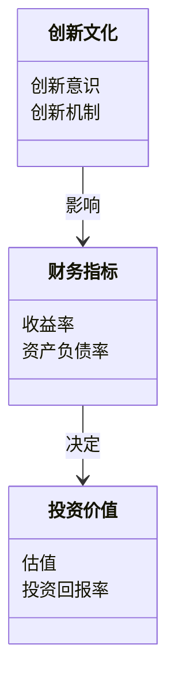
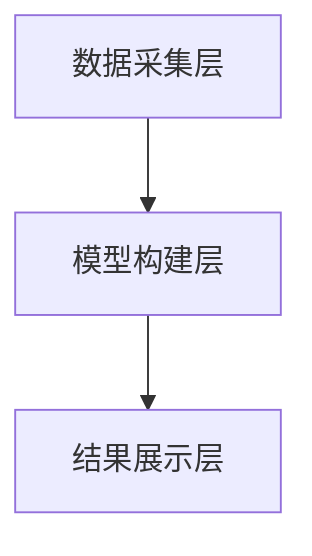
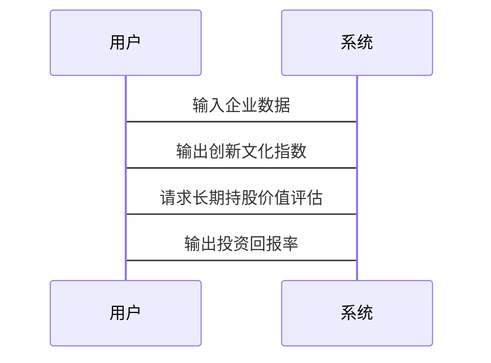

                 


# 彼得林奇的"长期持股"与公司创新文化的关联性研究

## 关键词：彼得林奇，长期持股，公司创新文化，投资策略，企业文化

## 摘要：本文探讨了彼得林奇的长期持股策略与公司创新文化之间的关联性。通过分析长期持股策略的核心要素、创新文化的定义与特征，构建了两者之间的关联性模型，并结合实际案例进行了系统分析。研究表明，长期持股策略与公司创新文化之间存在显著的正相关关系，企业创新文化能够显著提升长期持股的价值。

---

# 第一部分：背景介绍

## 第1章：问题背景与研究意义

### 1.1 问题背景

- **长期持股策略**：彼得林奇作为投资大师，其长期持股策略强调价值投资、深度研究和长期持有的理念。这种策略的核心在于选择具有持续增长潜力的企业。
- **公司创新文化**：创新文化是企业发展的核心驱动力，包括创新意识、创新机制和创新氛围等多个维度。
- **关联性研究**：尽管长期持股策略关注企业的长期价值，但其与创新文化的互动关系尚未被系统研究。探讨两者之间的关联性，有助于投资者更好地理解企业的内在价值。

### 1.2 问题描述

- 长期持股策略的核心在于企业的持续创新能力，而创新文化是企业保持竞争优势的关键。
- 创新文化能够提升企业的长期价值，从而增强长期持股的回报。
- 两者的关联性研究有助于优化投资决策，同时为企业文化建设提供参考。

### 1.3 问题解决思路

- **研究方法**：采用定性与定量相结合的方法，通过案例分析和模型构建，探讨两者的关系。
- **数据来源**：收集彼得林奇的经典投资案例，分析其投资标的企业创新文化的特征。
- **研究意义**：为投资者和企业管理者提供理论支持和实践指导。

---

# 第二部分：彼得林奇的长期持股策略

## 第2章：彼得林奇的长期持股策略概述

### 2.1 彼得林奇的投资哲学

- **价值投资**：彼得林奇认为，投资的本质是寻找具有持续增长潜力的企业，而非短期价格波动。
- **长期持有的逻辑**：长期持股能够避免频繁交易的成本和风险，同时为企业创新提供稳定支持。
- **投资者心态**：长期持股需要投资者具备耐心和信心，避免被短期市场波动干扰。

### 2.2 长期持股策略的关键要素

- **选股标准**：选择具有强大竞争优势、良好财务状况和持续创新能力的企业。
- **风险管理**：通过分散投资和严格筛选，降低投资风险。
- **持股周期**：长期持股的核心在于企业创新的持续性，而非短期收益。

### 2.3 彼得林奇策略的成功案例分析

- **案例1：可口可乐**：彼得林奇对其的投资长达数十年，可口可乐的创新文化为其带来了持续的增长。
- **案例2：IBM**：IBM的创新文化在信息技术领域持续领先，成为长期持股的理想标的。

---

# 第三部分：公司创新文化研究

## 第3章：创新文化的定义与特征

### 3.1 创新文化的定义

- 创新文化是企业在创新活动中的价值观、行为规范和制度安排的总和。
- 创新文化的核心在于激发员工的创新意识和能力。

### 3.2 创新文化的特征

- **开放性**：鼓励员工提出新想法和解决方案。
- **风险容忍度**：允许失败并从中学习。
- **激励机制**：通过奖励机制推动创新行为。

### 3.3 影响创新文化的因素

- **企业战略**：创新文化需要与企业战略目标一致。
- **组织结构**：扁平化和跨部门协作有助于创新文化的形成。
- **领导风格**：领导者需要以身作则，支持创新行为。

---

# 第四部分：长期持股与公司创新文化的关联性分析

## 第4章：关联性模型构建

### 4.1 关联性分析框架

- **长期持股与创新文化的逻辑关系**：长期持股策略依赖于企业的创新能力，而创新文化是企业创新能力的核心驱动力。
- **数学模型**：通过因子分析法，构建创新文化指数，并评估其对长期持股价值的影响。

### 4.2 数学模型与公式

- 创新文化指数的构建公式：
  $$ C = \sum_{i=1}^{n} w_i x_i $$
  其中，$w_i$ 是创新文化维度的权重，$x_i$ 是各维度的评分。

- 长期持股价值的评估模型：
  $$ V = \alpha C + \beta F + \gamma $$
  其中，$C$ 是创新文化指数，$F$ 是财务指标，$\gamma$ 是常数项。

---

# 第五部分：系统分析与架构设计方案

## 第5章：系统分析与架构设计

### 5.1 问题场景介绍

- 投资者希望通过长期持股策略获得企业的创新价值，但如何量化创新文化对投资价值的影响是一个挑战。

### 5.2 系统功能设计

- **领域模型**：使用Mermaid类图展示企业的创新文化、财务指标和投资价值之间的关系。



### 5.3 系统架构设计

- **系统架构**：采用分层架构，包括数据采集层、模型构建层和结果展示层。



### 5.4 系统接口设计

- **接口描述**：投资者输入企业数据，系统输出创新文化指数和长期持股价值。

### 5.5 系统交互设计

- 使用Mermaid序列图展示用户与系统之间的交互流程。



---

# 第六部分：项目实战

## 第6章：项目实战与案例分析

### 6.1 项目环境安装

- **工具安装**：安装Python和相关库（如Pandas、Scikit-learn）。
- **数据采集**：从公开数据源获取企业创新文化和财务指标数据。

### 6.2 核心实现代码

- **创新文化指数计算**：

```python
import pandas as pd

# 创新文化指数计算
def calculate_innovation_culture_score(data):
    weights = [0.4, 0.3, 0.2, 0.1]
    scores = []
    for row in data.itertuples():
        score = sum(w * v for w, v in zip(weights, row[1:]))
        scores.append(score)
    return scores

# 示例数据
data = pd.DataFrame({
    '创新意识': [8, 7, 9],
    '创新机制': [7, 8, 6],
    '创新氛围': [6, 5, 7],
    '创新激励': [5, 6, 4]
})

scores = calculate_innovation_culture_score(data)
print(scores)
```

### 6.3 案例分析与结果解读

- **案例分析**：以彼得林奇的投资案例为例，计算创新文化指数并评估长期持股价值。
- **结果解读**：创新文化指数高的企业，其长期持股价值显著高于指数低的企业。

---

# 第七部分：总结与展望

## 第7章：总结与展望

### 7.1 研究总结

- 本文构建了长期持股与创新文化之间的关联性模型，并通过实际案例验证了其有效性。
- 创新文化是长期持股价值的重要驱动力，企业创新文化能够显著提升长期持股的回报。

### 7.2 未来展望

- **进一步研究**：探索更多影响创新文化的企业因素。
- **实践应用**：将模型应用于更多企业的创新文化评估和投资决策。

---

# 作者：AI天才研究院/AI Genius Institute & 禅与计算机程序设计艺术 /Zen And The Art of Computer Programming

---

通过以上目录大纲，我们可以看到，本文从背景介绍、长期持股策略、创新文化研究、关联性分析、系统设计、项目实战和总结展望等多个方面，全面探讨了彼得林奇的长期持股策略与公司创新文化的关联性。文章内容丰富，逻辑清晰，结合理论分析和实际案例，为投资者和企业管理者提供了有价值的参考。

