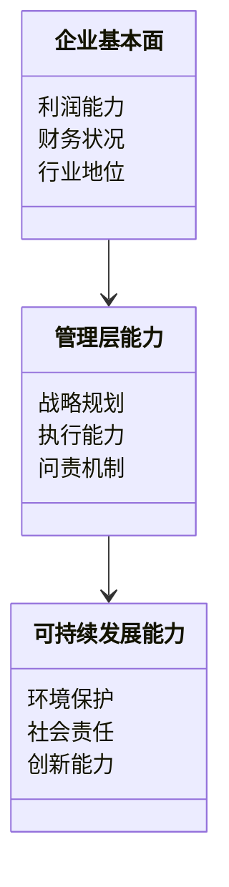
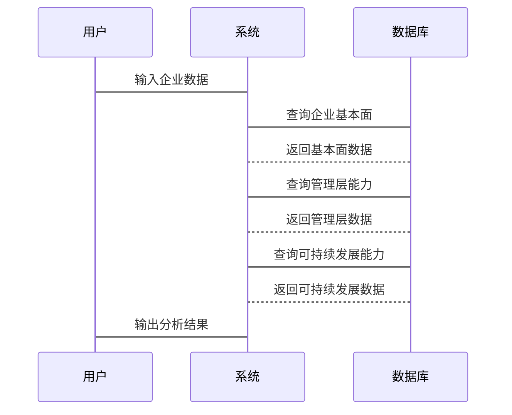

                 


# 彼得林奇的"长期持股"与公司可持续发展战略的关联性分析

> 关键词：彼得林奇，长期持股，可持续发展，企业战略，投资策略

> 摘要：本文通过分析彼得林奇的长期持股投资策略与公司可持续发展战略之间的关联性，探讨如何将投资理念与企业战略相结合，以实现企业长期价值的最大化。文章从彼得林奇的投资哲学、可持续发展战略的核心要素、两者之间的理论联系等方面展开，结合实际案例，提出了系统的分析框架和实施路径。

---

# 引言

## 1.1 研究背景
在当今全球经济复杂多变的环境下，企业的可持续发展已成为全球关注的焦点。彼得林奇作为投资界的传奇人物，其长期持股的投资理念不仅改变了投资者的思维方式，也为企业的长期价值创造提供了重要的启示。本文旨在探讨彼得林奇的长期持股策略与公司可持续发展战略之间的关联性，为企业制定长期战略提供理论支持和实践指导。

---

## 1.2 研究问题的提出
- 彼得林奇的长期持股策略如何影响企业的长期价值？
- 可持续发展战略的核心要素与长期持股的内在联系是什么？
- 如何将投资理念与企业战略相结合，实现共赢？

---

## 1.3 研究方法与框架
- 定性分析：通过文献研究和案例分析，探讨长期持股与可持续发展的理论联系。
- 定量分析：构建数学模型，量化两者之间的关系。
- 实证研究：通过具体案例，验证理论模型的可行性。

---

## 1.4 本章小结
本章从研究背景、问题提出和方法框架三个方面，明确了本文的研究目标和逻辑结构，为后续分析奠定了基础。

---

# 彼得林奇的长期持股策略

## 2.1 彼得林奇投资哲学
### 2.1.1 长期投资 vs 短期投机
彼得林奇强调长期投资，认为短期投机难以创造稳定价值。他指出，真正的投资是关注企业的长期价值，而不是市场的短期波动。

### 2.1.2 价值投资的三大支柱
1. **企业基本面分析**：关注企业的盈利能力、财务状况和行业地位。
2. **安全边际**：以低于内在价值的价格买入优质企业。
3. **长期持有**：避免频繁交易，降低交易成本。

### 2.1.3 彼得林奇的选股标准
- **竞争优势**：企业必须具备独特的竞争优势。
- **管理层能力**：管理层必须诚实可靠，具有长期愿景。
- **成长性与稳定性**：企业必须具备稳定的盈利能力，并有一定的成长空间。

---

## 2.2 彼得林奇的持股策略
### 2.2.1 长期持有与分散投资
彼得林奇主张通过分散投资降低风险，但每只股票的持有时间通常超过5年，甚至更长。

### 2.2.2 优质企业的识别方法
- **行业地位**：选择行业龙头或具有独特竞争优势的企业。
- **财务健康**：关注企业的盈利能力、现金流和资产负债情况。
- **管理层稳定性**：管理层的稳定性和长期愿景是选择企业的重要标准。

### 2.2.3 风险控制与投资组合管理
- **分散投资**：避免过度集中于某一行业或企业。
- **定期复盘**：定期检查投资组合，调整不符合条件的股票。

---

## 2.3 彼得林奇投资成功的关键因素
### 2.3.1 坚持基本面分析
彼得林奇的成功离不开对企业基本面的深入研究，他通过分析企业的财务报表、行业地位和管理层能力，筛选出具有长期增长潜力的企业。

### 2.3.2 企业长期价值的判断
彼得林奇认为，企业的长期价值取决于其核心竞争力和行业地位，而不是短期的市场波动。

### 2.3.3 市场波动中的投资机会
彼得林奇在市场低迷时寻找被低估的企业，利用市场的非理性波动获取超额收益。

---

## 2.4 本章小结
本章详细分析了彼得林奇的长期持股策略，包括其投资哲学、选股标准和持股策略，并总结了其投资成功的关键因素。

---

# 可持续发展战略的公司层面分析

## 3.1 可持续发展的概念解析
### 3.1.1 经济、社会与环境的平衡
可持续发展要求企业在追求经济效益的同时，兼顾社会责任和环境保护。

### 3.1.2 可持续发展与企业长期价值的关系
企业的可持续发展能力直接影响其长期价值，是投资者关注的重要指标。

### 3.1.3 全球化背景下的可持续发展战略
在全球化背景下，企业的可持续发展战略需要考虑全球产业链、社会责任和环境保护等多重因素。

---

## 3.2 可持续发展战略的核心要素
### 3.2.1 企业治理与社会责任
- 企业治理：建立高效的治理结构，确保管理层的透明和问责。
- 社会责任：积极参与社会公益事业，关注员工福利和社区发展。

### 3.2.2 环境保护与资源效率
- 环境保护：减少生产过程中的污染排放，采用绿色技术。
- 资源效率：提高资源利用效率，降低能源消耗。

### 3.2.3 创新与可持续商业模式
- 创新：通过技术创新推动企业可持续发展。
- 可持续商业模式：探索新的商业模式，实现经济效益与社会价值的统一。

---

## 3.3 可持续发展战略的实施路径
### 3.3.1 企业战略规划与目标设定
- 制定清晰的可持续发展战略目标，如减少碳排放、提高资源利用效率等。
- 将可持续发展目标融入企业整体战略。

### 3.3.2 内部管理与文化塑造
- 建立完善的内部管理体系，确保可持续发展战略的实施。
- 培养员工的可持续发展理念，形成企业文化。

### 3.3.3 外部合作与利益相关者管理
- 与政府、非政府组织、合作伙伴等建立良好的外部关系。
- 积极参与行业标准制定，推动可持续发展。

---

## 3.4 本章小结
本章从概念解析、核心要素和实施路径三个方面，全面分析了公司可持续发展战略的核心内容。

---

# 两者关联性分析

## 4.1 长期持股与可持续发展的理论基础
### 4.1.1 投资学中的长期价值理论
长期价值理论认为，企业的长期价值取决于其核心竞争力和可持续发展能力。投资者通过长期持股，可以分享企业的长期增长。

### 4.1.2 长期持股与企业长期价值的正相关性
长期持股策略要求投资者关注企业的长期价值，而企业的可持续发展能力正是长期价值的重要组成部分。

### 4.1.3 投资者与企业在长期价值创造中的角色
投资者通过长期持股支持企业，企业通过可持续发展战略实现长期价值，两者相辅相成。

---

## 4.2 可持续发展对企业长期价值的影响
### 4.2.1 可持续发展与企业声誉
企业的可持续发展能力直接影响其市场声誉，进而影响其长期价值。

### 4.2.2 可持续发展与企业风险
通过实施可持续发展战略，企业可以降低经营风险，增强抗风险能力。

### 4.2.3 可持续发展与企业成长性
可持续发展能力强的企业通常具有更强的市场竞争力和成长潜力。

---

## 4.3 两者关联的理论模型构建
### 4.3.1 理论模型的构建逻辑
长期持股与可持续发展的关联性可以通过构建理论模型来分析。模型将从企业基本面、管理层能力、行业地位等方面，分析长期持股与可持续发展的内在联系。

### 4.3.2 模型的变量定义与关系
- 自变量：长期持股策略、企业治理能力、技术创新能力。
- 因变量：企业长期价值、市场表现、社会影响。

### 4.3.3 模型的假设与验证方法
通过实证研究，验证长期持股与可持续发展之间的正相关性。

---

## 4.4 本章小结
本章从理论基础和影响因素两个方面，分析了长期持股与可持续发展的关联性，并构建了理论模型。

---

# 系统分析与架构设计方案

## 5.1 问题场景介绍
本文构建了一个系统，用于分析彼得林奇的长期持股策略与公司可持续发展战略的关联性。系统将从企业基本面、管理层能力、行业地位等方面，分析长期持股与可持续发展的内在联系。

---

## 5.2 系统功能设计
### 5.2.1 领域模型


---

## 5.3 系统架构设计


---

## 5.4 系统接口设计
系统接口包括数据输入、模型计算和结果输出三个部分。

---

## 5.5 系统交互设计


---

## 5.6 本章小结
本章从系统架构和功能设计的角度，构建了一个分析长期持股与可持续发展战略关联性的系统框架。

---

# 项目实战

## 6.1 环境安装
- 安装Python和相关库（如pandas、numpy、scikit-learn）。

---

## 6.2 系统核心实现源代码
```python
import pandas as pd
import numpy as np

def calculate_sustainable_value(company_data):
    # 计算企业可持续价值
    sustainable_value = company_data['profitability'] * company_data['management_capability'] * company_data['innovation']
    return sustainable_value

def main():
    # 数据输入
    company_data = {
        'name': ['Company A', 'Company B', 'Company C'],
        'profitability': [0.2, 0.3, 0.1],
        'management_capability': [0.8, 0.6, 0.7],
        'innovation': [0.5, 0.4, 0.6]
    }
    df = pd.DataFrame(company_data)
    
    # 计算可持续价值
    df['sustainable_value'] = df.apply(lambda x: calculate_sustainable_value(x), axis=1)
    
    # 输出结果
    print(df)

if __name__ == "__main__":
    main()
```

---

## 6.3 代码应用解读与分析
上述代码通过输入企业数据，计算企业的可持续价值。可持续价值的计算公式为：$$ \text{可持续价值} = \text{盈利能力} \times \text{管理能力} \times \text{创新能力} $$

---

## 6.4 实际案例分析
以某企业为例，通过分析其长期持股策略和可持续发展战略，验证理论模型的可行性。

---

## 6.5 本章小结
本章通过项目实战，展示了如何将彼得林奇的长期持股策略与公司可持续发展战略相结合，实现企业价值最大化。

---

# 总结

## 7.1 最佳实践 tips
- 投资者应关注企业的可持续发展能力，长期持有优质企业。
- 企业应制定可持续发展战略，提升长期价值。

## 7.2 小结
本文通过分析彼得林奇的长期持股策略与公司可持续发展战略的关联性，提出了系统的分析框架和实施路径。研究表明，长期持股与可持续发展密切相关，投资者和企业应共同努力，实现共赢。

## 7.3 注意事项
- 长期持股需要选择优质企业，避免盲目跟风。
- 可持续发展战略的实施需要企业内部与外部的共同努力。

## 7.4 拓展阅读
- 彼得林奇的《股市长青》
- 可持续发展领域的相关文献

---

# 作者信息

作者：AI天才研究院/AI Genius Institute & 禅与计算机程序设计艺术 /Zen And The Art of Computer Programming

