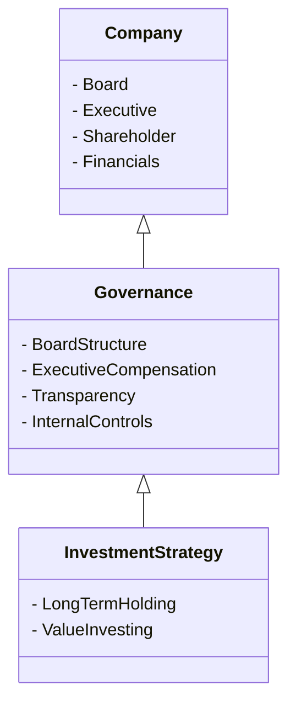

                 


# 彼得林奇的"长期持股"与公司治理改善的关系

## 关键词：彼得林奇，长期持股，公司治理，投资策略，股东价值

## 摘要：
本文探讨了彼得林奇的长期持股策略与公司治理改善之间的关系。通过分析长期持股的定义、公司治理的核心要素，以及两者之间的相互作用，本文揭示了如何通过改善公司治理来实现长期投资价值的最大化。文章结合数学模型和实际案例，详细阐述了长期持股策略对投资回报的影响，并提出了在投资实践中如何将公司治理改善纳入考虑的建议。

---

## 第一章: 长期持股策略的定义与核心要素

### 1.1 长期持股策略的定义
#### 1.1.1 长期持股的定义与特点
长期持股是一种投资策略，强调投资者在较长的时间内持有优质资产，以获得资本增值和分红收益。其特点是：
- **长期性**：投资期限通常超过3年，注重资产的长期表现。
- **稳定性**：避免频繁交易，降低交易成本和税务负担。
- **价值导向**：关注企业的内在价值，而非短期市场波动。

#### 1.1.2 长期持股与短期投资的区别
| 方面       | 长期持股                | 短期投资                |
|------------|-------------------------|-------------------------|
| 目标       | 资本增值与分红收益      | 短期价差收益            |
| 持股期限   | 超过3年                 | 几周到几个月             |
| 风险承受   | 较低                   | 较高                   |
| 交易频率   | 低                     | 高                     |

#### 1.1.3 长期持股在投资组合中的地位
长期持股是构建稳健投资组合的核心策略，尤其适合厌恶风险的投资者。它通过分散投资和时间的复利效应，降低市场波动对整体收益的影响。

---

### 1.2 公司治理的核心要素
#### 1.2.1 公司治理的基本概念
公司治理是确保企业有效运作、保护股东权益、实现可持续发展的制度安排。它涉及董事会结构、高管薪酬、信息披露等多个方面。

#### 1.2.2 公司治理的四大核心要素
1. **董事会结构**：董事会的独立性、专业性和多样性。
2. **高管激励机制**：将管理层利益与股东利益绑定。
3. **透明度与信息披露**：确保信息的公开、准确和及时。
4. **内部控制与风险管理**：建立有效的风险控制体系。

#### 1.2.3 公司治理与企业绩效的关系
良好的公司治理能够提升企业绩效，具体表现为：
- 提高管理效率。
- 降低代理成本。
- 增强投资者信心。
- 促进企业长期发展。

---

## 第二章: 彼得林奇投资理念的核心思想

### 2.1 彼得林奇的投资哲学
#### 2.1.1 长期价值投资的核心理念
彼得林奇强调“买得好，而不是卖得好”。他主张选择具有强大竞争优势、良好管理团队和稳定财务状况的企业进行投资。

#### 2.1.2 投资中的“烟蒂”策略
彼得林奇以其独特的“烟蒂”策略闻名，即寻找被市场低估的优质企业进行投资。这种策略强调对企业基本面的深入研究。

#### 2.1.3 投资者心态与决策逻辑
彼得林奇认为，投资者应避免情绪化决策，注重理性分析。他强调长期持有优质资产，避免频繁交易。

---

### 2.2 彼得林奇的选股标准
#### 2.2.1 选股的三大标准
1. **强大的竞争优势**：企业应具有独特的竞争优势，如技术壁垒、品牌影响力等。
2. **良好的财务状况**：关注企业的盈利能力、资产负债表和现金流情况。
3. **优秀的管理团队**：管理层应具备诚信、专业和责任感。

#### 2.2.2 企业基本面分析的重要性
彼得林奇注重对企业基本面的深入分析，包括：
- **收入与利润**：企业的收入和利润是否稳定增长。
- **资产负债表**：企业的资产、负债和所有者权益结构是否健康。
- **现金流**：企业是否有稳定的现金流来源。

#### 2.2.3 行业分析与竞争优势评估
彼得林奇认为，选择具有成长潜力的行业和企业在长期持股中至关重要。他强调关注行业趋势和企业的竞争优势。

---

### 2.3 彼得林奇与公司治理改善的结合
#### 2.3.1 长期持股对治理结构的影响
长期持股能够推动公司治理的改善，具体表现为：
- **增强董事会独立性**：长期股东通常要求董事会更具独立性，以避免管理层滥用职权。
- **推动透明化**：长期股东关注企业的信息披露，要求企业提高透明度。
- **改善管理层激励**：长期持股的股东通常要求管理层的激励机制与企业绩效挂钩。

#### 2.3.2 公司治理改善对长期持股的价值
良好的公司治理能够增强投资者信心，具体表现为：
- **提高企业稳定性**：良好的治理结构能够降低企业经营风险。
- **增强分红能力**：公司治理改善通常伴随着更高的分红比例。
- **提升股价表现**：良好的治理结构通常会带来股价的长期稳定增长。

#### 2.3.3 两者关系的理论框架
通过长期持股，投资者能够影响企业的治理结构，从而实现企业价值的最大化。这种互动关系构成了长期持股与公司治理改善的理论基础。

---

## 第三章: 长期持股策略的数学模型与公式

### 3.1 长期持股的回报计算公式
#### 3.1.1 复利计算公式
$$
FV = P \times (1 + r)^n
$$
其中：
- \( FV \)：终值
- \( P \)：本金
- \( r \)：年化收益率
- \( n \)：投资年数

#### 3.1.2 投资回报率计算
$$
\text{投资回报率} = \frac{\text{资本增值} + \text{分红}}{\text{初始投资}} \times 100\%
$$

---

## 第四章: 系统分析与架构设计方案

### 4.1 问题场景介绍
长期持股与公司治理改善的关系可以通过系统化的分析来理解。我们可以通过构建一个公司治理评估系统，来分析长期持股对治理结构的影响。

### 4.2 项目介绍
本项目旨在通过分析公司治理结构，评估长期持股策略对治理改善的推动作用。

### 4.3 系统功能设计
#### 4.3.1 领域模型


#### 4.3.2 系统架构设计


---

## 第五章: 项目实战

### 5.1 环境安装
为了进行公司治理分析，我们需要以下工具：
- 数据库：MySQL 或 PostgreSQL
- 分析工具：Python（Pandas, NumPy）
- 可视化工具：Matplotlib 或 Seaborn

### 5.2 核心实现源代码
以下是一个Python脚本，用于分析公司的治理结构和长期持股的可行性：
```python
import pandas as pd
import numpy as np

# 数据库连接
db_config = {
    'host': 'localhost',
    'user': 'root',
    'password': 'password',
    'database': 'company_governance'
}

# 加载数据
df = pd.read_sql('SELECT * FROM company_data', db_config)

# 计算ROE（净资产收益率）
df['ROE'] = df['Net Income'] / df['Average Equity']

# 找出ROE最高的公司
top_company = df.sort_values('ROE', ascending=False).head()

print("Top companies by ROE:")
print(top_company[['Company Name', 'ROE']])
```

---

## 第六章: 最佳实践与小结

### 6.1 最佳实践 tips
1. **长期持股需要耐心**：投资者应避免频繁交易，耐心持有优质资产。
2. **关注公司治理**：在选择投资标的时，应关注企业的治理结构。
3. **分散投资**：通过分散投资降低风险。

### 6.2 小结
彼得林奇的长期持股策略与公司治理改善密切相关。通过改善治理结构，投资者能够实现长期价值的最大化。本文通过理论分析和实际案例，揭示了两者之间的关系，并提出了在投资实践中如何将公司治理改善纳入考虑的建议。

### 6.3 注意事项
- 投资者应避免情绪化决策，注重理性分析。
- 长期持股需要耐心和信心，避免短期波动的干扰。
- 在选择投资标的时，应综合考虑企业的财务状况、治理结构和行业前景。

### 6.4 拓展阅读
1. 彼得林奇的《投资之道》
2. 《公司治理与企业绩效》
3. 《价值投资实战》

---

## 作者：AI天才研究院/AI Genius Institute & 禅与计算机程序设计艺术 /Zen And The Art of Computer Programming

---

以上是关于《彼得林奇的"长期持股"与公司治理改善的关系》的技术博客文章。

