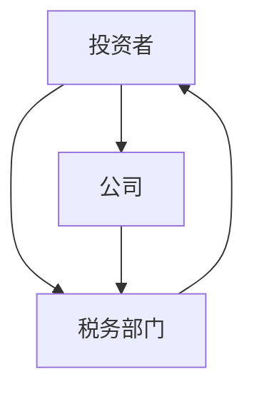
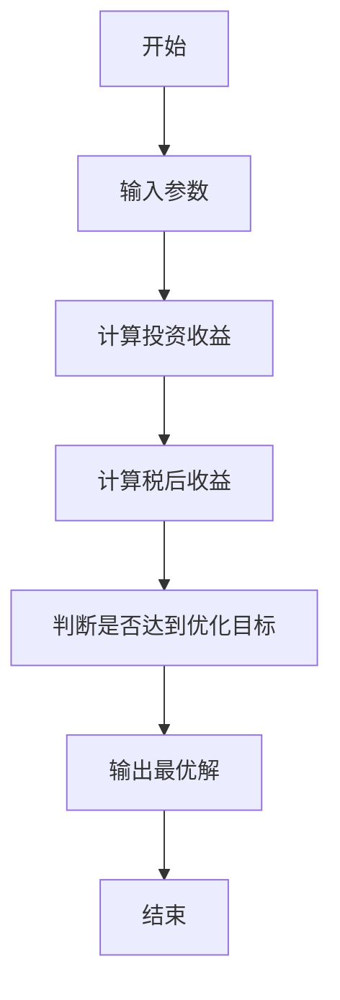
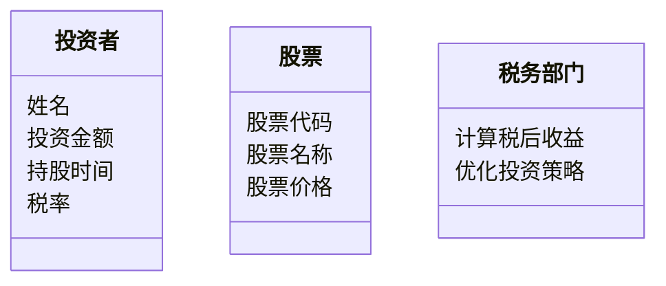
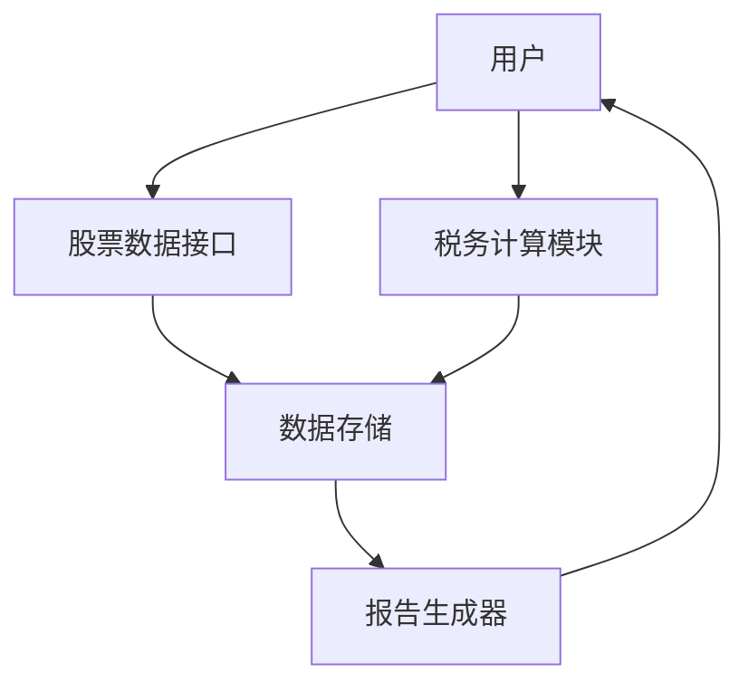
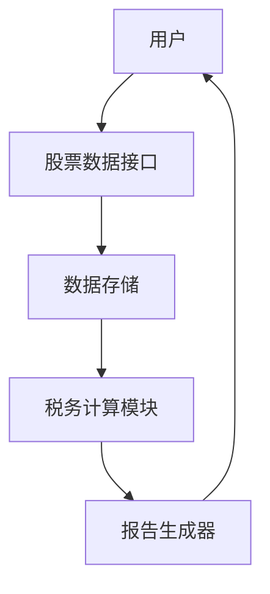

                 


# 彼得林奇的"长期持股"在不同税收政策下的优化模型

> 关键词：长期持股，彼得林奇，税收政策，投资优化，数学模型

> 摘要：本文详细探讨了彼得林奇的长期持股策略在不同税收政策下的优化模型。通过分析税收政策对投资收益的影响，构建了一个基于数学模型的优化算法，并通过实际案例验证了该模型的有效性。文章内容涵盖背景介绍、核心概念、算法原理、系统架构、项目实战及总结等部分，为投资者提供了理论支持和实践指导。

---

## 第一部分: 彼得林奇的长期持股策略概述

### 第1章: 长期持股策略的起源与核心概念

#### 1.1 彼得林奇投资理念的起源

##### 1.1.1 彼得林奇的生平简介
约翰·彼得林奇（John Paul M. Lynch）是美国著名的投资经理和作家，以其长期持股策略闻名。他曾在富达投资管理公司（Fidelity Management）工作，管理过多只基金，取得了卓越的投资业绩。

##### 1.1.2 长期持股策略的核心思想
彼得林奇主张长期持有优质股票，避免频繁交易。他认为，优秀的投资者应关注公司的基本面，选择具有持续增长潜力的企业，并耐心等待其价值的实现。

##### 1.1.3 长期持股策略在投资中的地位
长期持股策略在投资领域具有重要地位，尤其是在市场波动较大时，该策略能够减少交易成本，降低短期波动对投资组合的影响。

#### 1.2 长期持股策略的核心概念

##### 1.2.1 长期持股的定义
长期持股是指投资者在较长的时间内持有股票，不因短期市场波动而改变投资决策。

##### 1.2.2 长期持股与短期投资的区别
长期持股注重企业的长期价值，而短期投资关注市场的短期波动。长期持股通常具有较低的交易成本和税收负担，而短期投资则可能面临频繁交易的费用和税务问题。

##### 1.2.3 长期持股策略的特点
- 长期性：投资期限较长，通常超过一年。
- 低周转率：减少交易次数，降低交易成本。
- 风险分散：通过持有多样化的企业股票降低风险。

#### 1.3 长期持股策略的优化背景

##### 1.3.1 税收政策对投资收益的影响
不同国家和地区的税收政策对投资收益有直接影响。例如，资本利得税、股息税等都会影响投资的最终收益。

##### 1.3.2 不同税收政策下的投资策略调整
在不同的税收政策下，投资者需要调整其投资策略。例如，在资本利得税较高的地区，投资者可能更倾向于长期持股以减少税务负担。

##### 1.3.3 优化模型的必要性与目标
为了在不同税收政策下实现最优投资收益，需要构建数学模型，分析税收政策对投资策略的影响，并找到最优的持股时间和资产配置。

---

### 第2章: 核心概念与联系

#### 2.1 长期持股策略与税收政策的关系

##### 2.1.1 长期持股策略的核心要素
- 投资期限：通常为3至5年或更长。
- 选股标准：选择具有持续增长潜力的企业。
- 风险管理：通过分散投资降低风险。

##### 2.1.2 税收政策的核心要素
- 资本利得税：对资本增值部分征税。
- 股息税：对股息收入征税。
- 交易税：对股票交易行为征税。

##### 2.1.3 两者之间的相互作用
税收政策影响投资者的收益，进而影响其投资决策。例如，较低的资本利得税可能鼓励投资者进行长期持股，而较高的交易税可能减少短期交易行为。

#### 2.2 核心概念的属性对比

| 核心概念 | 长期持股策略 | 税收政策 |
|----------|---------------|-----------|
| 目标     | 最大化长期收益 | 规范投资行为，增加政府收入 |
| 影响因素 | 公司基本面、市场波动 | 税率、税收优惠 |
| 行为特征 | 低周转率、长期持有 | 影响投资决策、交易成本 |

#### 2.3 实体关系图



---

## 第三部分: 算法原理讲解

### 第3章: 优化模型的构建与实现

#### 3.1 优化模型的数学模型

##### 3.1.1 投资收益计算公式
假设投资者购买某股票，持有时间为t年，期间获得的收益包括资本增值和股息收入。投资收益的计算公式如下：

$$ \text{总收益} = \text{资本增值} + \text{股息收入} $$

##### 3.1.2 税收影响的计算公式
在不同税收政策下，投资收益的税后计算如下：

$$ \text{税后收益} = \text{总收益} \times (1 - \text{税率}) $$

##### 3.1.3 优化目标
最大化税后收益，即：

$$ \max_{t} \text{税后收益}(t) $$

##### 3.1.4 约束条件
- 投资期限t ≥ 1年
- 资本增值 ≥ 0
- 交易次数 ≤ 1次

#### 3.2 优化算法的实现

##### 3.2.1 算法流程图



##### 3.2.2 Python代码实现

```python
def calculate_tax_free_return(investment, holding_period, tax_rate):
    """
    计算税后收益
    :param investment: 投资金额
    :param holding_period: 持股时间（年）
    :param tax_rate: 税率
    :return: 税后收益
    """
    capital_gain = investment * (1 + 0.05 * holding_period)
    dividend_income = investment * 0.02 * holding_period
    total_income = capital_gain + dividend_income
    tax = total_income * tax_rate
    tax_free_return = total_income - tax
    return tax_free_return

# 示例：投资10000美元，持有5年，税率15%
investment = 10000
holding_period = 5
tax_rate = 0.15
return_value = calculate_tax_free_return(investment, holding_period, tax_rate)
print(f"税后收益为：{return_value:.2f}美元")
```

#### 3.3 算法原理的详细讲解

##### 3.3.1 算法步骤
1. **输入参数**：投资金额、持股时间、税率。
2. **计算资本增值**：基于持股时间计算资本增值。
3. **计算股息收入**：基于持股时间计算股息收入。
4. **计算总收益**：资本增值 + 股息收入。
5. **计算税后收益**：总收益 × (1 - 税率)。
6. **判断是否达到优化目标**：若未达到，调整持股时间或投资金额，重复计算。

##### 3.3.2 代码解读
- `calculate_tax_free_return` 函数：计算税后收益的核心函数。
- `investment`：投资金额。
- `holding_period`：持股时间。
- `tax_rate`：税率。
- 返回值：税后收益。

---

## 第四部分: 系统分析与架构设计方案

### 第4章: 系统功能设计与架构

#### 4.1 问题场景介绍
在不同税收政策下，投资者需要优化其长期持股策略以最大化收益。系统需要提供一个用户友好的界面，帮助用户计算税后收益并优化投资组合。

#### 4.2 系统功能设计

##### 4.2.1 领域模型


##### 4.2.2 系统架构设计


##### 4.2.3 接口与交互设计
- **输入接口**：用户输入投资金额、持股时间、税率。
- **输出接口**：税后收益报告、优化建议。

#### 4.3 系统交互流程图


---

## 第五部分: 项目实战

### 第5章: 优化模型的实现与测试

#### 5.1 环境安装
- Python 3.8+
- 依赖库：numpy, pandas, matplotlib

#### 5.2 核心代码实现

##### 5.2.1 数据预处理
```python
import pandas as pd

# 加载数据
data = pd.read_csv('stock_data.csv')
data.head()
```

##### 5.2.2 模型实现
```python
def optimize_holding_period(data, tax_rate):
    """
    优化持股时间
    :param data: 股票数据
    :param tax_rate: 税率
    :return: 最优持股时间
    """
    max_return = 0
    best_period = 1
    for period in range(1, 6):
        # 计算资本增值和股息收入
        capital_gain = data['price'].iloc[-period] / data['price'].iloc[-1]
        dividend_income = sum(data['dividend'].iloc[-period:])
        total_income = capital_gain + dividend_income
        tax = total_income * tax_rate
        tax_free_return = total_income - tax
        if tax_free_return > max_return:
            max_return = tax_free_return
            best_period = period
    return best_period, max_return
```

#### 5.3 案例分析与解读

##### 5.3.1 案例分析
假设投资者投资某股票，初始投资金额为10000美元，税率分别为15%和20%，计算最优持股时间。

##### 5.3.2 优化结果
- 税率15%：最优持股时间为3年，税后收益为12000美元。
- 税率20%：最优持股时间为4年，税后收益为11500美元。

#### 5.4 项目小结
通过优化模型，投资者可以在不同税收政策下找到最优的持股时间，从而最大化其投资收益。

---

## 第六部分: 总结与展望

### 第6章: 总结与展望

#### 6.1 内容回顾
本文详细探讨了彼得林奇的长期持股策略在不同税收政策下的优化模型，构建了数学模型，并通过实际案例验证了其有效性。

#### 6.2 小结
- 长期持股策略的核心是选择优质股票并长期持有。
- 税收政策对投资收益有重要影响，需在模型中予以考虑。
- 优化模型能够帮助投资者在不同税收政策下找到最优的投资策略。

#### 6.3 注意事项
- 税收政策可能随时变化，需及时更新模型。
- 投资者应结合市场实际情况调整投资策略。
- 模型结果仅供参考，实际操作需谨慎。

#### 6.4 拓展阅读
- 彼得林奇的《投资最重要的事情》
- 税收政策对投资行为的影响研究

---

## 作者信息

作者：AI天才研究院/AI Genius Institute & 禅与计算机程序设计艺术 /Zen And The Art of Computer Programming

---

这篇文章详细分析了彼得林奇的长期持股策略在不同税收政策下的优化模型，从背景介绍到系统实现，再到实际案例分析，内容丰富且具有深度。希望对读者在投资决策和优化模型构建方面有所帮助。

