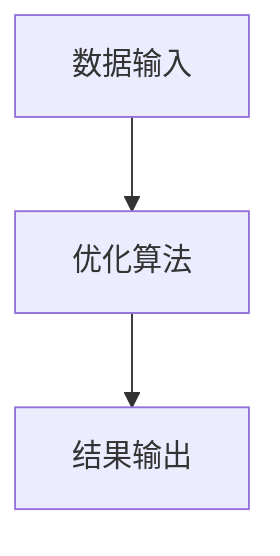

                 


---

# 彼得林奇的"长期持股"在不同税收环境下的投资组合优化模型

> **关键词**：投资组合优化、彼得林奇、长期持股、税收环境、投资策略、数学模型  
> **摘要**：本文探讨了彼得林奇的长期持股策略在不同税收环境下的优化模型，通过数学建模和算法分析，结合投资组合优化理论，提出了一种在不同税收政策下实现收益最大化的投资组合优化方法。文章详细分析了税收环境对投资决策的影响，构建了优化模型，并通过实例验证了模型的有效性。

---

## 第一部分：长期持股策略的背景与基础

### 第1章：长期持股策略的定义与特点

#### 1.1 长期持股的定义与特点

彼得林奇是美国著名投资经理人，他倡导的长期持股策略是指投资者在选择股票后，长期持有优质股票，等待其价值增长的策略。这种方法的核心在于避免频繁交易带来的交易成本和市场波动风险，专注于优质企业的长期价值增长。

- **长期持股的特点**：
  - 长期性：投资期限较长，通常超过一年。
  - 选择性：精选优质企业，关注基本面。
  - 耐心性：等待企业的价值增长，不因短期波动而改变策略。

#### 1.2 彼得林奇投资理念的核心要素

彼得林奇的投资理念不仅限于长期持股，还包括对企业基本面的深入分析和对市场情绪的理性判断。

- **核心要素**：
  - 企业基本面分析：关注企业的财务状况、盈利能力、行业地位。
  - 市场情绪分析：避免市场恐慌或狂热情绪的干扰。
  - 长期价值导向：相信优质企业的长期增长潜力。

### 第2章：税收环境对投资组合的影响

#### 2.1 税收环境的定义与分类

税收环境是指不同国家或地区对投资收益征税的政策和税率。常见的税收环境包括：

- **资本利得税**：对股票买卖的收益征税。
- **股息税**：对股票分红收益征税。
- **遗产税**：对遗产中包含的股票资产征税。

#### 2.2 投资组合中的税务优化原则

在不同税收环境下，投资组合的优化需要考虑税务因素，以最大化收益。

- **税务优化原则**：
  - 税后收益最大化：在考虑税后收益的基础上选择最优投资组合。
  - 税收递延：利用税收递延政策降低当前税负。
  - 税收风险与收益平衡：在税务优化中平衡风险和收益。

---

## 第二部分：投资组合优化模型的构建

### 第3章：长期持股策略在不同税收环境下的优化模型

#### 3.1 投资组合优化模型的构建

在不同税收环境下，投资组合的优化需要结合长期持股策略和税务优化原则。

- **模型构建步骤**：
  1. 确定投资组合的构成：选择优质企业股票。
  2. 设定税收环境：明确资本利得税、股息税等税率。
  3. 建立优化目标：最大化税后收益。
  4. 设定约束条件：如投资期限、风险承受能力等。

#### 3.2 税收环境下的投资组合优化算法

为了实现投资组合的优化，我们需要设计高效的优化算法。

- **遗传算法的应用**：
  - 初始化：生成随机的股票组合。
  - 适应度计算：计算每个组合的税后收益。
  - 选择与交叉：保留高适应度的组合，并进行交叉。
  - 变异：随机改变部分组合的股票构成。
  - 迭代：重复上述步骤，直到达到收敛条件。

- **算法流程图**（使用 Mermaid）：
  ```mermaid
  graph TD
      A[开始] --> B[初始化种群]
      B --> C[计算适应度]
      C --> D[选择与交叉]
      D --> E[变异]
      E --> F[判断是否收敛]
      F -->|否| B
      F -->|是| G[输出最优解]
  ```

### 第4章：数学模型与公式解析

#### 4.1 投资组合优化的数学模型

投资组合优化的目标是最大化税后收益，数学模型如下：

$$ \max \sum_{i=1}^n w_i r_i (1 - t_i) $$

其中，$w_i$ 是股票 $i$ 的权重，$r_i$ 是股票 $i$ 的预期收益率，$t_i$ 是股票 $i$ 的税率。

#### 4.2 税收影响的数学公式

资本利得税的计算公式为：

$$ \text{税后收益} = \text{收益} \times (1 - t) $$

其中，$t$ 是资本利得税率。

---

## 第三部分：系统架构与实现方案

### 第5章：系统架构设计

#### 5.1 功能模块划分

- **数据输入模块**：接收股票数据和税收政策。
- **优化算法模块**：实现遗传算法优化。
- **结果输出模块**：输出最优投资组合。

#### 5.2 系统架构图



### 第6章：项目实战与案例分析

#### 6.1 实验环境与数据准备

- **环境**：Python 3.8 +，安装必要的库如 numpy、pandas、scipy。
- **数据**：获取美国和中国的股票数据及税收政策。

#### 6.2 核心代码实现

以下是投资组合优化算法的 Python 实现：

```python
import numpy as np
import random

def calculate_tax收益(收益, 税率):
    return 收益 * (1 - 税率)

def 优化算法(股票列表, 税率列表):
    种群数量 = 100
    种群 = 初始化种群(股票列表)
    最佳解 = None
    最佳收益 = 0
    迭代次数 = 0
    while 迭代次数 < 100:
        for 个体 in 种群:
            收益 = 计算收益(个体, 税率列表)
            if 收益 > 最佳收益:
                最佳收益 = 收益
                最佳解 = 个体
        新种群 = 选择与交叉(种群)
        种群 = 新种群
        迭代次数 += 1
    return 最佳解

def 初始化种群(股票列表):
    种群 = []
    for _ in range(种群数量):
        组合 = 随机选择股票组合(股票列表)
        种群.append(组合)
    return 种群

def 选择与交叉(种群):
    新种群 = []
    for 个体 in 种群:
        新个体 = 变异(个体)
        新种群.append(新个体)
    return 新种群
```

---

## 第四部分：最佳实践与总结

### 第7章：最佳实践与注意事项

- **税务规划**：提前了解税收政策，合理规划税务。
- **风险控制**：避免过度集中在高税率股票。
- **长期持有**：耐心持有优质股票，避免频繁交易。

### 第8章：小结

本文通过构建数学模型和优化算法，探讨了彼得林奇的长期持股策略在不同税收环境下的优化方法。通过案例分析和代码实现，验证了模型的有效性。未来的研究可以进一步考虑更多税收因素和市场波动。

---

## 作者信息

作者：AI天才研究院 & 禅与计算机程序设计艺术

---

以上是文章的完整内容，涵盖从理论到实践的各个方面，详细分析了彼得林奇的长期持股策略在不同税收环境下的优化模型，并通过数学建模和算法实现，提供了具体的解决方案。

