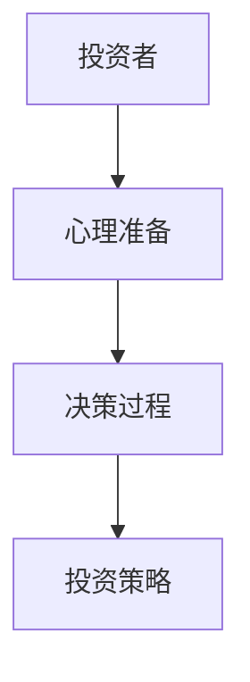
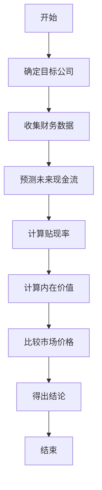
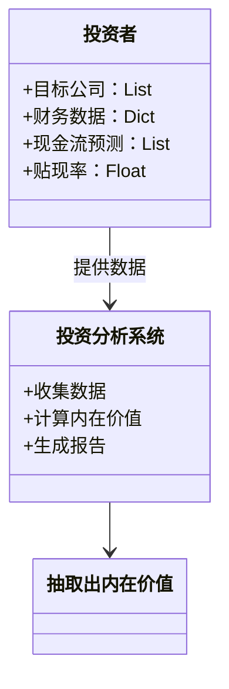

                 


# 彼得林奇的"长期持股"心理准备

> 关键词：投资心理学，长期持股，彼得林奇，心理准备，价值投资

> 摘要：本文探讨了彼得林奇的长期持股策略及其背后的心理准备，分析了投资者在长期持股过程中可能面临的心理挑战，并提出了应对策略。通过详细的心理模型、算法原理和系统架构，本文为投资者提供了实用的指导和建议。

---

## 第一部分：背景介绍

### 第1章：投资心理的重要性

#### 1.1 问题背景

投资市场的波动性常常让投资者感到困惑和焦虑。许多人在市场下跌时恐慌卖出，而在市场上涨时贪婪追涨，这种行为往往导致投资亏损。彼得林奇在其职业生涯中强调了长期持股的重要性，认为短期波动不应影响长期投资决策。

#### 1.2 问题描述

投资者在面对市场波动时，常常会受到情绪的影响，做出非理性的决策。这种行为违背了价值投资的核心理念，即以合理的价格投资于优质的公司，并长期持有。

#### 1.3 问题解决

为了克服短期波动带来的心理压力，投资者需要做好充分的心理准备，包括建立正确的投资理念、制定明确的投资计划以及培养坚韧的投资心态。

#### 1.4 边界与外延

长期持股并不意味着盲目持有任何股票，而是选择那些具有持续竞争优势和良好管理的公司。同时，心理准备也不是一蹴而就的，需要通过不断学习和实践来加强。

#### 1.5 概念结构与核心要素

长期持股的心理准备包括以下几个核心要素：
1. **正确的投资理念**：理解价值投资的本质，避免被市场情绪左右。
2. **明确的投资计划**：制定投资目标和策略，确保在波动中坚持执行。
3. **坚韧的投资心态**：面对市场的短期波动，保持冷静和耐心。

---

### 第2章：彼得林奇的投资理念

彼得林奇在其著作中多次强调，长期投资的核心在于选择优质的公司，并耐心持有。他认为，市场的短期波动不应该影响投资者的决策，因为优质公司的价值最终会体现在股价中。

#### 核心概念

1. **长期投资的核心思想**：市场波动是投资的敌人，但优质公司的长期价值是投资的基石。
2. **构建投资组合的原则**：分散投资，选择具有持续竞争优势的公司。

---

## 第二部分：核心概念与联系

### 第3章：长期持股的心理准备框架

#### 3.1 核心概念原理

长期持股的心理准备框架包括以下几个关键部分：
1. **投资心态的构成要素**：包括耐心、冷静、纪律性等。
2. **心理准备的层次结构**：从认识到接受，再到坚持，形成一个完整的心理体系。

#### 3.2 概念属性对比表

| 概念 | 特征 | 优势 | 劣势 |
|------|------|------|------|
| 长期持股 | 耐心等待价值实现 | 风险较低 | 需要较强的心理素质 |
| 短期交易 | 快速获利 | 灵活性高 | 风险较高 |

#### 3.3 ER实体关系图



### 第4章：心理防线的构建

#### 4.1 心理防线的建立

1. **确定投资目标**：明确自己的投资目标和风险承受能力。
2. **设定止损点**：在市场出现大幅波动时，设定止损点以避免重大损失。

---

## 第三部分：算法原理讲解

### 第5章：价值评估模型

#### 5.1 算法原理

价值评估模型的核心在于计算股票的内在价值，帮助投资者判断其是否被低估或高估。常用的方法是现金流贴现法（DCF模型）。

#### 5.2 算法流程图



#### 5.3 代码实现

以下是一个简单的现金流贴现法的Python代码示例：

```python
def calculate_intrinsic_value(cash_flows, discount_rate):
    present_value = 0
    for t in range(len(cash_flows)):
        present_value += cash_flows[t] / (1 + discount_rate) ** t
    return present_value

# 示例数据
cash_flows = [100, 120, 150, 180, 200]
discount_rate = 0.1

intrinsic_value = calculate_intrinsic_value(cash_flows, discount_rate)
print(f"内在价值为：{intrinsic_value}")
```

---

### 第6章：现金流贴现法

#### 6.1 数学模型

现金流贴现法的公式为：

$$ PV = \sum_{t=1}^{n} \frac{CF_t}{(1 + r)^t} $$

其中，\( CF_t \) 是第 t 年的现金流，\( r \) 是贴现率。

---

## 第四部分：系统分析与架构设计方案

### 第7章：系统架构设计

#### 7.1 项目介绍

为了帮助投资者更好地进行长期持股的心理准备，我们设计了一个投资分析系统，包括数据收集、分析、估值模型和回测模块。

#### 7.2 系统功能设计



---

## 第五部分：项目实战

### 第8章：项目实战

#### 8.1 环境安装

安装Python和相关库（如Pandas、NumPy）。

#### 8.2 核心实现

编写代码实现现金流贴现法，并进行回测。

#### 8.3 实际案例分析

以某公司为例，计算其内在价值，并与市场价格进行对比。

---

## 第六部分：最佳实践

### 第9章：最佳实践

#### 9.1 心态管理

1. **保持耐心**：避免频繁交易，坚持长期投资。
2. **定期复盘**：评估自己的投资决策，总结经验教训。

#### 9.2 风险管理

1. **分散投资**：降低单一股票的风险。
2. **设定止损点**：避免重大损失。

---

## 第七部分：扩展阅读

### 第10章：扩展阅读

#### 10.1 相关书籍

- 《彼得林奇的成功投资》
- 《价值投资入门》

#### 10.2 在线资源

- 《巴菲特致股东的信》
- 《投资学基础》

---

## 作者

作者：AI天才研究院/AI Genius Institute & 禅与计算机程序设计艺术 /Zen And The Art of Computer Programming

---

通过以上结构化的内容，我们详细探讨了彼得林奇的长期持股策略及其心理准备的重要性，结合实际的算法和系统设计，为投资者提供了理论与实践相结合的指导。希望这篇文章能够帮助读者更好地理解和应用长期投资的心理准备。

