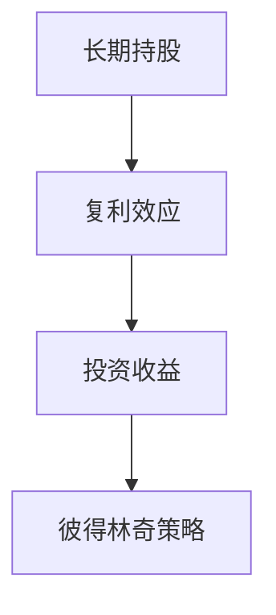
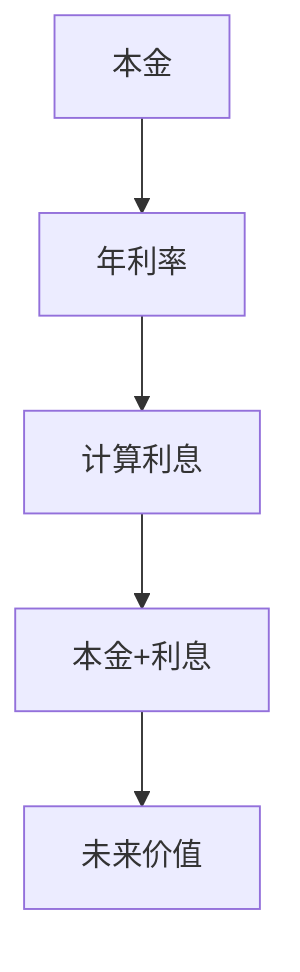
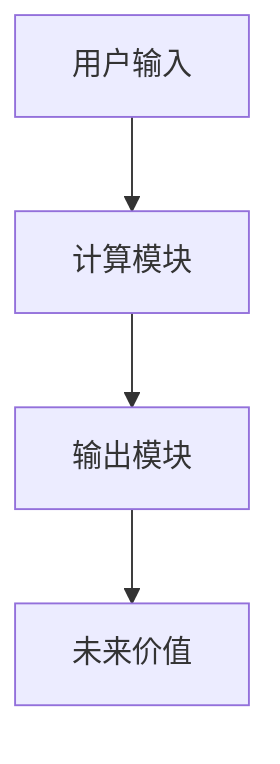

                 


# 彼得林奇的"长期持股"收益复利效应

---

## 关键词

- 彼得林奇
- 长期持股
- 复利效应
- 投资策略
- 股票投资
- 投资收益

---

## 摘要

本文深入分析了彼得林奇的长期持股策略及其背后的复利效应，通过数学建模、算法实现和系统架构设计，探讨了如何通过长期持有优质股票实现收益的复利增长。文章结合理论与实践，从背景介绍、核心概念、算法原理到项目实战，全面解析了长期持股与复利效应的内在联系，并通过具体案例展示了如何在实际投资中应用这一策略。

---

## 第一部分：长期持股与复利效应的背景介绍

### 第1章：长期持股的定义与意义

#### 1.1 长期持股的定义与意义

- **长期持股的定义**：长期持股是指投资者将资金投资于优质股票，持有时间跨度通常在5年以上，目的是通过股息再投资和股价上涨实现收益的复利增长。

- **长期持股的意义**：
  - 避免频繁交易的交易成本和情绪干扰。
  - 利用复利效应，逐步放大投资收益。
  - 通过长期持有优质资产，实现财富的稳定增长。

#### 1.2 复利效应的定义与特点

- **复利效应的定义**：复利效应是指在投资过程中，将产生的收益再次投资，从而实现收益的指数增长。

- **复利效应的特点**：
  - 时间的幂次方效应：收益增长速度随时间呈指数级增长。
  - 利息的再投资：将产生的收益继续用于投资，放大整体收益。

#### 1.3 彼得林奇投资理念的背景

- **彼得林奇的生平简介**：彼得·林奇是美国著名投资经理人，曾管理富达麦哲伦基金，创造了年化13.7%的平均回报率。

- **彼得林奇投资理念的核心思想**：
  - 长期持有优质股票，避免频繁交易。
  - 选择具有竞争优势的公司，长期跟踪和评估。

---

## 第二部分：长期持股与复利效应的核心概念与联系

### 第2章：长期持股与复利效应的数学模型

#### 2.1 复利效应的数学公式

- **复利公式**：$$FV = PV \times (1 + r)^n$$，其中：
  - $$FV$$：未来价值
  - $$PV$$：现值
  - $$r$$：年化收益率
  - $$n$$：投资年数

- **年金公式**：$$PMT \times \frac{(1 + r)^n - 1}{r}$$，用于计算定期投资的未来价值。

#### 2.2 长期持股的复利模型

- **长期持股的复利计算公式**：$$FV = PV \times (1 + r)^n + \text{股息再投资收益}$$

- **长期持股与复利效应的结合模型**：通过复利公式和股息再投资，长期持股能够实现收益的指数增长。

#### 2.3 彼得林奇投资策略的数学分析

- **投资组合的期望收益计算**：$$E(R) = \sum P_i \times R_i$$，其中$$P_i$$为投资比例，$$R_i$$为各资产的预期收益率。

- **风险与收益的平衡模型**：通过资产配置和分散投资，平衡风险与收益，实现长期稳定的复利增长。

---

### 第3章：长期持股与复利效应的实体关系图

#### 3.1 核心概念属性对比表

| 概念       | 属性               | 描述                                         |
|------------|--------------------|----------------------------------------------|
| 长期持股   | 时间跨度           | 5年以上                                      |
| 复利效应   | 计算方式           | 每期利息加入本金计算                        |
| 投资策略   | 核心思想           | 选择优质资产，长期持有，避免频繁交易        |

#### 3.2 实体关系图（Mermaid）



---

## 第三部分：长期持股与复利效应的算法原理

### 第4章：复利效应的算法实现

#### 4.1 复利计算算法



#### 4.2 长期持股的复利算法

```python
def compound_interest(principal, rate, years):
    return principal * (1 + rate) ** years
```

---

## 第四部分：系统分析与架构设计方案

### 第5章：投资系统的架构设计

#### 5.1 项目介绍

- **项目目标**：模拟彼得林奇的长期持股策略，计算复利收益。

#### 5.2 系统功能设计

- **功能模块**：
  - 用户输入：本金、年化收益率、投资年数。
  - 计算模块：计算复利收益。
  - 输出模块：显示未来价值。

#### 5.3 系统架构设计（Mermaid）



---

## 第五部分：项目实战

### 第6章：模拟投资组合的构建与管理

#### 6.1 环境安装

- **Python版本**：Python 3.8+

- **依赖库**：numpy、pandas、matplotlib

#### 6.2 核心代码实现

```python
import numpy as np
import pandas as pd
import matplotlib.pyplot as plt

def calculate_compound_interest(principal, rate, years):
    return principal * (1 + rate) ** years

principal = 10000
rate = 0.07
years = 30

future_value = calculate_compound_interest(principal, rate, years)
print(f"未来价值：{future_value:.2f}")
```

#### 6.3 案例分析与解读

- **案例分析**：假设本金为10000元，年化收益率为7%，投资30年，未来价值为$$10000 \times (1 + 0.07)^{30} \approx 10000 \times 7.379 = 73790$$元。

---

## 第六部分：总结与展望

### 第7章：总结与展望

#### 7.1 总结

- **长期持股的优势**：
  - 利用复利效应实现收益的指数增长。
  - 通过长期持有优质资产，避免短期波动的影响。

- **注意事项**：
  - 选择具有竞争优势的公司。
  - 定期评估和调整投资组合。

#### 7.2 未来展望

- **智能投顾**：利用AI技术优化投资组合，实现自动化长期持股策略。
- **风险管理**：通过大数据分析，降低投资风险，提高复利效应的稳定性。

---

## 作者

作者：AI天才研究院/AI Genius Institute & 禅与计算机程序设计艺术 /Zen And The Art of Computer Programming

---

**本文通过技术与投资的结合，深入解析了彼得林奇的长期持股策略及其背后的复利效应，为投资者提供了科学的投资方法和实践指导。**

