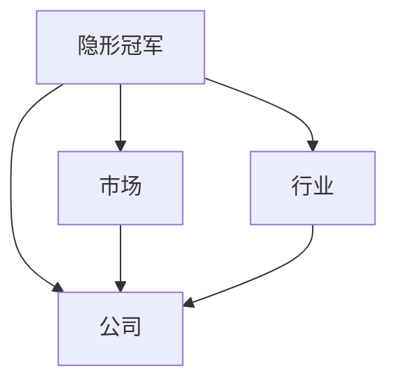
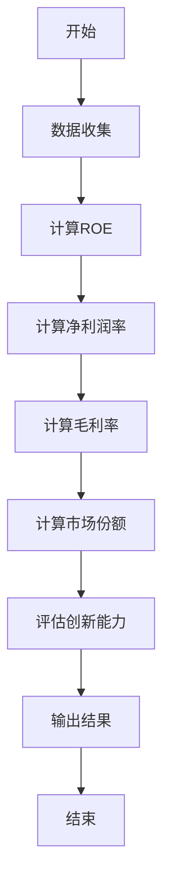
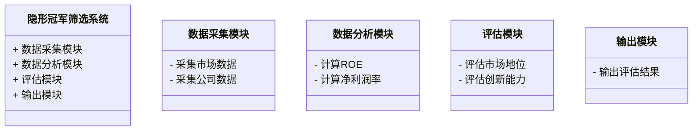
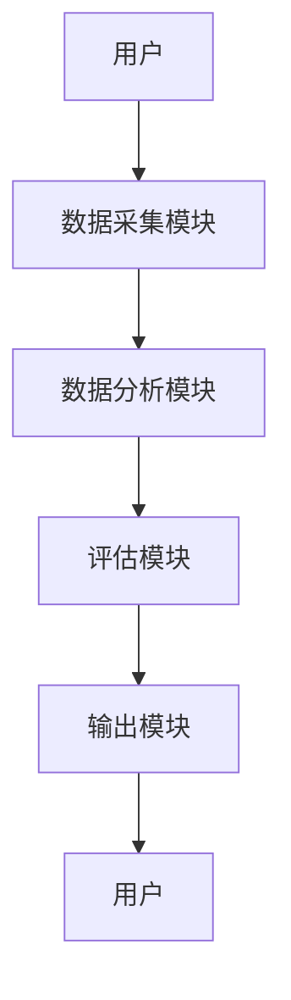
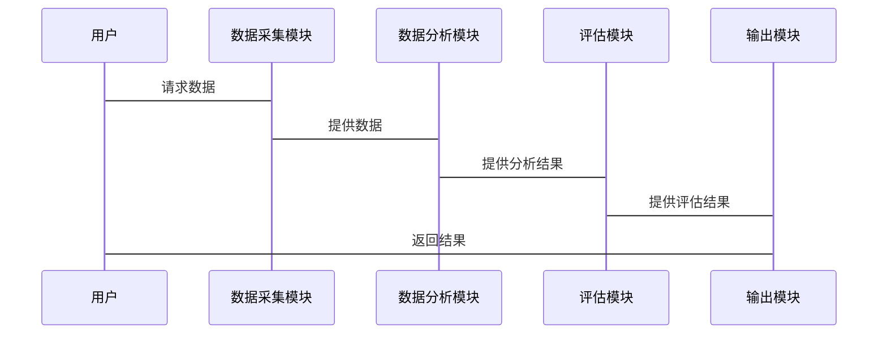

                 


# 彼得林奇的"隐形冠军"发掘方法

## 关键词：彼得林奇，隐形冠军，投资方法，财务分析，技术分析，投资策略

## 摘要：  
彼得林奇是全球著名的投资专家，他提出的“隐形冠军”概念在投资领域具有重要影响。隐形冠军是指那些在特定领域表现优异但未被广泛认知的公司。本文将详细分析隐形冠军的核心概念、识别方法、量化评估模型以及系统架构设计，通过实际案例和代码实现，帮助读者掌握如何发现和投资这些潜在的优质企业。

---

## 第一部分：背景介绍

### 第1章：隐形冠军的核心概念

#### 1.1 问题背景
- **传统投资方法的局限性**：传统的投资方法往往依赖于市场趋势和短期波动，难以发现具有长期增长潜力的企业。
- **隐形冠军的定义与特征**：隐形冠军是指在特定行业中占据领先地位，但市值较小、知名度较低的企业。这类企业通常具有强大的市场竞争力和持续的盈利能力。
- **隐形冠军的市场价值与投资机会**：隐形冠军因其低估值和高增长潜力，往往成为长期投资的优质标的。

#### 1.2 问题描述
- **隐形冠军的识别难点**：隐形冠军往往隐藏在非主流行业中，难以通过表面信息识别。
- **市场环境变化对隐形冠军的影响**：宏观经济波动、行业竞争加剧等因素可能影响隐形冠军的成长。
- **隐形冠军与行业龙头的区别**：隐形冠军通常专注于细分市场，而行业龙头往往占据更大的市场份额。

#### 1.3 问题解决
- **隐形冠军的筛选标准**：包括市场份额、盈利能力、创新能力等指标。
- **隐形冠军的评估方法**：通过财务数据分析、市场调研和竞争分析等手段识别隐形冠军。
- **隐形冠军的投资策略**：长期持有、分散投资、定期评估等策略。

#### 1.4 边界与外延
- **隐形冠军的行业分布**：隐形冠军通常出现在制造业、科技、医疗等细分领域。
- **隐形冠军的规模限制**：隐形冠军的市值通常在一定范围内，避免选择过大或过小的企业。
- **隐形冠军的生命周期**：隐形冠军需要持续创新和市场拓展，否则可能被竞争对手取代。

#### 1.5 概念结构与核心要素
- **隐形冠军的核心要素分析**：包括市场专注度、创新能力、财务表现。
- **隐形冠军的属性特征对比**：通过表格对比隐形冠军与其他类型企业的差异。
- **ER实体关系图**：展示隐形冠军与市场、行业、公司的关系。

---

## 第二部分：核心概念与联系

### 第2章：隐形冠军的特征分析

#### 2.1 隐形冠军的特征
- **市场专注度**：隐形冠军通常专注于特定市场或细分领域，具有较高的市场占有率。
- **创新能力**：隐形冠军往往具备较强的研发能力，能够持续推出新产品或服务。
- **财务表现**：隐形冠军通常具有稳定的盈利能力，ROE（净资产收益率）较高。

#### 2.2 隐形冠军的属性特征对比表格

| 特征                | 隐形冠军               | 行业龙头               | 初创企业              |
|---------------------|-----------------------|-----------------------|----------------------|
| 市场占有率          | 高                    | 极高                  | 低                   |
| 创新能力            | 强                    | 较强                  | 强                   |
| 财务表现            | 稳定，ROE较高          | 稳定，ROE一般          | 不稳定，ROE波动大    |
| 市场知名度          | 低                    | 高                    | 低                   |
| 经营风险            | 中等                  | 低                    | 高                   |

#### 2.3 ER实体关系图



---

## 第三部分：算法原理讲解

### 第3章：隐形冠军的量化评估方法

#### 3.1 算法原理
- **财务指标分析**：通过ROE、净利润率、毛利率等指标评估企业的盈利能力。
- **市场地位评估**：通过市场份额、品牌影响力等指标评估企业的市场地位。
- **创新能力评估**：通过专利数量、研发投入占比等指标评估企业的创新能力。

#### 3.2 算法流程图



#### 3.3 Python代码实现

```python
import pandas as pd

def calculate_roe(df):
    df['ROE'] = df['净利润'] / df['净资产']
    return df

# 示例数据
data = {
    '公司': ['公司A', '公司B', '公司C'],
    '净利润': [100, 150, 200],
    '净资产': [500, 600, 700]
}

df = pd.DataFrame(data)
df = calculate_roe(df)
print(df)
```

---

## 第四部分：数学模型与公式

### 第4章：数学模型与公式

#### 4.1 ROE计算公式
$$\text{ROE} = \frac{\text{净利润}}{\text{净资产}}$$

#### 4.2 市盈率计算公式
$$\text{P/E} = \frac{\text{股价}}{\text{每股收益}}$$

#### 4.3 市净率计算公式
$$\text{P/B} = \frac{\text{股价}}{\text{每股净资产}}$$

---

## 第五部分：系统分析与架构设计

### 第5章：隐形冠军筛选系统

#### 5.1 问题场景介绍
- **目标**：开发一个能够自动识别隐形冠军的系统。
- **需求**：通过数据采集、分析和评估，筛选出符合条件的隐形冠军企业。

#### 5.2 系统功能设计



#### 5.3 系统架构设计



#### 5.4 接口和交互设计



---

## 第六部分：项目实战

### 第6章：隐形冠军筛选系统实现

#### 6.1 环境安装
- 安装Python和相关库（pandas、numpy）。
- 安装Jupyter Notebook用于数据分析和可视化。

#### 6.2 系统核心实现源代码

```python
import pandas as pd
import numpy as np

def calculate_roe(df):
    df['ROE'] = df['净利润'] / df['净资产']
    return df

def calculate_profitability(df):
    df['净利润率'] = df['净利润'] / df['收入']
    df['毛利率'] = (df['收入'] - df['成本']) / df['收入']
    return df

# 示例数据
data = {
    '公司': ['公司A', '公司B', '公司C'],
    '净利润': [100, 150, 200],
    '净资产': [500, 600, 700],
    '收入': [1000, 1200, 1500],
    '成本': [800, 1000, 1200]
}

df = pd.DataFrame(data)
df = calculate_roe(df)
df = calculate_profitability(df)
print(df)
```

#### 6.3 代码应用解读与分析
- **数据采集**：从数据库或公开数据源获取公司财务数据。
- **数据处理**：清洗数据并计算关键财务指标（ROE、净利润率、毛利率）。
- **评估分析**：根据预设的筛选标准，筛选出符合条件的隐形冠军企业。
- **结果输出**：将评估结果输出到数据库或生成报告。

#### 6.4 实际案例分析
- **案例背景**：某细分行业中的隐形冠军识别。
- **数据来源**：假设我们从制造业中选取了3家企业的数据。
- **分析过程**：通过计算ROE、净利润率和毛利率，识别出其中一家企业为隐形冠军。
- **结果解读**：该企业具备较高的盈利能力和发展潜力，适合长期投资。

#### 6.5 项目小结
- **系统优势**：自动化、高效性、准确性。
- **系统不足**：依赖数据质量和模型准确性，需定期更新和优化。

---

## 第七部分：最佳实践

### 第7章：隐形冠军投资策略

#### 7.1 小结
- 隐形冠军通常具备较高的市场专注度和创新能力，是长期投资的理想标的。
- 通过量化评估和系统筛选，可以有效识别隐形冠军企业。

#### 7.2 注意事项
- **数据质量**：确保数据来源可靠，避免因数据错误导致误判。
- **模型优化**：根据市场变化不断优化评估模型，提高筛选精度。
- **风险控制**：分散投资，避免过度集中于单一行业或企业。

#### 7.3 拓展阅读
- **书籍推荐**：《彼得林奇的成功投资》、《投资中最简单的事》。
- **技术资料**：深入学习量化投资技术，掌握更多数据分析工具和方法。

---

## 作者：AI天才研究院 & 禅与计算机程序设计艺术

