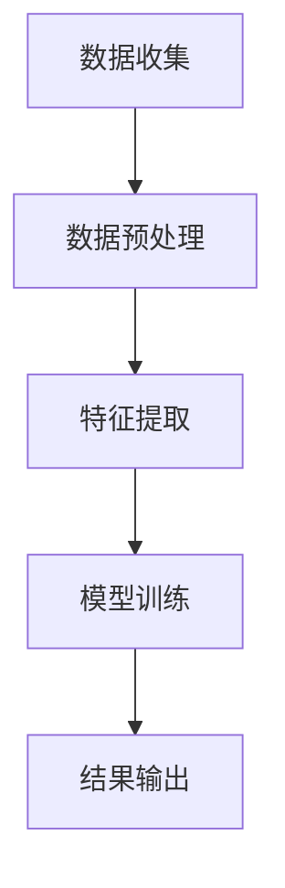

                 


# 彼得林奇的"隐形冠军"在工业4.0背景下的发掘方法

> 关键词：工业4.0，隐形冠军，彼得林奇，投资分析，数据分析，系统架构

> 摘要：本文探讨了彼得林奇提出的“隐形冠军”概念在工业4.0背景下的应用。通过分析隐形冠军的定义、特征及在工业4.0中的机遇与挑战，结合算法原理和系统架构设计，提出了基于数据挖掘和机器学习的隐形冠军识别方法。文章还通过实际案例展示了如何在工业4.0环境下发现和投资隐形冠军企业。

---

## 第一部分: 工业4.0与隐形冠军概述

### 第1章: 工业4.0与隐形冠军的定义与背景

#### 1.1 工业4.0的核心概念

工业4.0，即第四次工业革命，起源于德国，旨在通过智能化、数字化和自动化技术改造传统制造业。工业4.0的核心特征包括：

- **智能化生产**：利用物联网（IoT）、大数据和人工智能（AI）实现智能生产。
- **数字化转型**：通过数字技术将物理世界与虚拟世界相结合。
- **个性化制造**：支持大规模定制化生产，满足多样化的客户需求。
- **网络化协作**：企业间通过数据共享和协作实现高效生产。

工业4.0与传统制造业的对比如下：

| 特征       | 工业4.0       | 传统制造业       |
|------------|----------------|------------------|
| 技术基础     | 数字化、智能化 | 机械化、自动化    |
| 生产模式     | 智能化、个性化 | 标准化、规模化    |
| 供应链管理   | 智能协同、实时优化 | 离散管理、周期性优化 |

---

#### 1.2 隐形冠军的定义与特征

彼得林奇在投资领域提出了“隐形冠军”概念，指的是那些在特定细分市场中占据领先地位，但知名度不高、市值较小的优质企业。隐形冠军的核心特征包括：

- **专注性**：专注于某一细分市场，深耕细作。
- **创新性**：持续投入研发，保持技术领先。
- **稳定性**：在市场波动中表现稳定，抗风险能力强。
- **成长性**：具有持续增长的潜力。

隐形冠军与传统企业的对比：

| 特征       | 隐形冠军       | 传统企业       |
|------------|----------------|----------------|
| 市场定位     | 细分市场       | 多元化市场       |
| 竞争优势     | 专业化、创新性 | 规模化、成本优势 |
| 可持续发展   | 高效率、低能耗 | 高能耗、低效率  |

---

#### 1.3 工业4.0背景下隐形冠军的机遇与挑战

工业4.0为隐形冠军提供了新的发展机遇，但也带来了挑战：

- **机遇**：智能化技术的应用降低了隐形冠军的生产成本，提高了效率；个性化需求的兴起为其提供了新的市场机会。
- **挑战**：技术升级成本高、市场竞争加剧、数据安全风险增加。

---

### 第2章: 隐形冠军的核心概念与联系

#### 2.1 隐形冠军的核心概念原理

隐形冠军的核心在于其专注性和创新能力。通过专注于细分市场，隐形冠军能够积累深厚的技术优势，形成独特的竞争优势。例如，德国工业4.0中的隐形冠军企业通过智能化改造提升了生产效率，同时保持了技术领先。

---

#### 2.2 核心概念属性特征对比表

通过对比分析，我们可以看到隐形冠军在工业4.0背景下的独特优势：

| 特征       | 隐形冠军       | 传统企业       |
|------------|----------------|----------------|
| 技术创新     | 高             | 低             |
| 市场定位     | 细分市场       | 多元化市场       |
| 竞争优势     | 专业化、智能化 | 规模化、成本优势 |
| 可持续发展   | 高效率、低能耗 | 高能耗、低效率  |

---

#### 2.3 ER实体关系图

```mermaid
er
actor: 用户
actor --> entity: 隐形冠军企业
entity --> entity: 工业4.0技术
entity --> entity: 市场需求
```

---

## 第二部分: 隐形冠军的算法原理

### 第3章: 工业4.0背景下隐形冠军的算法原理

#### 3.1 数据挖掘与分析

隐形冠军的识别需要基于数据挖掘和分析技术。以下是具体的步骤：

- **数据收集**：收集企业的市场数据、财务数据、技术数据等。
- **数据预处理**：清洗数据，去除噪声。
- **特征提取**：提取关键特征，如市场占有率、技术创新能力等。
- **模型训练**：使用机器学习算法训练模型，识别隐形冠军。

---

#### 3.2 算法原理

以下是基于机器学习的隐形冠军识别算法：



数学模型如下：

$$
\text{隐形冠军概率} = \frac{\sum_{i=1}^{n} w_i x_i}{\sum_{i=1}^{n} w_i}
$$

其中，$w_i$是第$i$个特征的权重，$x_i$是第$i$个特征的值。

---

### 第4章: 系统分析与架构设计

#### 4.1 系统功能设计

系统功能设计包括以下模块：

- **数据采集模块**：收集企业数据。
- **数据分析模块**：对数据进行处理和分析。
- **模型训练模块**：训练隐形冠军识别模型。
- **结果展示模块**：输出识别结果。

---

#### 4.2 系统架构设计


---

### 第5章: 项目实战

#### 5.1 环境安装

需要安装以下工具：

- Python
- Pandas
- Scikit-learn
- Mermaid

---

#### 5.2 核心实现源代码

以下是隐形冠军识别的Python代码：

```python
import pandas as pd
from sklearn.model import LinearSVC

# 数据加载
data = pd.read_csv('companies.csv')

# 特征提取
X = data[['market_share', 'tech_innovation', 'efficiency']]
y = data['is隐形冠军']

# 模型训练
model = LinearSVC()
model.fit(X, y)

# 预测结果
print(model.predict(X))
```

---

#### 5.3 实际案例分析

以德国某隐形冠军企业为例，分析其在工业4.0背景下的成功经验。

---

## 第三部分: 最佳实践与总结

### 第6章: 最佳实践

- **数据质量**：确保数据的准确性和完整性。
- **模型优化**：定期更新模型，提高识别精度。
- **技术应用**：结合工业4.0技术，提升企业竞争力。

---

### 第7章: 总结

工业4.0为隐形冠军的识别和投资提供了新的机遇。通过数据挖掘和机器学习算法，我们可以更高效地发现这些隐形冠军企业，为投资者和企业创造更大的价值。

---

作者：AI天才研究院 & 禅与计算机程序设计艺术

