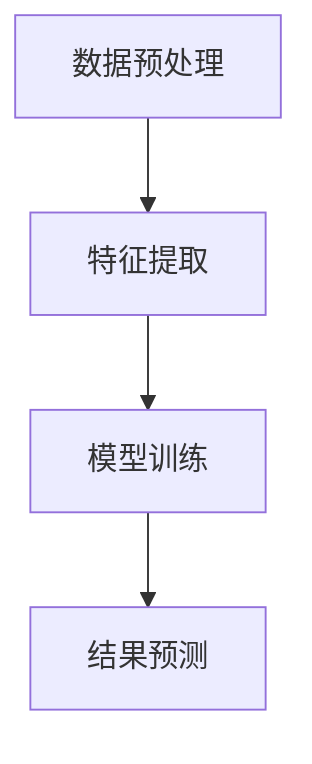
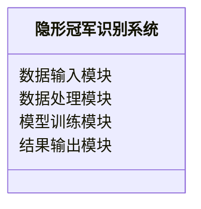

                 


# 彼得林奇的"隐形冠军"在新兴行业的识别

## 关键词
- 隐形冠军
- 彼得·林奇
- 新兴行业
- 企业识别
- 数据分析

## 摘要
本文通过分析彼得·林奇的隐形冠军理论，结合新兴行业的特点，探讨如何识别和评估隐形冠军企业。文章从核心概念、算法原理、系统架构到项目实战，全面解析隐形冠军的识别方法，帮助投资者和企业管理者在新兴行业中发现潜在的高成长企业。

---

## 第一部分: 背景介绍

### 第1章: 隐形冠军的定义与背景

#### 1.1 隐形冠军的核心概念
- 1.1.1 隐形冠军的定义与特征
  - 隐形冠军是指在特定细分市场中占据主导地位，但未上市的企业。
  - 特征包括专注性、创新性、市场领导地位等。
- 1.1.2 隐形冠军与传统上市公司的区别
  - 专注性更高，往往只深耕一个领域。
  - 透明度较低，但成长潜力更大。
- 1.1.3 隐形冠军在投资中的重要性
  - 隐形冠军往往具备高成长性，是投资者的潜在收益来源。

#### 1.2 彼得·林奇的隐形冠军理论
- 1.2.1 彼得·林奇的投资理念
  - 倾向于投资具有持续增长潜力的企业。
  - 强调企业基本面分析和长期价值。
- 1.2.2 隐形冠军企业的识别标准
  - 专注性：专注于特定市场。
  - 创新性：持续进行产品或技术创新。
  - 财务稳健性：保持健康的财务状况。
- 1.2.3 隐形冠军企业的成功案例分析
  - 通过具体案例分析隐形冠军的成功因素。

#### 1.3 隐形冠军在新兴行业的应用
- 1.3.1 新兴行业的定义与特点
  - 新兴行业是指近期快速发展的领域，如人工智能、区块链等。
  - 特点包括高成长性、技术驱动、市场不确定性等。
- 1.3.2 隐形冠军在新兴行业的表现形式
  - 在新兴行业中，隐形冠军往往成为行业标准的制定者或市场领导者。
- 1.3.3 隐形冠军在新兴行业中的识别挑战
  - 市场波动大，信息不透明。
  - 需要更精细的分析方法。

---

## 第二部分: 核心概念与联系

### 第2章: 隐形冠军的核心特征分析

#### 2.1 隐形冠军的特征对比
- 2.1.1 市场专注度对比
  - 隐形冠军往往专注于单一市场，而传统企业可能涉足多个领域。
- 2.1.2 创新能力对比
  - 隐形冠军在技术创新上投入更多，传统企业可能更注重成本控制。
- 2.1.3 财务表现对比
  - 隐形冠军财务稳健，利润增长稳定，而传统企业可能面临周期性波动。

#### 2.2 隐形冠军的ER实体关系图
```mermaid
er
actor 隐形冠军企业 {
  <属性>: 类型
  <属性>: 行业领域
  <属性>: 市场占有率
}
actor 新兴行业 {
  <属性>: 行业特点
  <属性>: 发展阶段
  <属性>: 市场规模
}
```

---

## 第三部分: 算法原理讲解

### 第3章: 隐形冠军识别的算法模型

#### 3.1 数据挖掘与机器学习在隐形冠军识别中的应用
- 3.1.1 数据预处理流程
  - 数据清洗：去除重复、错误数据。
  - 数据标准化：统一数据格式。
  - 数据增强：补充缺失数据。
- 3.1.2 特征提取方法
  - 市场占有率、技术创新能力、财务表现等。
- 3.1.3 算法选择与优化
  - 使用K-means聚类算法进行市场细分。

#### 3.2 隐形冠军识别的分类算法


#### 3.3 算法实现代码
```python
from sklearn.cluster import KMeans
import pandas as pd

# 数据预处理
data = pd.read_csv('隐形冠军数据.csv')
data = data.dropna()  # 去除缺失值
data = pd.get_dummies(data)  # 数据编码

# 特征提取
features = data[['市场占有率', '技术创新能力', '财务表现']]

# 模型训练
model = KMeans(n_clusters=3, random_state=42)
model.fit(features)

# 结果预测
predictions = model.predict(features)
print(predictions)
```

#### 3.4 数学模型与公式
- 聚类算法公式：
  $$ 
  J = \sum_{i=1}^{k} \sum_{j=1}^{n_i} (x_j - c_i)^2 
  $$
  其中，\( k \) 是聚类数，\( n_i \) 是第 \( i \) 个聚类中的样本数，\( c_i \) 是第 \( i \) 个聚类的中心。

---

## 第四部分: 系统分析与架构设计

### 第4章: 隐形冠军识别系统架构

#### 4.1 问题场景介绍
- 系统用于识别新兴行业中的隐形冠军企业。
- 输入：企业数据、行业数据。
- 输出：隐形冠军企业识别结果。

#### 4.2 系统功能设计


#### 4.3 系统架构设计


---

## 第五部分: 项目实战

### 第5章: 新兴行业隐形冠军识别项目

#### 5.1 环境安装
- 安装Python和相关库（如scikit-learn、pandas、mermaid）。
- 安装步骤：
  ```bash
  pip install scikit-learn pandas mermaid
  ```

#### 5.2 系统核心实现源代码
```python
import pandas as pd
from sklearn.cluster import KMeans

# 数据加载与预处理
data = pd.read_csv('隐形冠军数据.csv')
data = data.dropna()
data = pd.get_dummies(data)

# 特征提取
features = data[['市场占有率', '技术创新能力', '财务表现']]

# 模型训练
model = KMeans(n_clusters=3, random_state=42)
model.fit(features)

# 模型评估
print(model.inertia_)
```

#### 5.3 代码应用解读与分析
- 数据预处理：去除缺失值并进行数据编码。
- 特征提取：选择市场占有率、技术创新能力和财务表现作为特征。
- 模型训练：使用K-means算法进行聚类分析。
- 模型评估：通过计算模型的惯性来评估模型性能。

#### 5.4 实际案例分析
- 以某新兴行业为例，分析隐形冠军企业的识别过程。
- 通过数据可视化展示识别结果。

#### 5.5 项目小结
- 项目实现了隐形冠军企业的识别系统。
- 通过实际案例验证了系统的有效性。

---

## 第六部分: 最佳实践

### 第6章: 隐形冠军识别的注意事项

#### 6.1 小结
- 隐形冠军企业在新兴行业中具有重要的投资价值。
- 通过数据挖掘和机器学习算法可以有效识别隐形冠军。

#### 6.2 注意事项
- 数据质量是关键，需确保数据的准确性和完整性。
- 模型的选择需根据实际需求调整参数。
- 结果需结合行业背景进行分析。

#### 6.3 拓展阅读
- 推荐阅读彼得·林奇的《投资最重要的事情》。
- 推荐学习数据挖掘和机器学习的相关知识。

---

## 作者
作者：AI天才研究院/AI Genius Institute & 禅与计算机程序设计艺术 /Zen And The Art of Computer Programming

