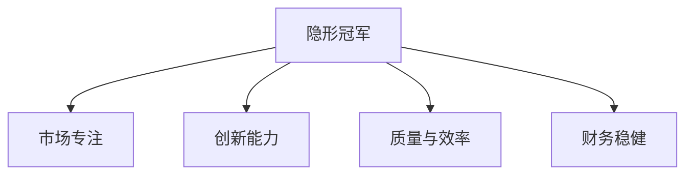

                 

# 彼得林奇的"隐形冠军"在服务业中的发掘

> **关键词**：隐形冠军、彼得林奇、服务业、投资策略、市场分析、竞争优势  
> **摘要**：本文探讨了彼得林奇的“隐形冠军”概念在服务业中的应用，分析了隐形冠军的特点、识别方法以及在投资中的价值。通过系统的方法和实际案例，展示了如何在服务业中发现这些隐形冠军。

---

## 第一部分: 背景介绍

### 第1章: 隐形冠军的定义与特点

#### 1.1 隐形冠军的定义与特点
隐形冠军是指那些在特定细分市场中占据领先地位，但知名度不高、不为大众所熟知的企业。它们通常专注于某个领域，具有强大的市场竞争力和持续的创新能力。以下是隐形冠军的核心特点：

| **特点** | **描述** |
|----------|----------|
| 市场专注 | 隐形冠军专注于特定市场或产品，具有较高的市场占有率。 |
| 创新能力 | 持续进行产品或服务创新，保持竞争优势。 |
| 质量与效率 | 高质量的产品和高效的运营能力。 |
| 财务稳健 | 财务健康，具备持续发展的能力。 |

#### 1.2 彼得林奇与隐形冠军
彼得·林奇是美国著名的投资经理人，以其独特的投资理念闻名。他认为，隐形冠军是那些在特定市场中表现优异但未被广泛认知的企业。以下是彼得林奇的相关理念：

- **专注投资**：林奇强调专注于特定行业或市场的投资，避免分散投资。
- **基本面分析**：通过深入分析企业的财务状况、市场地位和竞争优势，寻找潜在的隐形冠军。
- **长期价值**：隐形冠军通常具有长期的增长潜力，适合长期投资。

---

### 第2章: 服务业中的隐形冠军

#### 2.1 服务业的定义与特点
服务业是以提供服务为主的企业，其特点包括：

- **无形性**：服务通常是无形的，难以量化。
- **即时性**：服务往往即时发生，不易储存。
- **多样性**：服务种类繁多，涵盖金融、教育、医疗等多个领域。

#### 2.2 服务业中的隐形冠军
在服务业中，隐形冠军的表现形式有所不同，但核心特征与制造业中的隐形冠军相似。以下是服务业隐形冠军的特点：

- **客户专注**：专注于特定客户群体，提供定制化服务。
- **创新模式**：通过服务模式创新，形成竞争优势。
- **品牌影响力**：虽然知名度不高，但在特定领域具有强大的品牌影响力。

---

## 第二部分: 隐形冠军的核心特征

### 第3章: 市场专注度

#### 3.1 市场专注度的定义
市场专注度是指企业在特定市场中的聚焦程度。隐形冠军通常在某个细分市场中占据领先地位，具有较高的市场占有率。

#### 3.2 服务业中的市场专注度
在服务业中，市场专注度尤为重要。例如，一家专注于本地市场的律师事务所可能在某个领域（如公司法）具有强大的竞争力。

### 第4章: 创新能力

#### 4.1 创新能力的定义
创新能力是指企业通过创新产品或服务，保持竞争优势的能力。隐形冠军通常具有强大的创新能力，能够不断推出新产品或改进服务。

#### 4.2 服务业中的创新能力
在服务业中，创新能力的表现形式多样，例如通过数字化转型提升服务质量，或通过创新的商业模式（如订阅制服务）吸引客户。

---

## 第三部分: 隐形冠军的识别方法

### 第5章: 数据驱动的识别方法

#### 5.1 数据收集与分析
要识别隐形冠军，需要收集相关数据，包括企业的市场占有率、财务状况、创新能力等。

#### 5.2 竞争分析
通过分析竞争对手的情况，找出在某个市场中占据领先地位但知名度不高的企业。

### 第6章: 投资策略

#### 6.1 投资组合构建
隐形冠军通常具有较高的增长潜力，适合加入投资组合。

#### 6.2 风险管理
在投资隐形冠军时，需要注意市场风险和企业经营风险，制定合理的风险管理策略。

---

## 第四部分: 实际案例分析

### 第7章: 美国某律师事务所案例

#### 7.1 案例背景
这是一家专注于知识产权领域的律师事务所，通过提供高质量的服务，在该领域占据了领先地位。

#### 7.2 成功因素
- **专注市场**：专注于知识产权领域，成为该领域的领先者。
- **创新服务**：通过数字化工具提升服务效率，降低客户成本。
- **客户关系**：与客户建立了长期合作关系，形成了强大的品牌影响力。

---

## 第五部分: 总结与展望

### 第8章: 总结

隐形冠军在服务业中的发掘需要结合市场分析、财务分析和竞争分析。彼得林奇的投资理念为我们提供了一个有效的框架，帮助我们识别这些潜在的冠军企业。

### 第9章: 展望

随着经济的发展，服务业将成为隐形冠军的主要战场。未来，隐形冠军的识别将更加依赖于数据分析和创新模式的应用。

---

## 作者：AI天才研究院 & 禅与计算机程序设计艺术

---

通过以上结构，我们可以系统地分析和识别服务业中的隐形冠军，为投资者和企业提供有价值的洞见。

