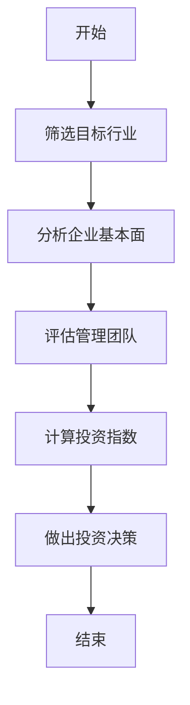

                 

# 彼得林奇的"隐形冠军"投资案例分析

> 关键词：彼得林奇，隐形冠军，投资策略，财务分析，系统架构

> 摘要：本文通过分析彼得林奇的投资理念，详细阐述了“隐形冠军”的定义、特征及其投资价值。结合数学模型和系统架构，深入探讨了如何筛选和评估隐形冠军企业，并通过实际案例分析展示了彼得林奇的投资策略在实践中的应用。文章最后总结了隐形冠军投资的关键点和注意事项。

---

## 第一部分：彼得林奇与“隐形冠军”的定义

### 第1章：彼得林奇的生平与投资理念

#### 1.1 彼得林奇的生平简介
彼得·林奇（Peter Lynch）是全球最著名的投资专家之一，被誉为“股票投资的奇才”。他在富达投资管理公司（Fidelity Management）担任基金经理期间，创造了年均29%的投资回报率，管理资产规模超过1000亿美元。林奇的投资理念以选股严谨、注重基本面分析而闻名。

#### 1.2 彼得林奇的投资哲学
彼得林奇强调长期投资和价值发现，他认为市场的波动性是投资者的敌人，而企业基本面分析是投资的核心。他倡导投资者关注企业的财务状况、行业地位和管理团队，而不是市场短期波动。

#### 1.3 “隐形冠军”概念的提出与背景
“隐形冠军”是指那些在特定行业或市场中占据领先地位，但未被广泛认知的公司。这些公司通常专注于细分市场，具有强大的竞争优势和持续的盈利能力。彼得林奇认为，隐形冠军是投资的最佳选择，因为它们往往具有较高的成长潜力和抗风险能力。

---

### 第2章：“隐形冠军”的定义与特征

#### 2.1 什么是“隐形冠军”
“隐形冠军”是指在特定市场或行业中占据领先地位，但不一定是行业龙头的公司。这些公司通常专注于某个细分领域，具有强大的市场影响力和竞争优势。

#### 2.2 “隐形冠军”的核心特征
- **专注性**：专注于一个细分市场，具有高度的专业化。
- **创新性**：在产品或服务上具有独特的创新点。
- **市场定位**：在目标市场中占据领先地位。
- **财务健康**：具有稳定的财务状况和较高的盈利能力。
- **管理团队**：管理团队具有丰富的行业经验和卓越的领导能力。

#### 2.3 “隐形冠军”与传统冠军的对比
| 特征       | 隐形冠军                      | 传统冠军                      |
|------------|-------------------------------|-------------------------------|
| 市场定位    | 细分市场领导者                | 整体市场领导者                |
| 竞争优势   | 专注于某个领域                | 多元化的竞争优势              |
| 市场认知度  | 低                           | 高                           |
| 成长潜力   | 高                           | 中等                          |

---

### 第3章：研究“隐形冠军”的价值与意义

#### 3.1 从彼得林奇的投资案例中学习
通过分析彼得林奇的投资组合，可以发现他偏好投资于隐形冠军企业。这些企业通常具有稳定的增长和较高的利润率。

#### 3.2 “隐形冠军”对企业战略的启示
隐形冠军的成功在于专注和创新。企业可以通过专注于细分市场和持续创新来提升自身的竞争力。

#### 3.3 “隐形冠军”对个人投资的指导意义
对于个人投资者来说，隐形冠军提供了高成长潜力的投资机会。通过分析企业的基本面和市场定位，投资者可以找到具有长期增长潜力的优质企业。

---

## 第二部分：隐形冠军的筛选标准与评估体系

### 第4章：彼得林奇的筛选标准

#### 4.1 市场地位与竞争优势
彼得林奇认为，隐形冠军的关键在于其市场地位和竞争优势。他通过分析企业的市场份额、行业排名和竞争对手情况来评估其市场地位。

#### 4.2 财务健康状况
财务健康是隐形冠军的重要评估指标。彼得林奇关注企业的净利润率、资产负债率和现金流状况，以确保企业具有稳定的财务基础。

#### 4.3 管理团队与企业文化
优秀的管理团队和积极的企业文化是隐形冠军成功的关键。彼得林奇通过分析管理团队的背景和企业文化来评估企业的长期发展潜力。

#### 4.4 行业前景与增长潜力
隐形冠军的投资价值还取决于其所在行业的前景和增长潜力。彼得林奇关注行业的市场规模、增长率和未来发展趋势。

---

### 第5章：隐形冠军的评估体系

#### 5.1 市场占有率分析
市场占有率是衡量企业市场地位的重要指标。彼得林奇通过分析企业的市场份额和竞争对手的市场份额来评估其市场竞争力。

#### 5.2 盈利能力分析
盈利能力是评估企业财务健康的重要指标。彼得林奇关注企业的净利润率、ROE（净资产收益率）和利润率等指标。

#### 5.3 财务稳定性分析
财务稳定性是评估企业抗风险能力的重要指标。彼得林奇通过分析企业的资产负债率、流动比率和速动比率等指标来评估其财务稳定性。

#### 5.4 管理团队能力评估
管理团队的能力是评估企业长期发展潜力的重要指标。彼得林奇关注管理团队的背景、经验和领导能力，以确保企业具有持续的创新能力和发展动力。

---

## 第三部分：隐形冠军投资策略的数学模型与分析

### 第6章：投资决策的数学模型

#### 6.1 市场地位的量化指标
市场地位指数 = 企业市场份额 / 行业增长率

#### 6.2 财务健康度的量化指标
财务健康指数 = 净利润率 / 资产负债率

#### 6.3 增长潜力的量化指标
增长潜力指数 = ROE（净资产收益率） / 行业平均ROE

---

## 第四部分：隐形冠军投资策略的系统架构

### 第7章：系统分析与架构设计

#### 7.1 投资决策流程图

---

## 第五部分：项目实战与案例分析

### 第8章：环境安装与系统核心实现

#### 8.1 案例分析：苹果公司的隐形冠军之路
苹果公司通过专注于高端智能手机市场，凭借创新的产品设计和强大的品牌影响力，成为全球科技行业的隐形冠军。

#### 8.2 核心实现：苹果公司的市场定位与竞争优势
- **市场定位**：专注于高端智能手机市场，与安卓手机形成差异化竞争。
- **竞争优势**：创新的产品设计、强大的品牌影响力和优质的用户体验。

---

## 第六部分：最佳实践与小结

### 第9章：投资关键点与注意事项

#### 9.1 投资关键点
- 专注于细分市场，寻找具有强大竞争优势的企业。
- 关注企业的财务健康状况，确保其具有稳定的盈利能力。
- 分析管理团队的能力，选择具有长期发展潜力的企业。

#### 9.2 注意事项
- 隐形冠军的投资需要长期关注和持续跟踪，避免短期波动的影响。
- 投资者需要具备较强的研究能力和行业分析能力，才能准确识别隐形冠军。

---

## 第七部分：拓展阅读与总结

### 第10章：相关书籍与资源推荐

#### 10.1 相关书籍
- 《彼得林奇的投资智慧》
- 《隐形冠军：企业如何通过专注和创新实现成功》

#### 10.2 总结
彼得林奇的投资理念为我们提供了寻找隐形冠军的思路。通过专注于细分市场、分析企业基本面和评估管理团队，投资者可以找到具有长期增长潜力的优质企业。

---

## 作者信息

作者：AI天才研究院/AI Genius Institute & 禅与计算机程序设计艺术 /Zen And The Art of Computer Programming

