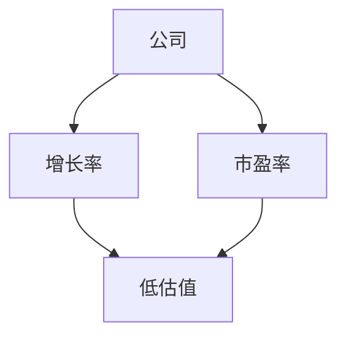
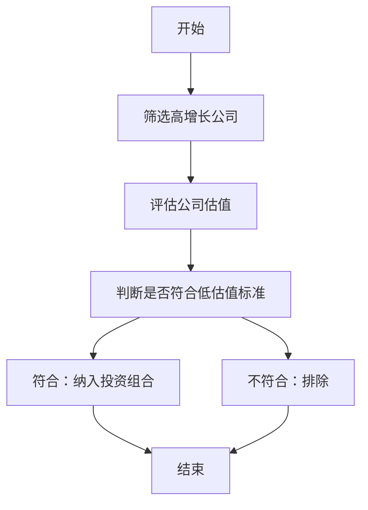
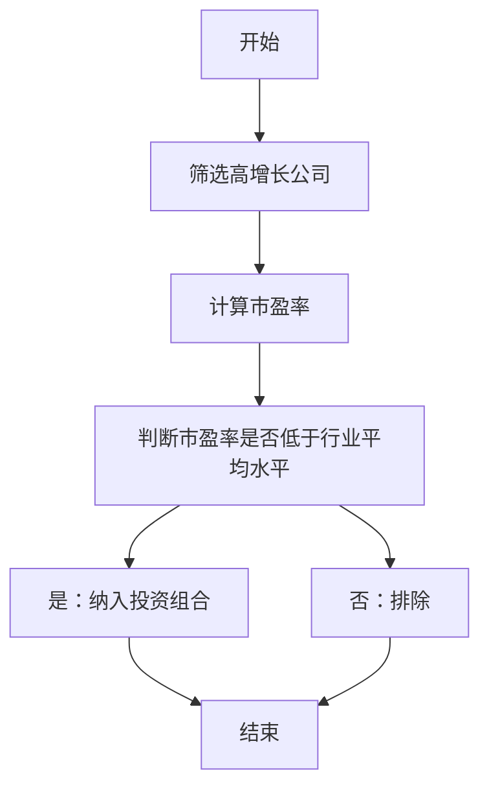
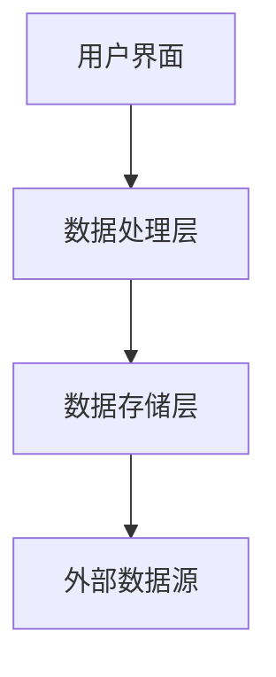

                 


# 彼得林奇的"高增长低估值"在不同市场环境下的筛选

> 关键词：彼得林奇，高增长低估值，投资策略，市场环境，股票筛选

> 摘要：本文详细分析了彼得林奇提出的“高增长低估值”投资策略，并探讨了该策略在不同市场环境下的筛选方法。通过结合技术分析和基本面研究，本文深入解析了高增长与低估值的定义、相互关系及其在实际投资中的应用，提供了详细的筛选流程、算法实现和系统架构设计，为投资者在不同市场环境下应用彼得林奇策略提供了理论和实践指导。

---

## 第1章：彼得林奇投资理念的核心概念

### 1.1 彼得林奇的生平与投资哲学

彼得·林奇是美国著名的投资专家，曾任富达麦哲伦基金的经理，以其卓越的投资业绩闻名。他提倡长期投资，注重基本面分析，强调选择具有持续增长潜力的公司。他的投资哲学以“高增长低估值”为核心，主张寻找那些增长速度快、估值合理的公司。

### 1.2 高增长低估值策略的背景与问题背景

在金融市场中，投资者通常面临两个关键问题：如何选择具有增长潜力的公司，以及如何在合理估值的基础上进行投资。彼得林奇的策略通过结合这两个因素，帮助投资者在不同市场环境中筛选出具有长期增值潜力的股票。

---

## 第2章：高增长低估值策略的核心概念与联系

### 2.1 高增长与低估值的核心要素

#### 2.1.1 高增长公司的定义与特征

高增长公司通常是指那些在过去几年中收入和利润持续增长，且增长率高于行业平均水平的公司。以下是高增长公司的核心特征：

- **收入增长率**：收入年增长率超过行业平均水平。
- **利润增长率**：净利润年增长率稳定且高于行业平均水平。
- **市场地位**：公司在市场中具有竞争优势，市场份额稳步增长。
- **管理团队**：公司管理层稳定且具有战略眼光。

#### 2.1.2 低估值股票的定义与衡量标准

低估值股票通常是指那些市场价格低于其内在价值的股票。以下是衡量低估值股票的关键指标：

- **市盈率（P/E）**：股票价格与每股收益的比率。P/E越低，可能意味着估值越低。
- **市净率（P/B）**：股票价格与每股净资产的比率。P/B越低，可能意味着估值越低。
- **市销率（P/S）**：股票价格与每股销售额的比率。P/S越低，可能意味着估值越低。

#### 2.1.3 高增长与低估值的矛盾与平衡

高增长公司通常具有较高的成长性，但市场可能已经对其高增长预期进行了充分的定价，导致其估值偏高。低估值公司通常具有较高的安全边际，但可能增长潜力有限。因此，寻找高增长与低估值的平衡点是彼得林奇策略的核心。

### 2.2 高增长与低估值的ER实体关系图

以下是高增长与低估值的ER实体关系图：



### 2.3 高增长低估值策略的流程图

以下是高增长低估值策略的流程图：



---

## 第3章：高增长低估值策略的算法原理

### 3.1 高增长低估值策略的数学模型

以下是高增长低估值策略的关键数学公式：

#### 3.1.1 市盈率（P/E）计算公式

$$ P/E = \frac{股票价格}{每股收益} $$

#### 3.1.2 市净率（P/B）计算公式

$$ P/B = \frac{股票价格}{每股净资产} $$

#### 3.1.3 增长率计算公式

$$ 增长率 = \frac{净利润增长}{上年净利润} $$

### 3.2 算法流程图

以下是高增长低估值策略的算法流程图：



### 3.3 算法实现代码

以下是Python代码实现：

```python
import pandas as pd

def is_high_growth(company, industry_avg_growth):
    if company.growth_rate > industry_avg_growth:
        return True
    else:
        return False

def is_low_valuation(company, industry_avg_pe):
    if company.pe < industry_avg_pe:
        return True
    else:
        return False

def peter_lynch_strategy(company, industry_avg_growth, industry_avg_pe):
    if is_high_growth(company, industry_avg_growth) and is_low_valuation(company, industry_avg_pe):
        return True
    else:
        return False
```

---

## 第4章：高增长低估值策略的系统分析与架构设计

### 4.1 系统功能设计

#### 4.1.1 高增长公司筛选模块

- 输入：公司财务数据、行业平均增长率。
- 输出：高增长公司列表。

#### 4.1.2 低估值股票评估模块

- 输入：公司股价数据、行业平均市盈率。
- 输出：低估值公司列表。

#### 4.1.3 综合评分模块

- 输入：高增长公司列表、低估值公司列表。
- 输出：高增长低估值公司综合评分列表。

### 4.2 系统架构设计

以下是系统架构图：



### 4.3 系统接口设计

#### 4.3.1 数据输入接口

以下是系统接口设计：

```python
class CompanyData:
    def __init__(self, name, revenue, net_profit, pe, pb):
        self.name = name
        self.revenue = revenue
        self.net_profit = net_profit
        self.pe = pe
        self.pb = pb

class Strategy:
    def __init__(self, companies):
        self.companies = companies

    def apply_strategy(self, industry_avg_growth, industry_avg_pe):
        selected = []
        for company in self.companies:
            if (company.revenue > industry_avg_growth and company.pe < industry_avg_pe):
                selected.append(company.name)
        return selected
```

---

## 第5章：项目实战

### 5.1 项目背景与目标

本项目旨在通过实现彼得林奇的高增长低估值策略，筛选出符合投资条件的股票，并验证其在不同市场环境下的表现。

### 5.2 项目实施步骤

#### 5.2.1 数据收集

从金融数据库中收集相关公司数据，包括收入、利润、市盈率、市净率等。

#### 5.2.2 数据预处理

对数据进行清洗和标准化处理，确保数据的准确性和一致性。

#### 5.2.3 策略应用

使用彼得林奇策略筛选出符合条件的股票。

#### 5.2.4 结果分析

对筛选结果进行分析，验证策略的有效性。

### 5.3 代码实现

以下是Python代码实现：

```python
class Company:
    def __init__(self, name, revenue, net_profit, pe, pb):
        self.name = name
        self.revenue = revenue
        self.net_profit = net_profit
        self.pe = pe
        self.pb = pb

class Strategy:
    def __init__(self, companies):
        self.companies = companies

    def apply_strategy(self, industry_avg_growth, industry_avg_pe):
        selected = []
        for company in self.companies:
            if (company.revenue > industry_avg_growth and company.pe < industry_avg_pe):
                selected.append(company.name)
        return selected

# 示例数据
companies = [
    Company("公司A", 100, 20, 15, 2),
    Company("公司B", 150, 30, 10, 1.5),
    Company("公司C", 80, 15, 12, 1)
]

strategy = Strategy(companies)
selected = strategy.apply_strategy(10, 12)
print(selected)
```

### 5.4 实际案例分析

假设行业平均增长率为10%，行业平均市盈率为12%，则筛选结果如下：

- 公司A：收入增长率为10%，市盈率为15，不符合条件。
- 公司B：收入增长率为15%，市盈率为10，符合条件。
- 公司C：收入增长率为8%，市盈率为12，不符合条件。

最终筛选结果为公司B。

---

## 第6章：总结与展望

### 6.1 最佳实践与注意事项

- 定期更新数据，及时调整筛选条件。
- 结合市场环境，灵活调整策略。
- 注意行业特异性，避免一刀切。

### 6.2 未来展望

随着人工智能和大数据技术的发展，彼得林奇策略可以在更大范围内应用，通过算法优化和数据挖掘，进一步提高筛选效率和准确性。

---

## 作者：AI天才研究院/AI Genius Institute & 禅与计算机程序设计艺术 /Zen And The Art of Computer Programming

---

通过本文的详细分析，读者可以全面理解彼得林奇的高增长低估值策略，并能够在实际投资中灵活应用。

