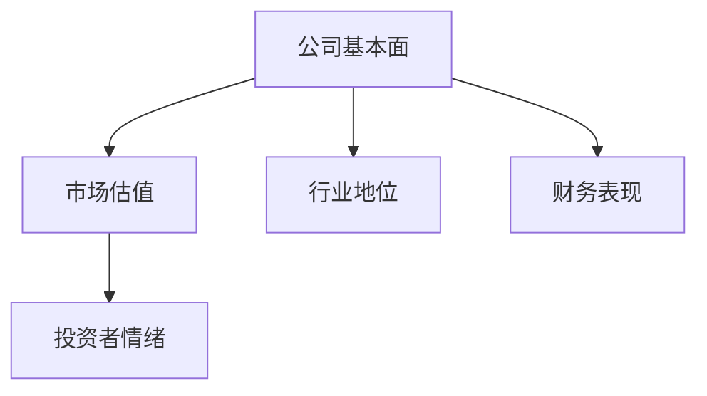
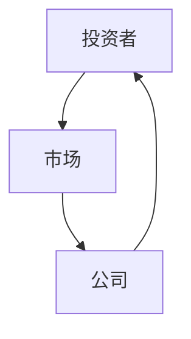
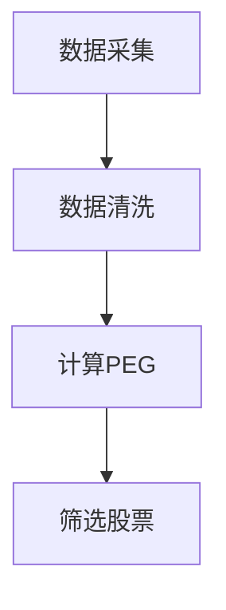
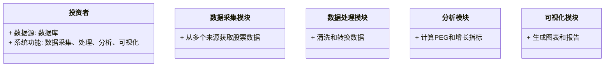

                 


# 彼得林奇的"高增长低估值"案例分析

> 关键词：彼得·林奇，高增长低估值，投资策略，股票分析，价值投资

> 摘要：本文通过分析彼得·林奇的“高增长低估值”投资策略，探讨其核心概念、算法原理、系统架构以及实际案例。文章详细阐述了如何通过基本面分析和市场估值比较，筛选出具有投资价值的股票，并提供了具体的Python代码和系统设计，帮助读者理解并实践这一策略。

---

## 引言

彼得·林奇是全球最著名的职业基金经理之一，他在投资领域提出的“高增长低估值”策略，为投资者提供了寻找优质股票的重要方法。本文将从背景介绍、核心概念、算法原理、系统架构到实际案例，全面分析这一策略，并为读者提供实践指南。

---

## 第一部分：背景介绍

### 第1章：彼得·林奇与“高增长低估值”投资理念

#### 1.1 彼得·林奇的投资哲学

彼得·林奇的职业生涯始于1977年，他在富达投资管理公司管理的麦哲伦基金创造了辉煌的投资业绩。他主张投资于那些具有高增长潜力但市场价格被低估的公司，这种策略被称为“高增长低估值”。

#### 1.2 高增长低估值的定义与特征

- **高增长**：公司收入和净利润的年增长率高于行业平均水平。
- **低估值**：市盈率（P/E）和市净率（P/B）低于行业平均水平。

#### 1.3 投资策略的背景与意义

在20世纪80年代，许多高增长公司因技术进步和市场需求激增，但市场价格尚未反映其未来潜力，为投资者提供了介入机会。

---

## 第二部分：核心概念与联系

### 第2章：高增长与低估值的核心要素

#### 2.1 高增长的核心要素

- **收入增长率**：衡量公司业务扩展能力。
- **净利润增长率**：反映盈利能力提升。
- **市场份额**：行业地位稳固。

#### 2.2 低估值的核心要素

- **市盈率（P/E）**：股价与每股收益的比率。
- **市净率（P/B）**：股价与每股净资产的比率。
- **市销率（P/S）**：股价与每股销售额的比率。

#### 2.3 高增长与低估值的对比分析

通过对比分析，发现高增长公司通常处于扩张期，而低估值意味着市场尚未发现其潜力。

---

### 第3章：高增长低估值的实体关系分析

#### 3.1 公司基本面与市场估值的关系



#### 3.2 投资者与市场的互动



---

## 第三部分：算法原理与数学模型

### 第4章：高增长低估值筛选算法

#### 4.1 算法原理

- 基于PEG（价格/盈利增长）的筛选方法。
- 使用复合增长率计算公式：$$PEG = \frac{P/E}{G}$$，其中G为净利润增长率。

#### 4.2 算法流程



#### 4.3 Python代码实现

```python
import pandas as pd
import numpy as np

def calculate_pe(stock_data):
    return stock_data['股价'] / stock_data['每股收益']

def calculate_growth(stock_data):
    return (stock_data['净利润'] / stock_data['净利润'].shift(1)) - 1

def calculate_peg(pe, growth):
    return pe / growth

# 示例数据
data = {
    '股价': [100, 200, 300],
    '每股收益': [10, 20, 30],
    '净利润': [100, 200, 300]
}
df = pd.DataFrame(data)

pe = calculate_pe(df)
growth = calculate_growth(df)
peg = calculate_peg(pe, growth)

print("PEG:", peg)
```

---

## 第四部分：系统分析与架构设计

### 第5章：投资分析系统设计

#### 5.1 系统功能设计



---

## 第五部分：项目实战

### 第6章：环境安装与代码实现

#### 6.1 环境安装

安装必要的Python库：

```bash
pip install pandas numpy matplotlib
```

#### 6.2 核心代码实现

```python
import pandas as pd
import numpy as np
import matplotlib.pyplot as plt

# 示例数据
data = {
    '公司': ['A', 'B', 'C'],
    '股价': [50, 30, 40],
    '每股收益': [5, 3, 4],
    '净利润': [100, 60, 80]
}

df = pd.DataFrame(data)

# 计算PE
pe = df['股价'] / df['每股收益']
# 计算净利润增长率
growth = (df['净利润'] / df['净利润'].shift(1)) - 1
# 计算PEG
peg = pe / growth

print("PEG值：", peg)
```

---

## 第六部分：最佳实践与总结

### 第7章：总结与注意事项

- **总结**：彼得·林奇的“高增长低估值”策略通过基本面分析和市场估值比较，帮助投资者发现潜在价值股。
- **注意事项**：投资需谨慎，策略需结合市场环境和公司具体情况。

---

## 结语

彼得·林奇的“高增长低估值”策略为投资者提供了有效的分析框架。通过本文的系统分析和实战指导，读者可以更好地理解和应用这一策略。

---

## 作者

**作者：AI天才研究院/AI Genius Institute & 禅与计算机程序设计艺术 /Zen And The Art of Computer Programming**

---

感谢您的阅读，希望本文能为您提供有价值的投资分析方法和实践指南。

