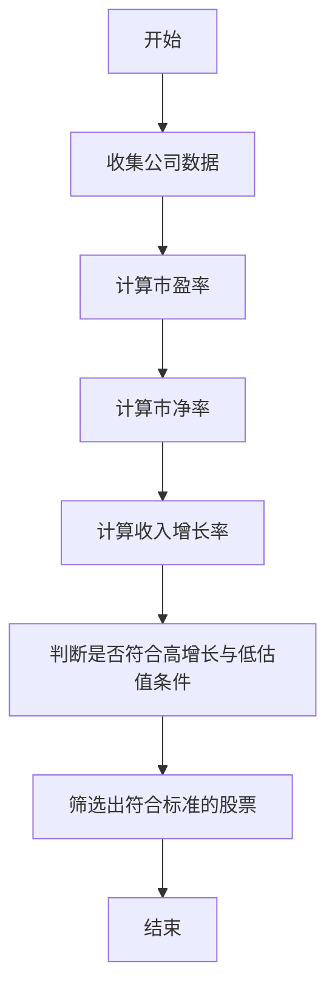

                 


# 彼得林奇的"高增长低估值"选股法

## 关键词：
- 彼得林奇
- 选股法
- 高增长
- 低估值
- 股票投资

## 摘要：
本文深入解析了彼得林奇的“高增长低估值”选股法，从其背景、核心概念、算法原理到数学模型、系统架构，再到实战案例，全面阐述了这一选股方法的逻辑和实践。文章通过详细分析，帮助读者理解如何通过结合公司成长性和估值合理性来选择投资标的。

---

## 目录大纲

### 第1章：背景介绍

#### 1.1 彼得林奇的背景
- 彼得·林奇的生平简介
- 他的投资哲学与风格
- 他在投资界的地位

#### 1.2 高增长低估值选股法的背景
- 选股法的起源
- 它在投资领域中的重要性
- 彼得林奇如何提出这一方法

#### 1.3 问题背景与描述
- 投资者在选股时的主要问题
- 传统选股方法的局限性
- 为什么需要结合高增长与低估值

### 第2章：核心概念与联系

#### 2.1 高增长的定义与特征
- 公司增长率的计算方法
- 如何识别高增长公司
- 高增长公司的财务表现特征

#### 2.2 低估值的定义与特征
- 估值指标（市盈率、市净率）的计算
- 如何判断股票是否低估
- 低估值公司的市场表现

#### 2.3 高增长与低估值的关系
- 两者的协同作用
- 如何平衡高增长与低估值
- 为什么高增长公司可能被低估

#### 2.4 核心概念对比与联系
- 高增长与低估值的对比分析
- 使用表格展示两种概念的异同
- 彼得林奇如何结合两者

### 第3章：算法原理讲解

#### 3.1 选股算法的基本思路
- 数据输入与处理
- 指标计算与筛选
- 结果输出与评估

#### 3.2 算法的详细步骤
- 数据收集：如何获取公司财务数据
- 计算高增长与低估值指标
- 筛选符合标准的股票
- 输出结果并进行排序

#### 3.3 算法的流程图


### 第4章：数学模型与公式

#### 4.1 常用估值指标公式
- 市盈率（P/E）：$$P/E = \frac{\text{股价}}{\text{每股收益}}$$
- 市净率（P/B）：$$P/B = \frac{\text{股价}}{\text{每股净资产}}$$
- 市销率（P/S）：$$P/S = \frac{\text{股价}}{\text{每股收入}}$$

#### 4.2 增长率的计算
- 收入增长率：$$\text{增长率} = \frac{\text{当年收入} - \text{上年收入}}{\text{上年收入}} \times 100\%$$
- 净利润增长率：$$\text{净利润增长率} = \frac{\text{当年净利润} - \text{上年净利润}}{\text{上年净利润}} \times 100\%$$

#### 4.3 结合高增长与低估值的筛选公式
- 低估值筛选：$$\text{P/E} < 市场平均P/E$$ 或 $$\text{P/B} < 市场平均P/B$$
- 高增长筛选：$$\text{收入增长率} > 市场平均收入增长率$$ 或 $$\text{净利润增长率} > 市场平均净利润增长率$$

#### 4.4 示例计算
- 假设某公司过去两年收入分别为1000万元和1500万元，计算收入增长率：$$\text{增长率} = \frac{1500 - 1000}{1000} \times 100\% = 50\%$$
- 假设当前股价为20元，每股收益为2元，则P/E = 10，低于市场平均P/E 15。

### 第5章：系统分析与架构设计方案

#### 5.1 问题场景介绍
- 投资者如何高效筛选股票
- 如何自动化执行高增长低估值选股法
- 系统的目标与范围

#### 5.2 项目介绍
- 系统名称：高增长低估值选股系统
- 系统目标：帮助投资者快速筛选符合标准的股票
- 系统功能：数据获取、指标计算、筛选、结果展示

#### 5.3 系统功能设计
- 数据获取模块：从数据库或API获取公司数据
- 指标计算模块：计算P/E、P/B、收入增长率等指标
- 筛选模块：根据设定条件筛选股票
- 结果展示模块：以图表形式展示筛选结果

#### 5.4 系统架构设计


### 第6章：项目实战

#### 6.1 环境安装
- 安装Python环境
- 安装必要的库（pandas、numpy、matplotlib）

#### 6.2 核心实现代码
```python
import pandas as pd
import numpy as np

# 数据获取
data = pd.read_csv('company_data.csv')

# 计算估值指标
data['PE'] = data['股价'] / data['每股收益']
data['PB'] = data['股价'] / data['每股净资产']

# 计算增长率
data['收入增长率'] = (data['收入'] - data['收入'].shift(1)) / data['收入'].shift(1) * 100
data['净利润增长率'] = (data['净利润'] - data['净利润'].shift(1)) / data['净利润'].shift(1) * 100

# 筛选条件
筛选条件：PE < 市场平均PE 且 收入增长率 > 市场平均收入增长率
符合条件的公司 = data[(data['PE'] < 市场平均PE) & (data['收入增长率'] > 市场平均收入增长率)]
```

#### 6.3 代码解读与分析
- 数据获取：从CSV文件中读取公司数据
- 估值指标计算：计算PE、PB等指标
- 增长率计算：使用差分和移动平均方法计算增长率
- 筛选条件：根据设定的条件筛选股票

#### 6.4 实际案例分析
- 选择一个市场，计算市场平均PE和收入增长率
- 筛选出符合高增长低估值条件的公司
- 分析这些公司的表现

#### 6.5 项目小结
- 项目实现的目标
- 实践中的注意事项
- 改进方向

### 第7章：总结

#### 7.1 最佳实践
- 筛选条件的调整
- 数据源的选择
- 定期更新数据

#### 7.2 小结
- 本文总结了彼得林奇的高增长低估值选股法
- 详细讲解了其背后的逻辑和实现方法
- 提供了系统的架构设计和实战案例

#### 7.3 注意事项
- 数据的准确性
- 市场变化的影响
- 多指标结合的重要性

#### 7.4 拓展阅读
- 推荐相关书籍：《彼得林奇的成功投资》
- 推荐学习资源：投资分析工具、财务报表分析

---

## 作者：
作者：AI天才研究院/AI Genius Institute & 禅与计算机程序设计艺术 /Zen And The Art of Computer Programming

