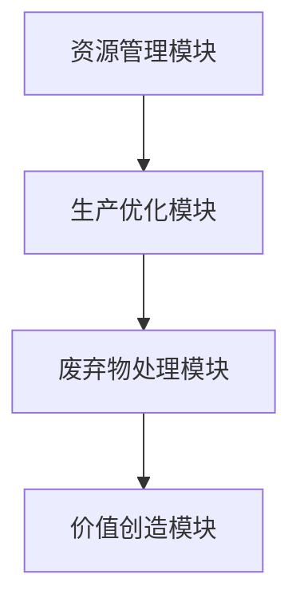

                 

# 循环经济商业模式的规模化挑战与机遇

## 关键词：循环经济，商业模式，规模化，挑战，机遇，资源优化

## 摘要：  
循环经济是一种以资源高效利用和废弃物最小化为核心理念的经济模式，通过构建闭环系统实现资源的循环利用，减少对环境的负担。本文从技术与商业双重视角出发，分析循环经济商业模式在规模化过程中面临的挑战，探讨其带来的商业机遇，并提供系统化的解决方案。通过数学建模、算法优化和系统设计等方法，结合实际案例，深入剖析循环经济商业模式的可行性、效益与实施路径，为读者提供全面的洞察与实践指导。

---

## 第1章 循环经济的基本概念与商业模式

### 1.1 循环经济的定义与特点  
循环经济是以“资源-产品-再生资源”为基本特征的经济模式，强调通过设计、生产、消费和回收等环节的协同优化，实现资源的高效利用和废弃物的最小化。其核心特点包括：  
1. **闭环性**：从资源输入到废弃物输出的全生命周期管理。  
2. **资源节约**：最大化资源的使用效率，减少对自然资源的依赖。  
3. **环境友好**：减少污染物排放，降低环境负担。  
4. **经济可持续**：通过资源再利用创造新的经济增长点。  

### 1.2 循环经济商业模式的构成  
循环经济商业模式的核心在于构建一个多利益相关方协同的闭环系统，主要包括以下要素：  
1. **资源输入**：包括原材料、能源和水资源等。  
2. **生产过程**：通过优化设计和工艺，减少资源消耗和污染物排放。  
3. **废弃物管理**：将废弃物转化为新的资源，实现再利用或无害化处理。  
4. **价值创造**：通过资源的循环利用，创造新的经济价值。  

### 1.3 循环经济商业模式的分类  
循环经济商业模式可以根据不同的维度进行分类：  
1. **按产业类型**：分为制造业循环模式、服务业循环模式和农业循环模式。  
2. **按商业模式**：包括共享经济模式、产品即服务模式和逆向物流模式。  
3. **按区域范围**：从局部区域到全球供应链的多层次模式。  

### 1.4 循环经济商业模式的案例分析  
以德国的“绿色工厂”为例，企业通过内部废弃物再利用和外部合作伙伴关系，实现了资源的高效循环。其成功的关键在于：  
1. **技术创新**：开发废弃物再利用的核心技术。  
2. **政策支持**：通过政府补贴和税收优惠降低运营成本。  
3. **市场驱动**：通过绿色产品溢价获取额外利润。  

---

## 第2章 循环经济的核心概念与系统分析

### 2.1 循环经济的核心概念  
循环经济的核心在于构建一个高效、协同的资源循环系统。其关键概念包括：  
1. **资源流**：包括正向资源流（原材料输入）和逆向资源流（废弃物输出）。  
2. **闭环系统**：通过技术手段将废弃物转化为新的资源输入。  
3. **合作伙伴关系**：构建跨行业的协同网络，实现资源的最优配置。  

### 2.2 循环经济系统的核心要素  
循环经济系统由以下几个核心要素构成：  
1. **资源管理模块**：负责资源的收集、分类和再利用。  
2. **生产优化模块**：通过工艺改进减少资源消耗。  
3. **废弃物处理模块**：将废弃物转化为新的资源或进行无害化处理。  
4. **价值创造模块**：通过绿色产品和服务实现经济价值。  

### 2.3 循环经济系统中的关键流程  
1. **资源的收集与分类**：通过智能传感器和物联网技术实现资源的高效分类。  
2. **资源的加工与再利用**：利用先进工艺将废弃物转化为高附加值产品。  
3. **再利用产品的市场推广**：通过绿色营销策略提升产品的市场竞争力。  

---

## 第3章 循环经济商业模式的算法与数学模型

### 3.1 循环经济的数学建模  
为了量化循环经济的效益，我们可以建立一个线性规划模型，如下所示：  
$$ \text{最大化：} \quad \sum_{i=1}^{n} c_i x_i $$  
$$ \text{约束条件：} \quad \sum_{i=1}^{n} a_i x_i \leq b $$  
其中，$c_i$ 表示资源 $i$ 的单位效益，$x_i$ 表示资源 $i$ 的使用量，$a_i$ 表示资源 $i$ 的消耗系数，$b$ 表示资源总量。  

### 3.2 循环经济的算法优化  
通过遗传算法优化循环经济的资源配置，流程如下：  
1. **初始化**：设定初始种群和参数。  
2. **适应度评估**：计算每个种群的效益。  
3. **选择与交叉**：选择高效益的个体进行交叉。  
4. **变异与迭代**：通过变异操作优化种群，直到达到收敛条件。  

### 3.3 循环经济的数学模型与公式  
循环经济的成本效益分析可以通过以下公式表示：  
$$ \text{总成本} = \sum_{i=1}^{n} (c_i + w_i) x_i $$  
$$ \text{总效益} = \sum_{i=1}^{n} r_i x_i $$  
其中，$c_i$ 表示资源 $i$ 的初始成本，$w_i$ 表示废弃物处理成本，$r_i$ 表示资源再利用的收益，$x_i$ 表示资源 $i$ 的使用量。  

---

## 第4章 循环经济商业模式的系统架构设计

### 4.1 系统功能设计  
循环经济系统的功能模块包括：  
1. **资源管理模块**：实现资源的收集、分类和再利用。  
2. **生产优化模块**：优化生产流程，减少资源浪费。  
3. **废弃物处理模块**：对废弃物进行分类处理并再利用。  
4. **价值创造模块**：通过绿色产品和服务实现经济价值。  

### 4.2 系统架构设计  
使用Mermaid图描述系统架构：  

### 4.3 系统接口设计  
1. **资源管理接口**：与供应商和回收商进行数据交互。  
2. **生产优化接口**：与生产设备和生产线进行数据交互。  
3. **废弃物处理接口**：与废弃物处理厂和再利用企业进行数据交互。  

---

## 第5章 循环经济商业模式的项目实战

### 5.1 项目背景与目标  
以某电子产品制造企业的循环经济项目为例，目标是通过废弃物再利用降低生产成本并减少环境影响。  

### 5.2 项目实施过程  
1. **环境影响评估**：分析生产过程中的资源消耗和废弃物排放。  
2. **成本分析**：计算资源再利用的成本和收益。  
3. **效益计算**：通过数学模型预测项目的经济效益和环境效益。  

### 5.3 项目核心实现  
1. **资源分类与处理**：利用智能传感器和自动化设备实现废弃物的高效分类。  
2. **废弃物再利用**：将塑料和金属废弃物转化为新产品原材料。  
3. **绿色产品设计**：通过逆向设计减少产品生命周期中的资源消耗。  

---

## 第6章 总结与展望

### 6.1 本章总结  
循环经济商业模式通过资源的高效循环利用，不仅减少了环境负担，还创造了新的经济增长点。其成功实施依赖于技术创新、政策支持和市场驱动的协同作用。

### 6.2 未来展望  
随着技术进步和政策支持的加强，循环经济将在全球范围内得到更广泛的应用。未来的研究方向包括：  
1. **技术创新**：开发更高效的资源循环技术。  
2. **政策优化**：制定更完善的循环经济支持政策。  
3. **国际合作**：推动全球范围内的资源循环利用。  

---

## 作者：AI天才研究院 & 禅与计算机程序设计艺术  

---

通过以上内容，我们全面分析了循环经济商业模式的规模化挑战与机遇，从理论到实践，为读者提供了系统的解决方案和实际案例分析。希望本文能够为循环经济的推广和实施提供有价值的参考。

