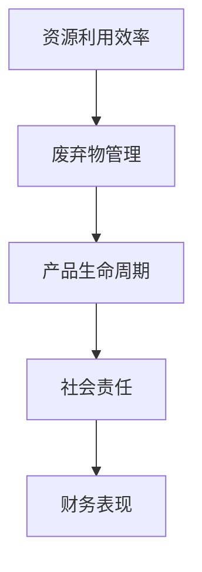
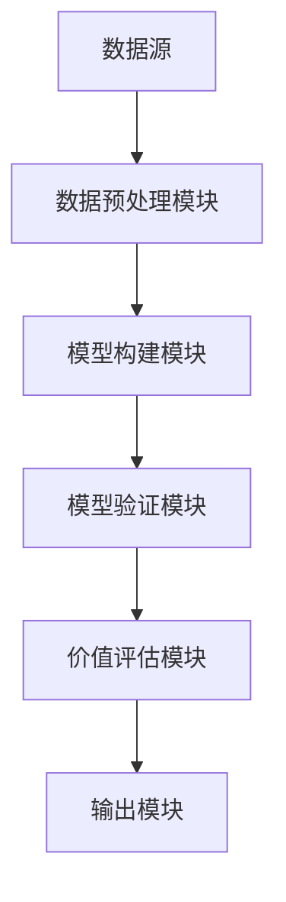
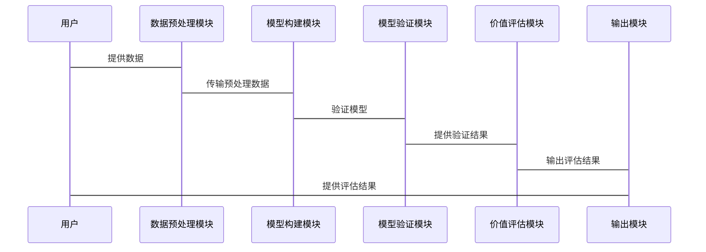

                 


# 循环经济模式下的公司估值方法

## 关键词：循环经济、公司估值、可持续发展、经济模式、价值评估

## 摘要：本文探讨了在循环经济模式下公司估值的方法，分析了循环经济对传统估值模型的挑战和影响，提出了创新性的评估指标和方法，并通过实际案例展示了如何在循环经济框架下进行公司估值。

---

# 第一部分：循环经济模式下的公司估值背景介绍

## 第1章：循环经济的定义与特点

### 1.1 循环经济的定义

循环经济是一种以资源高效利用和循环利用为核心，以减少资源消耗和环境污染为目标的经济模式。与传统的线性经济模式（资源-产品-废弃物）不同，循环经济强调“资源-产品-再利用”的闭环模式，通过延长产品生命周期、减少废弃物产生和促进资源回收，实现可持续发展目标。

循环经济的核心特征包括：
- 资源效率最大化：通过优化资源使用，减少浪费。
- 废弃物最小化：将废弃物视为资源，进行再利用。
- 闭环系统：构建生产、消费和回收的闭环链条。

循环经济与可持续发展的关系密切，是实现环境、经济和社会协调发展的关键路径。

### 1.2 循环经济模式下的公司价值评估

在循环经济模式下，公司的价值不再仅仅依赖于短期的财务表现，而是更加关注长期的资源效率、环境影响和社会责任。传统估值方法主要基于财务指标（如净利润、营业收入等），但在循环经济模式下，这些指标可能无法全面反映公司的可持续价值。

循环经济模式下的公司估值需要考虑以下因素：
- 资源利用效率：公司如何高效利用资源，减少浪费。
- 废弃物管理：公司如何处理和回收废弃物，降低环境负担。
- 产品生命周期：产品设计是否考虑了多次使用和回收。
- 社会责任：公司在可持续发展方面的表现。

### 1.3 循环经济模式下的公司估值问题背景

传统公司估值方法在循环经济模式下面临以下问题：
- 传统估值方法忽视了资源消耗和环境成本，导致低估公司的长期价值。
- 循环经济模式下的公司可能面临更高的初期投资和不确定的回收周期，传统估值方法难以捕捉这些因素。
- 循环经济模式下的公司可能依赖于外部资源和合作伙伴，传统估值方法难以评估这些外部依赖的影响。

为了解决这些问题，需要提出适合循环经济模式的估值方法，综合考虑财务、资源和环境因素。

### 1.4 循环经济模式下的公司估值概念结构

循环经济模式下的公司估值概念结构包括以下几个核心要素：
1. **资源利用效率**：公司如何高效利用资源，减少浪费。
2. **废弃物管理**：公司如何处理和回收废弃物，降低环境负担。
3. **产品生命周期**：产品设计是否考虑了多次使用和回收。
4. **社会责任**：公司在可持续发展方面的表现。
5. **财务表现**：公司传统的财务指标，如净利润、营业收入等。

这些要素相互关联，共同影响公司的长期价值。概念结构可以通过Mermaid图表示如下：



---

## 第2章：循环经济模式下的公司估值模型

### 2.1 循环经济模式下的价值评估模型

循环经济模式下的价值评估模型包括以下几个核心要素：
1. **资源效率**：公司如何高效利用资源，减少浪费。
2. **废弃物价值**：公司如何通过回收和再利用废弃物创造价值。
3. **产品生命周期**：产品设计是否考虑了多次使用和回收。
4. **社会责任**：公司在可持续发展方面的表现。
5. **财务表现**：公司传统的财务指标，如净利润、营业收入等。

模型的输入包括公司的资源消耗数据、废弃物产生数据、产品设计信息和财务数据。模型的输出是公司的可持续价值评分。

### 2.2 循环经济模式下的公司估值方法

循环经济模式下的公司估值方法包括以下几个步骤：
1. **数据收集**：收集公司的资源消耗数据、废弃物产生数据、产品设计信息和财务数据。
2. **数据处理**：对数据进行清洗和预处理，确保数据的准确性和一致性。
3. **模型构建**：基于收集的数据，构建循环经济模式下的价值评估模型。
4. **模型验证**：通过实际案例验证模型的准确性和可靠性。
5. **价值评估**：基于模型输出，评估公司的可持续价值。

### 2.3 循环经济模式下的公司估值指标

循环经济模式下的公司估值指标包括以下几个方面：
1. **资源效率指标**：资源消耗率、单位产品资源消耗量。
2. **废弃物价值指标**：废弃物回收率、废弃物再利用率。
3. **产品生命周期指标**：产品使用寿命、产品回收率。
4. **社会责任指标**：社会责任投入、环境影响评分。
5. **财务指标**：净利润、营业收入、利润率。

这些指标可以通过对比分析，找出公司在循环经济模式下的优势和劣势。

---

## 第3章：循环经济模式下的公司估值算法

### 3.1 算法原理概述

循环经济模式下的公司估值算法基于以下原理：
1. **资源效率最大化**：通过优化资源使用，减少浪费。
2. **废弃物再利用**：通过回收和再利用废弃物，创造价值。
3. **产品生命周期优化**：延长产品使用寿命，降低环境负担。

算法的核心是通过数学模型，将公司的资源消耗、废弃物产生和财务数据转化为可持续价值评分。

### 3.2 算法步骤

1. **数据收集**：收集公司的资源消耗数据、废弃物产生数据、产品设计信息和财务数据。
2. **数据预处理**：对数据进行清洗和标准化处理。
3. **模型构建**：基于数据，构建循环经济模式下的价值评估模型。
4. **模型验证**：通过实际案例验证模型的准确性和可靠性。
5. **价值评估**：基于模型输出，评估公司的可持续价值。

### 3.3 数学模型与公式

循环经济模式下的公司估值模型可以表示为：

$$ V = \alpha R + \beta W + \gamma P + \delta S + \epsilon F $$

其中：
- \( V \) 表示公司的可持续价值评分。
- \( R \) 表示资源效率指标。
- \( W \) 表示废弃物价值指标。
- \( P \) 表示产品生命周期指标。
- \( S \) 表示社会责任指标。
- \( F \) 表示财务指标。
- \( \alpha, \beta, \gamma, \delta, \epsilon \) 表示各指标的权重。

---

## 第4章：循环经济模式下的公司估值系统架构

### 4.1 系统功能设计

循环经济模式下的公司估值系统需要实现以下功能：
1. **数据收集**：收集公司的资源消耗数据、废弃物产生数据、产品设计信息和财务数据。
2. **数据处理**：对数据进行清洗和预处理。
3. **模型构建**：基于数据，构建循环经济模式下的价值评估模型。
4. **模型验证**：通过实际案例验证模型的准确性和可靠性。
5. **价值评估**：基于模型输出，评估公司的可持续价值。

### 4.2 系统架构设计

循环经济模式下的公司估值系统架构如下：



### 4.3 系统接口设计

系统接口包括：
1. **数据接口**：与公司数据源对接，获取资源消耗数据、废弃物产生数据、产品设计信息和财务数据。
2. **模型接口**：与第三方模型对接，获取循环经济模式下的价值评估模型。
3. **输出接口**：将评估结果输出给用户。

### 4.4 系统交互设计

系统交互流程如下：



---

## 第5章：循环经济模式下的公司估值项目实战

### 5.1 项目背景

假设我们有一家制造公司，希望在循环经济模式下进行公司估值。我们需要收集公司的资源消耗数据、废弃物产生数据、产品设计信息和财务数据，构建循环经济模式下的价值评估模型，评估公司的可持续价值。

### 5.2 项目环境安装

为了实现循环经济模式下的公司估值，需要安装以下工具和库：
- 数据处理工具：Python、Pandas、NumPy。
- 数据可视化工具：Matplotlib、Seaborn。
- 模型构建工具：Scikit-learn、XGBoost。
- 系统架构工具：Docker、Kubernetes。

### 5.3 核心代码实现

以下是循环经济模式下的公司估值模型的核心代码：

```python
import pandas as pd
import numpy as np
from sklearn.ensemble import RandomForestRegressor

# 数据预处理
def preprocess(data):
    data = data.dropna()
    data = pd.get_dummies(data)
    return data

# 模型构建
def build_model(data, target):
    model = RandomForestRegressor()
    model.fit(data, target)
    return model

# 模型验证
def validate_model(model, data, target):
    predictions = model.predict(data)
    rmse = np.sqrt(np.mean((predictions - target)**2))
    return rmse

# 价值评估
def evaluate(company_data):
    processed_data = preprocess(company_data)
    model = build_model(processed_data, processed_data['value'])
    rmse = validate_model(model, processed_data, processed_data['value'])
    return rmse

# 示例数据
data = {
    'resource_efficiency': [0.8, 0.9, 0.7],
    'waste_recovery': [0.6, 0.7, 0.5],
    'product_lifetime': [5, 6, 4],
    'social Responsibility': [0.7, 0.8, 0.6],
    'financial_performance': [0.9, 0.8, 0.7]
}

company_data = pd.DataFrame(data)
print(evaluate(company_data))
```

### 5.4 代码解读与分析

上述代码实现了循环经济模式下的公司估值模型，包括数据预处理、模型构建和模型验证三个步骤。通过随机森林回归模型，预测公司的可持续价值评分。

### 5.5 实际案例分析

假设我们有一家制造公司，其数据如下：

| 资源效率 | 废弃物回收率 | 产品寿命 | 社会责任 | 财务表现 |
|---------|-------------|----------|----------|----------|
| 0.8     | 0.6         | 5        | 0.7      | 0.9      |
| 0.9     | 0.7         | 6        | 0.8      | 0.8      |
| 0.7     | 0.5         | 4        | 0.6      | 0.7      |

通过上述代码，我们可以预测公司的可持续价值评分，并评估其在循环经济模式下的价值。

### 5.6 项目小结

通过实际案例分析，我们可以看到循环经济模式下的公司估值方法能够有效评估公司的可持续价值，为企业提供新的估值思路。

---

## 第六部分：循环经济模式下的公司估值最佳实践

### 6.1 小结

循环经济模式下的公司估值方法是一种创新的估值思路，能够更好地反映公司的可持续价值。通过综合考虑资源效率、废弃物管理、产品生命周期、社会责任和财务表现等因素，我们可以更全面地评估公司的长期价值。

### 6.2 注意事项

在实际应用中，需要注意以下几点：
- 数据的准确性和完整性：确保数据的准确性和完整性，避免数据偏差。
- 模型的适用性：根据具体行业和公司特点，选择合适的模型和方法。
- 持续优化：定期更新数据和模型，确保评估结果的准确性和可靠性。

### 6.3 拓展阅读

- 《循环经济与可持续发展》
- 《公司估值方法与模型》
- 《循环经济模式下的企业创新》

---

## 作者：AI天才研究院 & 禅与计算机程序设计艺术

---

以上是《循环经济模式下的公司估值方法》的完整目录大纲和文章内容，希望对您有所帮助！

