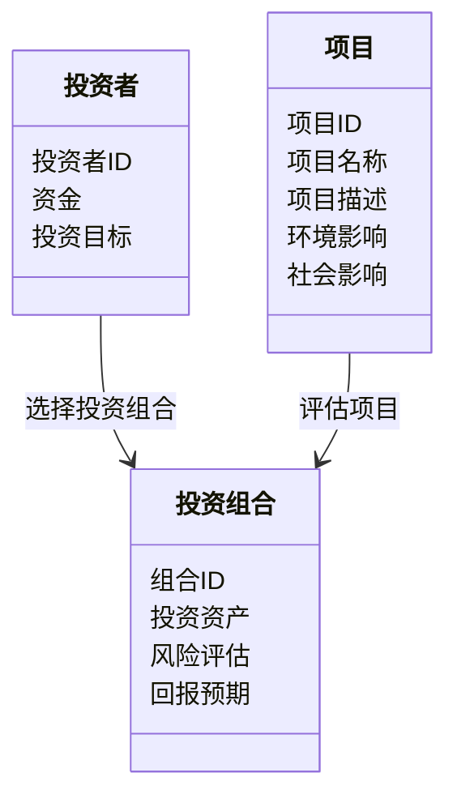

                 

# 循环经济模式下的可持续投资策略

> **关键词**：循环经济、可持续投资、投资策略、系统架构、项目实战  
> **摘要**：本文探讨循环经济模式下的可持续投资策略，分析其核心概念、理论基础、投资评估方法及系统架构设计，并通过实际案例展示其应用，最后总结最佳实践与未来展望。

---

## 第一部分：循环经济模式下的可持续投资背景与概念

### 第1章：循环经济与可持续投资概述

#### 1.1 循环经济的基本概念

- **1.1.1 循环经济的定义**  
  循环经济是以资源高效利用和循环利用为核心的发展模式，强调减少资源消耗和环境污染，实现经济与生态的协调统一。

- **1.1.2 循环经济的核心特征**  
  - 资源高效利用：通过技术手段最大化资源使用效率。  
  - 废物减量化：减少生产过程中废弃物的产生。  
  - 循环再生：将废弃物转化为资源，形成闭环系统。  

- **1.1.3 循环经济与传统经济的对比**  
  | **对比维度** | **循环经济** | **传统经济** |  
  |---------------|---------------|---------------|  
  | 资源消耗 | 减少，强调循环利用 | 高，一次性使用 |  
  | 环境影响 | 低，注重生态保护 | 高，可能破坏环境 |  
  | 经济模式 | 资源节约型 | 资源消耗型 |  

#### 1.2 可持续投资的定义与特征

- **1.2.1 可持续投资的定义**  
  可持续投资是指在追求经济回报的同时，考虑环境、社会和公司治理（ESG）因素的投资方式，旨在实现长期价值。

- **1.2.2 可持续投资的核心要素**  
  - 环境（Environmental）：关注企业的碳足迹、资源消耗等。  
  - 社会（Social）：关注企业的社会责任、劳工权益等。  
  - 公司治理（Governance）：关注企业的管理透明度和治理结构。  

- **1.2.3 可持续投资与传统投资的区别**  
  | **对比维度** | **可持续投资** | **传统投资** |  
  |---------------|----------------|---------------|  
  | 投资目标 | 长期价值与社会影响 | 短期收益最大化 |  
  | 风险评估 | 包括环境、社会和治理风险 | 仅考虑财务风险 |  
  | 投资对象 | 具有可持续性的企业或项目 | 无特定要求 |  

#### 1.3 循环经济模式下的可持续投资

- **1.3.1 循环经济与可持续投资的内在联系**  
  循环经济强调资源的高效利用和循环再生，而可持续投资关注企业的可持续性，两者在资源节约和环境保护方面具有共同目标。

- **1.3.2 循环经济模式对投资策略的影响**  
  循环经济模式下的投资策略更倾向于选择那些在资源利用效率、废弃物处理和环境保护方面表现优异的企业或项目。

- **1.3.3 可持续投资在循环经济中的作用**  
  可持续投资为循环经济提供了资金支持，同时通过资本的力量推动企业向更可持续的方向发展。

---

## 第2章：循环经济的理论基础

### 2.1 循环经济的经济学基础

- **2.1.1 循环经济的资源效率理论**  
  资源效率理论认为，通过技术进步和管理优化，可以显著提高资源利用效率，降低单位产品资源消耗。

- **2.1.2 循环经济的成本效益分析**  
  循环经济模式下的成本效益分析需要考虑资源的重复利用带来的成本节约和环境效益。

- **2.1.3 循环经济与可持续发展的关系**  
  循环经济是实现可持续发展的重要途径，通过减少资源消耗和环境污染，促进经济与生态的协调发展。

### 2.2 循环经济的生态学基础

- **2.2.1 生态系统中的物质循环**  
  在自然生态系统中，物质通过分解和再利用形成闭环，循环经济模拟了这一过程。

- **2.2.2 循环经济与生态足迹分析**  
  生态足迹分析是用来衡量人类活动对地球生态系统的压力，循环经济通过减少资源消耗降低生态足迹。

- **2.2.3 循环经济对生态系统的影响**  
  循环经济通过减少废弃物产生和资源消耗，保护生态系统，促进生物多样性。

---

## 第3章：可持续投资的理论基础

### 3.1 可持续投资的伦理与社会价值

- **3.1.1 投资的社会责任理论**  
  投资者在追求经济回报的同时，应承担社会责任，关注环境保护、社会公平等问题。

- **3.1.2 可持续投资的伦理框架**  
  可持续投资的伦理框架包括环境责任、社会责任和治理责任三个方面。

- **3.1.3 可持续投资对社会的影响**  
  可持续投资通过支持社会责任强的企业，促进社会公平和就业，改善社会福祉。

### 3.2 可持续投资的经济学分析

- **3.2.1 可持续投资的收益与风险分析**  
  可持续投资的收益可能略低于传统投资，但其风险较低，长期回报更为稳定。

- **3.2.2 可持续投资的市场效率理论**  
  可持续投资通过筛选具备可持续性的企业，提高了市场信息透明度，促进了市场效率。

- **3.2.3 可持续投资的长期回报分析**  
  长期来看，可持续投资因其注重企业的可持续性，可能在市场波动中表现更为稳健。

---

## 第二部分：循环经济模式下的可持续投资策略

### 第4章：循环经济模式下的投资策略

#### 4.1 循环经济模式下的投资目标

- **4.1.1 资源高效利用的投资目标**  
  选择那些在资源利用效率方面表现优异的企业或项目。

- **4.1.2 环境友好型投资的目标设定**  
  优先投资于那些采用清洁生产技术、减少环境污染的企业。

- **4.1.3 投资回报预期**  
  循环经济模式下的投资可能初期回报较低，但长期来看具有较高的可持续性和稳定性。

#### 4.2 循环经济模式下的投资评估方法

- **4.2.1 经济效益评估**  
  通过分析企业的资源利用效率、单位产品成本等指标，评估其经济效益。

- **4.2.2 环境效益评估**  
  使用生命周期评估（LCA）方法，分析企业或项目在整个生命周期中的环境影响。

- **4.2.3 社会效益评估**  
  评估企业或项目对社会的影响，包括就业创造、社区发展等方面。

---

### 第5章：可持续投资的实施路径

#### 5.1 循环经济模式下的投资组合构建

- **5.1.1 循环经济相关产业的投资机会**  
  包括节能环保、清洁能源、废物再生等领域。

- **5.1.2 可持续投资组合的构建方法**  
  通过筛选具备可持续性指标（如低碳排放、高资源效率）的企业，构建投资组合。

- **5.1.3 投资风险控制**  
  通过分散投资、定期评估和调整投资组合，降低投资风险。

#### 5.2 循环经济模式下的投资风险管理

- **5.2.1 环境风险**  
  包括政策风险、碳排放风险等。

- **5.2.2 社会风险**  
  包括社会责任履行不力带来的声誉风险。

- **5.2.3 治理风险**  
  包括公司治理不透明带来的投资风险。

---

## 第三部分：系统架构与项目实战

### 第6章：系统架构设计

#### 6.1 系统功能设计

- **6.1.1 领域模型**  
  使用 Mermaid 类图展示系统的功能模块和实体关系。

---

### 第7章：项目实战

#### 7.1 环境影响评估

- **7.1.1 项目背景**  
  某企业计划投资于一家废弃物再生企业，需评估其环境影响。

- **7.1.2 评估方法**  
  使用生命周期评估（LCA）方法，分析企业从原材料采购到产品回收的全过程。

- **7.1.3 评估结果**  
  该企业在资源利用和环境污染方面表现优异，具备较高的投资价值。

#### 7.2 企业转型案例

- **7.2.1 背景**  
  一家传统制造企业计划转型为循环经济模式。

- **7.2.2 转型措施**  
  采用清洁生产技术，建立废弃物回收系统，优化供应链管理。

- **7.2.3 投资评估**  
  通过分析企业的成本节约、环境效益和社会影响，评估其转型后的投资价值。

---

## 第四部分：总结与展望

### 第8章：最佳实践与小结

#### 8.1 最佳实践 tips

- **关注企业的可持续性指标**：在选择投资标的时，重点关注企业的资源效率、环境影响和社会责任。
- **分散投资风险**：通过分散投资降低环境、社会和治理风险。
- **长期视角**：可持续投资需要长期持有，注重企业的可持续发展能力。

#### 8.2 注意事项

- **政策风险**：关注相关法律法规的变化，避免政策风险。
- **数据准确性**：确保评估数据的准确性和可靠性。
- **持续监控**：定期评估投资组合的可持续性表现。

#### 8.3 未来展望

- **技术进步**：人工智能和大数据技术将为可持续投资提供更强大的支持。
- **全球协作**：国际间的合作将推动循环经济和可持续投资的发展。
- **市场趋势**：随着环保意识的增强，可持续投资将成为主流趋势。

---

## 作者信息

作者：AI天才研究院/AI Genius Institute & 禅与计算机程序设计艺术 /Zen And The Art of Computer Programming

